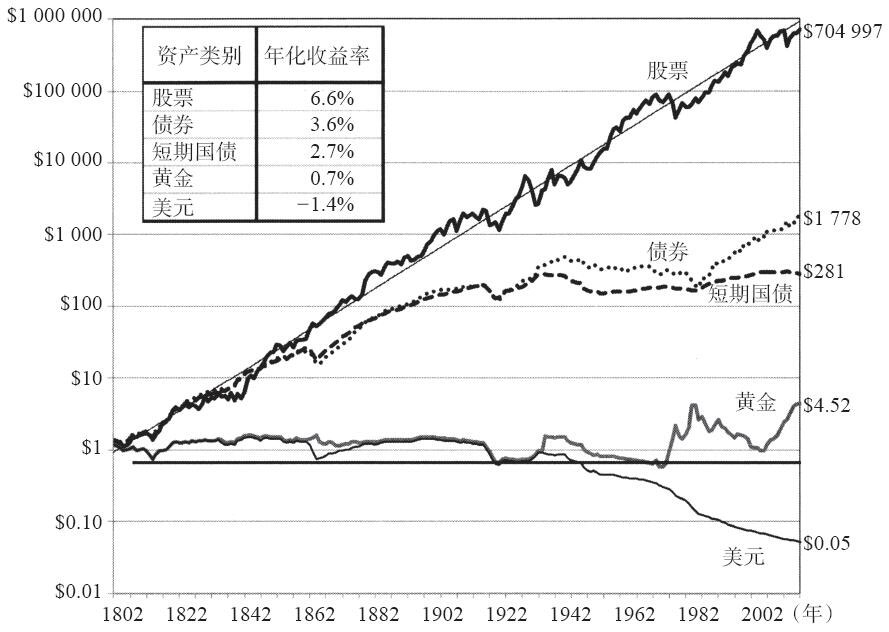
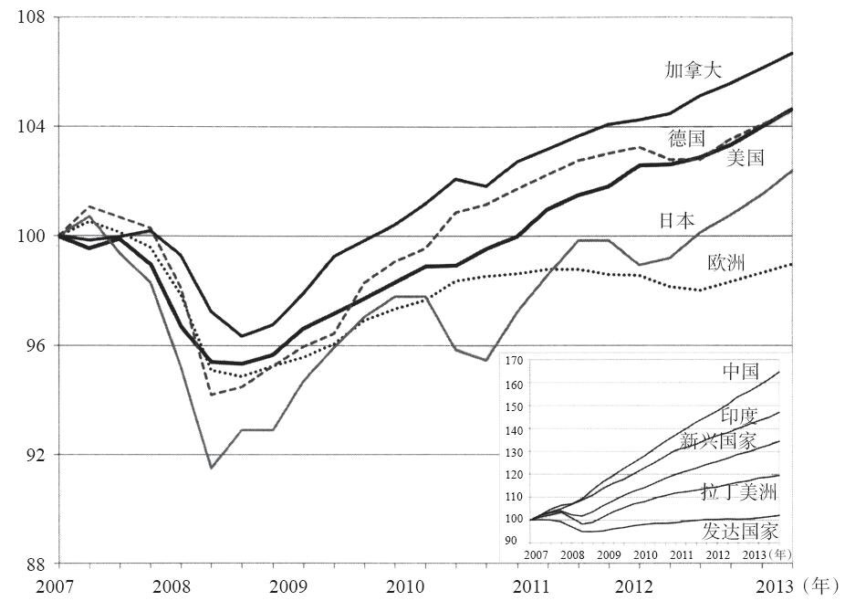
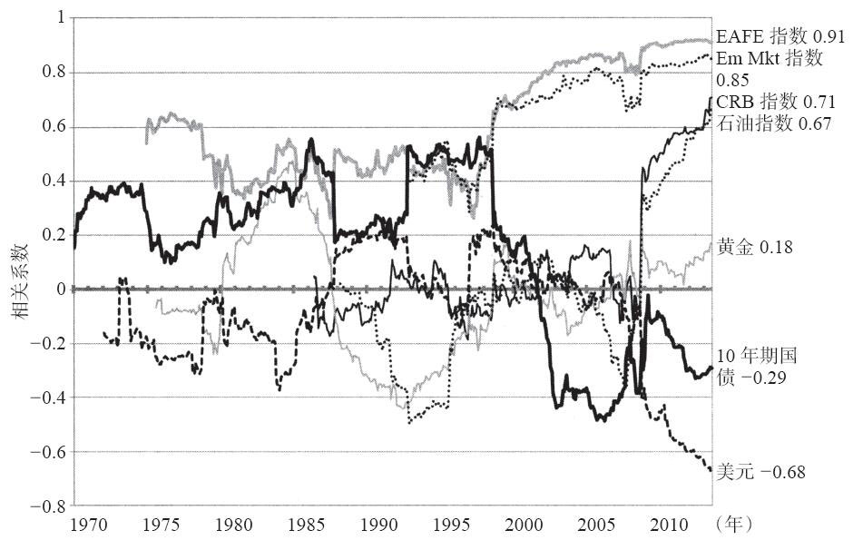
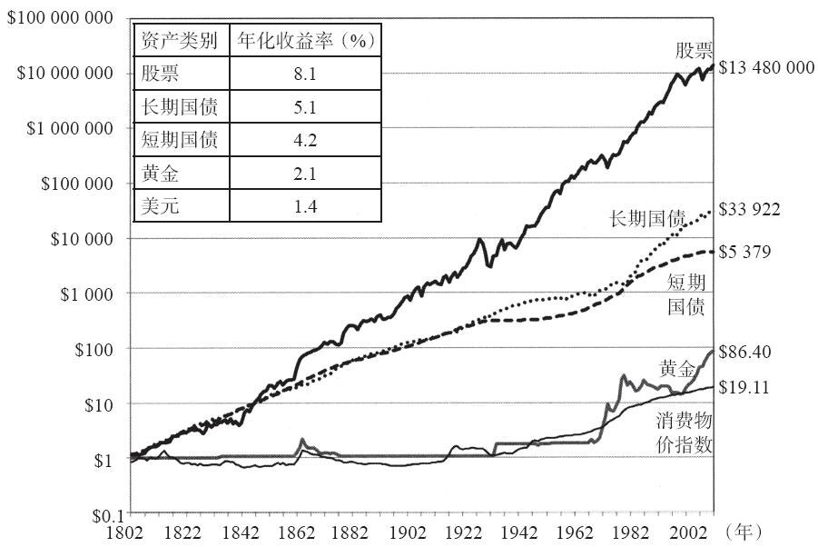
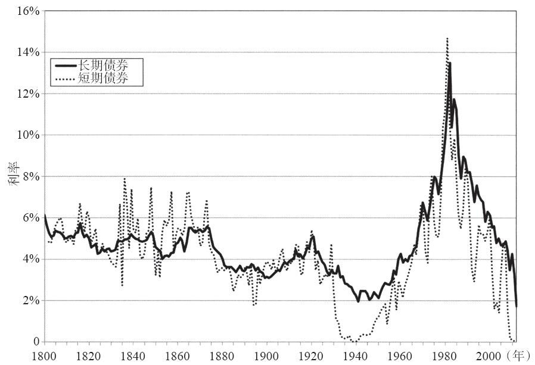
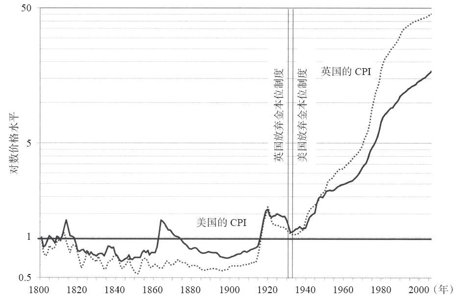
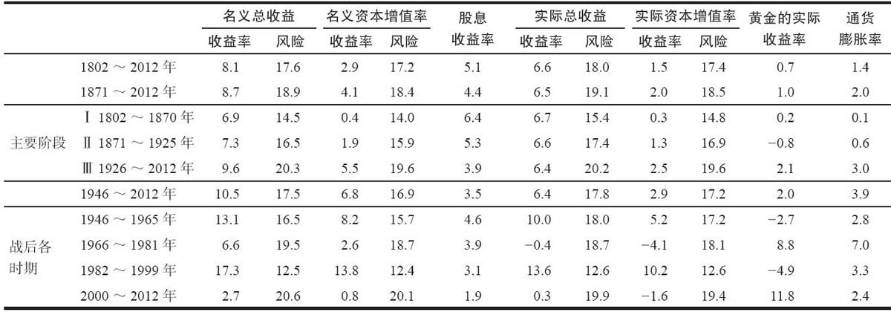
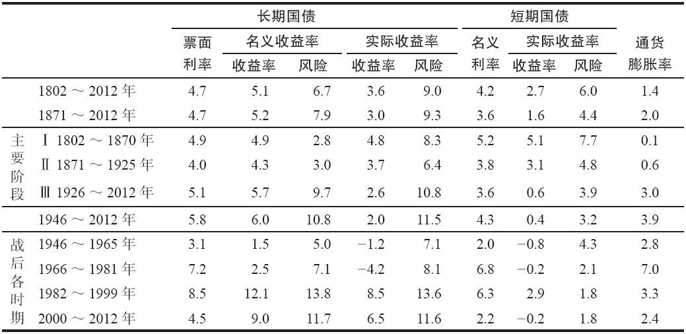

股市长线法宝（原书第5版）

杰里米 J.西格尔

出版时间：2015-01

◆ 序言

\>\> 如果资本主义体系仍然屹立不倒，那么股票的长期风险溢价也将保持稳定。在资本主义体系中，债券的长期表现不能也不应超过股票。债券是在法律上可以强制执行的合同，而股票并未向持有者承诺任何事情。所以，股票是一种高风险投资，它要求投资者对未来走势充满信心。因此，股票并不是天生“优于”债券，但我们会对股票要求高收益，以补偿其承担的高风险。如果债券的长期预期收益率高于股票的长期预期收益率，那么这种资产定价方式会使投资者无法获得风险收益，而这种情况是不可持续的。因此，股票必然是“那些追求长期稳定收益的投资者的最佳投资方式”，否则我们的经济体系就会瞬间终结，而且垮得无声无息。

◆ 译者序

\>\> 在书中，西格尔教授通过详尽的历史数据、丰富的图表工具以及现代金融理论对美国两百多年来的股票交易的演进，进行了全面、系统的分析。他详细比较了各种投资产品（股票、债券、黄金等）的风险与收益。概括起来，西格尔主要的投资观点是：

①从长期来看，股票收益率会实现均值回归，而包括债券在内的任何其他投资工具都做不到这一点。因此，投资者在构建投资组合时，应采取偏股型投资策略。

②实行被动投资策略，以获取市场平均收益。因为个人要想战胜大盘是非常困难的，且主动型投资策略的交易成本极高。因此，作者对指数基金、交易所交易基金倍加推崇。

③坚持价值型投资。长期来看，价值型股票不但优于成长型股票，而且其年复合平均收益率持续高出市场指数两个百分点以上，因此，投资者应坚持投资于价值型基本加权指数基金，以获取市场平均回报以上的收益率。

\>\> 本书站在全球投资的视角，为投资者提供了一个有效的全球化长期投资策略。

◆ 前言

\>\> 对那些希望降低短期波动性的投资者来说，股票确实是最好的长期投资工具。事实上，一个多元化普通股投资组合的长期实际收益率为6.7%。

\>\> 第1章简要介绍了我对股票及债券所做的主要研究成果，并回顾了投资者、基金经理及学术界在过去一个世纪中对股票投资的主要观点。

第2章介绍了金融危机，并指出了各大投资银行的负责人、监管者及国会等在金融危机中所犯的错误。我还列出了标准普尔公司犯下的一系列错误，这家全世界最大的评级机构给次级贷款的评级是最高的AAA级，并愚蠢地宣称它们的安全性与美国国债一样高。

第3章分析了金融危机对金融市场的特别影响：银行的资本成本（以“伦敦银行间同业拆借利率的利息差”测度）空前高涨；股票价格的崩盘让股市缩水2/3；自20世纪30年代以来，国债收益率降至零，甚至为负。

\>\> 这次危机也改变了各项资产之间的相关性。全球股票市场之间的联系越发紧密，这降低了全球投资的多样化收益，而美国国债及美元成为资产的“避风港”，联邦政府担保债务受到了空前的追捧。在经济危机最危险的阶段，包括黄金在内的全部商品均遭受严重的损失，但公众对中央银行的扩张性货币政策可能会导致高通胀的恐慌让贵金属价格强劲反弹。

第4章介绍了那些影响我们经济福利的长期事项。美国在经济衰退中的财政赤字飙升至1.3万亿美元，财政赤字与国内生产总值的比率也创下了第二次世界大战（以下简称“二战”）以来的新高。由于生产率增速的放缓，公众开始担忧生活水平的增速将显著放缓，甚至可能会停滞不前。这也引出这样一个问题：我们的子女能否首次沦为生活水平尚不如父辈的一代？

第4章对本书前几版的结论进行了更新及扩展，使用了由联合国人口委员会提供的最新人口数据与世界银行及国际货币基金组织提供的生产率预测数据。在本书中，我计算了世界各主要国家和地区在21世纪末的全球产出分布。

\>\> 在第19章“市场波动性”中，我们分析了2010年的“闪电崩盘”，并对这次金融危机的波动性与20世纪30年代的银行业危机之间的关系进行了比较。

第20章再次说明，只要使用一些简单的技术分析手段（如200日移动平均线方法），投资者就可以成功避开近期熊市的最坏阶段。

本书第1版介绍了一些著名的日历异象，如“一月效应”“小盘股效应”及“九月效应”等，这一版检验了这些异象在过去20年中的表现，以确认它们是否依然存在。在第21章中，我还首次介绍了“流动性投资策略”，并解释了如何将这一策略作为“小盘股效应”与“价值股效应”（研究人员认为这两种效应是决定单只股票收益的重要因素）的补充。

\>\> “根据真正的长期预期而做投资，实在太难，几乎不可能。”75年后的今天同样如此。

但是，那些坚持投资股票的人一定会获得回报。从长期来看，那些赌股市下跌或未来经济前景暗淡的人将注定一无所得。当经济学家及投资者开始感到悲观时，有些人注定会动摇不定，本书最新版旨在增强他们的信心。历史雄辩地证明，对于那些追求长期收益的投资者来说，股票永远是他们最好的投资选择。

◆ “人人都能发财”

\>\> 那些从不购买股票，并以股市的大崩盘为自己的保守辩护的人最终会发现，他们的收益将远远低于那些坚持投资于股票的投资者。

\>\> 图1-1是本书中最重要的一张图。该图对一个虚拟投资者的1美元投资在两个世纪中所产生的真实（去除了通货膨胀的影响）财富进行了逐年跟踪。

图1-1 美国股票、债券、短期国债、黄金及美元在1802～2012年的真实总收益

\>\> 图1-1中的统计趋势线是对真实股票收益率的最佳拟合线。股票真实收益率惊人的稳定：19世纪股票的真实收益率与20世纪的真实收益率没有太大的区别。注意，股票的收益围绕这条趋势线上下波动，但最终会回到这条趋势线上来。经济学家将这种行为称为均值回归（mean reversion），均值回归的性质表明：如果某个时期的收益率高于平均水平，在接下来的时期里，收益率有低于平均水平的倾向，反之亦然。而其他类型资产（债券、商品或美元）的长期真实收益率表现得不像股票这般稳定。

\>\> 在本章剩下的部分，我将考察经济学家与投资者是如何看待股票在历史进程中的投资价值的，我还会分析大牛市与大熊市将会对专业投资者及传媒产生怎样的影响。

◆ 股票投资的历史前景

\>\> 在整个19世纪里，股票被认为是投机者与内幕交易人士的势力范围，但绝不适合保守的投资者。研究人员直到20世纪初才认识到，对那些游离于传统投资渠道之外的投资者来说，在一定的经济条件下，股票可能是一种合适的投资工具。

\>\> 在持有相当长一段时间（他认为这一时间是6年到最多15年）的股票之后，赚不到钱的概率微乎其微。

\>\> 那些在1929年市场顶部投资的人，尽管其后的崩盘远比史密斯想象的严重得多，他们也只用了15年的时间就收复了失地。自二战以来，股票市场的复苏时间变得更短。如果我们将最近这一次金融危机（它是股市自20世纪30年代以来的最大的一次熊市）也考虑进来，一个投资者在股市上的初始投资回本（包括股息再投资）所需的最长时间也只不过是5年8个月：2000年8月～2006年4月。

\>\> 斯特恩的研究表明，普通股投资相对于债券及其他金融工具的优势远不限于美国的金融市场。证明股票投资的优越性的理论也被称为普通股投资理论。

◆ 第3章 金融危机后的市场、经济及政府政策

图3-1 金融危机及大衰退中各国GDP的国际比较（2007年第四季度的产出值设为100）

图3-1还显示，在经济危机的冲击下，新兴经济体的表现远比发达国家好得多；像中国及印度这样迅速成长国家的实际GDP增长率有所放缓，但并未下降。总体而言，新兴经济国家GDP的跌幅只有3%；截至2009年第二季度，新兴经济体的产出再创新高。与之相反，美国经济直到2011年年末方才收复失地，而日本一直到2013年年底才达到危机前的顶峰状态，而欧洲经济还远未走出低谷。

◆ 金融市场对金融危机的反应

\>\> 金融危机对资产收益率及其相关性的影响

金融理论的一个主要的结论是，为了在既定的风险下获得最高的收益，投资者不但要在某类资产内分散投资，而且还要在各资产类别之间分散风险。有鉴于此，投资者会给那些价格与市场间相关性为负的股票一定的溢价，而给那些价格与市场间相关性为正的股票一定的折扣。

图3-3显示的是不同类别的资产与标准普尔500指数之间的相关性，时间窗口选择的是自1970～2012年的全部5年期。你可以看到，金融危机对各类资产之间的相关性的影响极大，在大多数情况下，金融危机会让此前业已形成的趋势大大加速。发达国家股市（EAFE）及新兴市场国家股市（EM）与美国股市之间的相关性均显著上升，EAFE与美国股市之间的相关性为0.91，而EM与美国股市之间的相关性为0.85。

股票市场之间的相关性在近年来逐渐增强，其原因可以很容易用经济学原理解释。首先，随着国际贸易在全球产出中所占的份额逐渐加大，各国间的经济依存度也不断提高。其次，交易者与投资者在许多不同的市场间同时运行，因此，市场情绪不可能局限于某个特定的市场中。最后，自2008年以来，金融与商品市场遭受的大多数冲击都属于全球性的，那些只能影响一国或一个市场的特殊类型的冲击已不复存在。

图3-3 标准普尔500指数与各类资产之间的月度相关性（1970～2012年）

如图3-3所示，不但股票市场之间的相关性在增加，股票市场与商品市场（以CRB商品价格指数或石油价格表示）之间的相关性自金融危机以来也显著增加。24商品价格既受到世界经济增长等需求因素的影响，也受到季节（影响农作物）及政治局势（影响石油）等供给因素的影响。需求的波动让股票价格与商品价格之间存在正相关性，而供给的波动会让这二者之间产生负相关性。如果商品价格紊乱主要缘自供给的波动，那么持有商品会很好地对冲股票的波动风险。但当全球需求冲击占据主导地位时，商品价格的走势将与股票价格同步，用商品来分散股票市场风险的效果将变得很差。

我们同样可以用经济学原理来解释商品与股票价格之间的相关性可能会持续增加的原因。能源市场最近的发展意味着，石油输出国组织（OPEC）不再像以前那样对石油供给产生巨大的影响。来自非石油输出国组织国家的那些石油与天然气的替代性能源（主要运用页岩气勘探、天然气液压及其他萃取技术获取）正变得日益重要。这些发展意味着需求波动是能源价格的决定因素，从而使股票与商品价格之间存在一种正相关性。这也意味着商品作为股票对冲工具的有效性正在降低。

有些人认为，随着全球股市之间相关性的增强，人们对投资组合进行分散化的动机正逐渐减弱，甚至消失。这一观点的支持者主张，如果全球股市的联动性增强，那么在国外市场的投资将无法消除本国市场的波动性。但是，相关性的计算时期通常较短，如一周或一个月。资产收益率之间的长期相关性远低于短期相关性。这意味着长期投资者应当继续分散化投资，即便这种分散化投资并未显著降低投资组合收益率的短期波动性。

相关性的下降

自金融危机爆发以来，商品价格与股票价格间的相关性日益增强，与之相反的是，两类重要资产的收益率与股票之间的相关性大幅下降，这两类资产是美国长期国债和美元。

在外汇市场上，美元的价格受美国经济及国际投资者对美元“避风港”地位的认可度的影响。第一个因素让美国股票与汇率之间呈现正相关性：经济的好消息或坏消息会对股价及汇率产生同向的影响。

但美元作为“避风港”的地位会让二者之间呈现负相关性：经济的坏消息，尤其是美国以外的坏消息会让资金流向美元，与此同时，坏消息也会让全球股票及美国股票走低。由于金融危机的爆发，尤其是欧洲货币危机的爆发，美元作为“避风港”的地位得到极大的提高。与欧洲有关的坏消息利空全球股市，但美元因欧元的走低而在外汇市场上走高。如图3-3所示，欧洲债务危机让美元与美国股市之间呈现出空前的负相关性。

自金融危机以来，美国长期国债作为“避风港”的地位同样得以提升。无论是美国国内还是国外发生坏消息，投资者都会购买美国国债，美国长期国债与股票价格之间因此而呈现出负相关性。对那些想对其投资组合进行对冲的投资者来说，这种负相关性提升了美国长期债券的吸引力，美国国债在金融危机爆发后及持续期内的高价格与低收益率也因此得以维持。

对那些以非美货币为基础的投资者而言，美国长期国债股票风险对冲的能力日益增强。对这类投资者来说，坏消息增加了对美元计值资产的需求，尤其是对美国长期国债的需求。这也让美国长期国债与非美货币国股市之间的负相关性日益增强。长期国债实际上成为全世界的终极“对冲”资产，这也说明了为什么如此多的主权财富基金将其大部分资产以美国长期国债的形式持有，尽管该资产的收益率及预期收益都非常低。

只有一种资产与股票市场的相关性不受金融危机的影响，这就是黄金。金融危机之后，受恶性通货膨胀及金融衰退恐慌的影响，黄金的价格开始上涨，但其与股市间的相关性在过去的50年里一直接近零。2008～2013年年初，黄金价格大幅上涨，尽管考虑到通货膨胀的因素，黄金价格并没有触及1980年市场泡沫顶部的历史高点——850美元/盎司，以2013年的价格计算是2545美元/盎司。

股票市场与商品及石油价格之间的正相关性，与美国长期国债及美元之间的负相关性，产生了这样一个术语——风险追逐/风险规避（risk-on/risk-off）市场。如果投资者在利好消息的刺激下买入股票，做多期货，同时卖出美元与长期国债，我们称这一市场为风险追逐的市场。在这样一个市场中，股票与商品的价格将上涨，而美国长期债券的价格与美元将下跌。风险规避的市场则与此相反，在这样一个市场中，投资者在利空消息的驱使下买入美国国债及美元，做空商品及股票。在这两种情况下，黄金价格涨跌互现。

但如图3-3所示，各资产类别之间的相关性并不稳定。股票价格与国债价格之间的相关性尤其如此，20世纪七八十年代，二者间的相关性不是为负，而是正值。这是因为，通货膨胀是经济在这些年里面临的主要威胁，而低通胀同时利好股票与债券。当通货膨胀不再是一种威胁，私营企业的金融稳定性成为一个问题时，国债确立了其“避风港”的地位，它与股票价格之间的相关性也就由正转负。

\>\> 当然，在现行的货币政策下，通货膨胀风险极有可能成为决策者的关注对象。在这种情况下，国债将不再是一种对冲资产，债券价格将会显著下跌，因为投资者将会谋求资产的高收益，而不再将国债作为股票投资组合的风险对冲资产。由于投资者将国债视为金融危机发生时的“保险单”，长期国债市场的空前大牛市即将终结，其后果将和科技股牛市在21世纪初期时的崩盘一样惨。那时，由于经济持续增长，国债持有者会遭受利率上涨及“避风港”地位丧失的双重打击。

通过长期分析得出的一个重要教训是，没有哪种资产可以长期脱离其基本价值。当科技股泡沫破灭，金融体系崩盘时，股票投资者得到了惩罚。当全球中央银行所创造的流动性最终转化为强劲的经济增长及高通货膨胀时，债券持有人也很有可能重蹈覆辙

\>\> 小结

金融危机及随后的经济衰退引发了20世纪30年代大萧条以来股票市场的最大熊市及国债价格的最大牛市。随之而来的经济衰退也让政府的财政赤字达到和平时期的历史最高水平，这也是美国历史上最缓慢的一次经济复苏，人们对于美国未来的悲观情绪也在不断增长。

但是，债务、赤字以及经济的低速增长不一定是大衰退的必然产物。在下一章中，我们将深入分析经济的未来走势，以确定经济前景在21世纪剩余时间内的发展趋势及其主导因素，我们还将说明，我们为何对美国与全球经济深表乐观

◆ 第二部分 历史的定论

◆ 第5章 股票与债券自1802年以来的收益率

◆ 自1802年以来的市场基本数据

\>\> 本章将分析股票、债券及其他资产的收益率在过去两个世纪的表现。美国历史可以划分为三个阶段。第一阶段是1802～1870年，在此阶段，美国完成了从农业国向工业化国家的转变，而这也是拉丁美洲与亚洲等“新兴市场国家”当前所发生的变革。第二阶段是1871～1925年，美国在此阶段成为世界政治与经济第一大国。第三阶段是从1926年到现在，这段时间包括了大萧条时期、战后的扩张期、科技股泡沫期及2008年金融危机。

我们选择这些时期，不只是因为它们是历史上的重大事件，还因为这些时期标志着股票收益率历史数据在深度与广度上所取得的重大突破。

\>\> 该书包含的全部（也包括19世纪初期）股票与债券的收益率均不存在“存活者偏差”，如果我们仅使用存活下来的公司的收益率，而忽视那些随着时间变化而消失的公司的较低收益率，就会出现存活者偏差。

◆ 资产的总体收益率

\>\> 图5-1显示的是这些资产的走势。该图显示的是1802～2012年，股票指数、长期国债、短期国债、黄金与商品价格的总体名义（未经通货膨胀调整）收益率。总体收益率包括资产价值的变动与利息或股息之和，并假定随着时间的推移，这些现金流会自动在这些资产上进行再投资。

显然，股票的总资产收益率在过去的两个世纪中远高于其他资产。

图5-1 各资产在1802～2012年的总体名义收益率与通货膨胀率

◆ 债券的长期表现

\>\> 图5-1显示的债券走势取自美国长期及短期国债（如果数据可以取得），如果像我们所使用样本中一些早年的数据那样无法取得数据，我们就选用高等级市政债券。我们还估算了违约溢价，并将其从高风险证券中剔除，以获得整个期限内的一个可比较的高级别样本。

图5-2显示的是长期国债与短期国债（也叫国库券）在过去210年间的利率走势。在19世纪及20世纪初，利率在一个狭窄的范围内波动，但从1926年到现在，长期利率与短期利率的变动十分剧烈。在20世纪30年代的大萧条时期，短期债券的收益率接近零，而在1941年10月，20年期国债的收益率降至1.82%的历史低点。为筹集巨额的战争费用，政府在整个二战期间及战后初期将利率压在一个极低的水平上。

图5-2 美国长期利率与短期利率的走势（1800～2012年）

利率的走势在20世纪70年代发生了史无前例的变化。通货膨胀率升至两位数，利率也飙升至大陆货币在美国成立初期贬值以后的最高点。通货膨胀在此之前从未达到如此高度，受此影响，利率也空前高涨。

◆ 黄金、美元与通货膨胀

\>\> 图5-3显示的是美国与英国的消费价格在过去200年中的走势。这两个国家在二战初期的价格水平与其在150年前的价格水平基本相同。但在二战之后，通货膨胀的变动十分剧烈。战后的价格水平几乎是逐年上升，有时以两位数的速度激增，就像20世纪70年代那样。除了战争期间，20世纪70年代也是美英两国历史上第一次经历持久的高速通货膨胀。

图5-3 美国与英国的消费物价指数（1800～2012年）

通货膨胀趋势的剧烈变动可以由货币本位制的变动来解释。19世纪与20世纪初，美国、英国与其他工业化国家实行的是金本位制度。如图5-1所示，在此期间，黄金的价格与商品的价格水平非常接近。这是因为，金本位制度限制了货币的供给，由此限制了通货膨胀。但是，从大萧条期间到二战，世界转为纸币本位制度。在纸币本位制度下，货币的发行没有法律限制，因此，通货膨胀很容易受到政治与经济的压力。价格是否稳定，取决于中央银行为对抗政府的赤字财政及其他源于政府支出与管制的通货膨胀压力而对货币供给增长率的限制欲望。

\>\> 美国及其他发达国家在二战后经历的这一慢性通货膨胀并不意味着金本位制度优于纸币本位制度。金本位制度被抛弃，是因为它在面临经济危机（尤其是20世纪30年代银行崩盘这样的经济危机）时表现的不灵活性。如果得到适当的管制，纸币本位制度既可以防止困扰金本位制度已久的银行的挤兑及严重的经济萧条，又可以将通货膨胀保持在适度的低水平之上。

但货币政策的效果不佳。20世纪70年代的通货膨胀之后，黄金价格在1980年1月飙升至850美元/盎司。当通货膨胀最终得到控制以后，黄金价格开始下跌，但是，由于2008年金融危机之后的中央银行信贷泛滥激起了人们对通货膨胀的恐慌，黄金价格开始重振雄风。截至2012年年底，黄金价格飙升至1675美元/盎司，一条在1802年价值1美元的金条，在2012年年末价值为86.4美元，而价格水平在此期间的增幅只有19.12倍。然而，尽管黄金让投资者免受通货膨胀的损害，但它并不能提供更高的收益。不管黄金的保值属性有多强，从长期的角度来看，这种贵金属只会拉低投资者所持投资组合的收益率。

◆ 实际总体收益率

\>\> 有些人认为这一收益率是不可持续的，因为这一收益率几乎是实际GDP（3%～3.5%）的两倍。12但这种看法是错误的。即使经济完全不增长了，资本收益率也将为正，因为资本是一种稀缺资源，就像劳动力要获得正的工资，土地要获得正的租金一样。如前所述，股票的总体收益率假设所有的股息与资本利得都会再投资于证券市场，这就使得股票收益率的增长速度远高于股票财富总值或GDP的增长速度。13

表5-1总结了美国股票在不同时期的年收益率。注意，股票的真实收益率在前述三个主要阶段中表现得异常稳定：1802～1870年为6.7%，1871～1925年为6.6%，1926～2012年为6.4%。即使在二战后的这段时期内，美国经历了过去200年中所发生的各种通货膨胀，股票的实际年平均收益率仍然达到了6.4%。

表5-1 股票、黄金的实际收益率与通货膨胀（1802～2012年）

注：1.实际收益率=复合年收益率。

2.风险=算数收益率的标准差。

3.全部数据均以百分数（%）表示。

这一收益率实际上和股票在之前125年中的实际收益率相等，而那一时期总体上来看并没有通货膨胀。股票是真实资产的代表，它在长期内以通货膨胀率的速度增值，因此股票的实际收益率不会受到价格水平变化的损害。

◆ 固定收益证券的真实收益率

\>\> 固定收益资产的长期收益率没有股票那样稳定。如表5-2所示，国库券的真实收益率从19世纪早期的5.1%骤降至1926年之后的0.6%，这一收益率只是略高于通货膨胀率。

长期债券的实际收益率同样呈现出下降趋势，但程度更温和一些。债券收益率从第一阶段的4.8%降至第二阶段的3.7%，在第三阶段只有2.6%。政府债券的实际收益率随着时间的推移而下降，部分原因在于某些提高了债券需求的特定因素：债券的流动性得到了极大的提高，或是这些债券能满足其他固定收益资产所不能提供的信用需求。这些提高了债券需求的因素提高了政府债券的价格，因此降低了其收益率。二战以后，投资者经历的未预期通货膨胀也降低了长期债券的实际收益率。

表5-2 债券的实际收益率与通货膨胀率（1802～2012年）

注：1.实际收益率=复合年收益率。

2.风险=算数收益率的标准差。

3.全部数据均以百分数（%）表示。

几十年来，股票收益率的短期波动性并不令人惊讶。让投资者惊讶的是政府债券实际收益率的波动性也非常大。在1946～1981年的这35年中，长期国债的实际收益率为负值。换言之，因利率与通货膨胀上涨所带来的债券价格下跌并未被债券的票面利率所抵消。正如我们将在下一章中将看到的那样，就股票的实际年平均收益率而言，不要说35年期收益率，就是20年期收益率也从来没出现过负数。
