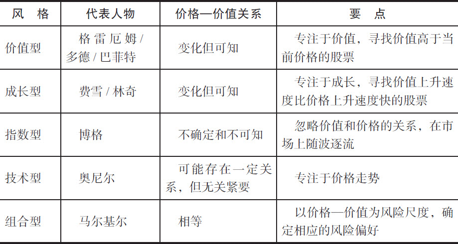
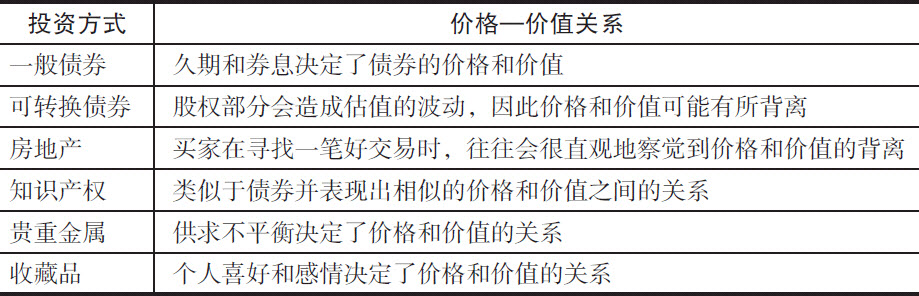

◆ 第1章 当前常见的投资风格

\>\> 价值投资目前又在市场上受到青睐。在20世纪90年代末的股市狂热中，仅有少数投资者能够习惯性地寻找价值被低估的股票，大多数试图在市场上冒险的投机客蒙受了巨大损失，而价值投资者却得以幸免。虽然在短期内，冒险投机者似乎赢得了不错的收益，但长期来看，价值投资者还是更能占得先机。尽管价值投资的理念正在复苏，但是还有很多人对其缺乏清晰的理解。希望本书能厘清这一概念，对投资者有所助益。

目前流行的投资风格有五种：

价值型投资者（value investor）依赖对公司财务表现的基本面进行分析，进而识别市场价格低于其内在价值（intrinsic value，即公司未来现金流的当前价值，我们会在后继章节中详细讨论）的股票。这一策略的历史可以追溯到20世纪30年代，由本杰明·格雷厄姆（Benjamin Graham）和哥伦比亚大学的戴维·多德（David L.Dodd）率先提出。因为伯克希尔–哈撒韦公司（Berkshire Hathaway）的CEO兼总裁沃伦·巴菲特对其推崇备至，该策略自20世纪七八十年代以来风靡一时。

成长型投资者（growth investor）力图寻找那些营收具有很大潜力、可迅速扩张其内在价值的公司的股票。投资人兼作家菲利普·费雪（Philip A.Fisher）在20世纪50年代首创了这一价值投资策略的变体，而麦哲伦基金（Magellan Fund）的基金经理彼得·林奇（Peter Lynch）则在80年代将它发扬光大。

指数型投资者（index investor）买入能够复制较大的细分市场（如标准普尔500指数）的股票。格雷厄姆认为这种选择股票的策略适合防守型的投资者。20世纪80年代，先锋基金（Vanguard Fund）的创始人约翰·博格（John C.Bogle）使这一策略流行起来。

技术型投资者（technical investor）使用图表收集那些标示涨跌预期的市场行为信息、市场走势和其他动态指标。技术分析的大师是《投资者商业日报》（Investor's Business Daily）的创始人威廉·奥尼尔（William J.O'Neil）。这一策略在20世纪90年代晚期被广泛应用。

组合型投资者（portfolio investor）首先明确自己的投资风险偏好（risk appetite），然后构建一个具有相应风险的分散化的证券组合。投资组合理论最初出现在20世纪50年代，并在70年代经过了多位诺贝尔经济学奖获得者的优化。该策略在70年代早期经由普林斯顿大学经济学家伯顿·马尔基尔（Burton G.Malkiel）的名著《漫步华尔街》（A Random Walk Down Wall Street）一书介绍后一直广受欢迎。

所有投资哲学的核心问题都是关于价格和价值的关系。价值型投资者和成长型投资者认为价格和价值是不同的；指数型投资者对自己能否搞清楚两者之间的关系持怀疑态度；技术型投资者只对价格而不是价值感兴趣；组合型投资者认为价格就是价值。

这些不同的理念也催生了不同的交易策略：

价值型投资者搜寻那些价格低于价值的公司的股票。

成长型投资者寻找那些在短期内的成长将揭示公司应有的价值并引发当前股价调整的股票。

指数型投资者认为最安全的策略是买入能很大程度上代表整个市场的那些股票。

技术型投资者寻找那些能快速以高价卖出的股票。

组合型投资者相信因为价格和价值是相同的，所以价格的变化反映了风险，而投资者应当选择一个自己认为合理风险水平的证券组合。

表1-1列出了这五类投资风格的要点。

表1-1 投资风格

为了做进一步的说明，假设昨天纽约证券交易所闭市时IBM公司的股价是每股50美元。是否买入该股票取决于每种投资策略中的不同因素（是否要卖出该股票在概念上基本是反其道而行之，我们将在第8章中进一步讨论）。

价值型投资者：（a）对IBM的未来现金流做出预期，计算其当前的价值，并判断是高于还是低于每股50美元；（b）只有当现金流的当前价值高于每股60美元时，才会买入股票[价值和价格之间10美元的差额意味着20%（\$10/\$50）的“安全边际”（margin of safety）]。更加保守的投资者会要求更大的边际厚度。

成长型投资者：（a）强调IBM销售、营收和现金流的相对可能增长；（b）如果确信IBM的价值和股价在不远的将来会增长到60美元，则买入股票。

指数型投资者：（a）认为自己在确认单独一只股票的价值和价格方面无能为力；（b）于是他们会买入一只包含IBM和很多其他公司股票的基金。

技术型投资者会：（a）高度关注市场上那些与IBM股价走势有关的线索，以判断股价在50美元附近上行或下行的可能性；（b）如果有迹象表明股价有上涨的趋势，则买入股票（如果这些投资者认为股价会下跌，他们也很有可能会卖空股票，以锁定当前50美元的价格，并希望将来以更低的价格将股票购回）。

组合型投资者：（a）认为以上这些完全是在浪费时间，因为50美元的股价已经反映了IBM当前的价值；（b）重要的问题是IBM的风险（以其股价相对于市场整体的历史波动来衡量）是否适合某投资者的风险偏好。

价值型投资和成长型投资在策略上有重合之处，它们对价格——价值的关系持有相同的观点，但在看待未来的角度上侧重点不同。价值型投资强调已知的价值，并将其和价格作比较；成长型投资强调成长所带来的价值增长，并将其与价格作比较。从这个意义上说，成长型投资和价值型投资如同一对表兄弟，它们的追随者均认为，投资分析师是能够得出股票的价值并将其与价格进行比较的。

指数型投资策略是为那些不能或不愿做上述工作的投资者所准备的。采用这种策略无需专业的分析能力或做额外的功课，投资的回报是整个指数的表现而不是遴选出的某一股票。价值型和成长型策略的拥趸认为该策略适用于那些缺乏分析技能或精力的投资者。我们在第12章将会看到，**了解价值投资的基本理念对被动型的投资者其实也是有益的，因为这可以帮助他们理解是什么力量在操纵他们原本的投资**。

价值型投资者把技术型交易看做投机，而不是投资。技术型投资策略试图预测投资者对股市前景的预期，并通过探究股价历史数据中的模式来建立这种预测。从某种意义上说，这并不是一种投资策略，而且它的时限也太短，不能构成真正的投资，所以这种策略对那些富于理性的分析师来说并没有吸引力，它会在股市持续走高时使人沉醉其中，从而丧失应该有的判断。20世纪90年代就是人们在股市中酩酊大醉的时候。

有一类被称做“动量交易”（momentum trading）的技术型交易在20世纪90年代很普遍。当最受瞩目的股票上涨时，其吸引力会进一步加大，采用这种策略的投资者会错误地认为自己是英明的炒家。很多人在弹冠相庆时，甚至都不清楚自己买入的公司是干什么的，是不是在盈利，更不要说去看一下这些公司的财报。在大概5年的时间内，大部分股票都在上涨，即使是那些已经摇摇欲坠的公司；沾沾自喜的情绪到处蔓延。

这期间，很多新的投资者被股市吸引而下海，尽管他们还读不懂企业财报，更不知其中的基本要素，即便是投资的老手也禁不住随波逐流，去相信传言和错误的主观判断，而不是基于事实和数据的分析。菜鸟投资者从来没有听说过价值投资的概念，而很多有经验的投资者又迷信地认为所谓的“新经济”已经使这一概念变得如化石般古老。其实我们不难发现，历史上有很多类似的时期，其中最广为人知的是20世纪20年代，其顶峰就是1929年的股市大崩盘。

正是这次经济大萧条催生了本杰明·格雷厄姆和戴维·多德的价值投资理念。20世纪20年代后期，由内部消息和主观判断驱动的资产组合管理技巧构成了当时投资圈的主要特点，而格雷厄姆通过宣扬一种理智的投资策略框架，提高了投资者的自制力。虽然他的价值投资理论蓝本仍然处处依赖投资者的个人判断，但是却给他们提供了一个坚实的基础。

组合型投资策略则在提供这种理性的投资策略框架方面走得更远。这种策略的一个基本假设是价格和价值是相等的。如果这一“有效市场假说”是正确的，则价值型投资策略就毫无用武之地了。通过买入一只价格远低于其内在价值（未来现金流的当前值）的股票来获取超出平均水平的投资收益变得没有可能。

在有效市场理论中，一个公司的业务风险反映在其股价相对于其他公司股价的历史波动中。这一组合型投资策略的关键指标被该策略的拥护者称做股票的β（beta）系数，并被频繁地监测。投资顾问使用β风险测度来指导组合型投资者建立符合自己风险偏好的投资组合，我们将在第7章中介绍其中的细节。

在此基础上，组合型投资策略又前进了一大步。其认为存在这样的可能性，即通过组合一揽子分散化的证券，可以消除与其中任何一只证券有关的特定风险。一只证券的风险可以被其他证券的收益所抵消。组合型投资策略将问题简化为分析β系数和构造最优的分散化投资组合，对于这两种工具，已有大量的数学和计量经济学方面的研究成果。有些证据支持这一理论，而另外一些则让人对其存有疑问。

价值型投资者对有效市场理论、该理论所宣称的价值和价格的同一性，以及β系数作为风险度量手段的适用性表示怀疑。价值型投资者的投资记录本身就是组合型投资理论存在薄弱点的重要实证。因为有太多成功的价值投资者，有效理论的支持者无法忽视他们的存在，而且市场上有太多的股票，其价格明显高于或低于其价值，这也使得有效理论难以变得完备。另外，尽管β系数可以或多或少地衡量与价格起伏有关的风险，但它却不能反映业务表现或真正的价值。 

市场泡沫的产生并不是偶然的，而是一种以快速的技术革新和过度的兴奋为典型特征的商业环境下的症状。非理性的繁荣会螺旋式地上升，其蔓延的深度和宽度往往超出人们的理解。在这种情况下，大量的普通人开始错误地认为自己了解公司的业务和股票市场，而有经验的投资者则会去追求超出自己理解能力的投资机会。

市场萧条同样不是偶发的，而是一股与上述情况相反的力量作用下的症状——新手从市场上逃离，而老手则恐慌过了头。这就如同一场散去的宴席，相比席上短暂的快乐，令人印象更加深刻的是宿醉带来的痛苦。

价值型投资者认为股市是不可预测的，不管是短期还是长期。基于过往的表现和现有的信息，人们能够较为合理预测的最多不过是较长时期内公司业务的大致表现。价值投资者要做的就是分析这些信息以确定价值，并将其与股价相联系。

◆ 第12章 购买股票的方法

\>\> 历史表现看，从众策略的回报远非丰厚。

\>\> 指数基金和价值投资

价值投资和对一家指数基金的长期投资有什么共同点呢？尽管投资指数似乎可以将投资者从价值投资的艰辛中解脱出来，但这样的观点是有误导性的。

指数基金是一类共同基金，基金经理将募集的资金适当分配，用来买入一个特定范围中的所有股票。这个范围通常包括构成能代表整个市场很大一部分的某一基准指数中的所有股票，如S&P 500。

\>\> 指数基金在股市上扬时会表现特别好，但在市场下挫时表现糟糕。市场走强时买入股票会让你感觉自己既聪明又富有，而如果市场变成熊市时还持有这些股票会让你对自己的智商产生怀疑并且感到财务窘迫。尽管指数基金的表现会随着市场涨跌起落，但它们对那些对股票良莠不分，或不知道如何区分实际经济状况和大众中盛行的观点的人来说，仍然可能是最好的投资方式。

\>\> 投资股票始终是有风险的，不论你是持有一只股票本身还是买入一个指数。价值投资策略不可避免地会被用到，即便你是指数策略的支持者，你也总是需要看到一些利润的空间，证明价值是高于价格的，才会去投资。在这一点上说，投资是没有捷径的。

常识和经验清楚地表明了这一点。被动投资者似乎本身就是矛盾的结合体。不论你是拥有福特、埃克森还是买入了先锋（Vanguard）或是富达（Fidelity）的基金，同样的原则都是适用的。单一股票和整个市场都会变动，或上或下，而熊市往往持续好几年甚至几十年。

股票基金

在遴选股票上有专长的人可以运营股票基金。投资者投入资金，并付给管理者一定费用，这比投资指数基金成本更高。股票基金在广告中会说这笔费用跟回报相比算不了什么，但在现实中往往不是这么回事。选股就要涉及股票的买卖，因此会对投资人税务申报产生影响，而这些买卖的决定控制在基金管理人而不是投资者手中。

有些基金是封闭式的，这意味着如果一位投资者想买入这样的基金，他只能从已经持有该基金的投资者手中购买，这样的交易通常在公开市场上的交易所中进行。更多的基金是开放式基金，任何人可在任何时间直接通过基金经理买入或卖出。在收取一定的费用后，这两类基金都给投资者提供了专业的投资管理服务和分散化投资的机会，当然这也是有潜在费用的。

再强调一遍，投资是没有简单轻松的解决方案的。最终，所有类型的投资——指数型、技术型、成长型或组合型——都隐含着对价值的判断。

\>\> 对投资者来说，投资交易所交易基金的期间成本（periodic cost）通常要比共同基金低，因为后者要为基金经理遴选股票的专业技能支付高额的报酬。省去这笔费用后，交易所交易基金的费用基本类似指数型基金。有些交易所交易基金的费用甚至还低于指数型基金，因为后台的工作也可以交给负责买入和卖出的经纪人，而不是由基金自己来完成。但是，经纪人不会免费工作，所以交易的成本往往也会中和掉节省出来的期间成本。所以，一次性大额投资应选择交易所交易基金（即开始时缴纳一笔经纪费，但是年费用很低），而资金成本平均法投资更适合走共同基金的路线（年费用较高，但没有经纪费）。

◆ 第13章 非股票投资途径

价值投资者总是习惯性地将价值和价格关联起来。这一态度不仅可以用到股票上，它同样适用于其他所有的投资形式。某些资产与其他资产比起来，更容易让人们建立将价格和价值联系起来的习惯。房地产就是一个很好的例子。当有一笔可能非常划算的房地产交易摆在自己面前时，人们一般可以非常直观地理解这样的机会。但是，很多人对普通股票投资缺乏这样的直觉。一般来说，人们对消费品，如汽车、贷款或者按揭贷款等比较容易建立这种直觉。

从市场上看，有一些资产的价格——价值差异是不太容易出现的。在这一点上，债券是个很好的例子。债券有久期和利率等普通股票没有的特性，这使得投资者比较容易在价值上达成一致，因此价格可以比较一致地反映价值，而普通股票在这些特性上的缺失使得我们有更多理由相信价格和价值的背离更有可能发生在股票身上。

所以除股票外的其他投资类型不仅说明了价值投资理念的普适性，还在一定程度上强化了价格和价值关联这一基本点，因此有必要对除股票外的其他投资形式做一点总结。

债券

对任何公司来说，债券都要比股票更安全。股票不承诺任何回报，而且在公司破产时是最后清算的，但债券在破产清算时的优先级较高，有预先给出的回报，还可以有额外的保护条款。但是，债券仍然是针对特定发行者的投资，所以股票投资的估值和分析原则同样是适用的：投资对象应该是位于投资者能力范围内、由值得信赖的具备必要能力的管理层运营的、高质量的企业。

债券是一类赊欠凭证。债券发行人承诺会归还所借金额（即债券的本金），并定期支付利息。发行债券时，应有协议规定发行方的财务状况必须维持一定的水平，以保证债务的偿还，并防止发行方滥用借到的现金，危害偿还能力，同时还要指明在发行方无力偿还甚至破产时不同债券清算的相对优先顺序。

公开发行的债券会在二级市场挂牌交易，如纽约证交所。债券发行时以招募说明书的形式，说明发行方的详细业务情况和债券的特点。发行方要定期向美国证券交易委员会（SEC）和评级机构，如标准普尔和惠誉等，做出呈报，评级机构会据此给出债券的信用等级。

整个市场整体的信用状况和债券发行方本身的信用情况决定了债券的价格，也就是债券支付的利息。 通过利用资产估值的一般原理，债券当前的价值是未来现金流的折现，其中包括定期支付的利息和债券到期时偿付的本金。用来计算这些现金流现值的折现率应该是市场上普遍接受的回报率，其中不仅反映了债券发行方的信用风险，同时也反映了目前市场上总体的系统性信用状况。

因此，债券价值会随着发行方本身的信用状况以及信用市场整体的变化而波动。一般来说，在股市是牛市时，债券相对股票的价格会偏低，但是债券会提供较稳定的回报；在股市是熊市时，相比股票，债券下行的风险要小一些。

当发行方的信用质量下降（例如，当其负债权益比率显著升高或者流动性不佳时）或信用市场对金融形势出现悲观情绪时（例如，担忧利率上涨），应使用较高的贴现率对债券的现金流进行估值。

当发行方信用状况提升或市场状况改善时，应使用较低的折现率。不论是哪种情况，债券的面值一般与其现金流的现值不同，要么会有一个溢价（当债券价格高于其面值时），要么会折价（当债券价格低于其面值时）。

债券的市场价格发生变化反映出债券支付的利息的变化，债券持有人的收益也会跟着变化。债券持有人的收益被称为“有效收益率”或“市场利率”。对折价销售的债券来说，有效收益率高于债券的券息；对以溢价销售的债券，有效收益率低于券息。

这些关系反映出债券价格和市场上普遍接受的利率之间的反向关系。利率上升时，还未到期的债券的价格会下降，反之亦然。考虑一只券息为10%的债券。如果市场利率下降为5%，这只债券的价格会高于新发行的债券（10%的券息高于5%的券息），而如果市场利率上升到15%，则这只债券的价格会低于新发行的债券（投资新发行的债券回报更丰厚）。我们的结论是，当利率高于历史平均水平时，购买债券是很好的投资手段，因为这时利率下降的可能性比上升更高。

一般说来，债券分析会比股票分析更加客观。为给债券评级，信用评级机构在分析和研究上投入了巨大的精力，而这些机构本身并没有买卖这些债券的兴趣（主要的投行也有研究部门对股票进行分析，但是投行的其他部门会交易股票）。 

其他投资者，特别是机构投资者也会进行和评级机构类似的调研和分析工作。这意味着，信用评级机构发布的降级决定常常是由于市场上已有的价格下行压力导致的，而降级的决定会进一步加大压力。这样的双重效应往往造成价格的过度下跌，使得降级后的债券成为可能的理想投资机会。同样的道理，评级上升时，债券的价格往往高过了应有的水平。

当然，债券的回报永远不会超过发行方的承诺，而股票持有人在企业表现强健时会分到一块越来越大的蛋糕。一种对冲的办法是把二者结合起来，这就是可转换债券。

可转换债券

可转换债券给投资者提供了债券的相对安全性，又保留了股票拥有的上升空间。固定收益的特点帮助投资者躲过市场下行时的风险，而可转换成股权的特点又给投资者提供了股价上升时获益的机会。这种组合意味着其中的债券成分相对来说比较容易估值，因而价格也较容易得到；而另一部分股权价值变化比较大，从而提供了价格与价值相背离的可能性。

当然，想要安全就要付出代价，可转换债券在这一点上也不例外。当股票表现强劲时，所对应的可转换债券价格的涨幅基本等于股票本身涨幅的2/3；当股票价格走低时，相应可转换债券的价格的跌幅只有股票价格跌幅的1/3 。看起来成本和效益似乎是不对称的，其实这缘于可转换债券中固定收益和本金偿付部分提供的保护，而仅持有股票的投资者在最坏的情况下是有可能血本无归的。

从流动性的角度讲，债券提供了更高的平均回报率，因为对典型的发行方来说，提供给债券的收益率会高于普通股票的股息收益率。对更加激进或更加乐观的公司，二者之间的差会增大，这些公司将全部的或几乎全部的净利润都用于再生产。它们认为这样做可以大大提高将来的利润，而且会提升股价，从而使得将债券转换为股票的做法变得很吸引人。

信用评级机构对一般债券的评级可能会比可转换债券的评级更加重要也更加准确。评级机构评测的重点是看债券发行方是否有能力在债券到期时按时偿付本金和利息。对于可转换债券，它们也会做同样的事情，这等于是没有考虑可转换债券中股权的价值，而这一特性是有可能带来丰厚回报的。

可转换债券市场的效率相对于股票市场和一般债券市场都要低一些，这使得发现价格和价值背离的可转换债券的几率要高一些。作为一类资产，可转换债券在很多市场条件下都很有吸引力，不论是牛市还是熊市。市场走高时，可转换债券可以捕捉到上涨的收益；市场走低时，则可以依靠利率和本金保底，这远远好于股票持有人所冒的股票分文不值的风险。

可转换债券可能最适合那些投资期限比较短的投资者，如还有几年就要退休的人，或者因为特殊原因需要资金的人。另一点需要权衡的因素是，相比一般的股票投资，要充分利用可转换债券的长处需要投资者有更加脚踏实地的经验，因为债券的可转换特性有可能触发债券发行人赎回债券，而且可转换的特性往往在特定日期后就无效了。当转换后的股票价值高于债券本身的价值时，持有人通常需要在很短的时间内做出是否转换的决定。

房地产

大部分购买房地产的人往往相信自己可能会做一笔很划算的买卖。这表明，在拥有自己住房这个问题上，人们很直观地认识到价格和价值是有可能分离的，从而自然地把握了价值投资的核心。

在美国，家庭拥有住房的比例正在稳步地提高，这得益于美国联邦政府对在二级市场上交易房屋抵押贷款的支持。这种支持还反映在税务优惠上，在美国，购房者为自己基本住房的按揭贷款支付的利息和房产税可以用来抵扣收入，从而享受个人所得税优惠。通过支付一小部分首付（一般是10%～20%），大部分人群能够利用抵押贷款这个杠杆，购入更多的房产为己所有。 

除了个别时间和个别地区的投机热潮外，房地产的价值是稳步上升的，所以投资房地产理所当然地成为了增加投资者净价值的一个选项。在过去的几十年中，美国人通过利用市场上各种与家庭财产有关的投资工具，已经在享受自己基本住宅价值上涨部分带来的回报。较低的利率促使人们纷纷放弃原来的按揭，转而买入新的按揭，如此一来，债务负担就降低了，能够利用的现金流也就更多了。 

购买第二座房产作为度假休闲的去处或者出租，成为对很多美国人有吸引力的选择，而不再仅仅是上层社会的特权。特别是当利率较低，股市回报不理想时，房地产市场会变得对投资者非常有吸引力。

除了家庭的需要和心理上的满足感外，这些投资方式还是要遵循基本的价值原则。支付一个合理的低于预期价值的价格还是非常关键的。投资者应避免采用过高的杠杆，就像投资股票时应避免保证金交易一样。耐心常常成为制胜的法宝。

拥有自己住房的另一个好处是，所有人本人就是房产的经理——他负责房子的日常运转和维护，要决定为了维持和提高房产的价值需要投入的资金。在意价值的投资者要保证自己能做这些事情，或者能找到胜任这些事情的人。对度假用房或者出租用房，这样的问题更加突出，因为房屋的管理者通常并不住在房子里，可能会存在后勤方面的问题。

有一种投资方式正变得越来越流行，这种投资方式在20世纪90年代促成了房地产投资的大发展，并广受投资者喜爱，这就是房地产投资信托（real estate investment trust，REIT）。房地产投资信托以给予投资人债权或股权的形式将资金募集起来，然后用募集的资金去购买和经营房地产项目。一家房地产信托可能投资于特定的项目，如办公区的停车场或公寓楼；或整片区域，如美国东南部或东北部；或二者兼顾。

房地产投资信托的价值受其持有地产或放出贷款的价值的影响，它需要以这些资产产生的现金流来回报给自己的投资者。房地产投资信托的涨跌直接由其持有房地产的涨跌决定。这类投资的优点是入门门槛低，仅需要较少的投资额，而且有内在的分散效应，另外还有非常吸引人的税务优惠。投资这类项目，同样需要有价值投资的头脑，要将价格和价值之间的比较关系铭记在心。

知识产权

所有的投资者都认可知识产权的重要性越来越突出。知识产权可以极大地提升企业的价值。专利、商标、版权和其他没有实物形式的资产带来的现金流，可以让那些传统上的“硬”资产如地产、厂房、设备和机器等相形见绌。

一个较少被考虑的问题是拥有这类资产的前景如何。作家和作曲家拥有作品的版权，发明家拥有专利，这类权利很少给原创者带来巨大的收益，但是我们不应该忽视它们。

投资者可以收购某些知识产权权利。例如，那些想从英国摇滚明星大卫·鲍威（David Bowic）的伟大作品的版税收入中分一杯羹的投资者不必再寻寻觅觅，而是可以借助他完成的一宗资产证券化交易。这笔交易从1997年2月开始，利用250首歌15年的使用权，募集5500万美元，券息高达7.9%。这笔交易开创了私有知识产权权利和唱片灌制权证券化的先河。

证券化交易是通过募集各种资产，包括各类知识产权，并以这些资产产生的现金流为依托发行证券的投资手段，这样的做法经过了时间的检验。知识产权证券化相当于一个特殊的信托，其资产就是转移过来的知识产权。对交易起到支撑作用的（以鲍伊的交易为例子）就是版税收入。

该信托是个独立的法律实体，其发行的证券一般都公开地在资本市场上交易。在目前这个阶段，这类证券更类似于债券而不是股票，是对信托资产上的固定利息收入和一定比例本金的所有权，超出这部分以外的收入归艺术家所有。

因此，这类证券是一类固定收益工具，类似于债券并表现出相似的价格和价值之间的关系。通常，评级机构也会对这类证券评级，评级一般较高，为A级或者以上。要得到这样的评级，有时候需要有一个评级为AAA的金融机构出具担保，保证支付不会中断，或者从资产中由艺术家持有的部分产生一部分现金存留，在收入不足时弥补亏空。

证券化过程中涉及的现金流量很大，因此弄明白谁该享有那个部分是很重要的。艺术家的收入来自他们跟唱片公司合同中规定的版税，只有这些资产支持着信托。歌曲的作者和唱片的发行商共享有三类版税：发行、广播表演和配乐使用（如作为商业广告的插曲）。发行商还享有灌录版税，这笔钱是由唱片制作商支付的用来使用原版或翻录音乐的费用。

鲍伊的交易是一个个人版税收入证券化的例子。我们还有其他的产权集合证券化的例子，比如把多个艺人的版税收入集中起来形成一个资产池。拥有很多签约艺人的唱片公司喜欢这种一揽子的方式，因为如此一来可以将多个艺人集中在一起支持一个交易，而这些艺人中的任何一个都不足以单独完成证券化。

投资者还应关注一下不同领域内多种类型的知识产权所有人提出的不同交易。到目前为止，乐坛上的这类交易还包括汽车城唱片的歌曲创作团队爱德华·郝兰德、莱蒙特·道泽尔和布莱恩·郝兰德（代表作《以爱的名义，住手！》）、詹姆斯·布朗、艾斯利兄弟（the Isley Brothers）、铁娘子乐队（Iron Maiden）和罗德·斯图尔特（Rod Stewart）。

其他被证券化的知识产权资产还包括可供多家电视台播出的电视剧集，如《宋飞正传》（Seinfeld）；文学作品，如《苏斯博士》）；职业运动队和著名运动员签署的合同也被囊括其中。

贵重金属

对贵重金属，如黄金和白银，其估价过程同其他投资对象不同。一般说来，我们在估计一家企业的内在价值时，会从其未来能产生的现金

\>\> 则可以依靠利率和本金保底，这远远好于股票持有人所冒的股票分文不值的风险。

可转换债券可能最适合那些投资期限比较短的投资者，如还有几年就要退休的人，或者因为特殊原因需要资金的人。另一点需要权衡的因素是，相比一般的股票投资，要充分利用可转换债券的长处需要投资者有更加脚踏实地的经验，因为债券的可转换特性有可能触发债券发行人赎回债券，而且可转换的特性往往在特定日期后就无效了。当转换后的股票价值高于债券本身的价值时，持有人通常需要在很短的时间内做出是否转换的决定。

房地产

大部分购买房地产的人往往相信自己可能会做一笔很划算的买卖。这表明，在拥有自己住房这个问题上，人们很直观地认识到价格和价值是有可能分离的，从而自然地把握了价值投资的核心。

在美国，家庭拥有住房的比例正在稳步地提高，这得益于美国联邦政府对在二级市场上交易房屋抵押贷款的支持。这种支持还反映在税务优惠上，在美国，购房者为自己基本住房的按揭贷款支付的利息和房产税可以用来抵扣收入，从而享受个人所得税优惠。通过支付一小部分首付（一般是10%～20%），大部分人群能够利用抵押贷款这个杠杆，购入更多的房产为己所有。 

除了个别时间和个别地区的投机热潮外，房地产的价值是稳步上升的，所以投资房地产理所当然地成为了增加投资者净价值的一个选项。在过去的几十年中，美国人通过利用市场上各种与家庭财产有关的投资工具，已经在享受自己基本住宅价值上涨部分带来的回报。较低的利率促使人们纷纷放弃原来的按揭，转而买入新的按揭，如此一来，债务负担就降低了，能够利用的现金流也就更多了。 

购买第二座房产作为度假休闲的去处或者出租，成为对很多美国人有吸引力的选择，而不再仅仅是上层社会的特权。特别是当利率较低，股市回报不理想时，房地产市场会变得对投资者非常有吸引力。

除了家庭的需要和心理上的满足感外，这些投资方式还是要遵循基本的价值原则。支付一个合理的低于预期价值的价格还是非常关键的。投资者应避免采用过高的杠杆，就像投资股票时应避免保证金交易一样。耐心常常成为制胜的法宝。

拥有自己住房的另一个好处是，所有人本人就是房产的经理——他负责房子的日常运转和维护，要决定为了维持和提高房产的价值需要投入的资金。在意价值的投资者要保证自己能做这些事情，或者能找到胜任这些事情的人。对度假用房或者出租用房，这样的问题更加突出，因为房屋的管理者通常并不住在房子里，可能会存在后勤方面的问题。

有一种投资方式正变得越来越流行，这种投资方式在20世纪90年代促成了房地产投资的大发展，并广受投资者喜爱，这就是房地产投资信托（real estate investment trust，REIT）。房地产投资信托以给予投资人债权或股权的形式将资金募集起来，然后用募集的资金去购买和经营房地产项目。一家房地产信托可能投资于特定的项目，如办公区的停车场或公寓楼；或整片区域，如美国东南部或东北部；或二者兼顾。

房地产投资信托的价值受其持有地产或放出贷款的价值的影响，它需要以这些资产产生的现金流来回报给自己的投资者。房地产投资信托的涨跌直接由其持有房地产的涨跌决定。这类投资的优点是入门门槛低，仅需要较少的投资额，而且有内在的分散效应，另外还有非常吸引人的税务优惠。投资这类项目，同样需要有价值投资的头脑，要将价格和价值之间的比较关系铭记在心。

知识产权

所有的投资者都认可知识产权的重要性越来越突出。知识产权可以极大地提升企业的价值。专利、商标、版权和其他没有实物形式的资产带来的现金流，可以让那些传统上的“硬”资产如地产、厂房、设备和机器等相形见绌。

一个较少被考虑的问题是拥有这类资产的前景如何。作家和作曲家拥有作品的版权，发明家拥有专利，这类权利很少给原创者带来巨大的收益，但是我们不应该忽视它们。

投资者可以收购某些知识产权权利。例如，那些想从英国摇滚明星大卫·鲍威（David Bowic）的伟大作品的版税收入中分一杯羹的投资者不必再寻寻觅觅，而是可以借助他完成的一宗资产证券化交易。这笔交易从1997年2月开始，利用250首歌15年的使用权，募集5500万美元，券息高达7.9%。这笔交易开创了私有知识产权权利和唱片灌制权证券化的先河。

证券化交易是通过募集各种资产，包括各类知识产权，并以这些资产产生的现金流为依托发行证券的投资手段，这样的做法经过了时间的检验。知识产权证券化相当于一个特殊的信托，其资产就是转移过来的知识产权。对交易起到支撑作用的（以鲍伊的交易为例子）就是版税收入。

该信托是个独立的法律实体，其发行的证券一般都公开地在资本市场上交易。在目前这个阶段，这类证券更类似于债券而不是股票，是对信托资产上的固定利息收入和一定比例本金的所有权，超出这部分以外的收入归艺术家所有。

因此，这类证券是一类固定收益工具，类似于债券并表现出相似的价格和价值之间的关系。通常，评级机构也会对这类证券评级，评级一般较高，为A级或者以上。要得到这样的评级，有时候需要有一个评级为AAA的金融机构出具担保，保证支付不会中断，或者从资产中由艺术家持有的部分产生一部分现金存留，在收入不足时弥补亏空。

证券化过程中涉及的现金流量很大，因此弄明白谁该享有那个部分是很重要的。艺术家的收入来自他们跟唱片公司合同中规定的版税，只有这些资产支持着信托。歌曲的作者和唱片的发行商共享有三类版税：发行、广播表演和配乐使用（如作为商业广告的插曲）。发行商还享有灌录版税，这笔钱是由唱片制作商支付的用来使用原版或翻录音乐的费用。

鲍伊的交易是一个个人版税收入证券化的例子。我们还有其他的产权集合证券化的例子，比如把多个艺人的版税收入集中起来形成一个资产池。拥有很多签约艺人的唱片公司喜欢这种一揽子的方式，因为如此一来可以将多个艺人集中在一起支持一个交易，而这些艺人中的任何一个都不足以单独完成证券化。

投资者还应关注一下不同领域内多种类型的知识产权所有人提出的不同交易。到目前为止，乐坛上的这类交易还包括汽车城唱片的歌曲创作团队爱德华·郝兰德、莱蒙特·道泽尔和布莱恩·郝兰德（代表作《以爱的名义，住手！》）、詹姆斯·布朗、艾斯利兄弟（the Isley Brothers）、铁娘子乐队（Iron Maiden）和罗德·斯图尔特（Rod Stewart）。

其他被证券化的知识产权资产还包括可供多家电视台播出的电视剧集，如《宋飞正传》（Seinfeld）；文学作品，如《苏斯博士》）；职业运动队和著名运动员签署的合同也被囊括其中。

贵重金属

对贵重金属，如黄金和白银，其估价过程同其他投资对象不同。一般说来，我们在估计一家企业的内在价值时，会从其未来能产生的现金流入手，然后进行折现。这种做法假设会有一个基本的现金收入作为估值的入手点。

但是，在经历严重的政治和经济危机或深度重商主义时，纸面上的价值变得一文不值，价值的存储形式回归贵重金属。在这样的时期，持有少量高内在价值的工具可能是个好的选择。

白银是保值手段中最为经济的。在严重的世界性危机中，当资产的纸面价值严重下跌时，白银的价值会保持稳定或上升（下面会提到，黄金的价格也会急剧上涨）。因此，每一个投资者应该考虑在自己的投资组合中包含少量的白银（视市场情况，在1%～10%之间）。白银是一种投资，所以应遵循同样的价值投资原理。在投资白银时，价值投资者应清楚这种金属是如何开采、冶炼、使用和买卖的，简而言之，他们应懂得白银的供需关系。更重要的是，白银还是一种工业性金属，这意味着它作为一种生产资料，本身就有着很刚性的需求。

例如，在供应端，白银经常作为开采铜的副产品，而铜只是一种普通金属。因此，当铜价格上涨时，白银价格可能会下降（铜价上涨会导致铜的开采量增加，从而导致白银供应量上升）。在需求端，白银的主要工业用途是影视行业（如早期的银幕）。但是，随着不使用白银的数字化影像技术的发展和大规模采用，这一需求减少了，因此对白银价格构成了压力。

购买白银最方便的手段是以银条或小面值银币的形式。这些银条和银币的定价一般来说都很接近其价值，而销售商一般都收取不变的手续费。纪念性和装饰性的银币和银首饰会有比较大幅度的加价，因此破坏了其价值和价格的平价关系，使得这些物品更适合成为奢华品而不是主要的投资工具。这些物品的价格和价值可能变化很大，因为人们可能根据个人的喜好和欣赏品味赋予它们超过市场价值的个人化的价值。

投资白银市场的一种方式是购买白银矿产企业的股份。金属价格上涨时，开采企业会随之受益，但是银价下跌时却不一定会同步伤及这些企业。矿产企业的表现和股价即便在贵金属市场走低时，也可能保持强劲。基于企业预期现金流的估值既是当前产品产生的收入的函数，也是探明和预计储量产生的未来的收入的函数。因此，对于通常不赞成基于未来成长来对企业进行估值的纯粹的价值投资者来说，这类企业是个例外。

黄金虽然在工业上也有非常广泛的用途，如电子工业和化学工业，但主要还是被用做货币金属。黄金的价值主要是宏观经济力量的函数，如利率、汇率变动和通货膨胀水平。经济突然发生结构性震动时，黄金的价格比白银和其他一些贵金属更容易波动，一个例子就是各国央行剥离金本位的做法。虽然黄金曾作为对冲高通货膨胀和利率绝对有效的手段，现在它在这方面的作用已经被其他金融工具（如期货和期权）取代。

收藏品

白银可以作为简单的投资品，白银制品也可以作为收藏品。例如，稀有的银币和银质高脚杯价值不菲。类似的例子还有油画、有特殊意义的招贴画、雕塑和其他小工艺品，以及古董，如钟表、老爷车和家具等。

相对于经济上的回报，涉足收藏品所需的投资额通常很高。另外，收藏品总是会有所有人的感情附着在上面，因此，即便是有可观的利润，所有人往往也不见得愿意出售。

当拥有这类收藏品时，它们应该被理所当然地考虑在投资者的组合中，不管是出于评估现有经济价值、风险管理还是投资前景分析的目的。但是，对其中情感因素的折价需要恰当地处理。在遇到紧急情况需要资金时，卖出1000美元的银行存款凭证或100股IBM公司的股票比卖出一打美国银币要容易得多。这再一次强调了价值投资的核心理念，即价格和价值的不同。

表13-1 总结了除股票外的其他投资形式以及它们各自的价格——价值关系。

