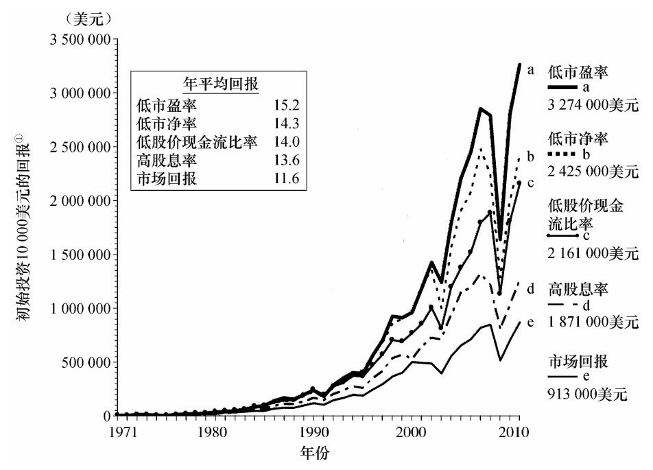
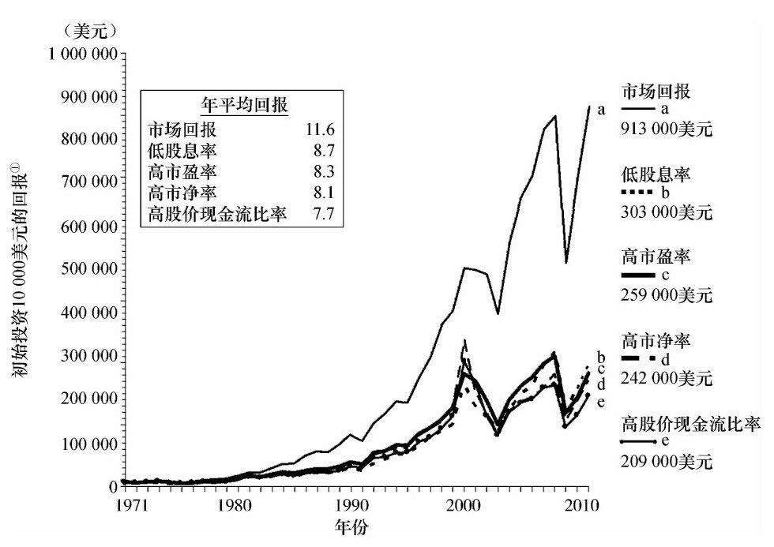

索引方式：微信读书（竖屏）

P4 推荐序：在许多人看来，所谓“逆向投资”就是和多数人的投资行为相反的“高见”，这是大谬。事实上，德雷曼以行为金融学为基础，动用了作者及其他人几十年来的经验数据、成功心得和失败教训，逐条反驳了时下仍长期占据市场主导地位的“效率市场理论”的每个假设。完善与发展了“逆向投资体系”。

P8 商学院课堂里的主流金融理论无法指导证券市场的实践，衍生出行为金融学

P12 掌握逆向投资策略是取得投资成功的关键

德雷曼深入研究投资者为何偏好“追涨杀跌”，总是在股市出现泡沫时投入，又在股票毫无价值时卖出，分析了情感因素对投资者产生的不利影响和心理陷阱。他认为，有效市场理论建立在未被证实的投资者理性前提之上，因此，与其说是一个“理论”，还不如说是一个“假说”；而事实证明，这个“有效市场假说”是错的。于是，他直截了当地提出“投资者过度反应假说”。他认为，对于同样的事实，两种假说的结论是完全相反的。

在这本第4版的《逆向投资策略》里，德雷曼围绕五大主题展开分析。①心理学前沿的启示：总结历史上著名投资狂热事件，从投资者行为和心理角度提出新的见解。②新黑暗时代：对有效市场假说和风险理论进行批评。③有缺陷的预测和可怜的投资回报：展示了分析师预测与市场表现间的巨大偏差。④市场反应过度——新的投资规范：详细介绍克服心理弱点和预测错误的各种逆向投资策略。⑤未来的挑战与机遇：讲述在“后危机时代”，该如何摆脱通货膨胀，让资产保值增值。

与丹尼尔·卡尼曼相比，德雷曼可能还算不上一个经济学家，他的这本《逆向投资策略》也算不上一部“严谨”的金融学理论著作。但他的表述深入浅出，通俗易懂，没有任何复杂的数学推演和深奥的理论阐述，娓娓道来，充满引人入胜的故事及经验总结。但是，并不因此就降低了其理论应用价值，因为真理往往是简单朴素的。试问，如果不能成功地指导实践，优美的理论模型又有何用呢？

德雷曼从提示逆向策略基本结构、功能和对五种方法的统计判断入手，结合自己50多年征战华尔街的亲身经历，系统讲述了规避心理陷阱、取得投资成功的途径。他提出的五个重要策略是：①低市盈率策略；②低股价现金流比率策略；③低市净率策略；④高股息策略；⑤低于行业定价策略。

与此同时，他还提出了选股五项基本指标：①坚实的财务状况；②尽可能多地采用受人欢迎的经营和财务比率；③近期较高的超过标普500指数的收益增长率，以及未来业绩不会有跳水的可能性；④收益预测应该尽量保守一些；⑤企业能够维持或提高高于平均值的股息率。

P14 译者序：本书前半部分篇幅侧重于理论探讨和辩论，作者的理论武器是投资心理学，这是行为金融的基础。在每个论辩、结论之后，作者给出了从心理学角度提出的指导原则。后半部分可以被看做“逆向投资”方法论的实证部分。无论从理论研究还是实证研究的角度看，本书都算得上相当严谨。在这部分，作者还给出了实际操作建议。

价值投资比其他技术分析更难掌握，在于他对于人心和人性提出了更高要求

P18 前言：有效市场假说（EMH）的核心错误是完全理性假设。

P22 \#\#\#本书的结构\#\#\#

P26 个人观点：\#\#\#投资范式的改变\#\#\#

PartⅠ 心理学前沿的启示

CH1 泡沫星球

P33 本章我们将快速回顾一下股市历史，展示泡沫的主要原因。告诉你如何辨别泡沫，更好地理解和避免被泡沫所伤。

P34 绝大部分泡沫最重要、具有毁灭性的共性是信用的过度使用。另一个相似之处：几乎所有的投机狂热都是由坚实的实体经济孕育的，那时投资者的信心高涨

P38 我将试着严谨地证明泡沫不会随着时间而变。如果真有变化，那就是泡沫在20世纪60年代之后出现得越来越频繁了，股价的波动性也越来越大，对美国、世界经济和金融系统的破坏性也越来越大。

P41 60\~90年代早期的泡沫对经济的长期破坏作用很有限，后期的泡沫迫使近百万已经到了退休年龄的人不得不继续工作。

所有这些都发生在有史以来受过最好教育的投资者身上。他们拥有强大而先进的计算机、即时通讯设备，随时可以获得快达纳秒级的更新数据，能用钱买到最好的研究资料。所有用来做逻辑决定的工具比以往任何时候都要好，但结果却是历史上最差的。所有这些都说明了了解投资者和市场心理很重要。

CH2 危险的情绪

P47 长期来看，情绪伤害投资者的4种形式：

1.  对概率不敏感：我们如果对一只股票或一项投资的前景有强烈的情感，有时会支付高于其真实价值100倍的价格。这是股价在泡沫期会飙升的主要原因。
2.  风险的判断和收益呈负相关性：有效市场理论声称承担的风险越大，投资所获得的回报也就越多。情感理论发现事情并不是这样。
3.  持续性偏差：我们倾向于高估一个正面或负面的事件或收益异动消息的过度反应，也可以应用于其他市场正面或负面事件。
4.  时间解释效应：近期发生的事件更有可能以密集而特别详细的方式被报道

P60 格雷厄姆是对市盈率和其他价值比率极端保守的人，通常只要市盈率高于20倍，不管股票的远景怎样，他都不建议人们买。拥有一般前景的股票的市盈率通常在12\~15倍，具有高平均收益增长预期的公司的市盈率应该在25\~35倍。

P61 证券分析对高于或低于基本面价值的最低25%、最高35%的大概价格范围内的估值是有效的。

P62 心理学指导原则1：不要丢弃由证券分析师精心计算出来的估值，即使这些估值暂时与目前的市场价格相去甚远。长期来看，市场价格会回复到与估值相似的位置。（CF：P72）

接下来，我们会深入了解另一个我们日常生活中都会用到的主要的启发法或思维捷径。尽管每一个都非常有用，但它们也会为我们的投资决策打开偏见之门，从而导致其他严重的甚至是毁灭性的错误。知道这些思维捷径是什么以及是如何运行的，会帮助你产生免疫力。

CH3 决策的危险捷径

P64 习得性偏差让我们在潜意识里对已经存在于大脑中的意象赋予的重要性高于了那些比较模糊的意象。

人们利用大量的心理捷径或经验法则来做决定，而不是通过计算一个给定结果的概率来做决定。

P72 心理学指导原则2（a）：不要仅仅依赖于“个案收益率”。计算“基础收益率”，这代表了收益或亏损的最大可能。股票的长期回报（即“基础收益率”）会更有可能被重新建立起来。

心理学指导原则2（b）：不要被暂时的个股或市场严重脱离过去基本状态后的近期回报（即“个案收益率”）所迷惑。如果回报特别高或低，则它们很有可能是不正常的。

P73 第1章花了很多时间详细介绍了投资狂潮和大股灾中情绪的力量。到目前为止，本章都是在探讨被可获得的、近因性和显著性的偏差引诱而导致的错误。现在有人可能会问，这三者如何会在同一个泡沫或投资者所犯的错误中出现？

我们可以建立一个识别泡沫的防御体系，并且在泡沫来临之前有足够的时间逃脱。实际上，如果股票还远未低到极其廉价的水平，我们都应该采取类似的方法。⭐预防近因性和显著性最好的方法是，将你的目光放在长期投资上。

我还将给出一些有用的预防措施。当然，如果只有这些预防措施，你的投资策略并不坚实，但你可能会希望将这些预防措施加到我们稍后会讨论的投资策略之中。在我们可以拿起抵御前面讲到的启发式错误的重武器之前，这些预防措施还可以帮你抵挡一阵子。

P76 总的来说，代表性偏差会像市场一样，对一家公司或一个行业施加影响。

心理学指导原则3：不要拘泥于近期投资环境和过去的投资环境之间明显的相似性，多考虑其他可能产生明显不同结果的重要因素。

P79 心理学指导原则4：别被基金经理、分析师、市场预测者或经济学家的短期记录或“伟大”的市场预测所影响，即便他们十分令人钦佩；在充分证实之前，不要接受任何粗略的经济学或投资方面的消息。

P80 有时候一个结论会因为“小数法则”而显得很荒谬。另一个由这种启发式偏差导致过度反应的例子，是投资者盲信美联储或政府发布的关于就业率、制造业产出、银行系统的健康性、消费价格指数、企业库存以及其他的类似统计数据。

P83 心理学指导原则5：市场的复杂性与不确定性越高，不论近期的回报如何可观，你都不应该重视个案比率，而应更多地关注基础比率。

P88 我们生活在一个信息泛滥和信息超载的市场，将在第4章看到，我们有办法降低信息超载的负面影响。接下来看看在启发式偏差下做出错误判断的其他途径

P90 心理学指导原则6：别期望你在股市所采取的策略会带来快速的成功，给它足够的时间来实现目标。

PartⅡ 新黑暗时代

CH4 穿斜纹软呢夹克的征服者

P96 为什么有效市场假说（EMH）和它的两个兄弟，资本资产定价模型（CAPM）以及现代资产组合理论（MPT）会在投资界变得如此有用？这些教育是如何影响你的，是如何改变市场的？研究EMH的不足之处能让投资者避免受其有害影响

P97 随机漫步假说表明，股价波动和交易量的历史数据为投资者提供的信息不足以提出任何比“买入——持有”更好地策略。市场没有记忆，你无法战胜平均值

P101 尽管在华尔街，基本面分析是主流，但还是有不少人时不时偷偷“看看图标告诉了他们什么”。可能在股市危机期间这样会更频繁一些，同时也为买入决定做最后的确认。尽管我们发现这50年来有大量的证据表明技术分析的有害性，但它还是被投资者广泛运用。

P103 有效市场假说最关键的一个前提是市场对新信息的反应几乎是瞬时且正确的，因此投资者不能从中获利。

P 在EMH、CAPM和MPT理论出现前通常没有风险校正。CAPM的发展促使学术界和咨询师将风险计算放入公式中，以决定一个投资组合表现的优异程度

1.  劣于大市的组合：用高风险的方式获得了与大市相等的回报。
2.  优于大市的组合：用低风险的方式获得了与大市相等的回报。

P106 在市场上取得成功的真实概率有多大？到底有没有真实的概率？我们很快就会讨论这些问题，但在这之前，让我们先看一看为什么有效市场假说失败了，其失败给投资者造成了怎样的影响。

CH5 皮肉之痛

P109 根据有效市场假说，这些基金经理和分析师大体上保证了市场的有效性，如果解雇了太多人，会使他们的人数变得更少。本章和下一张的内容会证明这些论点的基础一点都不牢固，我们会说明其中的原因。一路走过，我们会看到那些被认为是理论的有力支持的统计学资料坍塌了，这可能是因为工具并没有给出他们宣称的结果，也可能是那些研究者忽略或看轻的数据反过来反驳了他们的观点

真实世界所给出的结果与那些建立有效市场假说理论的杰出学术先驱的预测之间有很明显的非相关性。本章中，我们首先会基于反驳有效市场假说的基本前提的主要市场事件，编写出一个坚实的参考文献资料库，然后分析那些支持理论的基本缺陷。

现在我们开始详细讨论有效市场假说的支持者所说的不会发生的3件事：

1.  1987年大股灾：指数套利、投资组合保险和指数及股票期权的急速膨胀并没有像有效市场鼓吹者所保证的那样行使调节的功能，也没有降低市场的波幅
2.  1998年长期资本管理公司的倒闭
3.  2006\~2008年的房市泡沫和大股灾

P113 投资组合保险无法避免损失，只不过是另一个把握市场时机的装置。

P119 支持有效市场假说的主要支柱在1987年大股灾中被摧毁了\#\#\#5点说明\#\#\#

P132 现在你可以判断有效市场假说核心假设的精确性：

■关于流动性

■关于杠杆

■关于波动率和收益的相关性

■关于波幅是否一直能保持稳定

■关于理性投资者总是能“自发”维持正确定价

有效市场假说和资本资产定价模型的所有理论支柱都显得不堪一击。我们也看到了有效市场假说在很长一段时间内对市场和经济产生的严重伤害。

首先，我们需要以心理学和新的逆向投资策略来武装自己。如此一来，我们将学会如何将有效市场假说变废为宝。

CH6 有效市场和托勒密本轮（地心说的产物）

P134 我们现在要问的两个问题是：

1.  为什么专家们如此着迷于将波动性作为计算风险的唯一因素？
2.  这种关注正确吗？

稍后再讨论这两个问题。

P135 前一章主要围绕波动性展开。波动性高，会给投资者带来更高的回报，而波动性低所带来的回报率也同样低吗？从前一章我们看到，答案肯定是否定的。实际情况是，学术研究在30年前就解答了这个问题。

P140 高β系数是紧急，而那些可以在低β系数的情况下给出令人满意回报的投资组合经理大受追捧。

晨星网站数据关于风险的概念有问题。被外界广泛追捧的晨星五颗星最高级别排名，使用的是法玛的三因素模型作为其风险测量方法，这至少很值得怀疑。

P145 专业论文中，研究者通过标准风险校正技术显示，很难95%地肯定，一个在十年中资本增值90%地投资组合，比另一个在十年中资本下跌3%地投资组合管理地要好。文章还写到：“根据年回报表现和变量（波动性）的合理水平，标准风险校正技术需要70年期的季度数据才能在统计学意义上达到95%的可信度

P147 逆向投资策略的回报在相当长一段时间里打败了市场的均值。而那些宣称逆向投资策略的风险更高的言论却从未被证实。

P164 科学家是绝不会抛弃一个范式的。不管抨击者怎样恶劣，除非他们有更加令人信服的范式来取代它，并能解决旧范式不能解决的大多数问题。

⭐在第4篇将给出市场行为的新范式，它基于许多我们所了解的可预测的投资理论，并且拥有强大的经验依据来支撑假设。对于投资者来说，好消息是新的范式衍生出的的方法能持续跑赢市场，坏消息是它需要些年头才能通过考验。

P172 我们现在已经准备好开始检验那些有用的、且在将来与我们现在面临的不同的市场环境中同样有用的投资策略。

PartⅢ 有缺陷的预测和可怜的投资回报

CH7 华尔街预测成瘾

P173 了解投资者心理以及效率市场的冲突，能够让你带着优势进入市场。

我们详细讨论了每种理论表现出的巨大的概念性困难，不过你可以从中获利：投资者心理学，可以让你明白如何去保护和增加你的资产；而有效市场理论是一个失败的假说，如果你不明白它的危害就有可能为其所伤。

本章将开始说明当代投资理论长期以来令人失望的原因——我们不是理性机器人；我们不得不习惯性地经常犯错误，标准投资理论没有考虑这些心理偏差

P174 目前的研究显示，我们的大脑是一个串行或循序的数据处理器，只能依照线性的方式处理信息。也就是说，我们可以通过逻辑上的顺序从一点移动到另一点。但那些被证明对于专业人员来说很困难的问题又不一样；不同于线性思维，在这里需要构成性推理（或互动推理）。他们必须整合、测量不同的因素，当一个因素改变的时候，他们必须重新评估。

P175 通过一种叫做方差分析（ANOVA）的统计方法，一种特殊的技术被设计出来以评估专家们构成型推理能力。

放射线医生的诊断工作需要高水平的构成性处理，但研究者发现，在真实的操作中，构成性处理所做的判断只能解释所有判断的大概3%左右。

保罗·斯洛维奇检测了构成性推理在市场专家做决策时所起到的重要作用。结果是，用构成性推理所做的决策平均只占所有决策的4%——百分比基本上同放射线医生和心理学家持平。

总的来说，所有的证据显示，大部分人都不是强大的构成性推理者，不论是在市场中还是市场外。这显示出人类的思想天生就与电脑的处理方式不同。

P176 大量数据并没有给专业的投资者带来额外的优势。当信息的处理需要大量的、复杂的分析整合时，在不涉及专业知识的情况下，需要谨慎和分析的系统常常巧妙地被经验性系统所取代。推论系统巧妙地绕开了我们的理性数据库。

P180 心理学指导原则7：很少有人可以成功地用大量的信息来处理一个高难度的问题。详尽的信息不等于高回报。

信息过多对思考没有帮助，反倒助长了自信心，导致他们容易犯严重的错误

P181 投资者趋向于将不易理解的复杂问题做简单化和理性化处理。常常在他们发现一些简单的巧合的事件时，就会认为自己找到了相关性。

心理学指导原则8：不要基于相关性做出投资决定。股市中所有的相关性，不论是真实的还是虚幻的，都变化莫测、很快消失。

P185 心理学指导原则9：分析师的预测通常过于乐观。适当调低你的收益预测

现在，那些有抽象推理天赋的人可以解决大量的复杂问题。每个领域都有顶尖人物，但这样的人毕竟是少数。因此，看上去目前投资方法所要求的信息处理能力和抽象推理的标准，无论对专家还是新手来说，都过于复杂且无法精确使用

P188 研究证明，大部分专业投资者（基金经理）和普通投资者一样，既在股票高位时追逐热门股，又在股票不再光鲜时低价斩仓。

P189 心理学指导原则10：格外小心当下的投资方法。在处理复杂信息时的局限性使得绝大部分人无法成功地使用这些方法。

CH8 你能下多大的赌注

P199 心理学指导原则11：长期来看，做出精确收益预测的可能性非常小。不要利用收益预测作为你买入或卖出股票的主要原因。

P201 心理学指导原则12：在分析师的预测中，没有可以精确预测到的行业。

P204 心理学指导原则13：目前大部分证券分析要求的精准预测是分析师无法给予的。应尽量避免使用基于这类精确程度的分析方法。

P206 心理学指导原则14：在政策、经济、行业和竞争环境不断变化的动态经济体中，我们无法用过去的趋势预测未来。

P208 心理学指导原则15：如果你对某位分析师推荐的股票感兴趣，就看看他在过去3\~5年里发布的所有报告。如果这些报告达不到预期结果，那就赶紧走开吧

P223 在上一章中，我们看到指数基金长期来看轻松打败了大部分证券基金，而前者正是架构在外部观点的基础上，外部观点的采用频率要远远低于内部观点。能够获得更优厚回报的逆向投资战略也来自于外部观点，这点将会在下一章看到

另一个心理学指导原则放在这里十分恰当：

心理学指导原则16：长期来看，外部观点通常能提供更优厚的回报。为了最大化你的回报，购买那些能提供此类方法的投资标的。

P225 心理学指导原则17：客观看待投资的下滑；设想那些比你预期更严重的最糟糕的情况。

在本章，我们探讨了分析师预测的显著错误，这些错误如此巨大，以至于使得多数现有的投资方法都无效。我们同样看到，即使几十年来大家已经认识到预测的高失误率，然而，那些虔诚地依赖于预测的分析师和投资者一点都没有改变他们的投资方法。

对于分析师和市场预测者来说，这个问题并非特有。我们已经了解到在许多信息不透明的领域，这是普遍存在的，单认识到这个问题就已经很困难了，更别提改变了。最后，我们发现在股票市场内外，超级乐观的心态已经成为了专业预测的重要部分。

现在的问题是，对此我们可以做什么？答案是，我们需要转移到一个更好的投资范式，这个范式完全不依赖于有效市场理论，也不依赖于证券分析师对公司收益的预测和估值。其他更好的途径当然是有的。

CH9 不速之客与神经经济学

P235 本章首先主要讨论突发意外的各种表现和模式，随后将引入一个较新的科学领域，即“神经经济学”。

P249 具有最佳前景、最快成长速度和最引人注目的概念的公司，往往交易价格与收益、现金流和净资产的比率很高（即三高：高市盈率、高股价现金流比率、高市净率），而且几乎都是分红很少或者不分红。反之，前景预期差的公司的股票以低市盈率、低股价现金流比率和低市净率交易，但是股息率总是比较高。

P254 心理学指导原则18：收益异动事件有助于提高冷门股票的表现，但对热门股的收益回报是负面的，这种差异很明显。为了提高投资组合的表现，可以通过选择冷门的股票，从分析师的预测失误中获益。

P261 心理学指导原则19：正面和负面的意外对热门股和冷门股的影响正好相反

收益异动事件对股价有巨大的、可预判的、系统性地影响。异动事件包括：

1.  触发型事件：一个预期良好地股票遭遇了负面意外地冲击，或者预期差的股票遇到了正面的收益异动，其结果因股票种类不同而大相径庭。2种类型：
    1.  热门股受负面意外事件冲击，造成股价下跌。
    2.  冷门股受正面意外事件影响，将股价推升。
2.  强化型事件：这种意外事件强化了投资者对公司地当前看法。这种情形对股价的影响应该小很多。强化型事件指的是：
    1.  正面收益意外作用于热门股。这强化了上市公司出色的看法，理所当然
    2.  负面收益异动作用于冷门股。这也是在公众意料之中的

P273 心理学指导原则18告诉我们可以买进冷门股，并借助分析师预测失误和其他意外事件获利。我们现在可以更进一步描绘出意外的效应，这将会成为稍后提出的策略的基本工具。心理学指导原则20总结了我们对意外的发现。

心理学指导原则20（a）：意外事件提升了冷门股，热门股的表现不明显。

心理学指导原则20（b）：正面意外导致冷门股升值，对热门股的影响极小

心理学指导原则20（c）：负面意外导致了热门股的价格大幅下跌，而对冷门股其实没有影响。

心理学指导原则20（d）：收益异动的影响会持续一段较长时间。

本章仔细讨论了意外事件的作用，发现它们对投资者不看好的股票更有利，而不利于那些被投资者看好的股票。由于前一章所说的意外发生的频次，我们知道这是一股强大的力量，作用于之前被高估或低估的股票。

在下一章，我们将会看到在开发威力强大的投资策略过程中，意外和相应的改变是多么重要。

PartⅣ 市场反应过度：新的投资规范

CH10 通向赢利的逆向投资路径

P307 被专家们钟爱的股票绝对不值得买。分析师和基金经理喜爱的股票总是受到收益意外事件的打击，而那些被人们冷落的股票却总能从收益异动中获益。投资者的热情经常会导致热门股被高估，冷门股被打入冷宫，无人理睬。收益异动和其他意外事件导致了两类股票被重新估值，回到更合理价位。

这就是这个谜的最大最关键的部分，**问题在于，我们如何把它放入一个可执行的投资策略中去？**毕竟我们不是要分析市场的动力学，而是寻求从中学到能获取收益的模式。改变方式，不是建立一个逐步推导的过程，而是直接把答案摆出来，供大家检验。现在来确认这种投资方法的核心，得出一个心理学指导原则：

心理学指导原则21：热门股跑输市场，而大家不看好的公司表现出众，但是这个重新评估的过程往往进行得很缓慢，甚至像冰川融化一样慢。

⭐投资者行为是可以预测的，一般水平的读者都可以从中获利。我们已经有经过证实的不复杂的逆向投资策略，可以让你轻松而且只承担相当小风险就能轻松跑赢市场。

本章将展示一种新的投资范式（或模型），它糅合了第一部分介绍的心理学最新成果，以及已被几十年实践证明是成功有效的投资方法，这些方法也要求大家放弃以前学到的一些评估股票、债券等投资的常规估值方法，其实就是要求大家无条件地信从这种新知识。这些方法或者经受了心理学检验，或者被长期的优良投资业绩所验证。

我们的讨论将从提示逆向策略的基本结构、功能和对五种方法的统计判断入手，这些到目前为止都经受住了时间的考验。这五个重要的策略是：

1.低市盈率策略

2.低股价现金流比率策略

3.低市净率策略

4.高股息策略

5.低于行业定价策略

从这些策略中还可洐生出一些子策略，制定出符合个人需要的方案。策略5是一种全新的不同的逆向投资策略，我们将在第12章讨论。

P312 低市盈率策略的研究者确实有所成就，但那时正值有效市场假说处于快速上升期，因此他们的工作被湮没了。有效市场假说进一步断定低市盈率股票整体上风险更大（即具有更高的贝塔值），因此应该提供更高的回报。这种说法不值一辩，我们早已在第5、6章深入讨论了有效市场理论所采用的风险度量的失败。

P315 直至2011年，逆向投资者仍然明显是少数，未来也会是少数派。

P320 除了低市盈率策略，还有很多逆向投资策略的效果也很好。低市净率和低价格股价现金流比率也是跑赢市场的可选工具。我最近的一些工作表明，买入高股息率的股票也能获得超过市场平均水平的收益，买入任何行业的低市盈率股票（行业相关策略）也可以达到同样效果。打败市场是很困难的，在十年期里，大约只有10%的基金经理能做到这一点。也许有人会在这里提出一个尖锐的问题：“是的，你可能会说低市盈率的股票在1930～1990年间取得了令人炫目的回报，但是时间已经过去很久了。逆向投资策略在近年来的情况如何？”

答案是“相当好”，下一章会给出更多细节。在1970～2010年间，我们考察的5种逆向投资策略都跑赢了市场，这期间还发生了大萧条（1929～1932年）之外有史以来最严重的两次市场下挫。

图10-3 四种价值型的投资方式（1970～2010年）

①1970年初始投资为10000美元，投资每年都会经过再平衡。

图10-3显示了逆向价值策略在截至2010年12月底为期41年的表现。这里采用了四种独立的评测指标：低市盈率、低市净率、低价格股价现金流比率以及高股息率，所有样本股票根据四个指标分组，每年计算一次结果。图10-3显示了这些策略相比市场的水平。方法与我之前解释的几乎是完全一样的。

价值策略的表现令人刮目相看。4种策略都跑赢了平均水平，其中3种策略的表现特别优异。

与其他三种策略相比，高股息率策略跑赢市场105%（分红全部用于再投资）。有点讽刺的是，尽管大量投资者为获得收益而买入高分红股票，但这个方法可能最适合免税账户。在高税率的市场，超过市场的表现因为大部分股息要纳税，实际收益将会大幅减少。

P321 另一个合理的疑问是：用同样的标准，热门股的表现如何？很糟糕。不管使用哪种测评方法，在这41年里，热门股都离跑赢市场相距甚远。

P313 心理学指导原则22：买入当前不被市场看好的股票，标准可以采用低市盈率、低市净率、低股价现金流比率或者是高股息率。

你可能想问：假如这些策略都不错，为什么不是每个人都在使用它们？这就引导我们进入了投资心理学领域（或者称为行为金融学，经济学家使用这个说法）

尽管统计数据将我们拉向价值投资阵营，但是情绪却把我们拉向另一个方向

投资者肯定不愿意接近那些看上去很差的公司。

另一方面，热门股具有最好的可见度，适合购买。为什么要推荐反向操作呢？对错误的心理一致性是明显的。当然也会有很好的股票具有较小的市盈率，但是正如事实表明的，“最好”的总是数量稀少，辨认出它们的机会也很小。

逆向策略的成功是由于投资者作为做预测的人，不知道自己的局限性。一旦投资者认为他们能够指明热门股和冷门股的未来，你应该能从逆向投资策略中获得很好的回报，人性使然，这应该还会持续存在很多年，除非逆向投资不久之后有了数百万的读者。

我们已经见证了逆向投资策略在几年时间中的一致表现。好消息是心理学新发现与逆向投资策略的发现是协调一致的。这与有效市场假说和现代投资组合理论产生了明显对比，心理学揭示了它们的基本假设。股票长期表现的研究数据提供了有力证据，证实了打败市场的可能性很大。下面我们要扩展到如何利用这些策略在即将面临的困难的市场环境中生存，以及如何在这种情况下提高投资回报

CH11 从投资者的过度反应中获利

P288 本书一直在介绍，投资者面对突发事件时做出纠正原来行为的动作，导致了市场价格产生主要的反向运动。在第1和第2章，多次看到从过度自信的泡沫癫狂转向不可避免的恐慌，有时价格会突然下跌，幅度甚至可达到80%～90%。情绪有时伴随着其他认知启发（cognitive heuristics）效应，看起来极像是这些心理力量引发了投资行为。这些可预见的过度反应，不只限于狂热、蔓延和恐慌。

我们所见的这些现象具有一致性，远远不能算是正常的市场情况，让我们看看第9章描述的收益异动事件导致的行为。“最佳”股票，通常用诸如高市盈率、高市净率、高股价现金流比率等标准衡量，具有相当值得期待的前景，然而，一旦出现收益意外波动情况，这类股票往往显著跑输市场。相似地，那些用同样标准看上去“差劲糟糕”的股票，反而能大幅跑赢市场。这两类股票的差别巨大，每年大约有7%，相当于20世纪70年代以来年均回报率9.9%的70%。

忘掉格雷厄姆和多德吧，他们关注的是大量的基本面财务指标，会对现代分析师的狭隘结果不屑一顾。我们中的大多数人直接或间接地遵循新的证券分析方法，而这些东西在近几十年间都被证明是不成功的。

P290

\<ABORT\>在继续看下去之前，我想先思考一下这会怎样改变我的投资组合：继续持有那2个股票，依然买入低管理费率的指数基金，依然持有至少5%的黄金，依然利用债券来配置现金类资产。等到这些策略应该改变的时候我再读这本书也不迟。

投资者过度反应假说的三个核心预测是：  
1.投资者会对热门股持续高估，而对冷门股则持续低估。  
2.投资者将发现自己在预测“最佳”股票时有过度乐观倾向，对“最差”股票则过度悲观。其结果是收益异动，倾向于整体利好“最差”股。  
3.长期来看，无论热门股还是冷门股都会回归均值，这归因于收益异动和其他基本面因素，导致“最佳”股票表现不佳，而那些被认为“最差”的股票则表现优异。  
上述预测都经过了市场历史的检验，我们在前面已经详细讨论过。不幸的是，我们这里还未配上示意图表。让我们先来看几个与该假说符合的可预期的投资者行为。  
投资者对未来进行外推处理，得到正面或负面的判断，这将把热门股的价格推得过高，而冷门股的价格则被过度打折（“最佳”和“最差”股票的表现可以做直接对比，但是对投资而言，“最佳”和“最差”可能不大相同，在不同的市场，情况也是不一样的）。比如，在1980年，以及2009～2011年8月，“最佳”投资包括黄金——1980年曾达到每盎司850美元的高位，2008年金价再达此高位，而后上涨到2011年8月的1892美元。“最差”投资包括免税的市政债券，随着债券价格跳水，收益率高达15%。热门股的高估价和冷门股的折扣幅度都可以非常大，并持续相当长的时间。  
类似情况自从20世纪早期就在低等级债券上出现过，为了调节长期的信用风险就必须提供高回报。这类高出或低于平均回报的情况也出现在其他金融市场。  
投资者过度反应假说说明，基于我们对心理的了解，预测投资者的持续的过度反应，远比预测股票或其他投资安全得多，前者得到了我们已经讨论过的大量可靠证据的支持。  
投资者过度反应假说的12项重要预测  
下面是基于该假说的预测的完整清单：  
1a.绝对逆向投资策略提供长期的超高回报。  
1b.用至少三个主要基本指标，即低市盈率、低市净率、低股价现金流比率划分出的冷门股，作为整体将跑赢市场，持续时间一般是5～10年甚至更久。  
1c.用上述至少三个指标划分出的热门股，在同样时间范围内跑输市场。  
1d.在同样长的时间范围内，冷门股将大幅领先热门股。  
2a.随着时间的延伸，相对逆向投资策略可以提供超额收益。  
2b.在长期，每个行业的冷门股都能跑赢市场，这里的长期一般指的是4～6年。  
2c.每个行业的热门股在同样时间里跑输市场。  
2d.每个行业的冷门股在同样时间里会跑赢该行业内受追捧的股票。  
3.热门股价格整体被高估，冷门股价格整体被低估。随着时间的推移，它们都将回归均值。这是由于收益异动和其他基本面因素将令“最佳”股票表现不佳，而那些被认为“最差”的股票的表现会出人意料。  
4a.投资者过度反应假说断定，冷门股的卓越表现和热门股的差劲表现，首先来自于行为影响（情绪、认知启发、神经经济学以及其他心理学变量）。  
4b.情绪对热门股、冷门股的影响，无论是基于行业还是整体而言都是一样的。  
5.收益异动事件分为两大类：  
a.事件触发型——对低估值股票的大幅利好或对高估值股票显著利空。对两类股票的价格趋势产生后续影响。  
b.事件强化型——对低估值股票的利空和对高估值股票的利好，对股价的变化的影响较小。  
6a.对于之前提到的根据基本面因素确定高估或低估程度较小的其他三类股票，收益异动通常只对其中的60%的股票产生较小的影响。  
6b.如果未发生事件触发型收益异动，“最佳”和“最差”投资会随着时间推移而趋于市场均值，“最佳”股会跑输“最差”股，如第9章所述，无论用高市盈率、高市净率还是高股价现金流比率衡量，结果都是如此。  
7.当前投资理论的一个显著特点是依赖准确的预测，投资者过度反应假说认为：  
a.分析师和经济学家的预测总是趋于过度乐观。  
b.分析师对具体股票的预测随时间推移误差显著增大，导致持续地对股票做出错误估价。  
c.分析师对行业的预测随着时间推移出现很大偏差，导致持续地对股票做出错误估价。  
8.投资者的过度乐观有规律地出现在一些重要的市场活动中，包括：  
a.首次公开发行上市；  
b.分析师和经济学家过度乐观的收益预测。  
9.在事件触发型收益异动或其他因素导致对“最佳”和“最差”股票重新估值之前，会发生过度反应。此后，重估将引导股价向均值回归。“最差”股的价格上升而“最佳”股的价格下跌，持续时间可达数年之久。  
10.过度反应与反应不足在当前金融理论中的分歧，实际上是同一过程的两个不同部分。   
11.由于股票经常被错误定价，市场持续对证券价格做出调整。所以股市和其他金融市场从不会平衡，这一结论和有效市场假说以及很多经济学理论的说法不同。  
12.有效市场风险假说值得怀疑，没有足够说服力的证据支持“波动性大必然会带来高回报或者波动性小带来低回报”的说法。  
我们把五项逆向投资策略按照投资者过度反应假说重新归纳如下：  
1.低市盈率策略  
2.低股价现金流比率策略  
3.低市净率策略  
4.高股息率策略  
5.低于行业定价策略  
心理选择：有效市场假说还是投资者过度反应假说  
有效市场的风险理论和很多经济学理论一样，是建立在未被证实的投资者理性前提之上的，这可追溯到18世纪。正如我们知道的，该假说忽视了近来主要的心理学发现以及至少一个世纪的行为研究成果。因此，有效市场假说并没有起到作用，也不会有效。相反，心理学发现，投资者会经常做出过度反应，这支持了投资者过度反应假说。  
由于投资者过度反应假说建立在心理学原理之上，因此它也可以应用于风险和不确定性存在的其他领域。目前，投资者过度反应假说已得到实证证据的强力支持。随着时间的推移，这样的支持证据会大量出现。一部分支持投资者过度反应假说的证据，被有效市场假说的信奉者当做异常现象而忽略或否认了。  
投资者过度反应假说的关键含义  
1.“最佳”和“最差”股票在市场持续存在的事实，说明了有效市场假说中最令人激动的“有效理性估价”概念是从不存在的。尽管有效市场理论现在仍能大行其道，但投资者过度反应假说对其结论提出了相反的证据。  
2.在很多情况下，投资者过度反应假说都和有效市场假说的假设条件和结论是不同的。对同样的事实，两种假说得出的结论是截然不同的。我们稍后会看到，有一种非常不同的经过改进的风险评估方法被提出来。比如，在1987年股市崩溃期间，投资者过度反应假说也许可以解释指数套保的互动效应，以及对引发了市场过度反应和随后的灾难性恐慌的投资组合保险提出警示。投资者过度反应假说的目标之一，是减少引发大型的市场过度反应的因素，这类过度反应有时会产生灾难性后果。杠杆比例和流动性过高通常会导致严重的市场逆转，引发市场恐慌。因此，针对可能产生的巨大的市场过度反应，投资者过度反应会对高杠杆比例和高流动性提示预警。有效市场风险理论完全忽视了这一点，因为按照其假设，唯一的风险就是波动性，正如我们在第5章看到的，这会导致三种主要的恐慌和市场崩溃。  
3.与有效市场假说和一般经济理论不同的是，投资者过度反应假说并不认同市场均衡曾经存在或者未来有可能存在。在动态的不断变化的全球经济中，为数众多的新的政治、经济、投资和与公司有关的因素几乎同时发生，并迅速在市场中进行整合。作为结果的决策，也是不断改变的，这使得市场均衡就像试图寻找“不老泉”一样难以实现。  
4.投资者过度反应假说试图还原世界的本来面目，而不是像很多经济学家那样采用理性假设。相比而言，该假说是建立在最新的经过验证的人类行为研究成果的基础上，其结论得到了统计数据的大力支持，投资者行为方式是符合该假说的预测的。对逆向投资者而言，它可能不是金科玉律，不过该假说的12项预测已经被高统计概率的研究所验证（见第9章和第10章）。
