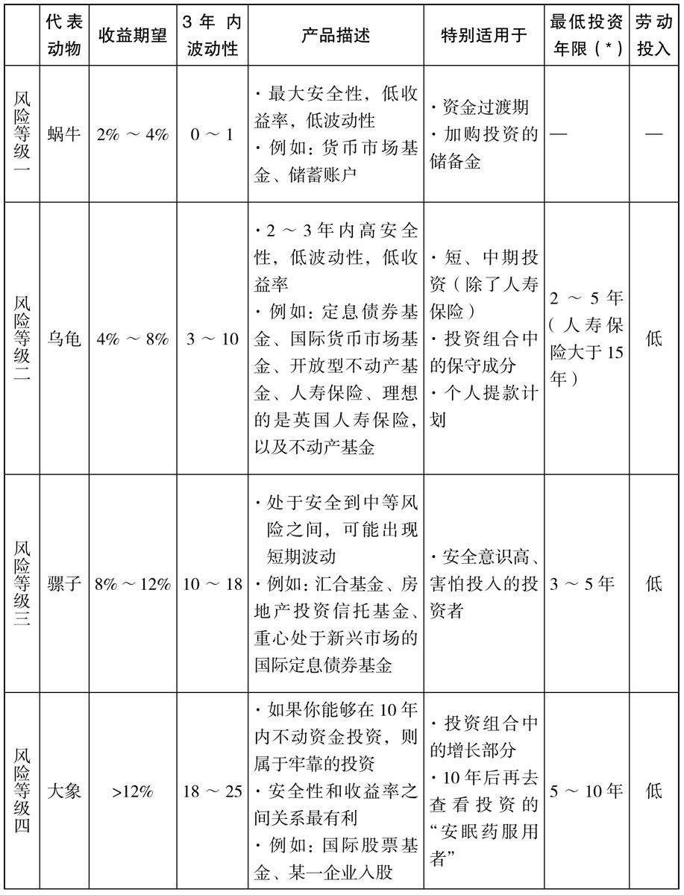
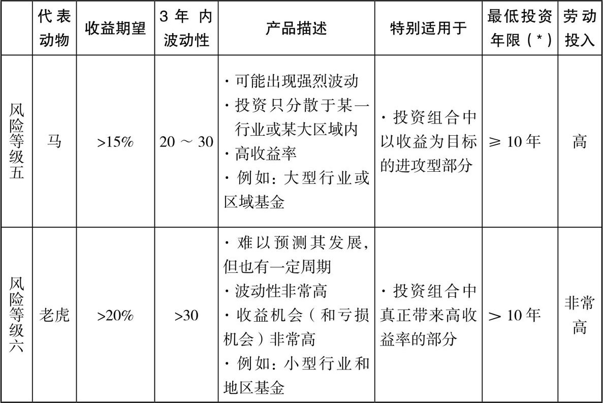
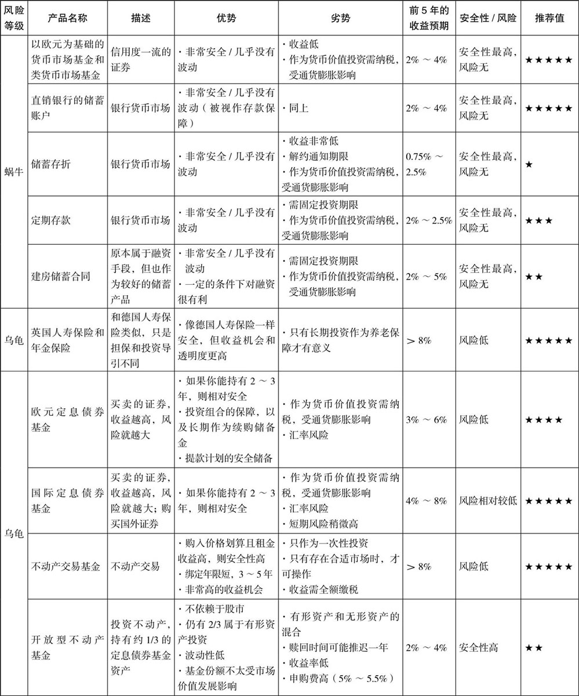
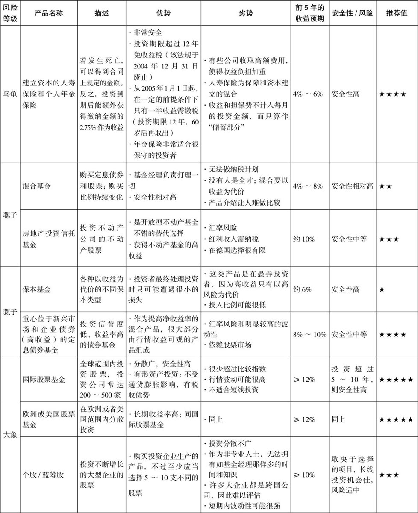
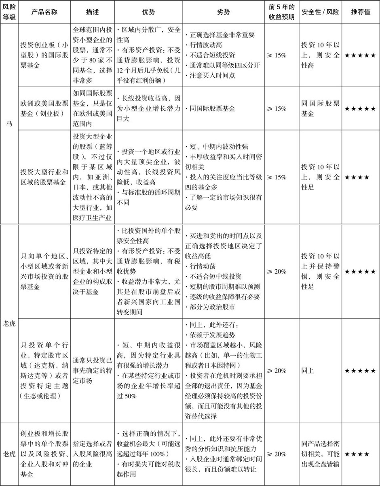
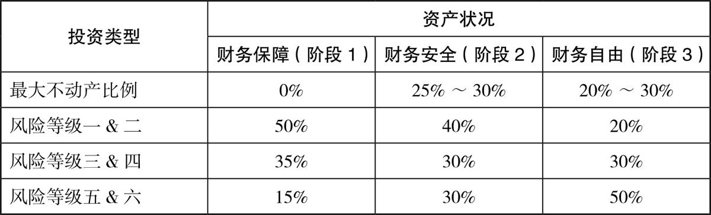

索引方式：微信读书（竖屏）

P6 前言：本书将教你，①让现有的资金增值、②没有压力地进行投资理财。

本书结构：前四章介绍金融投资的基础知识，第五章开始逐个讲解投资策略

PartⅠ 财务自由的前提条件

CH1 目标

P18 三点准则：

1.  有形资产才能让你富有
2.  识别出什么时候是投资，什么时候是投机
3.  区分负债与资产

P20 只有借助有形资产才能让你的资产在6\~9年内翻一番。

有形资产包括：①不动产、②企业股权、③股票、④股票型基金。

CH2 德国人的理财水平

P40 对钱的需要越紧迫，就应当投资更保险的项目。

P41 保持分散风险，可以避免满盘皆输、提高命中“大奖”的概率。

把**长期不用的钱**投资于固收类产品是不理智的，应该用于冒险（长线投资）

CH3 获利方

P48 \#\#\#金蛋与鹅\#\#\#、\#\#\#复利的奇迹\#\#\#

P52 \#\#\#低风险与高风险混合\#\#\#

P54 如果你还没有买任何基金和股票，并且对这些投资产品依旧有顾虑，那我建议你：至少尝试用小额资金去投资，亲身体验钱发生的变化。不要盲从股评家

CH4 灵活收益来源：股票、股票市场和投资基金

P59 股票价格总是受情绪因素影响，这可能引发短期内股价的大幅波动。因此，股票应被看作长期的价值投资。

你应该至少5年或者最好10年内，不要动这笔投资在股票中的钱。

P61 \#\#\#直接投资股票的5个前提条件\#\#\#如果不具备就只投资基金吧

P62 懂得打理好基金的人，不仅可以最大限度地规避风险，而且每个月只需花费2个小时，便可以取得显著的成绩。基金让小户投资者也能像大投资家一样理财

CH5 一览投资的丛林

P81 本章要解答的问题：如何将资金分配到每个风险等级中？第7章更深入探讨

（CF：P108）

CH6 各类投资形式的优缺点

PartⅡ 发展量身定制且收益可观的投资组合

CH7 你个人的投资组合和足球策略

P142 关键的问题在于：你应该怎样将资金分配到不同的产品上？

P143 四个关键问题

1.  你的目标有哪些？答：即使遇到金融危机重疾意外，也能确保财务自由
2.  你已有多少钱？答：家庭资产已达到。
3.  你属于哪一类投资个性？答：风险承受能力高。
4.  你今年多大？答：年轻。

P147 对我的家庭财务状况的分级：

1.  财务保障：自己债券+家人现金。
2.  财务安全：4000\*150=60万。
3.  财务自由：5000\*150=75万。

P150 风险测试：00034，44000，00200，00001，00000，00000，000331 = 25

投资个性D：最多只能把40%的资产用于高活跃度的投资。剩下的部分中，至少20%投资不动产，10%投资定息债券。切记不要借钱来扩张投资。

P188 德国人不动产的平均占比高达71%，太高了！

CH8 顾问

P194 并非真正的顾问：投资奸商、销售组织、固定聘用的顾问

CH9 投资基金等产品的11条准则

1.  发达国家大型指数通常每46个月平均增长102%，然后大约每12个月平均下跌26%。而新兴市场则是另一套循环法则：它们平均每36个月增长350%，接下来18个月会平均下跌50%。（博主注：企图在下跌前赎回基金是行不通的）
2.  至少要保持5年把钱放在股市不动，最好是10年。
3.  股市危机也有好的一面。它可以提供机会让你买到超低价的股票
4.  现金储备：保守的投资者应当至少把投资股票和股票基金的资本保留1/3。即使是最激进的投资者也应当至少保留25%的资金，作为手上的底牌。用于补仓
5.  买进和卖出都宜早不宜迟：大众几乎不可能做到在最低位买进，那在最低位之前买进更为理智。一旦股票达到设定的目标，就应当立刻抛售出去（基金除外）
6.  不要盲目从众，频繁转换：等到新闻都播出暴涨再买入已经太晚了，等到报纸都刊登暴跌再卖出同样太晚了。风险等级四的产品应该长期持有。
7.  永远不要直接投资你无法判断的市场，需要通过基金间接投资。
8.  为了分散风险，从风险等级四开始，你至少要选择3种不同的投资产品。
9.  未来的市场可以赚到巨大的收益（即适当投资于新兴市场等等）
10. 研究表明：投资组合中91.5%的收益率受到资产配置的影响，只有4.5%取决于产品的选择，1.7%取决于市场时机，另外2.2%取决于其他因素。
11. 当全世界股市都陷入大危机时，不动产和优质的未上市企业入股以及对冲基金产品都可以在一些时期内作为不错的稳定剂。入股+对冲基金不能超过1/3

CH10 怎样挖掘出最优投资项目

P218 \#\#\#在行业和区域内选择投资的7项原则\#\#\#有些不适合中国

P221 \#\#\#对技术标准和排序表进行评价的9项原则\#\#\#

CH11 \#\#\#注意基金管理费和隐含的费用\#\#\#

CH12 何时买进，何时卖出

P247 申购一项新投资的最佳时机：风险等级四越早买入越好；风险等级五和六适合在暴跌后买进，在行情下跌时加购。

P255 卖出时机：对于风险等级一、二、三的投资，期间几乎不必采取任何行动。同样，对于风险等级四的大象级投资也是如此；对于风险等级五或六，记录下你的收益目标，并且遵照本书中提出的基金投资建议（收益率在100%\~200%之间）。在达到目标后，至少要卖掉部分份额。

P259 在大型指数走势低迷时期，小公司却不断地急速发展。

CH13 如何管理投资

P267 退休时如果打算分批变现资产，最好优先选择涨幅较大的基金进行赎回。

\#\#\#剩余内容太复杂了\#\#\#
