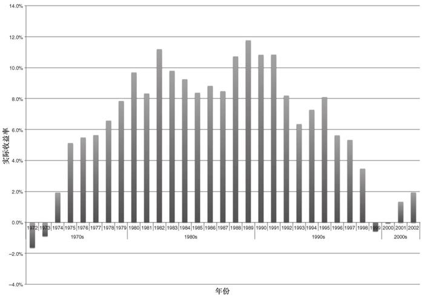
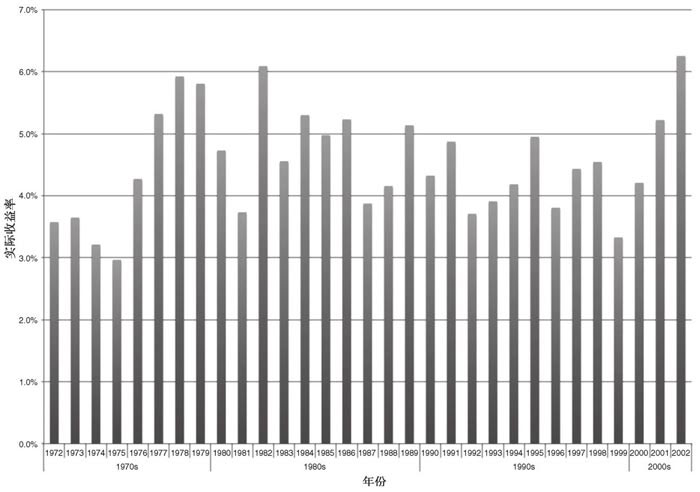
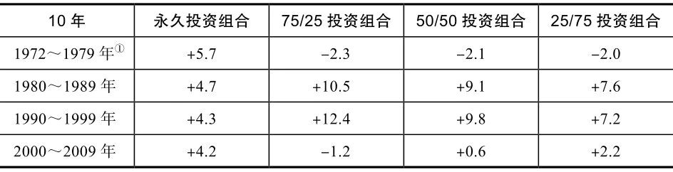
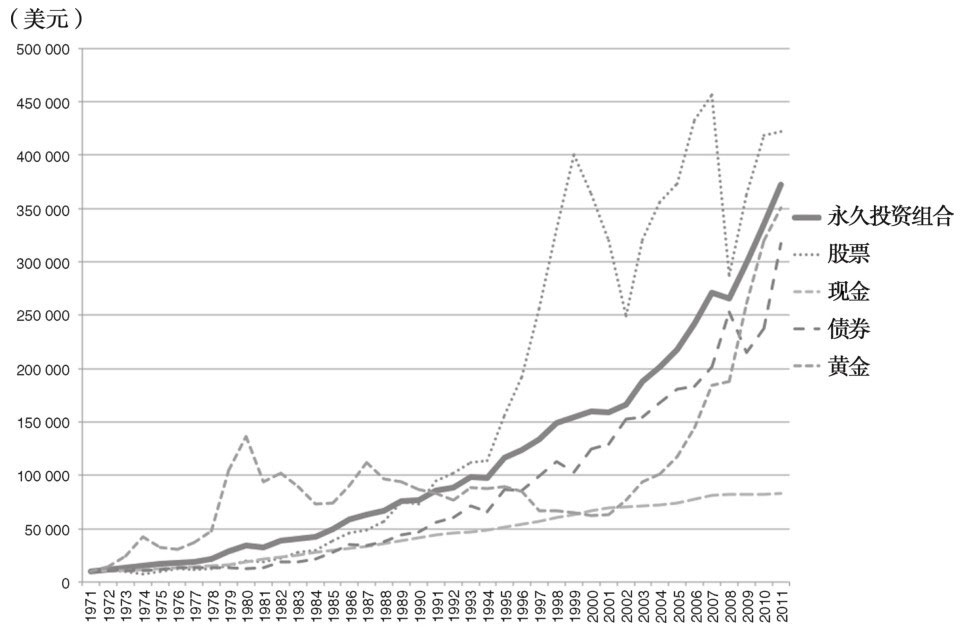

索引方式：微信读书（竖屏）

《哈利·布朗的永久投资组合》读书笔记

P3 推荐序：哈利·布朗的另一本书《万无一失的投资》理论太多实操太少，本书更实际。它介绍了永久投资组合，就是把资金分4份平分到股票、国债、现金、黄金，并每年做一次调平。

P6 前言：在过去的40年里，这种策略的年收益在9%\~10%。更引人注目的是它在一年中最大的亏损大概只有5%。

P13 哈利·布朗的第一本书《如何在即将来临的资产缩水中获利》预言了美国放弃金本位制的影响。

CH1 什么是永久投资组合

P19 把资金平分到股票、债券、现金、黄金中，看起来很简单，实际上这种配置反映了对经济和金融历史的深刻理解。

CH2 黄金法则之金融安全

1.  投资应该是从你的储备金里面拿出一部分资金，看着它们缓慢安全地增加，而不应该是拿辛苦赚到的钱通过风险较高的押注，容易亏损
2.  不要假定你可以回本
3.  投资者是有计划地进行投资，而投机者有的却只是希望（全靠运气）
4.  没有人可以预测未来
5.  没有人可以准确掌握市场时机
6.  没有哪个交易系统能持续战胜市场
7.  使用杠杆无异于借钱投资，不要用。除房贷外不要借任何有息贷款
8.  不要让他人帮你决策
9.  永远不要做任何你不理解的事情
10. 不要把你的安全托付给别人
11. 通过多元化来抵挡最广泛的风险
12. 仅把那些你可以承受亏损的资金用来投机
13. 确保部分资产在国外（陈浩注：在中国很难做到这一点）
14. 小心避税计划规则
15. 留一部分预算来享受生活
16. 当以怀疑一种做法时，安全第一

CH3 永久投资组合的业绩

P57 在1972\~2011年里，永久投资组合策略每年提供的投资收益在9%\~10%。最严重的损失只有-5%。

P64 如果一个美国人不拿自己的存款做任何投资，那么平均每年他的钱会自动失去4.4%的购买力。也就是说每过17年，你的现金就只能买到一半的生活用品。

P67 任选一年开始执行股票/债券=60/40组合投资并坚持10年，实际收益见上图

P68 任选一年开始执行本书的永久投资组合并坚持10年，实际收益见下图

P71 如下表，其他组合都有过亏损，永久投资组合只要坚持10年就无亏损记录

CH4 三要素：简单、安全与稳定

P75 简单的投资组合具有较低的隐性风险机会，具有较低的管理费用，更加节税，易于管理，收益可能超过复杂的投资组合。

P76 安全意味着投资中所承担的风险是可以计算出来的。

P77 稳定的投资组合允许投资者在市场处于震荡期时避免慌张。

P79 投资者可以通过下列方法来使投资组合变得简单、安全且稳定：

1.  只使用保守型投资；
2.  保持低成本；
3.  使用大幅波动的单个资产来降低投资组合整体的波动性；
4.  接受意料之外的事情，信奉“市场充满不确定性”的理念。

保守型投资是积极资产管理的反义词，它并不揣测进出市场的最佳时机、不频繁交易、不根据图表信息改变决策。（CF：CH2准则4）

P82 保守管理型基金管理费率更低，长期业绩将超过积极管理型基金

CH5 伪分散化

P89 \#\#\#分散化何时开始失效\#\#\# 强大分散化的意义就是当一组资产价值下跌，另一组资产价值就会上升。

P97 强大的分散化不是看历史数据，而是通过理解某类资产对于经济状况改变所做出的反应建立起来的。

P98 当所有纸上资产（货币、股票、债券）都运行不佳时，硬资产（黄金、房地产）是投资组合中唯一可以避免遭受损失的组件。

⭐P101 四种经济状况：

1.  繁荣：高生产力和收益、低失业率、稳定或者下跌的利率。人们对经济状况普遍持有乐观态度。例如美国1982\~2000。
2.  通货紧缩：信贷危机或者市场恐慌的经济冲击引发价格下降、利率下跌和货币价值上涨。此时贷款门槛变高，人们减少开支，价格下跌。企业被迫降低价格，赔钱清理库存，裁减员工。
3.  衰退：“衰退”一词在有些文章中是对除繁荣以外所有经济状况的整体描述，在本书中“衰退”特指“银根紧缩”衰退期。（CF：P197）这时央行提高利率，导致经济衰退。衰退只是**临时的，通常持续12\~24个月**。
4.  通货膨胀：货币过多、价格上涨、利率上涨

P104 可能同时出现多个经济状况。尽管经济状况之间经常会有过渡期，但总是他们其中一个统领全局。

通常来说，当经济状况看起来将永不发生变动时，它将发生巨变

P105 四种资产在4中经济状况的表现：

1.  繁荣：**股票↑**，**债券↑**，**黄金↓**，现金用于衡量前三者的价格。
2.  通货紧缩：**债券↑**，**现金↑**，**股票↓**，黄金**通常↓**但在**负实际利率时↑**（CF：P245）
3.  衰退：**现金↑**，**股票↓，债券↓，黄金↓**，现金充当缓冲器。
4.  通货膨胀：**黄金↑**，**债券↓**，**现金↓**，股票价格变动通常不大。

P108 永久投资组合不能预测哪组资产亏损，但盈利资产所获得的收益通常要远高于亏损资产所造成的损失。

P109 利用波动避免波动：单种资产的涨跌具有不确定性，但资产之间波动性往往会彼此抵消。如上图

CH6 股票类资产

P119 选取股票指数基金，要注意：

1.  整体股票市场指数或者标准普尔500指数
2.  一年的费用比率在0.5%以下
3.  是保守管理型，而不是积极管理型
4.  来自于有指数投资追踪记录的知名企业
5.  在任何时候都100%投资于股票

P129 当一只基金被迫经历牛市和熊市时，会考验基金经理处理基金税收效率的能力。指数基金的构建和运作方式本身就很有税收效率。

P130 晨星网站中最关键的信息不是星级，而是管理费和换手率

P137 一般而言，ETF基金的交易成本太高（博主注：在今天，对于构建永久投资组合而言，**ETF恰恰是成本最低、效率最高的工具之一**，因为它完美地解决了过去共同基金申购赎回效率低、费用高的问题，并享受着现代券商制度带来的零佣金红利）

P138 本书认为，小盘股跑赢大盘股可能需要坚持20年才能观察到。

P140 对于永久投资组合，国际股票投资显得没那么重要。（CF：P371） 想在永久投资组合里持有更多国际股票份额的投资者应该注意将其比例限制在整个投资组合的5%\~10%（比如15%\~20%本国股票与5%\~10%国际股票）。

⭐我的综合配置：

1.  国际 096001 占 ≤ 40%
2.  小盘 163110 占 ≤ 30%
3.  大盘 519671 占 ≥ 30%

P141 典型国际股票指数基金的费用比率大约是0.75%，越低越好

P145 持有大量雇主股票可能会导致你股票亏损的同时失去工作

P147 \#\#\#没有指数基金的权宜之计\#\#\#

CH7 债券安全性和收益

P149 理解起来，债券市场也许是投资领域中最复杂的部分之一，其主要问题时有很多种类型的债券。唯一适合永久投资组合的债券是25\~30年的长期国债。

P153 利率上升时，债券价格下降；利率下跌时，债券价格上升。

P161 长期国债适合永久投资组合的原因主要是：

1.  不存在违约风险
2.  较长的到期时间会提供最大的波动，以在通货紧缩时期获利
3.  它们是名义债券（固定利率），不随通货膨胀而调整利率
4.  避免了信用风险、政治风险和货币风险

P162 重要的是，投资者在投资组合中持有的债券的到期时间一般要超过20年。而且，到期时间少于20年的债券会被循环出投资组合，并被替换成一个具有更常到期时间的债券。

P164 \#\#\#购买债券的方法\#\#\#

P169 \#\#\#非政府债券的风险\#\#\#

P176 要避免的债券：通货膨胀保护债券（TIPS）、市政债券、抵押贷款债券、公司债券、垃圾债券、国际债券。

CH8 现金——货币类资产

P195 现金的作用：

1.  充当动荡市场中的稳定器
2.  存储利息、分红和基本收益
3.  在市场下跌时提供“干粉灭火器”以重新调整投资组合
4.  作为紧急备用金预防失业和健康事件

由于现金的安全性和稳定性非常重要，永久投资组合把现金投入最多12个月到期的非常安全的美国国债中去。

P197 银根紧缩衰退由央行在原本不景气的经济环境中上调利率引发

P219 通过货币市场基金（如余额宝）来持有现金类资产是有漏洞的

P229 美国的储蓄债券也可以被用作永久投资组合现金配置的一部分

CH9 黄金：永久投资组合的保险

P239 黄金可以在许多不同市场环境中为投资者提供保护，这其中包括高通货膨胀、政治动荡、货币危机和负的实际利率。

P242 黄金还可以在政治、金融和经济危机时为投资者提供保护，这很重要，因为这些事件可能会在很少或者没有什么征兆的情况下发生

P245 现在，中央银行愿意采取特别措施来防止通货紧缩的发生，主要是增加货币供应量和降低利率。如经济状况判断正确，这两项措施可以抑制通货紧缩，刺激通货膨胀。

⭐这种状况实际上是利好黄金的，因为投资者可能认为中央银行将采取必要措施来防止通货紧缩的真正发生（可能包括增加未来发生严重通货膨胀风险的政策）。

P247 在所有人想要买入黄金时卖出它，在所有人想要卖出股票和债券时买入它。

P249 通货膨胀通常是中央银行和政客们经过深思熟虑后的政策决定

P251 除了通货膨胀，黄金也可以对冲不确定性和极端事件的风险。

在高通货膨胀期政府极有可能不会向公众说出实情，政府在受到公众指责时的反应通常是实行工资和价格管制，甚至直接“打劫”公民的资产以试图控制通货膨胀。与股票和债券相比，黄金价值不容易受到这些事件的影响。

P255 中国人民银行多年以来都在大量买入黄金

P266 如果你难以持有实物黄金，推荐非美国投资者买入苏黎世州银行ETF基金

P273 避免存储任何种类的收藏型、稀有或者古董硬币。金饰的交易手续费太高

P274 白银更像是工业金属，而非货币金属。存储一些垃圾银币（junk silver coins）来应急也是不错的选择。然而白银不能取代黄金当作永久投资组合的首要硬资产。

P275 \#\#\#从信誉不佳的经销商买黄金要用一些仪器来辨别真假\#\#\#

P276 用通货膨胀保值债券（TIPS）取代黄金无异于从纵火犯那里买火灾保险。

P281 即使状况不理想，持有某些类型的纸上黄金也比什么都没有要好。不必太完美。

CH10 启动永久投资

P300 遵循基本策略比完美地执行更重要。每个投资者都有各自不同的限制因素，比如他的居住地、税务状况、投资组合规模等。实际上许多投资者基于最实用的方法来组织他们的永久投资组合。

P301 始终持有所有这4种资产类别而永不在市场时机出现时做出尝试，这是至关重要的。试图精确猜测出何时持有或卖出资产会是你的投资组合面临严重的风险，而且这些风险会没有任何预兆地突然出现

另外，遵循前几章所讲述的对每一资产类别的指导也很重要。偏离那些界限很容易导致投资者在毫无意识的情况下从投资转向投机。

P 在不需要付出额外保险费用的情况下，“直接持有黄金”好于“在分配账户中持有黄金”好于“黄金基金”

P 考虑使用不同的金融机构和不同的基金提供者

P 我适合用支付宝持有股票指数基金，用余额宝来配置现金，配置4/5的账户黄金，持有1/5的实物金条。

P319 只要对资产类别足够了解，越早入市越好。避免被媒体、朋友、专家影响

P324 自动红利再投资和自动股息再投资会增加交易费用，不适合永久投资组合

P329 永久投资组合不适合美元成本平均法

CH11 调整和维护

P354 当任一单个资产达到总量配置的35%或下降到总量配置的15%时，整个投资组合都应该调整。调整带历史上每隔几年才会被触发（在没有新资金加入时）

P356 退休会使投资者处于投资组合的价值下降的过程中，取款应出自现金部分

P357 即使你是在某一类资产暴涨或暴跌时启动建立永久投资组合，也不必提前调平（再平衡），正常调整就好。

P361 加入新资金的两种方式：

1.  直接加入现金部分，仅在现金高达35%的时候调平
2.  把新资金加入现金配置直到它达到25%，接下来把新资金加入其他3个资产中表现最差的资产，直到它也达到25%。（up注：根据《有效资产管理》对趋势效应的研究，月定投、周定投、日定投要谨慎频繁调平）

CH12 在国际上实施

P371 设计投资组合是为了在你自己的国家经济内部起作用。你要尽最大努力在自己国家并用本币持有这些资产。

P373 如果你买不到长期债券，就只能使用你可以用到的最长期限的国债，而且要持有较少的现金来尽力赶上。例如持有15%的现金和35%的债券。

P380 发展中国家的投资。不幸的是，世界上有些国家存在着腐败，而且这会影响到居住在这个国家的居民和他们的经济。现实是永久投资组合是设计用来在不腐败的经济体中发挥作用的。把钱保存在腐败的当地政府和震荡的经济之外，当你需要用它来支付生活费用时，把资金撤回来。

\#\#\#CH13 合法避税\#\#\#

CH14 机构多元化

P438 把你的钱分散在不同的基金公司、不同的银行、不同的经纪行中是安全的

CH15 地域多元化

P444 黄金在地域多元化方面的表现最好。

CH16 可变投资组合

P498 只有那些你不害怕损失的前才能用于可变投资组合

\#\#\#CH17 永久投资组合基金 不适合中国\#\#\#

CH18 总结
