《投资的常识：建立理性的投资观》读书笔记

布拉德福德·康奈尔 肖恩·康奈尔 安德鲁·康奈尔

出版年: 2019-5

◆ 前言

\>\> 资本资产定价模型需要很深的数理功底。晦涩的金融理论变得阳春白雪，使得非专业投资者对现代投资学的基础理论体系望而却步。

本书旨在填补这一鸿沟，尽可能用最少的技术细节来讲解现代投资理论的基础概念。对技术细节感兴趣的读者，可以自行查阅商学院课程中指定的教科书。

◆ 第一章 收益

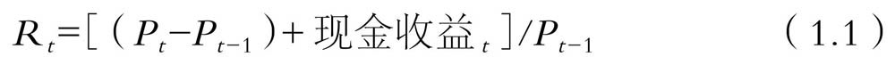

公式（1.1）适用于所有类型的证券投资。若为股票，现金收益就是股利，在除息日计算收益时需要考虑股利。

◆ 投资终值与美国常见指数

\>\> 投资业绩应以收益率与投资终值来衡量，而非以价格变动衡量。但大部分公开的财务业绩通常以价格为基础，个股与知名的指数中都存在这样的问题。例如，道琼斯指数和标准普尔500指数均未考虑股利。因此投资者在比较共同基金与标准普尔500指数投资业绩时会发现没有可比性。**标准普尔500指数和道琼斯指数的回报数据获取不易，在计算终值时会有一定的困难。**

\>\> 芝加哥大学证券价格研究中心（the Center for Reasearch in Securities Prices，以下简称为“CRSP”）几乎收集了所有美国上市公司自1926年以来的每日收益率数据。CRSP公布的收益率数据在除息日已经考虑了分红因素，并做了复权处理。此外，CRSP分别公布了包含股利和不包含股利两种全部上市股票价值加权指数的市场收益率数据。因此，CRSP指数比道琼斯指数，甚至比标普500指数更全面。直接提供月度收益率数据也是CRSP的优势之一。

\>\> 投资终值也可以用于比较不同的市场指数。在我们提到的三个市场指数中，道琼斯指数仅包含30只股票且不以市场价值计算，其描述市场的效果最差。标普500指数与CRSP市场指数均按照股票的市场价值进行加权计算，因此两者都是衡量市场收益时不错的选择。若投资者投资于这两种资产组合，则会获得与指数业绩吻合的收益率。 

◆ 平均收益率

\>\> 并非任何投资项目的市场价格信息都能获取。例如房地产类资产通常使用定期评估价格替代市场价格，但根据评估价格计算的收益率仅与评估结果一致。

◆ 第二章 金融市场的微观结构

\>\> 不存在一成不变的、能够战胜市场的永恒定律。倘若真的存在这样的定律，它也会因为知情者的过度使用而失去价值。我们将其称为投资的“第二十二条军规”：能够清晰阐明并快速应用的投资规律都是无效的。

\>\> 金融理论一般将“战胜市场”定义为在长时期内获得的经风险调整后的收益率大于市场投资组合的收益率。这条看似完整的定义，若没有详细说明如何对风险进行调整，就显得空洞无物。这个话题在金融领域经久不衰，在本书中也贯穿始终。我们暂且认为风险调整是可以实现的，“战胜市场”的定义是有实际意义的。

◆ 夏普法则

\>\> 威廉·夏普（William Sharpe）认为：**假设市场收益率为10%（也可以是其他值），持有市场组合的被动投资者能获得10%的收益率。所有主动投资者作为一个群体，其平均收益率也应该是10%。**此结论并没有充分的经济学依据，但基于股票被所有投资者所持有这一前提，可以推出该结论。

相较于被动投资者，主动投资者承担着额外成本：雇用专业人员进行经济和统计分析产生的人力成本，进行证券分析和估值产生的信息搜寻成本，频繁交易产生的佣金、税负等。通盘考虑各种费用后，主动投资者的业绩往往不如被动投资者，在上例中表现为主动投资者的净收益率低于10%。由此可以得出结论：无论市场状况如何，被动投资者的业绩总是优于主动投资者。该结论值得深思。

**夏普法则的普适性在于没有假设。没有假定金融市场是竞争性的——它们可能被少数几家大型机构控制；没有假定投资者是完全理性的——他们可能情绪激动、心血来潮；没有假定信息是广泛分布的——有可能存在猖獗的内幕交易。夏普法则不依赖任何有关证券收益规律的假设，只需要人们掌握相关指标的计算方法和所有证券都被投资者持有这一前提即可。**

\>\> 被动投资者不会被利用，因为他们不是知情交易者的交易对手方。

对主动投资者而言，挣脱夏普法则的唯一办法就是牺牲其他主动投资者的利益。若把主动投资者分为赢家和输家，那么输家最终不仅支付了主动投资者的所有成本，还承担了将财富转移给赢家的相关损失。精明的交易员战胜市场的唯一方法就是牺牲其他主动投资者的利益。

\>\> 从这个角度出发，夏普法则警告跃跃欲试的投资者，一旦脱离市场投资组合，他们就会转变为主动投资者，这意味着他们要面临成为大型投资机构的交易对手的风险。假设你认为通用电气公司在2017年股价超跌，价值被低估，那么你可能会在个人持仓中配置更多的通用电气公司，持仓比例高于其在CRSP指数中0.46%的权重。一旦持有权重超过0.46%，你就会成为一名主动投资者，此时，必定有其他主动投资者持有该股低于0.46%的权重。主动投资者要尽可能了解其交易对手方，以及超配某只股票的理由是否充分、经得起推敲。

夏普法则不仅适用于整个市场，还适用于所有细分行业，科技股也不例外。持有此类股票指数的被动投资者，其表现将优于交易这些股票的主动投资者。

总之，我们认为**怎么强调夏普分析的重要性都不过分。夏普法则的逻辑和结论对投资分析具有重要的影响，因此每个投资者都应该了解夏普法则，并将其作为每项投资分析的起点**。

◆ 有效市场假说

\>\> 夏普法则易与有效市场假说（EMH）混淆。

\>\> 根据广泛接受的定义，有效市场是指证券价格能够反映所有公开信息的市场。在橄榄球博彩市场的案例中，有效市场假说可以理解为：盘口反映了有关两支球队相对实力的所有公开信息。就股市而言，有效市场假说则指有关证券价值的所有公开信息均已体现在证券的市场价格中。

\>\> 市场的有效性并不意味着市场可以预知未来。有效市场假说认为，市场同专业投资者一样，处理所有公开可得的信息，但并不等于市场能够完美地处理信息，也不等于其能丝毫不差地预测未来。

高估值公司也有业绩惨淡、让人大跌眼镜之时。有效市场假说承认市场或者消息灵通的投资者皆有可能犯错，但平均而言，市场预测和估值的准确性不亚于专业投资者。

有效市场假说意味着如若投资者没有内幕信息，必然无法战胜市场。如果证券价格恰当地反映了所有公开信息，那么市场中就不存在定价过低或过高的证券。此时，所有的证券都是公平定价的，购买这些证券的投资者获得的是经风险调整后的公平的投资回报。

查理·芒格（Charlie Munger），这位知名的投资者，喜欢打趣有效市场假说和坚决拥护有效市场假说的学界人士。具有讽刺意味的是，自20世纪80年代初以来，陆续有学者宣称，完全有效的市场是天方夜谭，由于有暗箱操作等神秘力量的存在，市场不可能有效。当然，市场之所以变得有效，是因为众多投资者勤勉的工作。他们锱铢必较地核验财务报告，亲临公司业绩说明会，分析公司产品竞争力，不放过股票市场历史上的任一细节，等等。所有这些活动都需要付出成本。若市场是完全有效的，投资者就不能从花在投资研究上的时间和资金中获得公平回报，渐渐地，市场上就不会再有人专注于股票研究。但若投资者停止研究，价格就会偏离公允价值，其结果是，**即使在均衡状态下，市场也不够有效，精明的投资者能够从他们的研究投资中获得公平的回报率。因此，对当前学术观点的准确描述是，金融市场竞争激烈，但并非完全有效。**

◆ 信息效率与基本效率

\>\> 如果金融市场不完全有效，那么效率有多高呢？事实证明这是一个很难回答的问题。经过50年的研究，它仍未有明确的答案。但要注意区分所谓的信息效率（informational efficiency）和基本效率（fundamental efficiency）

1.  如果市场对重要的新信息反应迅速，那么它就是具有**信息效率**的市场。
2.  但是，对信息的快速反应并不等同于正确反应。一家公司的股价可能会随着盈利下滑而波动，但它的波动幅度是否合理呢？更为重要的是，股价波动前的初始价格是否反映了公司的基本价值？这些问题涉及**基本效率**的概念——**股票市场是否理性地反映了公司的基本价值？目前这个问题还没有明确的答案。**

\>\> 1986年，拉里·萨默斯（Larry Summers）对这个问题给出了如下解释：

现有证据不足以表明金融市场正确地反映了基本信息……迄今为止所使用的统计检验方法在分辨市场的非有效性方面能力不足，但这并不意味着市场就是有效的。即使掌握了精确的数据和最先进的统计方法，也不能充分证明市场价格没有背离合理价值。

萨默斯认为，即使股票市场价格不能正确地反映基本价值，也不影响其对信息的敏感度。

\>\> 布莱克与萨默斯的看法一致，他们在过去30年所做的研究也论证了其观点。**现在普遍认为，尽管价格可以迅速反映信息，但没有证据表明它合理地反映了基本价值。行为金融学的兴起进一步质疑了市场的有效性。时至今日，股市有效的程度仍是未解之谜。这为基于基本面估值的主动投资者打开了寻求高收益的大门。但事实上，即使这扇大门敞开，也不意味着所有投资者都可以登堂入室。**若市场价格偏离基本价值，那么基本价值与特定投资者估计的价值之间的差距可能会更大。要想战胜市场，不仅要等市场出现错误，自身还要尽可能少犯错。

上述观点似乎自相矛盾。若价格显著偏离基本价值，那么基于价值评估的投资者不应该获得更高的收益吗？但情况可能并非如此，原因如下：

第一，“基本价值”是无形的，是人们的一种评判。对价值的评判是因人而异的，比如我们对特斯拉公司价值的判断就与市场存在着巨大的差异，而人为判断又有可能是错误的。

第二，即使投资者准确地衡量出基本价值，也没有理由相信市场很快就会趋同。市场很有可能在连续数天出现同样的偏差。事实上，这一偏差甚至会随着时间的推移而增加，导致基本面投资者短期受损。

第三，股价的波动很剧烈。基本面分析的投资者为了获得更高的收益，必然增持低估的股票（相对于其在市场投资组合中的权重），减持（甚至卖空）高估的股票。正如我们将在第四章中讨论的“风险与收益”的关系，这种投资行为将承担额外的风险。

第四，市场尽管未达到完全有效的程度，但竞争十分激烈。若有方法能识别定价错误的股票，精明的投资者会竞相采用该方法，股价会迅速变动从而消除错误定价。因此，在竞争激烈的市场上，持续地错误定价要么不易发现，要么即使发现也很难利用。

这并不意味着基于基本估值的投资注定失败。例如，巴菲特是一个基本面投资者，显然他十分成功。但同时，这确实是一项充满风险的投资。我们将在第五章中进一步讨论该问题。

拉里·萨默斯还提出了一个与“番茄酱经济学”相关的深刻见解。

◆ 有效市场假说与夏普法则

\>\> 有效市场假说似乎是夏普法则的重述，但两者有着本质区别。夏普法则并没有提及证券定价或市场效率。市场效率可能极低，而且会受到投资者情绪波动的影响，这些因素会导致持续的定价错误，此时夏普法则的结论仍将站得住脚。作为一个整体，被动投资者的表现仍优于主动投资者。若主动投资者想利用错误定价的优势，就必须牺牲其他未意识到错误定价的主动投资者的利益。有效市场假说的观点为：在一个有效的市场中，没有基于公开信息的错误定价证券，因此没有主动投资者能够持续战胜市场。

\>\> 有效市场假说建议投资者被动投资。但正如我们上文所说的，市场在均衡状态下效率并不高，那这是否意味着投资者要主动投资呢？答案是否定的。**即使在低效率的市场，夏普法则也成立。事实上，在效率极低的市场中，个人投资者保持被动可能更为重要。因为主动投资会使他们成为那些富有经验的投资者的交易对手方，最终沦为“接盘侠”。**潜在定价错误越大，菜鸟投资者就越有可能迷失在这些错误中。

\>\> 个人投资者可以通过被动持有跟踪指数的市场组合来完全消除成为输家的风险，同时确保业绩优于主动投资者。这就体现了理解夏普法则和市场有效性对个人投资者的重要性。同时也带来一个问题：交易的对手方是谁？

◆ 你的交易对手是谁

\>\> 从\#\#\#表2-1\#\#\#中可以看出以下信息。

第一，家庭直接持股从1980年的47.9%下降到2007年的21.5%。此外，这些数字可能夸大了“个人投资者”的重要性。直接持股资产中有很大一部分属于巴菲特等非常富有的个人以及类似普利茨家族经营的家族企业。

第二，交易所交易基金（ETFs）和对冲基金应运而生。在1980年，它们没有持有任何股份。到2007年，它们持有的股份占总数的5%以上。2008年以来，它们的持股呈爆炸式增长，尤其是交易所交易基金。因此，表中数据明显低估了这些基金的当前持有量。交易所交易基金也是被动或准被动投资者的理想工具。

第三，外国投资者持有资产从1980年的7.6%增加到2007年的16.3%，翻了一番以上。这种增长在很大程度上归因于成熟的主权财富基金的兴起。

第四，共同基金持有量从1980年的5.1%大幅上升到2007年的33.5%。到2007年，共同基金已经取代直接持股者，成为美国股票的最大所有者。

第五，虽然养老金计划的持有量从1980年的24.8%下降到2007年的15.1%，但仍不可忽视。

第六，公共基金和非营利组织基本保持稳定，只占总数的12%左右。然而稳定的背后有一个重要信息，公共基金占比几乎翻了一番，而非营利组织却在下降

第七，银行及保险公司持有的股份大致维持在10%左右。

在弗伦奇教授演讲后的几年中，明显的变动是投资者从直接持有股票转向持有共同基金和交易所交易基金。尽管如此，市场还是存在老练的机构及投资者，甚至比2007年更多。

\#\#\#表2-1\#\#\#所示的机构均为最终资产持有者，但通常不是决策者

\>\> 每次交易时，\#\#\#表2-1\#\#\#中所示的机构或其聘用的专业投资经理都可能成为交易对手方。若你打算增持你认为股价被低估的股票，就要思考为什么卖方会减持。永远记住，一个主动投资者只有在另一个投资者亏损的前提下才能战胜市场。

### CF《赢得输家的游戏》译者后记BEGIN：

《赢得输家的游戏》深刻地论证了：在美国市场，个人投资者甚至机构投资者购买指数基金的合理性。因为在美国，投资已经变成了“输家的游戏”，即使专业投资者之间的竞争也非常激烈，也没有人能够长久地维持某种优势。要想在投资中获胜，只有减少自己的失误，而最好的方法就是购买市场，也就是指数化投资。

那么，指数化投资的方法是否也适用于中国的A股市场呢？如果想知道这一问题的答案，了解中美两国国情的差异就很有必要了。先看看美国的历史，20世纪60年代，当机构的交易量只占纽交所（NYSE）交易量的10%，而个人投资者占90%时，专家确实可以战胜市场，取得比指数更好的业绩。但50年来，共同基金、退休基金及对冲基金的巨大发展，使得投资机构的交易从只占公开交易总量的10%增加到压倒性的90%。所有的重大差异也就由此而来，赢家游戏转变成了输家游戏，专业投资者再也无法战胜市场，指数化投资的优势越来越明显。那么中国A股市场的情况又如何呢？

根据《上海证券交易所统计年鉴（2009卷）》和《上海证券交易所统计年鉴（2013卷）》的统计数据：

2008年和2013年度各类投资者交易占比情况

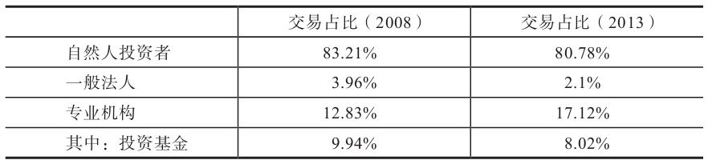

5年过去了，中国投资者结构的进化非常缓慢。中国上交所机构投资者与自然人投资者交易占比目前仍然是20%：80%。结合译者的实战经验，客观地说，中国A股目前仍处于赢家游戏阶段，有大量的散户可以“猎杀”，部分专业投资机构依然有机会战胜市场，取得比指数基金更好的成绩。

虽然中国A股处于赢家游戏阶段，但译者强烈反对个人投资者参与股票投资。正如埃利斯所说：“即使在20世纪60年代，投资机构只占10%，而个人投资者占到90%，仍有大量的个人投资者注定要输给专业机构。”根据译者的观察，中国的情况更是如此。大量的业余投资者，无论是精明的企业家、中科院的物理学博士，还是北大的教授，在股市里都一样输得一塌糊涂。对于个人投资者，尤其是抗风险能力较弱的投资者，我有两点建议：第一，珍惜血汗钱，远离股市；第二，5年以上不用的闲钱可以通过指数基金来投资股市，并且最好在大众恐慌、市场低迷时入市。

可能读者会问，既然目前是赢家游戏阶段，为什么不推荐大家买主动投资基金呢？因为挑选投资经理和挑选股票一样困难。资产管理公司的商业利益与客户利益冲突，投资经理的商业价值（做最有利于投资经理的事情）和职业价值（做最有利于客户的事情）冲突是一直存在的问题，其导致了客户资产的严重错配、利益受损。其中主要表现在以下方面：

（1）不当销售。在销售任务和压力的驱动下，很多基金产品被销售给不合适的投资者，销售机构甚至为了赚取申购赎回费，以各种理由诱导基民频繁更换基金。

（2）夸大宣传。销售机构夸大基金的预期收益率，不断推荐近期业绩记录突出的“热门”经理。

（3）人为造神。为了增加销售额，资产管理机构会通过众星捧月等各种方法人为制造业绩优秀的“神话基金”，而该基金却很少开放申购，卖的却是给客户“画饼”的基金（有些基金公司旗下有几十只不同的基金，所以总能找到部分记录在案的“赢家”）。

（4）过度交易。股票交易佣金是基金和券商的重要利润来源之一，因此机构通常利用客户资金进行频发交易、过度交易。

（5）管理落后。基金公司的管理者大部分是“空降兵”，尤其是监管机构、银行系统等出身的较多。管理者往往用政府机关或制造业等行业的思维进行管理，任人唯亲、激励不当等现象大量存在，导致人才流失严重。

（6）缺乏独立性。投资经理本质上是打工者，其投资决策的独立性常常受到干扰，轻则领导瞎指挥，重则进行利益输送，基金在股票高位接盘的现象并不鲜见。

**以上种种损害客户利益的现象并非都是违法违规行为，甚至大部分是难以界定的，大量且一直存在于资产管理行业中。**总的来说，基金公司的利润主要来源于管理费，在此激励制度下，规模重于业绩，很多基金公司选择了“营销为王”的商业模式，从而加重了资产管理机构商业利益与客户利益的冲突。大量客户的“短钱”（投资时间在1年内）被用来从事需要“长线”（投资时间在5年以上）的股票投资，大量从事短期投机的基金却被贴上“价值投资”的牌子，导致资产管理行业价值混乱、是非颠倒、资产错配、利益受损、诚信丧失、恶性循环。

对于以上问题，埃利斯的建议是重视投资咨询这一领域的建设。如果专业投资人士能够引导投资者选择适合其投资技能和经验、财务状况、投资时间及风险偏好的投资方案，大多数人会将其重点放在资产配置而非击败市场上，投资方案与自身技巧及资源相匹配，才能赢得赢家游戏，不输掉输家游戏。

### CF《赢得输家的游戏》译者后记END。

\>\> 对市场和个人非理性的影响因素是不同的。大多数对个体非理性的研究都是以大学生为样本，但弗伦奇教授认为，投资决策通常不是个人做出的，更别说是大学生了。相反，投资决策通常由雇用专业经理人的机构做出，因为他们受过专业培训，能够做出理性的投资决策。但他们尚且不能每次都成功，你有什么理由认为自己可以做得更好呢？

\>\> 正如我们将在第四章中讨论的那样，通过分散投资可以消除的风险不会得到风险补偿。因此，主动投资者最终承担了没有补偿的风险，若投资者能够合理把控投资的安全性，那么风险是可以接受的，但若不能成为赢家，投资者将承担更大的、没有回报的风险。

◆ 现实与理论一致吗

\>\> **你可能对诸多有关投资业绩的理论和实践研究持怀疑态度，但这并不影响对本书的阅读。本书仅介绍投资的基础概念，并不会对学术文献展开深入讨论。但有一个需要解决的问题是，站在有效市场假说和夏普法则的角度，专业投资者实际表现如何？**披露详细报告的共同基金能够很好地回答这个问题。

表2-2展示了在1年、3年、5年、10年和15年的期限内，主动管理基金的表现优于其被动标普基准的比例。

表2-2 积极管理共同基金相对于基准的业绩

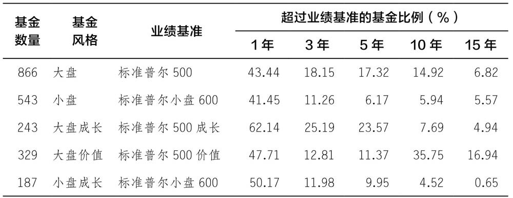

\>\> 最后，关于多样化投资，还有一个问题需要指出：人们认为股票都会跟着市场的方向变动，但事实并非如此，亨德里克·贝赛姆宾德（Hendrik Bessembinder）教授通过对1926—2016年CRSP数据库中所有股票的综合研究发现：

（1）只有42.6%的股票的长期收益率超过了在相同期限内持有一个月美国国债的收益率。（博主注：这42.6%的公司的市值所占比例远大于42.6%）

（2）在数据库中显示的25332家公司中，股市财富的增长完全由1092家（略高于4%）创造。

（3）这1092家公司中的90家公司（约占总数的0.36%）就带来了一半的增长。

贝赛姆宾德教授的研究表明，**如果广泛分散投资，那么投资者的收益将主要来源于持有权重较小的股票。但若主动投资者在投资时恰好避开了这些股票，那么其长期收益率可能低于短期国债的收益率。**分散持有证券的优势在于，若恰好投资了赢利的股票，则投资者表现优于市场表现，但这一优势也伴随着找不到赢利股票的风险。

投资的第二个常识是理解金融市场的微观结构。投资者熙熙攘攘，皆为利而来。夏普法则认为，如果投资者被动持有市场指数基金，那么其表现肯定优于一般投资者，甚至比绝大多数主动投资者表现更好。**若你立志成为主动投资者，应当铭记夏普法则的警示，你可以比被动投资者做得更好，但前提是有别的主动投资者做得更差，你们双方都得为主动投资付出代价。**悲催的是，你的交易对手很可能是一家人才济济的投资机构，而他们的观点恰恰与你相左。令主动投资者欣慰的是，有效市场假说认为，在竞争非常激烈的市场中，无论是绩优股还是绩差股均被公平定价，很难找到定价错误的证券。这也就意味着，主动投资者即便遇到更精明的交易对手，鹿死谁手还是个未知数。

◆ 第三章 债券和通货膨胀

\>\> 为了全面衡量价格的变化，美国劳工统计局构建了消费者价格指数（the CPI）。消费者价格指数衡量的是购买各种商品和服务的成本。该指数是根据人们消费的商品和服务的组成和质量的变化而调整的。通货膨胀率被定义为消费者价格指数变动的百分比。

\>\> 通货膨胀表示单位货币购买力的下降。尽管美国通货膨胀率在-10%～10%之间波动，但相较于国际历史标准还是很小。

\>\> 通货膨胀通过两种方式影响固定收益证券：

1.  固定收益证券预期持有期内的通货膨胀率 主导了 该证券支付利率。
2.  从证券中获得的美元的真正购买力取决于持有期内的通货膨胀率变化。

◆ 美国的短期国债和长期国债

\>\> 内部收益率（IRR） 是指投资获得的现金流现值等于购买价格时的折现率，可以通过Excel来快速地计算。例如，已知三年持有期内分别向投资者支付40美元、50美元、60美元，折现率为r，计算100美元投资的内部收益率，在Excel中使用函数IRR计算可得r=21.6%。

| 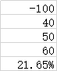-100 |
|-----------------------------------------------------|
| 40                                                  |
| 50                                                  |
| 60                                                  |
| =IRR(A1:A4)                                         |

◆ 利率与通货膨胀

\>\> 名义利率=（1+实际利率）×（1+预期通货膨胀率）-1

◆ 债券到期收益率和债券持有期收益率

\>\> 通过债券价格、票面利率计算的到期收益率见公式（3.7）：

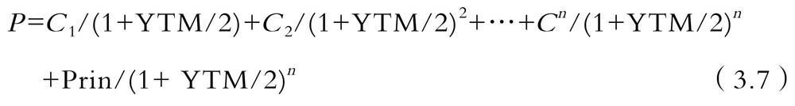

公式（3.7）中，P为债券价格，Cs是每半年支付的利息，Prin是到期日支付的本金，n为债券到期日（以半年为单位）, YTM是年到期收益率。利息和本金在债券发行时由债券合同确定，因此公式（3.7）中只有两个未知数：债券价格和到期收益率。这个公式看似复杂，使用Excel可以很快计算出结果。

◆ 通胀保值债券

\>\> 超低的实际收益率会产生两个需要注意的问题。

1.  它们让储蓄者的生活变得困难。例如，当固定收益证券的实际收益率为负时，靠退休储蓄生活的人，日子将变得更为困难。这导致许多储户通过购买风险较大的证券来“追求收益”。由于经济自危机结束以来一直保持稳定，因此这一现象并不严重，但若再爆发一次金融危机，对储蓄者来说将会是一场灾难。
2.  其次，低利率的最大受益者是世界上最大的债务方——美国政府。但也有潜在风险。如果利率进一步恢复到正常的水平，政府将更加难以支付其庞大且不断增长的债务利息。

◆ 承诺收益率与预期收益率

\>\> 按照惯例，评级为BBB（或Baa）及以上的债券被视为可投资级别。这个界限很重要，因为有相关规定要求一些机构债券持有人只能持有此评级以上的债券。由于存在重组风险，评级为BB或以下的债券通常被称为“垃圾债券”。

◆ 分散投资在债券投资中的作用

\>\> 如果投资者持有低评级债券的多元化投资组合，一些债券的不良业绩往往会被其他债券的良好业绩抵消。

◆ 低评级债券投资的高收益

\>\> 被称为“垃圾债券之王”的迈克尔·米尔肯（Michael Milken）曾这般阐释他投资低评级债券的理由：“假设你是一位专业的投资人，能够识别出定价过低的证券。当你持有一只可能被低估的股票，只有在市场认识到它的定价错误并纠正时，你才会获得巨大的收益。只要股价一直被低估，你就不会获得高回报。仅仅个人正确是不够的，市场必须意识到你是对的。然而，对于低评级债券的投资，情况却有不同。**定价过低意味着市场需要提供更高的承诺收益，市场高估了其破产的可能性。而在你看来，该公司不太可能发生破产重组，就购买了债券。若你是对的，公司没有破产，你得到了承诺的现金流，而不是较低的、市场预期的现金流。更重要的是，不管市场是否认同你，你都能得到更高的报酬。**”

投资常识3

投资的最终目的是为未来的消费提供资金。因此，投资业绩（收益）应以实际价值衡量，而不是名义价值。美元并不是一个很好的价值衡量标准，因为在美国历史的大部分时间里，它一直在贬值。

老练的投资者意识到美元正在缩水，所以证券定价是为了维持预期的实际回报水平。这一点在已预先确定承诺收益率的固定收益证券中体现得尤为明显。这些证券承诺收益率随预期通货膨胀的变动而上下波动，以保持预期实际收益率的相对稳定。固定收益证券的实际收益率取决于投资期间的通货膨胀率与投资初期的预期通货膨胀率之差。

◆ 第四章 风险与收益

\>\> 资产定价理论只有在涉及预期风险和预期收益时才有意义。但同时还存在另一个问题，是谁的预期风险和收益？

◆ **风险厌恶和风险溢价**

\>\> 财富边际效用递减原理的核心思想很简单：你拥有的财富越多，每增加1美元财富给你带来的幸福感越少。

\>\> 赌博是一种娱乐形式，人们愿意为娱乐付费，预期损失是娱乐成本。然而，人们愿意为娱乐所付的费用是有限的。经济学家认为，当涉及退休基金或为房屋投保等重大财务决策时，几乎所有投资者都是厌恶风险的。

但风险厌恶是否会影响金融市场？证券价格是否扣减了风险溢价？是否能更简单快速地验证假设——投资者只有在以高预期收益率的方式获得风险溢价时，才会购买风险资产？答案是肯定的，这一假设可以通过比较具有不同风险的不同资产类别的长期历史表现来检验。虽然我们还不知道如何衡量风险，但可以肯定，目前股市的风险高于长期国债，而长期国债的风险又高于短期国债。若市场中的投资者表现出厌恶风险，那么股票的预期收益应超过长期国债的预期收益，长期国债的预期收益应超过短期国债的预期收益。

不幸的是，正如上文指出的，无论是市场的预期收益还是个人的预期收益，都不能直接观测到。但是，如果股票的预期收益大于长短期国债的预期收益，那么从长期来看，股票的平均收益也大于长短期国债的平均收益。

\>\> 在过去的一个世纪里，投资股票获得的风险溢价远远大于短期国债，长期国债的风险溢价相对较小，但仍相当可观。除非投资者厌恶风险，否则这些溢价将不复存在，因为风险中立的投资者会持续购入股票，避开国债，直到三种投资的预期收益率相同。在20世纪，这种情况并没有发生过。

表4-1 1926—2017年的平均收益率和波动

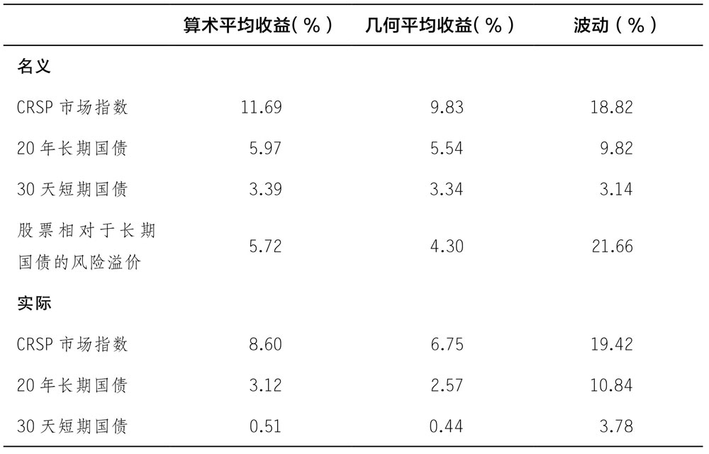

虽然上述结果令人印象深刻，但仍未回答这个问题：预期收益和预期风险是什么意思？

\>\> 预期收益是所有可能结果的概率加权平均值。

已知可能的结果和相应出现的概率，计算期望收益就很简单。不幸的是，现实中两者的信息我们都无法获取。更糟的是，不同投资者对可能出现的结果和概率的看法不同。最后，“市场”的预期收益是对所有投资者预期收益的加权平均数，每个投资者预期收益的所占权重是由其投资金额在市场中的权重决定的。后文中我们使用的“预期收益”均代表市场预期收益，这是金融领域的标准用法。

\>\> 那么它是如何实际应用的呢？苹果公司股票的市场预期收益有什么含义？其含义是：市场以某种方式考虑苹果公司未来可能的情况。例如，新款iPhone是否成功，苹果公司的服务是否会迅速增长，苹果公司是否会生产汽车，苹果公司是否会生产独立的娱乐产品。市场必须估算所有不定现金流，不仅局限于例子中的某个时间点，还要扩大到未来的每一年。

金融经济学家用来处理这种情况的概念框架被称为**“世界状态”。自然确定了世界的一种状态，进而产生了该状态下的所有偶然事件**。当然，有无数可能的状态存在。例如，考虑苹果公司的意外情况，就要包括所有公司可能存在的所有状况。但是如果可以描述所有的状态且为每个状态分配相应的概率，就可以直接计算预期收益。不幸的是，这只是一个假设。状态的数量庞大，且没有已知的方法来估计每种状态的概率，因此这个模型只是一个理想公式，不具有实际价值。

相反，实际解决方案是**假设市场以某种方式将所有状态的复杂性简化为一系列年度预期现金流**。

\>\> 尽管预期收益不可观测，但过去的收益可观测。如果我们能提出一种衡量风险的方法，那就有可能检验风险较高的证券在过去是否提供了更高的平均收益。这就是金融研究的路径。

“风险-收益权衡”这一说法似乎暗示投资者只要承担风险就能获得更高的预期收益，但事实并非如此。需要溢价的不是风险本身，而是无法通过分散投资来避免或消除的经济风险。

\>\> 在CAPM的背景下，不能通过分散投资消除的唯一风险是市场整体运行中的风险。因此，苹果公司的风险溢价与其Beta系数成比例是完全合理的，因为Beta系数衡量的是苹果公司的股价变动放大市场变动的程度，而市场是不可分散风险（通常称为“系统性”）的唯一来源。

自CAPM出现以来，已经进行了数百次测试，许多测试都发现它存在缺陷。这些测试指出的**主要缺陷是，市场是系统性风险的唯一来源。但只有系统性风险才会得到风险溢价的观点并未受到影响。**问题是：**除了市场投资组合的变动，系统风险的来源是什么？**

在一篇有影响力的论文中，尤金·法马（Eugene Fama）和肯尼恩·弗伦奇（Kenneth French）提出了证据，表明三因素模型比CAPM更准确地描述了股票的平均收益率。然而，与夏普教授不同的是，法马和弗伦奇的模型并非源自第一原则。他们还增加了**两个因素，一个是基于市值的，另一个是基于价值型股票相对成长型股票的表现**。

\>\> 因为这两个因素是有效的。这使得诸多研究人员认为，他们可能找到比法马-弗伦奇三因素更有效的其他因素，于是开始争相研究。在2016年发表的一篇论文中，哈维、刘（Liu）和朱（Zhu）调查了313篇针对寻找最佳风险因素的学术论文。作者报告称，到2016年，用于解释股票风险溢价（ERP）的因素总数已激增至316个。这些因素包括通货膨胀率、公司赢利能力、公司破产，以及与这些相关的其他所有因素。

◆ 股票市场的风险溢价

\>\> 回顾表4-1, CRSP指数收益率与国债收益率的算术平均差为5.72%，而几何平均差为4.3%。这意味着股票风险溢价应在5%左右，投资者才会对两者报以同样的投资态度。

**只有在不可观测的预期风险溢价保持不变的情况下，使用历史平均值来估计前瞻性的股票风险溢价才是有效的。但这种假设几乎肯定是错误的。股票风险溢价可能会随着时间推移而下降，原因有很多。**这些原因包括：

1．交易手段和记录存储技术的进步，增强了市场流动性。

2．证券交易委员会等机构的成立加强了资本市场监管以及对投资者的保护。

3．经济理论和政策的进步使经济更加稳定。

4．资产定价和投资组合理论的进步加强了风险度量和投资管理。

5．共同基金、交易所交易基金的发明和现代退休储蓄制度的建立，扩大了股票市场的参与。

6．投资者在收集和散布有关股票投资财务业绩的数据时，认识到股票并不是具有不可接受的风险水平的投资。

7．市场投资组合收益率波动性下降。

8．由于美国人口老龄化，他们可能会出售股票为退休提供资金，从而降低预期市场收益率。

考虑到预期风险溢价在过去90年中有所下降的情况，历史平均水平估计未来的风险溢价会上升。

由于意识到使用历史平均线（尤其是那些完全基于美国数据的平均线）存在固有的潜在偏差，学者和实践者转向估算股票风险溢价的其他方法。其中被广泛接受的是应用于整个市场的**现金流贴现（DCF）模型**。 给定当前市场的可观察价格指数（例如，标普500指数在我们写这篇文章时是2604），以及对指数中股票未来股息的预测，通过股息现值与指数相等可以计算出对应的贴现率。根据定义，该**贴现率是将 市场指数的预期收益率 减去 美国国债收益率 后得到的股票风险溢价的估计值**。

\>\> 阿斯瓦特·达莫达兰（Aswath Damodaran）教授在其网站上发布了每月一期的未来股票风险溢价。根据10年期政府债券收益率计算，他对2016年12月的最新估计约为5.7%。若他使用20年期债券，他的估计是5.5%。令人欣慰的是，这一估计值与基于历史数据的计算结果差异不大。

上述所有因素都适用于美国数据。分析人士通常使用美国的数据，因为它们是最完整、最准确的。但这本身就是个问题。美国的数据如此完整和清晰是因为20世纪的美国成为世界领先的经济体。在此期间，美国政治稳定，没有输掉一场战争，拥有增长最快的金融市场。这些原因导致美国的历史数据可能存在偏差。从1926年来看，投资者没有理由相信美国将在未来91年里受益。为了克服这种偏见，迪姆松（Dimson）、马什（Marsh）和斯汤顿（Staunton）（2002）着眼于整个20世纪的全球股市收益。 他们的结论是，**基于美国数据的历史平均水平可能高估了未来的股票风险溢价。他们认为4%左右的股票风险溢价更合适**。

◆ CAPM的应用

\>\> \#\#\#表4-2\#\#\#提供了在2017年11月28日使用CAPM计算的12家知名企业相关数据。

\>\> 处于表格底部的是那些业务对整体经济不确定性依赖较小的公司的Beta系数，比如埃克森（Exxon）美孚公司、宝洁（Procter and Gamble）公司，尤其是爱迪生国际（Edison International）公司，其Beta系数仅为0.2。事实证明，不论何时人们用电，价格在很大程度上是受管制的。在高端市场、科技公司，尤其是像Hubspot公司这样的小公司，Beta系数很高。但即便是苹果和亚马逊这样的大型科技公司，Beta系数也超过了1。通用汽车公司的Beta系数为1.56，高于亚马逊公司，这有点令人吃惊。这可能反映出购车对经济状况很敏感，也可能是测量误差的结果。最后，伯克希尔、通用电气等倾向于反映整体经济状况的大型多元化公司的Beta系数与预期相同，接近1。

\>\> 虽然债券的承诺收益率可以直接计算，但除了使用历史平均值，没有特定的程序来估计预期收益。CAPM解决了这个问题。

结果表明，低评级债券的Beta系数较高，约为0.5，使用来自2.58%的国债收益率和5%的股票风险溢价，Beta系数0.5对应于5.08%的预期收益率和2.5%的风险溢价。

◆ 股权现金流贴现率

\>\> 预期收益率也是计算股票现金流（如股息）现值的适当贴现率。贴现率是我们将在下一章详细讨论的问题。就股票而言，预期收益率是合适的贴现率，因为市场认为这是公平的经风险调整的收益率。

◆ 流动性与预期收益

\>\> 尽管风险是预期收益的主要决定因素，但不是唯一的决定因素。在其他所有因素中，流动性是最关键的。定义流动性并非易事，我们将在第九章中深入地讨论这一问题。先暂且这样定义：**金融资产流动性可以用无须大幅降低价格即可出售证券的数量来衡量**。

显然，流动性对投资者来说很重要，能够以当前市场价格立即将金融资产转换为现金，为投资者提供了一种保障。在突发事件中，高流动性的金融资产可以以当前价格出售，以应对健康危机等突发事件。研究发现，流动性可以带来价值，投资者愿意接受预期收益率低但流动性强的资产。通过美国国债可以更好地体会流动性的好处。美国国债支付固定的利息，且没有违约风险，因此可以精确计算其未来收益。**事实证明，即使在所有证券流动性都很高的美国国债市场，流动性最强的证券（也就是最近发行的证券）的交易价格也略低一些。**

流动性对普通股的影响更加复杂。与美国国债不同，股价存在波动性，因此无法精确衡量其预期收益率。所以很难说一只股票的预期收益率高于另一只。令问题进一步复杂化的是，与风险不同，现代交易技术的发展使得由流动性造成的误差很小。这意味着，要确定一只股票的预期收益率是否因流动性而高于另一只，需要很长的样本期。但随着时间的推移，股票的风险和流动性可能会发生变化，从而使研究结果变得毫无意义。

实际上，从大多数投资者的角度来看，活跃交易的股票都是完全流动的。个人投资者只要按下按钮，就可以在接近市场价格的范围内进行交易。**在公开交易的普通股中，流动性是一个可以完全忽略的问题。**

**考虑到房地产和私人公司股权等另类资产时，流动性变得重要起来。人们期望从这些资产中获得更高的预期收益，以弥补流动性的不足，但这很难量化。**例如，关于私人公司股票交易的历史数据既少又零散，不存在类似于公开交易股票收盘价的数据。因此，尽管人们普遍认为另类资产会提供弥补流动性不足的溢价，但其规模仍是一个处于研究中和备受争议的热门话题。

投资常识4

风险-收益权衡是金融和投资的关键基础概念之一，但它并非乍看上去的那样，承担更多的风险并不意味着获得更高的收益，甚至不意味着投资者可以期待更高的收益。有些风险根本得不到补偿。实际的权衡是预期收益和预期系统风险之间的权衡。系统性风险是指不能通过分散投资来规避或消除的风险。虽然关于衡量系统风险的精确方法仍有许多争论，但人们一致认为，系统风险指股票的收益对市场投资组合收益变化的敏感性，通过Beta值来衡量。目前正在进行的研究主要是寻找产生影响的系统性风险。

◆ 第五章 基本面分析与估值

\>\> 主动投资有两种不同的方式：

1.  购买相对于投资者期望的未来现金流来说定价合理的证券。若投资者的观点正确，购买并在长期内持有证券，则其收到的现金流可以证明投资决策是合理的，且最终市场将会发现证券价值，投资者可以以更高的价格出售该证券。
2.  购买证券，目的是在相对较近的未来以较高的价格转售。许多技术分析是以第二种方法为基础的，投资分析的目的是确定价格何时上涨或下跌，从而从价格变动中获利。

从投资的角度看，证券现金流在很大程度上是无关紧要的，投资目标是今日买入未来更值钱的东西。

购买你认为未来会有人以更高价格买入的东西而付出的努力不是本书讨论的问题。它应该属于心理学领域，而不是金融领域的问题。因此，我们认为这不是投资的基本概念。然而，在我们结束这个话题之前，有一个低买高卖的方法需要深入探讨，那就是股市存在泡沫的可能性。

◆ 泡沫

\>\> 投资股票的人在当前和未来拥有享受分红的权力，因此股票投资具有一定的基本价值。股市繁荣时，投资者经常会提出的问题是，股价上涨多大程度上合理反映了基本价值的上涨，而不是由于泡沫的影响？很难区分泡沫现象与对未来革命性商业创新的理性信念。不存在通用的方法来确定股票价格是否产生了泡沫。这取决于每个事件的特定情境。我们建议投资者只购买基于基本面分析估值合理的证券，具体分析方法将在下一节中进行讲解。禁受不住诱惑，**试图根据过去的股价波动来猜测未来股价走势的行为是一场博傻游戏**。

◆ 估值基础

\>\> 一股股票的价值最终必须由其按比例收到的款项决定。这是估值和基本证券分析的基础概念。

◆ 自由或“可派息”现金流

\>\> 估值应基于“可派息”或自由现金流，即公司在满足运营和新投资所需的现金需求后，在某一年所剩的现金量。

\>\> 使用可派息自由现金流对公司股票进行定价的经典方法是在整个公司范围内进行定价，因为财务报表是以这种形式报告的。然后，每股股票的价格可以用市值除以已发行股票的数量来计算。虽然我们未显示详细数学模型（有关定价的书中会介绍），但有一个简单的模型很重要，不能忽视，因为它阐明了几个基本概念——固定增长模型。

◆ 固定增长模型

\>\> 回顾第一章中所介绍的收益，债券价值等于利息和本金按市场利率折现后的现值。股票估值也是如此，但有几个问题：

1.  没有固定期限。派息现金流一直持续到不确定的未来；
2.  派息现金流是不固定的，甚至不能预先知道，因此，贴现的应是预测的未来现金流；
3.  贴现率更为复杂，因为它必须反映自由现金流的风险；
4.  我们假设期望自由现金流（FCF）以恒定的速度增长，得到的方程为：

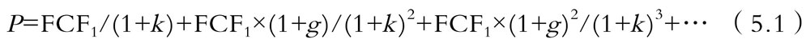

公式（5.1）中，P为股票价值，FCF1为第二年现金流，g为现金流增长率，k为适当的风险调整贴现率，最后一项后面的省略号表示这个方程是无限的。尽管这个方程有无穷多的项，它仍然可以被化简。

\>\> 估值比率是价格除以现金流量，在本例中是自由现金流（FCF）。两边同时除以FCF1：

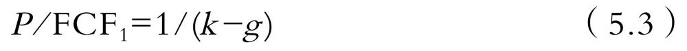

实际上，固定增长模型是一个特例，因为大多数企业，尤其是年轻企业，还没有实现稳定增长。尽管如此，固定增长模型仍然对关于决定价值和估值比率的基本因素有参考意义。

\>\> 显然存在两个关键因素：未来预期现金流FCF1及其增长率g。未来预期现金流越大，增长率越大，价格越高，估值比率越大。

**在进行跨公司比较时，估值比率比价格更有意义，因为它们会根据公司的规模进行调整。显然，大公司的价值往往高于小公司，但没有理由认为，大公司的每1美元现金流价值更高。**虽然公式（5.3）是用自由现金流表示的，但通常都用盈余来代替。从专业角度来看，这是错误的，但实际上大多数情况下两者区别不大。**无论哪种情况，预期增长率都是估值比率的主要决定因素。**

\>\> 影响估值比率的第二个因素是隐含在贴现率k中的风险。我们从关于风险和收益的章节中可知，预期收益率也就是投资者需要的贴现率，可以用20年期美国国债收益率加上公司Beta系数与股票风险溢价的乘积来近似表示。在这三个因素中，不同公司之间的唯一差异是Beta系数，Beta系数越高，公司风险溢价越大，折现率越大。更高的贴现率反过来会导致更低的价格和估值比率。

虽然我们通过固定增长模型得到了这些结果，但这些结果的应用比固定增长模型的应用更普遍。估值比率的两个关键决定因素是增长率和风险。为了比较这两个因素的相对重要性，必须放弃固定增长的假设。

◆ 更现实的模型

\>\> 尽管固定增长模型能够说明估值概念，但它并不现实，至少对大多数公司来说是这样。特别是在企业的早期，不能期望它们以恒定的速度增长。对于如何建立更切合实际的现金流贴现（以下通称“DCF”）模型的细节，许多优秀书籍中都有介绍，我们在这里不做讨论。 然而，要理解这些模型是如何使用的，必须理解几个基本原则：

第一，DCF的估值分为两个阶段。在第一个阶段，通常是5～10年，构建一个详细的财务模型。该模型基于对所有必要财务指标（如收入、成本、资本支出和折旧）的预测。财务分析的最终目标是预测确切的期间内每年的自由现金流。

第二，经过详细的预测阶段后，假设公司达到稳定的增长状态。这种稳定状态从预测期结束一直持续到不确定的未来。公司在稳定状态下的价值，通常被称为“最终价值”或“持续价值”，是使用固定增长模型计算的。

第三，估计适当的风险调整贴现率。如前一章所述，在本书中通常使用CAPM

最后，利用公式（5.4）计算年现金流折现值和稳定值。在公式（5.4）中，为了控制方程中项的数量，我们假设初始预测期为5年。这就是公式中包含5个明确的预测现金流——FCF1到FCF5的原因。在实际操作中，预测期应该延长，直到能够合理假设企业达到稳定状态。对一些公司来说可能需要10年甚至更长的时间。公式中除了明确的预测现金流，还有最终价值TV5。预测期结束后，使用固定增长模型计算最终值。明确的预测现金流对最终价值有很大的影响，因为它们决定了FCF5, FCF5是固定增长的初始值。

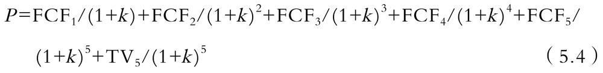

虽然公式（5.4）看起来很复杂，但若公式中的每一项都可以估计，最终计算可以通过电子表格来完成。

估值的关键在于如何在第一阶段估计年度现金流，这也是优秀投资者与一般投资者的差别所在。**贴现率和稳定状态值的估计都可以找到相应的操作指南，许多教科书中都有详细讲述。然而，估计年度现金流是一项艰苦的、以事实为基础的工作，需要详细了解业务。**了解一个企业没有捷径可走。此外，理解一种类型的业务（例如铁路）所需的技能可能不适用于其他类型业务（例如生物技术公司或社交媒体公司）。

为了帮助投资者进行基本面分析，许多网站都提供了DCF模型，读者访问网站，点击一个公司，软件就会建立一个DCF模型。该方法的问题是所有的复杂工作都是隐藏的。

◆ 具体的例子：特斯拉公司

\>\> 市场价格代表所有愿意买卖股票人的加权平均观点：是什么令你认为你的观点更准确？任何认为市场对证券定价错误的投资者，都存在这个问题。

就特斯拉公司而言，我们认为这是一家汽车公司。我们建立了详细的财务模型，假定特斯拉公司能够实现非常快速的增长，并保持与保时捷一样的利润率。但是尽管做了这些工作，根据DCF模型，我们从来没有得出超过200美元的价值。我们的结论是，市场显然不相信特斯拉公司仅仅是一家汽车公司，市场认为它是一家将改变世界的“技术能源公司”，电动汽车只是一个开端。虽然我们知道特斯拉公司拥有太阳城，但它的业务利润率甚至低于汽车，而且竞争十分激烈。我们的初步结论是：市场对特斯拉的估值完全错了。

上述问题还说明了DCF模型的另一个重要属性：它们允许投资者以逆向思维思考市场结论。以亚马逊公司为例，在讨论固定增长模型时，我们注意到亚马逊公司的市盈率接近300，并在此基础上得出结论：市场预期亚马逊公司的收益将快速增长。这一结论本身是正确的，但并不具体。更完善的方法是为亚马逊公司构建一个DCF模型，然后计算出使模型价格等于市场价格时所需要的预期现金流水平。这就是我们在特斯拉公司案例中所做的，我们的结论是：市场对特斯拉公司的估值远超过了对一个汽车公司的估值。

根据DCF模型分析，我们决定在特斯拉公司的股票上寻求投资机会，但价格太高而非太低。此时应该采取什么行动呢？利用定价过高的优势有两种基本方法：一种是卖空股票，另一种是交易衍生品。基本面分析既可以发现被低估的股票，也可以发现被高估的股票，上述两种方式可以帮助投资者从被高估的股票中获利。卖空并不适合胆小的投资者，而适合那些认为股价过高的投资者，对他们来说，卖空可能具有吸引力。

\>\> 基本估值与CAPM等资产定价模型相结合，构成了现代股市定价的基础。首先，运用资产定价模型对风险调整后的收益进行估计。风险调整后的收益率决定了贴现率。接下来，根据公式（5.4），预测公司的自由现金流并折现，以估计其基本价值。若市场价格低于基本价值，该理论预测投资者将购买股票。当他们购买股票时，价格会上涨，直到达到基本价值。如果股价过高，投资者就会避开或做空，直到股价跌至其基本价值。

虽然该机制在理论上是完全合理的，但在实际操作中还存在许多不足之处。例如，我们提到过，金融学者经过50多年的研究，仍在资产定价模型的合理性上存在认知分歧。此外，一旦选择了资产定价模型（例如CAPM）, Beta系数也会带来很多误差。这就意味着折现率的估计有很大的不确定性。对未来自由现金流的估计可能更加不精确。上文强调过，要充分了解一家企业，合理准确地预测其未来业绩是很困难的。结果表明，这种机制很难实际应用。正是出于这个原因，劳伦斯·萨默斯（Lawrence Summers）一直声称，股价在很长一段时间内可能与基本价值脱节。当然，正是这种可能性为巴菲特等成熟的基本面投资者提供了获得更高风险调整收益率的机会。

\>\> 人们很容易被这些公司将要做的事情的炒作吸引，而忽略了事实：这些公司的前景并没有在市场上消失。投资决策的关键不在于公司的未来是否光明，而在于投资者眼中的公司是否比市场眼中的公司有更好的未来。回答这个问题的唯一客观方法是建立一个估值模型，看看需要什么样的预期现金流才能产生当前的市场价格。

◆ 基本投资及多元化

\>\> 几乎所有的股市价值都是由4%的上市股票创造的。相对于持有市场投资组合的被动投资者，持有有限数量股票、碰巧错过了这4%的机会的投资者，其投资业绩较差。

◆ 发现定价错误的股票

\>\> 试图使用基本分析来追求主动投资时，还会出现另一个问题。

在竞争激烈的股市中，多数股票是公平定价的。

投资者可能不得不分析几十只股票，才能发现其中的一只可能定价有误。但这种分析既费时又费钱，相对于被动投资，这是主动投资的另一成本。

若错误定价变得“更糟”该怎么办？假设你已经做了基本分析，发现一只你认为被低估的股票，你买入该股票，且该股票不论是绝对价格还是相对市场的价格都下跌了，而你的估值模型不变，你会怎么做？有两种相反的选择，它们取决于你对估值模型的信心：

1.  如果你像巴菲特一样对自己的模型有足够的信心及耐心，那么就要增加你的持股；
2.  另外，价格的下跌表明你与市场的意见不一致。这可能需要重新考虑之前的分析，并重视出错的可能性。

根据一句古老的格言，如果你真的相信自己的头寸，那么“市场非理性的持续时间可能比你偿付能力持续的时间更长”，市场规模不会大到你可以被迫提前平仓。以上这些都是主动投资者面临的棘手问题。

◆ 如何应对市场定价“过高”

\>\> 图5-4显示了1926—2017年标准普尔500指数的两个市盈率指标。第一个是基于过去1年利润计算的标准市盈率，第二个是诺贝尔经济学奖得主罗伯特·席勒（Robert Shiller）提出的周期调整市盈率（CAPE，又称“席勒市盈率”），该指标使用过去10年的平均利润，而不是最近1年的利润。通过观察图5-4，就会明白席勒为何更青睐周期调整市盈率。如果短期收益下降，但预期会回升，标准市盈率将会飙升。该现象发生在金融危机期间，股价下跌，收益暴跌至接近零的水平。由于分母趋于零，标普500指数的市盈率在2009年跃升至100多倍，远远超出了正常范围。而周期调整市盈率通过对过去10年的收益进行平均，消除了这些异常现象的影响，更准确地描述了价格与收益之间的关系。

从图5-4可以看出，周期调整市盈率的变动没有规律，但不是恒定不变的。它的范围从20世纪80年代初的10以下，到90年代末互联网繁荣时期的40以上。值得注意的是，该指数曾经三次超过30，分别是1929年、互联网繁荣时期和目前（2017年11月）。在前两个时期，股价随着周期调整市盈率达到峰值而大幅下跌。这是否意味着现在的市场定价过高？这取决于周期调整市盈率是保持不变，还是可以改变。此时应使用DCF分析。

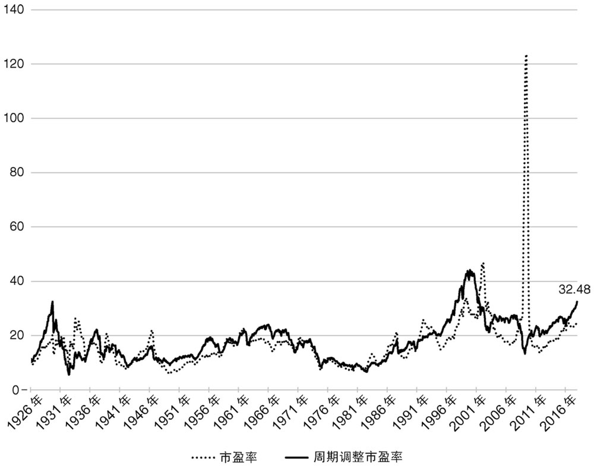

图5-4 过去1年的市盈率和周期调整市盈率（1926—2017年）

虽然固定增长模型可能不适用于个股，但它适用于整个市场。从长远来看，股票的总价值和总收益必须与国民经济的增长率挂钩。若股票价格和收益的增长速度快于整体经济增长的速度，其最终收益将超过整个国内生产总值（GDP，以下通称“GDP”），但这是不可能的。在出现这种状况前，经济和政治力量就会限制收入相对于工资等GDP其他组成部分的增长。历史数据很好地反映了这个现象，图5-5绘制了企业利润在GDP中所占的百分比，经济繁荣时该线上升，衰退时下降，且没有尽头。因此，从长远来看，企业利润和GDP必须以同样的平均速度增长。

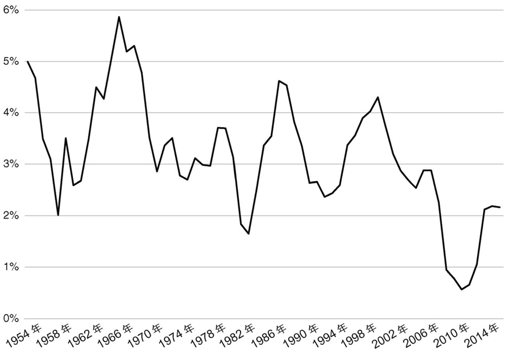

图5-6 每5年平均实际GDP增长率（1954—2016年）

\>\> 鉴于上述情况，若目前经济增长快于过去，就有可能解释目前周期调整市盈率升高的现象。不幸的是，情况恰恰相反。

图5-6为第二次世界大战至今每5年GDP的平均增长率。数据在经过5年的平均处理后更加平滑，也更容易发现趋势。很明显，增长率在过去20年中有所下降。此时，目前的周期调整市盈率应该比过去低，而不是比过去高。

\>\> 风险是一种更有希望的可能性。在风险和收益的章节中，我们认为有证据表明股票风险溢价在下降。这就表示公式（5.3）中的k值将下降，估值比率将上升。

综合考虑增长率和风险，可以得出合理的结论：周期调整市盈率的变化应该很小。但**若周期调整市盈率有一种趋势，趋于回归均值，这难道不能作为一种策略，在周期调整市盈率较低时买进，在其较高时卖出，从而战胜市场吗？**简而言之，事实并非如此。若该策略真的能使投资者获得更高的风险调整后的收益率，它早已被广泛采用。席勒教授几十年前就开始公开这一比率，所以这不是什么秘密。但直接说“不”有点太过绝对。有证据表明，从平均水平和长期角度来看，周期调整市盈率具有预测能力。**大量的学术和实践研究表明，在周期调整市盈率较高时买入市场指数的投资者，其未来10年的收益率往往低于在周期调整市盈率较低时买入的投资者。然而，考虑到股票收益率的波动性，这一结论的可靠性很低。这种关系只是一种趋势，并不是绝对的。**

\>\> 最后，周期调整市盈率比率的一部分可预测性可能与风险溢价的变化有关。在经济不景气的时候，比如在金融危机时，人们会感到害怕，需要很高的风险溢价。因此，股票价格下跌，周期调整市盈率比率将比较低，而预期的未来收益率将比较高，以补偿人们承受的风险。反之，在恐慌消退的繁荣时期，周期调整市盈率比率将比较高，而预期收益率将比较低。

尽管存在上述问题，周期调整市盈率还是具有参考价值的。当该指数远高于历史平均水平时，投资者应更加谨慎。

◆ 基础投资分析的社会贡献

\>\> 即使是最自私、最以利润为导向的投资者，也在履行一项关键的社会职能——决定如何分配稀缺资源。

\>\> 主动基本面投资者提供的社会效益可能比他们获得的私人效益大得多。夏普法则表示，只有在其他主动投资者表现较差的情况下，主动基本面投资者才能比被动投资者做得更好。若市场竞争非常激烈，且定价错误十分罕见，那么主动基本面投资者将很难获得高收益。此时，社会最终将成为他们试图战胜市场的主要受益方。

投资常识5

证券的价值，包括普通股，来自于证券产生的未来现金流。认识到这一事实后，基本面分析基于对未来现金流的预测来评估证券价值。然后，可以通过比较证券的基本价值的估值和市场价格来做出投资决策。虽然价格在短期内可能偏离基本价值，但理论上认为，从长期来看，它们将趋于一致。即使它们不一致，基本面投资者仍然受到保护，因为他们可以收到证券产生的现金流。

也可以通过预测价格何时上涨而不考虑基本面因素来做出投资决策。但在我们看来，这更多的是投机而不是投资。这是投资者在努力判断是否有人会在明天付出比今天更多的代价。这种判断更多的是出于心理学领域，而不是金融领域。此外，预测别人明天将支付多大的代价，可能会产生自我强化的泡沫，导致价格大幅度的上涨，甚至更大幅度的下跌。

◆ 第六章 交易成本、费用和税金

\>\> 投资的最终价值由它对你的可消费财富的贡献决定。这不仅要看证券或投资组合的最终价值增加了多少，还取决于投资者能保留多少增值。交易成本、费用和税收的存在导致投资者不能获得100%的增值。我们将依次分析每一个因素，在此之前，有必要了解一下这些因素的重要性。

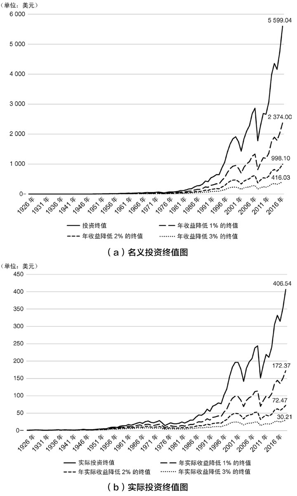

图6-1(a) 1926—2017年成本对业绩的影响

图6-1（a）为证券价格研究中心绘制的名义投资终值图（在第一章中出现过），若交易成本、费用和税收分别将市场指数的收益率降低了1个百分点、2个百分点和3个百分点，那么投资终值将会如何变动？图6-1（b）使用实际收益绘制了投资终值图。

\>\> 显然，投资者不能忽视成本对投资终值的影响，但投资者付出这些成本的代价总不是显而易见的。例如，在交易小盘股票时，最主要的成本不是支付给经纪公司的费用——这些费用已被行业竞争和技术创新压低，而是买卖价差的影响。然而，这种影响取决于交易的具体股票以及交易规模等因素。

由于成本会对长期投资绩效产生重大的影响，因此研究与三大类成本（交易成本、费用和税收）相关的细节是很有必要的。

图6-1(b) 1926—2017年成本对业绩的影响

◆ 交易成本

\>\> 换手率可以反映交易活动。换手率达到200%（市场曾数次超过这一水平）意味着平均每6个月，投资者就会出售自己的全部投资组合，并以新的投资组合取而代之。显然，这表明市场中大部分参与者既不是被动投资者，也不是基本面投资者。

你卖出一只股票并买进另一只股票时，需要支付两笔交易成本。如果市场有效，所有股价都是公平的，那么最终你得到的股票价值为市场的合理价格减去两笔交易成本。

\>\> **除了活跃交易的股票，其他领域的买卖价差均有所上升。除了国债的交易价差与股票相差不多，债券的价差更高，也更难以辨别。**这在很大程度上是由异质性导致的。公司发行的所有股票都是相同的，了解特斯拉公司的股票就相当于了解所有的股票。但其债券发行并非如此，每一期的债券都是独一无二的，票息和期限均有所不同，最重要的是年资不同。年资决定了公司在被迫重组从而影响信用风险时，某一特定债券持有人的求偿优先权。年资不同，同一公司发行的债券的信用风险会有显著差异。或许正因为异质性的存在，大部分债券交易都在不透明、不活跃的市场上进行。许多债券长达数周没有进行交易，因此很难辨别市场价格。为了保护自己不被价格的不确定性影响，这些债券交易商报价时都存在较大的买卖价差。

幸运的是，投资者没有理由主动交易债券。**正如我们在第三章中指出的，高评级债券的相似之处在于，它们反映了一个核心因素——利率水平。**这意味着投资者没有理由用一种高评级债券替换另一种，因为两种债券的表现类似。对低评级债券，米尔肯的分析是合理的。若投资者认为低评级债券定价过低，他可以购买并持有，从而获得高票面利率，没有必要等市场对错误定价做出反应进而以更高的价格出售。最后，如果投资者希望根据对未来公司业绩的预测来交易证券，那么应该购买股票而不是债券。因为股票不仅买卖价差较小，且对公司财务业绩的变化更加敏感。归根结底，债券是用来购买和持有的证券，而不是用来交易的，因为交易会降低它们较高的买卖价差产生的影响，成本可以在持有期限内进行摊销。

另一种降低持有债券成本的方法是购买低成本基金。正如我们在第二章中提到的，越来越多的投资者通过基金持有证券。投资者对股票的买卖往往能相互抵消，因此基金不需要频繁交易标的证券，从而大大降低了交易成本。

\>\> 基金是**金融中介**的一种。基金将数百只低流动性债券转换为高流动性的基金股票。这一过程并不罕见，几个世纪以来，银行基本上都这么做：持有贷款等非流动性资产，发行高流动性存款。

银行和基金的存在还解决了另一个问题—**评估基础证券**。银行在提供贷款时，需要评估借款人的信用价值。因此，储蓄者不必亲自评估贷款的质量。 主动管理基金，包括主动股票基金、对冲基金和私募股权基金，我们将在后文探讨，它们执行类似的信息处理服务。在这方面，它们与被动基金不同，被动基金仅仅是追踪某些指数。然而，正如我们下面将提及的，信息处理服务并不便宜。

\>\> 除了债券，利差还会在其他领域中进一步扩大。我们将在后续章节中讨论包括房地产在内的另类投资。目前有两点值得注意：

1.  买卖价差较大的资产并不适合交易。因为来回买卖的成本可能相当于一整年的收益。
2.  持有这些资产的最佳方式通常是购买基金。例如，在房地产领域，房地产投资信托公司购买大量多样化的房地产投资组合，然后向投资者出售股票或合伙权益。总的来说，随着交易所交易基金的兴起，中介服务变得更加高效，持有基金股票已成为持有流动性较差资产的最佳方式。随着金融技术的不断进步，基金作为中介的作用可能会变得更加广泛。剩下的问题是在被动基金和主动基金之间进行选择。

◆ 管理投资基金及费用

\>\> “对冲基金”这个词最初是用来形容那些持有多头和空头头寸的基金经理。如今，它代表持有几乎所有资产的基金。对冲基金通常以一般或有限合伙的形式设立。在这种结构中，普通合伙人对基金的运作负责，而有限合伙人可以对合伙企业进行投资，只对其实收金额负责。为了被排除在美国证券交易委员会之外，对冲基金通常被限制拥有不超过99名的有限合伙人。这意味着大多数对冲基金不适合小规模投资者。“基金中基金”（funds of funds）避开了这一限制。基金中基金是在对冲基金中持有有限合伙权益，并向最终投资者发行股票的专业基金。

\>\> 私募股权基金可以被看作是专门投资私人公司的对冲基金。

◆ 税额

\>\> 所有投资者都应记住两个基本的税务问题：收益和资本利得之间的区别、已实现和未实现的收益和损失之间的区别。

\>\> 尽管资产价格的随机波动超出了投资者的控制范围，但成本是可以控制的。仔细管理交易成本、费用和税收是提高投资业绩的必经之路。每年减少1%的成本对长期财富积累会产生重大影响。出于成本考虑，投资者持有流动性较差资产的最佳方式是通过购买低成本的被动基金。

◆ 第七章 历史可以信任吗

\>\> 媒体不断地将当前的市场行为与历史进行比较。但投资者究竟能从金融市场的历史中学到什么呢？这是一个很难回答的问题，它取决于三个关键概念：①数据挖掘、②稳定性和③模型设定。虽然读者可能并不熟悉这些概念，但关键是这三个概念，尤其是前两个，都能解释其他领域发生的随机事件。

从第一章中我们得出结论，认为股票收益率中不存在可以战胜市场的历史模式。如果有的话，拥有最新电脑和软件的老练投资者就会发现并利用它们，从而消灭它们。因此，**如果历史能够为预测未来的资产价格提供一些线索，那么这些线索就不可能是简单明了的。**这就是数据挖掘、稳定性和模型设定的切入点。正确解释历史数据之前，必须考虑到这三个因素的潜在影响。了解其中原因的最好方法是从历史股市收益中著名的、最具争议的一个现象开始：小市值效应。

1981年，罗尔夫·班斯（Rolf Banz）在其博士论文的一个部分中提到了一个有趣的现象。他所谓的“小股”是指那些市值较小的公司股票，相对于1926—1981年CAPM的预测，这些股票产生了巨大的收益。这一结果十分惊人且具有争议性，引发了大量学者的深入研究。尽管如此，直到今天围绕“小市值效应”的争论仍在继续。争论的焦点是如何解释班斯及持有相同观点学者的研究结果。目前存在四种不同的解释，其中三种涉及开头提及的概念。

第一种解释：小市值效应是一种通过投资小资本公司股票来获得更高经风险调整收益率的方式。该解释的支持者认为，行为或制度因素会建议投资者，包括成熟的机构投资者，不要购买小盘股票。班斯的研究只是发现了一个一直存在的市场特性。根据这种解释，小市值效应就像万有引力定律一样，是资产定价的一个持久特征。

第二种解释：小市值效应是风险度量不充分造成的。回顾关于风险和收益的章节，大量学术研究表明CAPM应用有限——除了市场，还有其他风险因素。若能恰当地衡量风险，小公司风险可能高于平均水平。此时，就不存在小市值效应，只有风险与收益的权衡。尤金·法马和他的同事肯尼恩·弗伦奇都认同这一观点。在一篇被广泛引用的学术论文中，法马教授和弗伦奇开发了一种资产定价模型，将公司的规模作为一种风险因素。这并不奇怪，该模型预测不存在可以战胜市场的市场异象，规模溢价只是一种风险溢价。根据这种解释，班斯教授最初使用CAPM的研究存在**模型设定**的问题，若他使用了合适的模型，他从一开始就不会认为存在小市值效应。

第三种解释：尽管小市值效应是班斯教授在研究期间发现的股票定价特征，但如今这种效应已不再成立。这是一个**非稳定性**的例子。早期，小盘股的平均收益率高于市场平均水平，但市场发生了一些变化，导致这种效应消失了。

该观点支持者认为，一旦出现小市值效应，就会产生消除它的力量。首先，若小型盘的定价相对于其风险来说持续偏低（班斯的数据似乎暗示了这一点），聪明的企业家就会在小市值效应存在时创办旨在利用错误定价的投资公司。

小市值效应是否已经完全消失仍是具有争议的问题。

第四种解释：一开始就没有小市值效应。即使是一系列的随机数据也会有明显的巧合。如果有足够多的研究人员都研究相同的历史数据集，他们就会发现这些随机波动引起的、没有任何经济意义的巧合。它们只是**数据挖掘**的产物。根据这种解释，小市值效应只是一个特例。

请注意，第四种解释和第三种解释一样，认为不应基于当前数据得出小市值效应是否存在的结论。基于非稳定性的观点，世界已经改变，目前找不到小市值效应存在的证据。根据数据挖掘的观点，一开始就没有真正的小市值效应。

在考虑数据挖掘、稳定性和模型设定这三个问题前，还有一个关于小市值效应的事情值得注意。在第六章中，我们指出，市值非常小的股票买卖价差较大。这使得计算小盘股票的实际赢利能力变得困难。账面上的利润实际上不一定能实现。Dimensional基金顾问公司制定了复杂的交易程序，以降低小盘股票的交易成本。然而，这些程序需要将Dimensional基金顾问公司的规模和市场联系起来，而普通投资者无法获得这些信息。因此，即使还存在部分小市值效应，可能也只有像Dimensional基金顾问公司这样的公司能够发觉。

**抛开对小盘股交易成本的担忧不谈，三个问题中的任意一个都使得解读历史金融数据变得十分困难。**

◆ 数据挖掘⭐

\>\> 检验数据挖掘的最佳方法是重复实验。这是最常见的，例如，在新药测试中。若在几个独立的试验中重复出现这种效应，那么其不太可能是数据挖掘的产物。不幸的是，就金融市场历史而言，我们只能“看一次电影”。证券价格的历史记录只有一个。近一个世纪以来，美国有成千上万只股票的历史数据，这是一把双刃剑。大样本增加了可执行的统计测试能力，但也增加了许多数据挖掘发现的异象，我们需要的是一个新的数据集。

最好的解决方案是再等一个世纪，让自然提供一个新的数据集。然而，这种选择对目前的投资者没有吸引力。更可行的办法是使用迄今未经审查的国际数据。

◆ 非稳定性

\>\> 暂且不考虑数学术语，从形式上看，**稳定随机过程的联合概率分布不会随着时间的推移而改变。因此，均值和方差等参数（如果它们是相关的）也不会随时间而改变。**不能将非稳定性与不可预测性混淆。所有随机过程都是不可预测的。但若该过程是不稳定的，就不能准确地估计随机分布的参数。

\>\> 在投资领域中，非稳定性并不罕见，是市场的常态。若事实如此，我们从市场历史中学到的东西是有限的。

\>\> 非稳定性比小市值效应更加普遍。它可能会影响金融市场的各个方面。

◆ 模型设定

\>\> 解释小市值效应的模型设定并非特例，投资者和学术研究人员一直在寻找可以用来战胜市场的资产价格的“异象”，其包括低方差效应、价值效应、预估Beta、一月效应等。对这些异象进行解释时，模型设定引发了争议。记住，学术研究人员声称已经发现了316种不同的风险因素。根据模型中选择的风险因素，某个效应（如低方差效应）可以被解释为一种战胜市场的异象，也可以解释为一种风险溢价。目前，许多异象仍未解决。

◆ Smart Beta和因素溢价

\>\> 每一个潜在的风险因素都有其对应的风险溢价。试图获取这些溢价的策略被称为“Smart Beta”，因为每个风险因素都有一个Beta值，越来越多的试图通过获取风险溢价来提高投资业绩的机构投资者采用了Smart Beta策略。投资者通过计算历史平均水平来决定利用哪些风险溢价，这就产生了一个问题，即历史溢价数据是否能够合理地预测未来溢价。

◆ 评估投资管理者的业绩

\>\> 或许历史数据最常见的用途是评估活跃基金经理的业绩。投资者经常忽略的是，由于资产价格的随机波动，即使存在出色的业绩，也可能难以识别。

\>\> 有证据表明股价正在回归均值水平。均值回归意味着，过去大幅上涨的股票的未来表现往往会比下跌的股票略差，反之亦然。这种影响并不显著，但在分析大数据集时可以看出。这种平均回归解释了康奈尔、许和纳尼吉亚发现的结果。被解雇的基金经理所持有的股票在评估期间表现不佳，由于均值回归，这些股票在随后的时期往往表现稍好。对持有表现良好股票的经理人来说，情况正好相反。令人讽刺的是，在某种程度上，历史不代表未来，过去表现良好的基金经理在未来反而要避开他，由此说明，错误地解读历史金融数据是非常危险的。

◆ 美国总统政治和股市

\>\> 不要在历史金融数据中寻找特定模式的重要性，即使是那些在经济和统计上显著的模式，不能只流于表面。数据挖掘、非稳定性和模型设定的问题十分重要，它们可能会让看起来就很好的结果更加好得令人难以置信。

投资常识7

当黑格尔说“人类从历史中得到的唯一经验，就是我们没有从历史中得到过经验”时，他可能已经想到了要投资。投资的第7个常识是历史财务数据对未来财务绩效的影响是复杂而微妙的。由于存在数据挖掘、非稳定性和模型设定等问题，**很难得出结论认为：过去战胜市场的策略在未来仍适用。**

◆ 第八章 异象，可以利用吗

\>\> 让我们回顾一下标准的“理性”金融模型是什么，然后再探讨行为金融学认为它有什么问题。金融模型通常会假定投资者追逐可消费财富效用的最大化。这种效用总是随着财富的增加而增加，但增加的速度是递减的。事实是，每增加1美元，增加的效用都比上1美元低，这是风险规避的基础。风险规避推动了理性资产定价模型的出现。此外，投资者被认为是理性的，他们追求效用最大化，不会屈服于恐惧和贪婪。

表面上看，大多数人认为传统模型是错误的。有谁能在股市崩盘时不恐惧呢？过去20年里，**行为金融学飞速发展，学者们尝试开发行为模型以避免效用最大化假设，而更贴合实际**。

\>\> 从投资的角度来看，问题不在于人们的日常行为是否偏离理性效用的最大化，而在于这些偏离理性的行为是否会导致市场异常，从而被识别出来并加以利用，以获得更高的收益。

\>\> 传统模式中所有投资者都是一样的，都是理性效用最大化者。在行为金融学中，投资者有各种各样的非理性表现，每个投资者都各不相同。因此，我们首先来了解行为主义者提出的一些偏离理性效用最大化的行为类型。

◆ 潜在投资者偏见类型

\>\> 行为主义者经常把导致行为偏离理性效用最大化的错误和偏见分为两类：认知错误和情感偏见。**认知错误**与赫伯特·西蒙的有限理性概念有关。由于人们存在智力、信息和概念上的局限性，他们依赖于启发和经验，这些往往与统计或数学分析不同。**情感偏差**是由于态度、情感和倾向与对可消费财富效用的理性计算不一致而产生的。

◆ 认知错误

\>\> 保守主义偏差和反应不足

行为金融学认为，做出投资决策需要投入时间和精力。实验表明，人们在做出决定之后，会对自己最初的观点产生兴趣，坚持最初的观点，而没有充分吸收与其决定不一致的新信息。这就是保守主义偏差。表现出保守主义倾向的投资者可能对新信息反应不足，导致他们比理性投资者持有头寸的时间更长。例如，一个购买股票的投资者可能对新的负面信息关注不足。

确认性偏差

心理学研究表明，人们往往会注意到并更容易接受那些证实先前观点的信息。理论认为，原因是与矛盾信息相比，验证性信息更容易被人们在认知上处理。因此，根据行为金融学理论，个人可能会过度重视符合自己观点的证据，忽略或修改不符合自己观点的证据。有人认为，确认性偏差导致投资者在有限数量的证券中建立大量头寸，而不是分散投资。

代表性偏差

和确认性偏差一样，代表性偏差也是一种信念坚持性偏差。该观点认为，人们有一种倾向，即以过去的经历和思想为参照系，将信息分类。面对新信息时，他们通常使用“最佳拟合”的方式近似将新信息放入一个类别中。这种方式可以简化并加速人类的信息处理过程。但在现实世界中，新信息不一定适合个性化的类别，因此可能会被错误地纳入其中。行为金融学认为，代表性偏差会导致投资者不愿面对处理复杂数据所需要的精力和时间，而依赖于简单的分类。这些简单的分类可能导致出现不合适的投资组合。

后见之明偏差

心理学已经证实，人类记忆不能准确地记录过去。相反，人们倾向于用他们更愿意相信的东西来“填补”过去的空白。其中一个观点是，人们回顾一个事件或投资决策时，会认为它比当时的实际情况更容易预测。例如，在2001年科技股崩盘后，许多投资者声称知道科技股估值过高。此时，投资者会产生错误的信心，低估投资风险。

锚定与调整偏差

锚定与调整偏差是一种信息处理偏差，是由人类大脑估计概率的方式产生的。该理论认为：在处理概率时，人脑与计算机不同。人们经常利用启发或经验来估计结果的可能性。该过程从一个起点或“锚”开始。以投资者购买证券的价格为例，对纯粹理性的投资者来说，锚不应该是独一无二的。然而，根据这一理论，人们往往给予这些锚特殊的权重。类似于保守主义偏差，这可能会导致投资者减持股票，且由于对锚的过分强调导致其无法对新信息做出适当的调整。

框定偏差

举例来说明框定偏差，假设你在找新工作，一个雇主说“30%的新员工在入职的第一年就获得加薪”，而另一个雇主说“70%的新员工在入职的第一年不会有任何加薪”。尽管这两种说法在数学上是相等的，但框定偏差理论认为人们的反应是不同的。若该理论成立，投资决策可能取决于投资信息的构建方式。

◆ 情感偏见

\>\> 亏损厌恶偏见导致投资者在亏损时继续持有以避免损失成为事实，而赢利时，投资者往往拥有倾向及早落袋为安、保住收益的心态。这与投资者基于税收择机应采取的理性行为相违背。

过度自信

过度自信是行为金融经济学家最先提出的情感偏见之一。过度自信的一个表现是，人们在估计概率方面做得很差，但仍然相信自己做得很好。因此，他们不能正确地评估投资风险。另一个表现是，没有认识到每一笔交易都有对手方，他可能比你更了解情况。最终，过度自信会导致投资者错误地认为自己能够识别出定价错误的证券，从而导致多元化投资失败。

自我控制偏差

自我控制偏差是指人们由于缺乏自律而无法正确地追求长期目标。行为主义者提供的例子是，随着时间的推移，许多人不能合理分配财富，尤其是不能为退休储蓄足够资金。

现状偏见

现状偏见会导致人们对不断变化的环境无动于衷，例如不能对证券价格随时间变化的影响做出反应。原本分散良好的投资组合，随着时间的推移，若少数证券价格大幅上涨，多元化可能会遭到破坏。存在现状偏见的投资者会继续持有原有的投资组合，不会为了多元化投资而重新配置组合。

禀赋偏差

投资者持有某项资产的价值高于不持有时，就会产生禀赋偏差。有禀赋偏差的人违反了理性原则，即一个人愿意为一件商品支付的价格应该等于他愿意以什么价格出售它。禀赋偏差会导致人们无法意识到损失，无法利用税收时机选择，无法重新配置投资组合，无法妥善管理风险。

◆ 行为金融学与市场定价

\>\> 第二章中，我们介绍了两个关键的投资概念：夏普法则和有效市场假说。如果加上非理性行为的可能性，那么我们自然会对其产生的影响感到疑惑。首先，**行为金融学对夏普法则没有任何影响**，这听上去很奇怪，但夏普法则没有任何关于投资者行为的假设，它完全基于所有证券被投资者持有这一前提。这一结论适用于任何市场，无论参与者多么不理性。此外，夏普法则的含义保持不变。无论非理性的程度如何，被动投资者作为一个群体，其表现都优于主动投资者，而个人主动投资者的表现只能以牺牲其他主动投资者为代价。

**行为金融学是对有效市场假说的攻击。**事实上，这一领域的发展来源于早期的研究，这些研究试图解释与市场效率不一致的股价异常的现象。关于这方面最早的杰出论文之一是德邦特（DeBondt）和塞勒的著作。他们发现，如果按照历史收益对股票进行排名，赢家往往表现不佳，而输家则相反。德邦特和塞勒将这些与市场效率不一致的逆转归因于投资者的过度反应。他们认为，在形成预期时，投资者过于看重公司过去的表现。这种过于看重近期过往业绩的倾向，与上面讨论的几种偏见是一致的。

评估类似德邦特和塞勒研究结果的可靠性时，首要的问题是确认市场异象是否真实存在。就像寻找风险因素一样，行为金融学的兴起掀起了一阵探索“异象”的浪潮。正如我们在第七章中提到的，即使在随机数据集中，通过数据挖掘也一定会发现某种异象。记住，有效率的市场并不等同于完美的市场。在某些环境下，结果会好于市场预期，也有可能比预期差。这并非异象——只是资产定价不可预测的随机干扰因素作用的结果。

这是法马教授对行为金融学早期研究的尖锐回应。法马和大文豪列夫·托尔斯泰共同指出，行为偏差和相关异象确实存在某种联系。有些是对预测反应过度，有些则是反应不足，等等。法马教授发现，从整体上看，预测异象本身通常是矛盾的。例如，德邦特和塞勒将输赢异象解释为反应过度，但也有其他行为研究发现这种异象可以解释为反应不足。行为主义者如何确定投资者何时反应过度，何时反应不足？所有投资者在市场中表现出的错误和偏差的相互作用而形成的市场价格所产生的净影响是什么？法马教授认为有证据表明这些净影响是微弱的。

法马教授还发现，尽管设计出的行为模型可以很好地解释特定异象，但它们不能解释其他异象，这就说明异象是数据挖掘的产物。法马教授进一步指出，特定异象对最初用于确定是否存在该异象的模型高度敏感。这也是我们在第七章中讨论的模型设定错误的问题。法马教授观察到，若估算超额收益模型中变量的轻微改变都会导致异象消失，那么该异象不一定真实存在，很可能是一种错觉。他提供的证据表明情况确实如此。

同时考虑这些问题时，行为金融学只告诉投资者，市场可能不像教科书理论所说的那么有效，因为个人投资者容易受到行为错误和偏见的影响。至于行为金融学对错误定价有什么意义，还尚未得知。错误和偏见影响市场价格这一假说的最后一个问题是，现代金融市场是由机构而不是由个人主导的。除非这些机构表现出与个人投资者相同的错误和偏见，或者存在某些限制阻止它们通过套利消除个人投资者造成的偏见，否则几乎没有理由相信市场价格会受到显著影响。

◆ 个体与机构

\>\> 主动个人投资者对金融市场的影响越来越小。

至于经验丰富的机构投资者，没有理由相信他们会表现出与个人同样的错误和偏差。首先，这些组织旨在尽可能有效地识别和利用错误定价。他们不依赖于个人反应，而是制订了涉及包含系统分析、交叉检查和群体决策在内的程序。上文中列出的偏差可能在组织内自我消除，至少在一定程度上是这样。

\>\> 此外，机构越来越依赖电子交易算法。很多情况下，这些算法是专门设计用来识别和利用由于主动交易者的偏差而可能出现的错误定价。

不幸的是，行为金融学的核心实验无法以成熟的机构投资者为对象进行研究，因为他们的整个投资决策过程都是独有的（如果他们希望以此作为持续获得更高收益的基础，就必须这么做）。我们的观点是，鉴于机构投资者在市场中的重要性，个人行为偏差即使存在，也不太可能对市场价格产生重大影响。

**行为金融经济学家没有忽视机构投资者的重要作用。他们认识到，成熟的机构往往会消除定价错误。他们通过套利的概念来解释个人偏好如何影响市场价格。**

\>\> 施莱费尔和维什尼认为个人投资者的错误和偏见对市场价格的影响以及套利资本是有限的。施莱费尔和维什尼论点的适用性取决于那些受行为偏差影响的主动个人投资者的相对规模（CF《赢得输家的游戏》：中国市场由散户主导，机构投资者增幅很小，离有效市场还有很长的路要走）。专业投资公司则试图通过套利来规避错误定价。1997年，在施莱费尔和维什尼的文章发表时，弗伦奇教授说，个人投资者持有29.5%的美国股票。到2007年，也就是弗伦奇教授在他的总统演讲中公布的数据中的最后一年，这一比例下降到了21.5%。弗伦奇教授的著作出版后的10年里，随着交易所交易基金和对冲基金的兴起，个人持有股票的比例进一步下降。这些个人股东包括由专业投资者运营的家族理财机构，不太可能受到行为偏差的影响。简而言之，即使限制了投资公司的套利行为，其持股规模与主动个人投资者的持有量相比已经发生了变化。没有理由认为，限制公司套利能够使个人投资者的行为弱点对市场价格产生显著影响。

◆ 证券定价错误是否重要

\>\> 行为金融学是一种解释有效市场假说失效、市场价格与基本价值之间存在差异的理论。综上所述，我们对个人错误和偏见可能对市场价格产生重大而持久影响的观点持怀疑态度。但假设我们错了，错误和偏见确实导致了显著的错误定价，除了我们已经讨论过的，这对理性投资者有什么实际影响吗？答案是否定的。对这些投资者来说，关键问题不在于证券为何定价错误，而在于它是否定价错误。在上文中，我们已经讨论了如何解决这个问题。它需要评估证券的基本价值，并将其与市场价格进行比较。以此方式来分析错误定价不会受到投资者过度自信、认知偏差及其他原因的影响。事实上，**对必须承担基本面估值分析成本的投资者来说，试图找出错误定价的根源费时费力且价格昂贵**。

识别错误定价来源的唯一方式是，看评估出的错误定价消除速度有多快。若错误定价是由于市场没有意识到有关业务表现的细节，那么在报告财务结果时，错误定价可能会被消除。若错误定价是由投资者的行为偏差造成的，那么它可能会持续到偏差消失。这种偏差是非理性的，因此很难预测其持续时间。然而，随着有关业务新数据的出现，这些数据对估值产生了更显著的影响，包括机构在内的理性投资者的行为最终将反映在市场价格中。

\>\> 如果我们的观点正确，投资者的错误和偏见不会对市场产生显著影响，但这是否表示可以忽略该影响吗？当然不是，即使在效率极高的市场中，存在认知偏差的投资者也会做出错误决策，从而影响其投资业绩。

◆ 行为偏差在有效市场中的作用

\>\> 即使股票以公平的价格交易，存在偏差的个体也可能出现影响投资业绩的重大失误。我们列出了其中的5个因素：

1．过度交易和业绩追逐

过度自信、缺乏自制力和代表性等偏见都可能导致过度交易。

2．缺乏多元化

造成过度交易的偏差也会导致投资者在有限数量的证券上投资过多。

3．过度市场时机

尽管席勒提出的周期调整市盈率似乎是预测股价“高”或“低”的指标，但它并不是十分精确的预测指标，不足以证明定期进出市场是合理的。大多数其他已知指标的表现也不尽人意。

4．纳税管理不善

厌恶损失等行为偏差，可能会影响管理税收的能力。回想一下，利用税收时机需要实现亏损以抵税并继续持有赢利股票。厌恶损失会导致完全相反的行为，其结果是产生不必要的高纳税额。

5．未能及时分配财富

行为主义者想要解决的一个问题是，许多投资者为退休准备的储蓄太少。行为经济学家什洛莫·贝纳茨（Shlomo Benartzi）和塞勒开发了一个完整的程序来解决这个问题。塞勒的著作《助推》旨在帮助人们克服导致储蓄过少的偏见。

上述因素并不详尽，但它说明了即使市场是完全有效的，个人投资者也可能会犯很多错误，损害他们的业绩。在这方面，个人投资者可以从行为金融学中学到很多东西，即使它不能提供战胜市场的方法。

投资常识8

**尽管行为经济学家已经证明，许多人并不像标准金融经济模型假设的那样，以理性效用最大化者的方式行事，但这对投资的影响（如果存在的话）尚不清楚。**目前，机构投资者日益占据金融市场的主导地位，算法交易技术发挥越来越重要的作用，套利行为可以消除个人非理性造成的定价错误。此外，对投资决策而言，重点在于证券是否定价错误，而不是它为何定价错误。该判断可以在不参考行为金融学的情况下做出。最后，即使行为错误和偏差不会影响市场价格，该类投资者也可能犯下重大投资错误，比如过度交易和无效的多元化投资。

◆ 第九章 另类投资

\>\> 目前为止，我们主要关注发达国家（主要是美国）公开交易的股票和债券。这是投资者需要考虑的主要资产，但可供选择的另类投资品种多达数千种。首先，有几种主要的另类投资，包括发展中国家的股票和债券、房地产、大宗商品以及对私营公司的投资。其次是不计其数的衍生品证券。最后，还有很多外来投资，包括贵金属、珠宝、艺术品、收藏品。在任何年份，如此多可供选择的资产中总会有一些表现得非常好。 

除了直接投资上述的另类投资，还有大量基金持有另类投资，并向公众出售股票或合伙权益。例如，有跟踪石油、天然气、黄金和白银的交易所交易基金。

过多的选择可能会让大多数投资者感到沮丧，因为他们总会错过某些表现出色的证券。例如，我们没有投资比特币，因为认为它几乎没有基本价值。尽管如此，我们仍会思考：“如果在比特币还不到100美元的时候购买了它呢？”这种想法是很危险的，它鼓励投资者追逐当下的明星投资，而不是设计和持有一个平衡良好的投资组合。金融媒体近乎偏执地专注于热门资产，这加大了投资风险。

我们对另类投资的基本观点是，忽略这些干扰信息，看清事实。错过今年的热门投资，你可能会感到沮丧，但好消息是，你错过的去年的热门投资理念，在今年可能彻底失败了。

考虑另类投资时，有一个重要的问题是：在股票和债券的多元化投资组合中加入另类投资有什么好处？错误答案是：能获得更高的预期收益率。没有证据表明，另类资产经风险调整后的收益率优于股票和债券。不过情况似乎并非如此，现实中总有一些热门资产类别（目前是加密货币）的价格会不同寻常地上涨。但就像打字机上的猴子终会写出一部小说一样，如果你持有足够多的另类投资，总会有一个比股票和债券收益率高的资产，只是在第二年这种资产可能就变得一文不值。更合理的回答是，**增加另类投资可以增加多元化的收益，从而降低风险。然而，如果投资者已经持有高度多样化的股票和债券投资组合，那么这种增加多样化带来的收益会十分有限。简而言之，我们认为另类投资不应在投资者的投资组合中占有很大比例。**

**尽管我们建议忽略大多数另类投资，但对主要类别的另类投资进行少量投资可能是合理的，例如房地产资产、发展中国家股票、私募股权和大宗商品。除了投资规模非常大的投资者，持有这些另类投资的唯一合理方式是购买基金。原因与流动性、信息、产权和必要的管理四个方面有关，某种程度上，它们会相互作用。**下面我们将逐一介绍这四个方面。

◆ 流动性

\>\> 流动性是一个复杂的概念。若你能以市场价格迅速出售资产，那么该资产就具有流动性。买卖价差的存在是衡量流动性的好方法。价差大小代表交易对手愿意进行交易所要求的费用。在活跃交易的普通股中，我们发现其费用很小——大约是0.05%。除非你持有大量股票，否则你几乎可以在接近市场价格的情况下低价卖出。然而我们也注意到，当你远离活跃、透明市场时，流动性变得更加难以定义。例如，房子的买卖差价是否有意义？假设根据可比销售额，你的房子价值50万美元，若你想在一天之内卖掉它，你可能要做出很大让步。从这个意义上说，买卖价差很大。但如果你愿意等六个月，让步可能小一点。这说明在不太活跃的市场中，**价差很可能是关于资产上市时间的函数**。

能够在不降价的情况下迅速出售资产对投资者来说是有价值的，所以流动性强的资产的出售价格更高。

\>\> 拥有大量现金储备，可以安然度过所谓的流动性危机。危机产生的原因是，在不景气时期，流动性差的资产往往变得更缺乏流动性。

\>\> 报告中的非流动性资产也很难估值。

\>\> 与房地产流动性相关的另一个问题是，流动性不稳定。你不能购买10%的商业建筑（除非通过合伙）。这使得除了投资规模非常大的投资者，所有人都不可能持有一个合理的房地产多样化投资组合。

◆ 信息

\>\> 与美国股票一样，许多关于信息的问题都可以通过被动持有一个广泛分散的指数来消除。例如，持有被动指数可以消除交易对手的风险。但人们仍然担心，整个市场可能会因政治形势的发展而起伏不定，这是外国投资者难以预料的

美国房地产在一定程度上也是如此。为了监控对波特兰一座商业大楼的投资，我们的员工必须定期出差，与租户交谈，与市政府官员会面，并在社区中走访。没有像苹果公司一样的免费信息流，这些行动的成本都是高昂的。据我们的分析显示，考虑了信息成本以及运营该物业的所有成本后，我们的预期收益低于标准普尔500指数。

我们的底线是，对于许多另类投资，适当的管理和投资决策都要涉及承担不可避免的信息成本。基金可能能够利用规模经济按比例降低这些成本，但无法消除它们。

◆ 产权

\>\> 除非你有自己的私人军队，否则拥有某样东西就意味着依靠法律体系和警察来保护你的财产权。对外国投资者而言，产权安全性较低。此时，在禁止资金外流的资本管制、完全没收资金等方面都存在一定风险。

\>\> 与产权相关的是腐败问题。腐败的投资经理和政客们非但没有确保投资者收到他们应得的款项，反而从他们那里吸走了资金。

◆ 必要的管理

\>\> 简而言之，对许多另类投资而言，它们无法与低成本的标准普尔500交易所交易基金相提并论。在交易所交易基金中，基金所需要的唯一管理工作就是保持记录，以及交易与该指数表现相匹配的流动性资产。

◆ 衡量风险和收益

\>\> 如果另类投资存在上述问题，那么在竞争激烈的市场中，难道不应获得更高的收益吗？这个问题并不简单，因为流动性不足等问题的存在使得投资业绩很难精确衡量。

\>\> 尽管如此，学术研究表明，流动性较差、可用信息较少、需要更多管理人员的资产，确实会给持有者带来更高的平均收益。但很难回答在考虑了所有的信息和管理成本后，它们是否仍有更高的经风险调整的收益率，因为其风险和收益很难衡量。然而，似乎确实有证据表明，即便是在风险调整的基础上，另类投资也能提供更高的收益，但这只适用于成本较低、效率较高的投资者，比如伯克希尔公司。

谈到风险，增加多元化的好处并没有看上去那么大。原因是美国公司开发房地产，在世界范围内销售，把商品作为其商业活动的一部分，持有美国股票的被动型市场指数已经包含了对房地产、大宗商品和国际商业的有效投资。因此，在这些领域增加另类投资，不会对基于市场指数的投资组合的多样化程度产生重大影响。

大多数情况下，标的资产的表现对最终投资者并不重要，因为他们通常持有基金股票，而不是标的资产。这与基础资产有很大差异，基金股票通常不缺乏流动性，不需要管理层持有它们。如果拥有基础资产可以获得更高的收益，那么大部分收益很可能体现在基金层面上，并反映在费用、工资和运营费用上。即使部分超额收益发放给股东，基金股票的价格也会被抬高以反映基础资产更高的预期收益，这样购买股票的投资者只能得到一个经过风险调整的公平收益率。

\>\> 在上述背景下，我们快速浏览一下投资者通过基金持有另类资产的一些方式，并指出其中涉及的一些问题。

◆ 房地产投资信托基金

\>\> 规模最大且最主要的另类投资之一是房地产。由于房地产的流动性差、波动性大，对大多数投资者来说，持有多元化房地产投资组合的唯一合理方式是通过基金。

◆ 新兴市场基金

表9-1 2003年和2016年各国及地区主要证券市场规模及占比

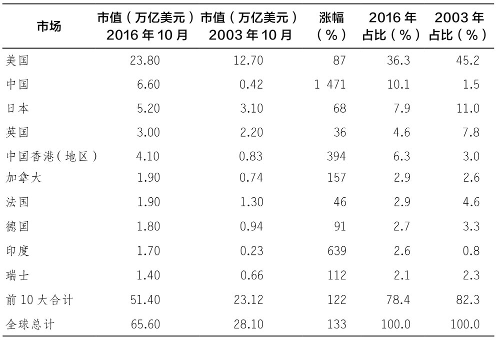

◆ 私募股权

\>\> 考虑到拥有部分或全部私人公司所需的管理时间和专业知识，投资者投资这一领域的唯一合理方式是通过私募股权公司。正如我们在第六章中所指出的，这些公司存在的问题是成本很高。伯克希尔公司是个例外。

◆ 与商品和其他指数相匹配的基金

\>\> 先锋集团标普500交易所交易基金几乎与标普500指数走势一致。你可能会猜测，所有与指数挂钩的被动型基金都是这样运作的，但这个结论是错误的

\>\> 原油的储存成本很高，因此美国原油基金通过使用期货和互换合约来匹配西得克萨斯轻质原油价格的每日变动百分比。这就导致了美国原油基金的轻微下滑，并将随时间的推移而扩大。在几天或几周的时间内，这种下滑并不重要，但对长期被动投资者来说，可能非常重要。如图9-1所示，西得克萨斯轻质原油的价格与投资终值（投资终值来自美国原油基金的收益）相对应。虽然这两条线的趋势看起来是一样的，但它们之间的差异在缓慢增加，直到2016年年底，美国原油基金的投资终值只有西得克萨斯轻质原油价格的1/3左右。

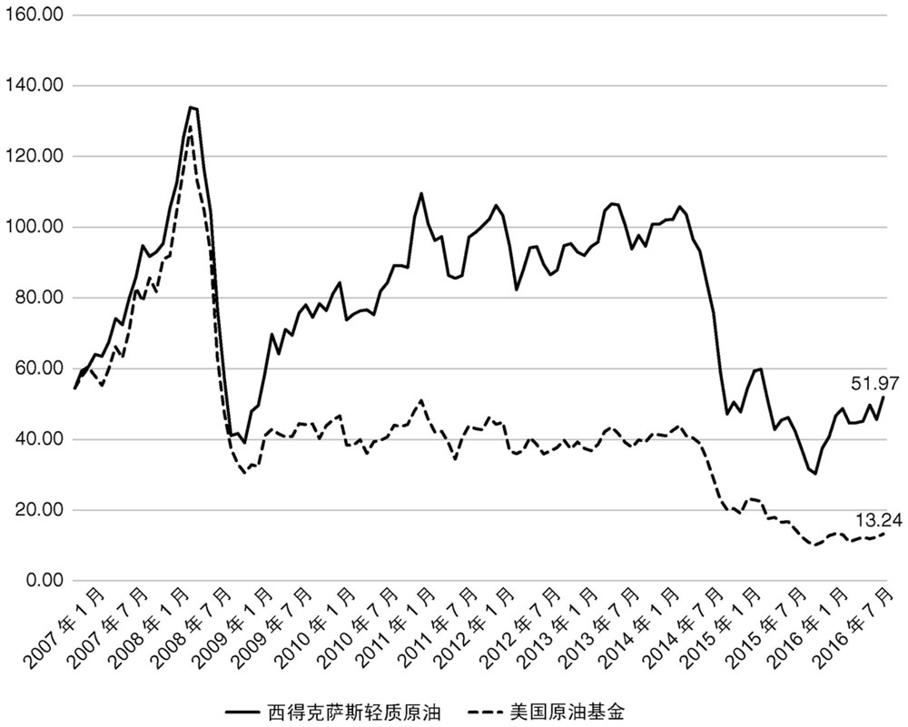

图9-1 西得克萨斯轻质原油价格和美国原油基金指数（2007年1月—2016年12月）

这种问题并非只存在于石油交易所交易基金。许多大宗商品基金和试图复制指数的基金都存在同样的问题。这取决于交易所交易基金实际上持有的是基础大宗商品，还是必须依赖于期货和互换。如果它持有标的商品，那么交易所交易基金通常会密切跟踪价格指数。如果它使用期货和互换合约，跟踪的准确性取决于这些合约的定价方式。若投资者不去详细地了解期货、互换和标的资产之间的关系，就不应想当然地认为，交易所交易基金的长期投资会与指数挂钩。这对长期投资者来说是一个糟糕的选择。

◆ 衍生品

\>\> 衍生品已经渗透到世界金融市场的每一个角落。衍生产品有上千种，问题是这些衍生品大多涉及隐性杠杆，复杂且难以分析。正确评估它们所必需的“信息”和技能需要多年才能获得，这使得它们不适合大多数人投资，除了老练的投资者。

还有一种选择是通过专门的共同基金或对冲基金持有衍生品，但正如我们在第六章中所指出的，此方式的成本较大。此外，如果投资者不了解标的证券，他应该如何评估持有的这些证券基金？唯一的选择是依靠业绩记录，但正如我们一再指出的那样，历史业绩不能可靠地预测未来业绩。目前，对大多数投资者来说，衍生品不是很好的选择。

◆ 外来投资

\>\> 目前，外来投资包括黄金、艺术品、珠宝、收藏品和其他外来资产。我们对这些外来投资的观点可以总结为：避免持有它们。 某种程度上，这类投资存在我们本章开始时概述的所有问题。**与生产性资产不同，它们不提供任何形式的现金支付。对它们最好的理解是，它们可能在巨大的社会动荡时期作为一种价值储存手段。**

投资常识9

虽然有成千上万的另类投资，除了发达国家的公司发行的股票和债券，投资者持有这些资产的收益是有限的。除了房地产和发展中国家的股票，我们的观点是，若不是最老练的投资者，所有人都应避免另类投资。几乎没有证据表明，持有这些资产会提高经风险调整后的预期收益率，这种增加多元化带来的好处有限。

由于可供选择的资产种类如此之多，在任何年份，总有一种资产的表现会非常出色。2017年是加密货币。**追逐当红投资可能会分散投资者的注意力，使他们无法选择更合适的长期投资方式，即买入并持有一个分散化程度较高的投资组合。**

◆ 第十章 投资建议

\>\> 人与人是不同的，每个人有不同的技能、知识、净资产、风险规避能力和纳税义务。这些因素都会影响投资的最优选择。因此，我们能做的就是提供一些宽泛的建议，让读者来填补这些空白。

也许我们能提供的最重要的建议是“了解自己”。

\>\> 投资中最危险的事情是认为你知道你不知道的事情。夏普法则清楚地说明了这一点。如果你认为你是一个优秀的主动投资者，那么你得出的结论是：你可以战胜其他主动投资者，获得超额利润。这个结论合理吗？如果你不能回答“是”，那么最好选择被动投资策略。因此，我们的第一个建议是遵循我们提出的多元化被动投资策略。

◆ 多元化被动投资策略

\>\> 出于以下几个原因，对大多数投资者来说，多元化的被动投资策略是最好的选择。

首先，没有必要将被动持有的股票限制在标准普尔500指数之内。低成本的交易所交易基金使小型美国公司股票很容易加入投资者的投资组合。例如，先锋集团提供的一种基于CRSP指数的全美国股市交易所交易基金，以及一种标准普尔500指数交易所交易基金。事实上，这两只基金的表现非常相似，因为标准普尔500指数中的500只股票创造了CRSP指数的大部分价值，但更大程度的分散投资仍有一些好处。

其次，国际多元化也有一定好处。低成本的交易所交易基金和其他被动型基金降低了投资成本。投资于欧洲、亚洲和发展中国家的市场基金都是不错的选择。考虑随着全球股市相对于美国股市的增长而增长，我们将国际敞口限制在投资组合价值的20%以内。

再次，根据税收和风险偏好，投资者也会考虑固定收益基金。先锋集团有几十种基金可供选择，包括财政部、公司、免税基金和低评级债券基金。通常推荐的投资组合是60%股票，40%固定收益基金，这并没有什么神奇之处。每个投资者都应该做出自己的决定。

最后，房地产投资信托基金、交易所交易基金和其他专业基金使得投资规模较小的个人投资者也可以持有另类投资。投资最多的就是房地产、发展中国家的股票和大宗商品。有些人会认为加密货币也应该在这里占有一席之地，但从我们的角度来看，目前加密货币价格较高且没有明确的基本价值，因此并不是很好的选择。此外，我们建议在选择另类投资时要谨慎，即使是购买基金。我们将对这类替代资产的投资限制在总投资组合的10%以下，这是基于在第九章讨论的原因：

1.  许多另类资产的非流动性使得持有它们的基金难以估值。
2.  目前尚不清楚这些基金是否真的是被动投资，因为管理人员需要经营房地产等资产。
3.  投资另类资产存在潜在的信息成本。
4.  这些基金并不总是与跟踪它们的指数的长期表现相匹配。

让我们回顾一下多元化被动投资策略的好处。首先，正如我们刚才指出的，通过多元化，投资者可以避免承担没有增加预期收益补偿的风险。其次，其成本和费用较为低廉。正如我们所强调的，投资业绩有涨有跌，但成本和费用是不变的。即使每年1%的成本和费用也会对长期财富积累产生重大影响。最后，被动投资策略消除了投资者基于错误定价的错误认知而进行过度交易的诱惑。这种过度交易可能是投资者买卖个股或试图把握市场时机时而产生的。最后，多元化的被动策略会阻止投资者成为拥有更好的信息和分析技能的其他主动投资者的对手方。总而言之，我们认为对大多数投资者而言，多元化被动投资策略是最佳的选择。

◆ 主动投资策略

\>\> 对于那些想要采取主动策略的投资者，我们的建议是，这种策略必须基于详细的基本面分析，目标是发现并长期持有那些投资者分析认为定价错误的投资。

\>\> 它需要拥有比市场更准确的评估公司价值的能力，这并不简单。

◆ 使用主动型投资经理

\>\> **选择经理比评估证券的安全性更困难。证券可以通过估值模型进行评估，但投资经理不能。投资经理通常持有数百种不断转手的证券。因此，评估投资经理的唯一方法是了解他们的投资理念，并检查他们的业绩记录。**其次，了解投资理念仍需要投资者对基础投资进行复杂评估。对于投资经理的业绩记录，正如我们在前几章中所指出的，三年以下的业绩记录对预测管理者未来的表现几乎没用。

\>\> 对大多数投资者来说，被动投资优于主动投资。一旦投资组合被设计出来，就不需要持续的评估和二次预测。此外，成本较低的好处会随着时间的推移而显现出来。

◆ “增强的”被动策略

\>\> **如果无法克服管理自己资金的诱惑，最好的方法是被动和主动相结合的混合策略。这也是我们所采用的策略。我们投资组合的核心是投资一系列低成本的交易所交易基金，同时也持有个别证券和衍生品头寸，以利用我们认为的错误定价。我们还利用衍生品来改变对整个市场的敞口，这取决于我们对股价高低的评估，评估依据包括周期调整市盈率在内的多种指标。**

\>\> **我们建议投资者仔细研究活跃部分是如何影响整个投资组合收益的。行为主义者所指出的偏见之一，是认为结果在很大程度上是由市场的整体走势等外部力量决定的。**不幸的是，考虑到股价的波动性，评估投资者个人的主动选择效益就像评估基金经理人的业绩一样困难。尽管如此，但**跟踪主动决策的影响是有价值的，至少它可以帮助投资者习惯于使用包括收益和投资终值在内的投资分析工具。根据我们的经验，大多数进行分析的投资者都对结果感到惊讶。**

结论

总之，我们经常听到这样一句话：“投资既是一门科学，也是一门艺术。”就目前而言，这句话不过是一句陈词滥调。更糟糕的是，这句话导致投资学被认为是空洞无物的。我们希望这本书能帮助读者改变这种看法。理解投资的基础概念是有效管理资金的关键部分，艺术部分则不那么清晰。在金融学术界和实务界工作了几十年之后，我们当中没有人听到过对“投资艺术”的一致定义。更准确的说法是，投资是一门不精确的科学，但仍然是一门科学。

◆ 后记

\>\> 一本书使命的最终完成都存在两个时间间隔：一个是从完稿到出版的时间，另一个是从出版到读者阅读的时间。我们在2018年年初完成了这本书。不幸的是，市场不等人。因此，为了尽可能跟上时代的发展，我们会根据最新的信息重新审视我们提出的一些建议。

最典型的例子就是比特币。在第五章中，我们认为比特币在2017年12月15749美元的价格只能用泡沫来解释，因为比特币没有显著的基本价值。如果投资者不再相信明天的比特币价格将高于今天的价格，就没有支撑比特币价格上升的现金流，比特币的价格就可能会大幅度下跌。没过多久。到2018年2月，比特币的价格已经跌破6000美元。这并不意味着狂热不会回来，但我们仍然相信，一项没有基本价值的资产无论以何种价格流通，对其的投资都是糟糕的。

在第五章中，我们还提到，经周期调整的市盈率达到创纪录高位的事实。这是一盏闪烁的红灯，表明未来10年的实际股票收益率可能低于长期历史平均水平。没过多久，该观点就得到了印证。在2018年2月的5个交易日中，市场指数下跌了10%以上，这就是通常所说的“调整”。我们不想把它看得太重。正如我们在第五章中所强调的，周期调整市盈率等指标提供了有关未来10年平均收益的一些信息。他们根本没有能力预测市场的急剧下跌。然而，此次大幅度下跌是10年来收益率低于预期的一个原因。尽管2018年2月的下跌确实使周期调整市盈率降低，但仍接近最高水平。因此，这一指标仍预测未来10年的实际收益率会更低。但是否会以短期急剧下降的形式出现还未可知。

在第七章中，我们介绍了**非稳定性的概念**。我们的观点是，**不仅资产价格是随机的，描述价格的随机概率分布也会变化。就好像从一个罐子里取了一段时间的球后，大自然突然换了一个新罐子。2018年2月VIX指数 的走势充分说明了这种可能性。**几年来，该指数一直徘徊在历史低点附近，几乎没什么变动，但其在一天内突然上涨了100%，一周内更是翻了3倍。此次波动较大，以至于一些旨在从波动较小且稳定的指数中获利，且多年来一直在上涨的交易所交易基金在短短几天内就倒闭了。大自然确实换了一个新罐子。

2018年2月
