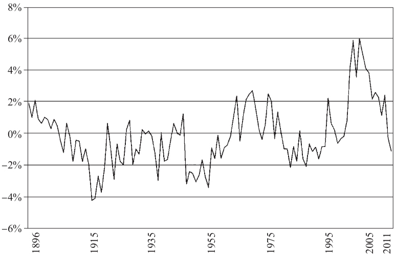

◆ 序言

\>\> 内在利益冲突广泛地存在于我们的金融市场之中，又最为明显地体现在投资者利益和金融职业人士利益这两者之间。

这是他对共同基金最重要的一项批判。许多投资者都有一种错误的印象，认为共同基金是以一种安全可靠的途径去低成本地获得分散投资的益处。事实上，同博格在此书和其他著作中详细阐述的一样，共同基金蕴藏着强烈的动机致力于在商业过程中为自身谋利，更甚于保护基金投资人的长期利益。

\>\> 本书观点鲜明，作为一本具有哲学性和学术性的基础读物，适合于各个年龄阶层的投资者阅读。整本书的遣词造句直截了当、易于理解。因为心怀对投资者的尊重，博格在书中既不花言巧语，也没有过分地把问题简单化。他明确指出了承担风险和鲁莽行事的不同。他认为基金的费用和回报息息相关。他解释了为什么模拟指数有效而主动管理往往是无效的。他发现目前市场问题的根源在于上市公司和基金管理公司的代理人问题日益严重，这两者交织在一起形成了一个既牢固又昂贵的“双层代理”隔层，阻碍着投资人和所有者对自己资产的主动掌控。

我希望华尔街的专业人士能读一读本书——即使只认同书中的部分观点，甚至是全盘否定也无妨。金融市场的最大威胁之一就是集体思维。当所有监管者、市场专业人士、投资者和政策制定者都使用着同一种假设，出现在同一个交易大厅，认可同一个似是而非的观点，期待着同样的结果时，可以预见，结局是灾难性的。

\>\> 本书提到了很多反面角色：审计、监管者、政客、评级机构、美国证券交易管理委员会（正是本人所领导的机构）、美联储、卖方分析师和媒体。由于他们共同的（也是个体的）过错，投资者深受其害。

\>\> 我们工作的目的何在？有一种观点认为，监管规定应该要求更多的信息披露。但事与愿违，有些规定并不能帮助投资者获取更多信息。那些充斥着法律措辞、用最小的字体印刷的信息披露对于大多数投资者就如过眼云烟，毫无价值。我们真正需要的是信息透明——尽力让投资者看到信息，读懂信息的意思，然后衡量信息对于他们投资决策的潜在风险和机会。

信息透明之所以是有效市场监管的核心，是因为它能真正帮助到投资者。不幸的是，很多为增加信息透明度而做出的努力，都被资金充裕的共同基金的游说人员和他们的盟友给扼杀了。

\>\> 在博格的不断坚持下，一个道理愈发清晰明了：投资者口袋里的收益正在被基金费用和投资成本不断侵蚀。投资者必须知道他们最终能达到的收益水平就是整个股票市场的收益水平，但这还没有考虑到给金融中介机构的成本费用。如果在不考虑成本费用的情况下，打败市场是一场零和博弈，那么把成本扣除之后，就彻底变成了一盘输家的游戏。有鉴于此，基金的成本费用必须向投资者清楚地披露，同时，还要尽量地减少该费用。

◆ 前言

\>\> 随着短期投机策略把长期投资策略挤出市场，这样的变化直接让金融界受益。

\>\> 《两种文化》中，斯诺主要探讨了以精确测量和量化分析为中心的科学文化的流行，还有与之对应的，以坚实的启蒙思想和理性思考为中心的人文文化的势弱。与此同理，在本书中，我对比分析了长期投资文化（即智者、哲学家、历史学家的基石）和短期投机文化（数学家、技术人员、炼金术师的工具）

\>\> 经济学家所定义的“价值创造”是指那些可以为社会增加福祉的活动，而“寻租”是指那些总体上看来其实是减少社会福祉的活动，这两者在本质上迥异。前者是提供新的或者更好的商品与服务，后者仅仅是把一部分的经济所得转移到另一部分人身上。

\>\> 我是出于想要讲述历史的心态来写本书的，以免那些本身只是围观者却恰好有这个机会的人来讲述历史。本书并不是另一本描写始于2007年的经济危机的书，而是讲述在自由市场资本主义和资本形成中的动荡与巨变，它们在漫长历史中逐渐变化，最终横扫美国乃至全球的商业和金融市场。

\>\> 在第1章中，我诠释了“文化的冲突”的主要内容。主要探讨了短期投机的文化是如何产生深刻影响并在与长期投资的竞争中占据上风。

\>\> 第2章研究了我所认为的导致资本主义失败的双重原因，我将它叫做“双层代理”。

\>\> 在第3章“基金的缄默”中，我分析了机构基金管理者，包括共同基金经理和他们麾下的养老金基金经理，是如何在管理美国最大份额的基金资产中失败的，他们未能战胜挑战，也未能在应当对基金投资人和受益人服务时承担其公司管理的职责。

◆ 十项简单投资法则

\>\> 在华尔街，指数基金并不是一个受欢迎的概念。哪怕是极其含蓄地评论消极管理将比积极管理更有效，都会被指责是荒谬的。共同基金行业通用的策略向来是积极管理，第一只指数共同基金也被众人叫做“博格做的蠢事”。指数基金更被形容成“非美国式的”。然而时至今日，虽然业内还有所保留，但指数型基金已经得到广泛的认同。

◆ 概况

\>\> 在本书的前几章中，我已经展示了一旦短期投机的地位居于长期投资之上，会给金融系统造成怎样的危害。当足以摧毁价值的销售文化彻底湮没了提升价值的监管文化，当然会产生文化的冲突。在前文我也详细探讨了投机对如今的金融环境和整个社会的影响，以说明投机产生的问题。这些问题大都是由复杂的双重代理现象引发的，即公司管理人员和机构财富管理人之间逐渐发展起来的强大的共生共栖的关系。现在是时候让我们挑战这一重视短期股票收益远胜过长期内在价值的愉快的共谋了。

◆ 买入综合市场指数基金

\>\> 读者需要迈出积极另一步是将指数基金作为你投资组合中的核心。拥有指数基金简单来说就是买入并持有一只多样化的股票投资组合，这个投资组合需要代表股市的综合表现，既涵盖美国也可能涵盖非美国的公司。

\>\> 但是，以传统指数基金（TIF）为代表的综合市场指数化的内在有效性，再加上为基金投资者及在整个市场取得的巨大成功，为一种新型但截然不同的指数基金类型铺平了道路——即交易所交易基金（ETF）。ETF以其巨额换手率和注重短期投资者为特点（讽刺的是，ETF本身持有的是长期投资的投资组合），我将这类基金形容为投机。

◆ 均值回归（RTM）是肯定会发生的事

\>\> 过去表现最顶尖的一些基金。它们曾经跑赢市场，但在长期发展中最终衰落了：均值回归的法则显而易见。

\>\> 专栏9-1

如何挑选主动型管理基金……评估基金管理人的“4个P”准则

\>\> 一个目标明确的投资者如何能增加他选择到优秀基金管理人的概率？

\>\> 以下是我提出的4个关键问题，以及相应回答的节选：

1.人（People）。谁是基金的管理人？“PRIMECAP的管理人员是杰出的投资专业人士，不仅声誉卓著，管理人员加在一起有85年的投资经验。”

2.投资哲学（Philosophy）。他们追求的目标是什么？“以增长为目标的投资哲学。”（我同样也很欣赏投资组合的低换手率，这反映了基金管理人关注长期投资的核心理念。）

3.投资组合（Portfolio）。他们如何执行投资哲学？“PRIMECAP管理的养老金投资组合包括一系列蓝筹股，部分是成长型；部分具有良好的收益；部分具有被收购的潜力；部分保持利率敏感性。”

4.表现（Performance）。他们过去的业绩如何？我着重强调了“公司过去的业绩并不是第一位选择标准，而是最末位的”。业绩当然重要，但是只有在考虑以上三个因素后才考虑。

\>\> 2011年，备受尊敬的基金分析公司晨星推出了一套全新的分析师评级体系，这套体系诡异地采用了与我的“4个P”非常类似的标准。“我们（全新）的评级系统（金，银，铜，中等，负面）反映了对每只基金基本面的综合评价，包括5个P：管理人，工作方式，母公司，表现和价格。”晨星列出的前四个因素几乎就是我在四分之一个世纪之前列出的四个标准的重复。（仅仅是因为先锋当时刚与顾问结束了非常艰难的协商，将费用降至非常具吸引力的低价，我才没有在PRIMECAP年报给股东的信中提及“第五个P”——价格（Price）。所以其实现在来看是五个P。）

以下是晨星五条标准的节选：

1.管理人（People）。我们会考虑在专业、经验以及专业技能上，公司与其他竞争者相比有什么优势，并评估基金经理在基金中的投资多少；评估整个公司的专业技能；公司是否有足够经验，以及是否足够稳定。

2.工作方式（Process）。基金管理人所做的工作其他人能否完成，还是其他人很难取而代之？采取的投资策略是已经多次使用的，还是全新的尚未经试验的？还有很重要的一点是，基金目前的工作方式是否和基金经理和基金本身的专业技能相一致。

3.母公司（Parent）。当你打算进行长远投资时，你会意识到基金背后的公司是多么重要的因素。我们会考虑公司经理的变更，投资文化，研究的深度，公司道德，董事，美国证券交易委员会是否曾对公司进行过制裁，等等……作为投资者，你会想要一个能信任多年的搭档。

4.表现（Performance）。我们主要关注在现任基金经理治理下的表现。数据跨越的时间越长，越能更好地预测未来相关的业绩表现。我们关注基金的策略和持有股票的数据，以及基金在不同市场环境下的表现、抗风险情况，以及在较长时间内是否能保持稳定的收益。

5.价格（Price）。成本是预测未来表现非常好的一个指标。成本不能代表一切，但是他们是解答这个谜题中重要的一环。我们将基金的开支和其竞争者进行比较，还有资产规模，某些情形下还包括交易成本。

我提出的“4个P”指标（实际上是5个P）和晨星的“5个P”选择指标还将继续在彼此间产生共鸣。这些标准不仅非常合理，还有助于投资者选择最好的主动型基金管理人。虽然投资主动型管理基金不太可能获得比综合股市指数基金更高的收益（扣除成本和税收后），但遵守这一指导原则将会让主动型管理基金的投资者有最好的机会获得最理想的收益。现在，让我们切入正题，来看对共同基金进行长期投资的10项基本原则。

◆ 成功投资的10项简单法则

\>\> 下面包含10项要点的简单策略应该可以帮助你在未来的日子里制定最理想的行动方针。我希望我能向你保证这是有史以来最好的投资策略，但是我不能作这样的承诺。不过我很确信有数不尽的投资策略都难与其比肩。

1.记住均值回归法则

2.时间是你的朋友，冲动是你的敌人

3.选择最正确的基金买入并长期持有

4.对未来保有现实的预期：贝果面包和甜甜圈

5.忘掉那根针，买入整个草堆

6.最小化庄家的抽成

7.永远逃不开风险

8.警惕最后一场战争

9.刺猬会打败狐狸

10.坚持到底！

法则1：记住均值回归法则

经过我在本章前半部分中列举的例子，相信你不会惊讶我将“记住均值回归法则”列为10项法则之首。它清楚地表明，通过考察历史业绩来选择基金是非常危险的尝试。过去永远不能代表未来。均值回归的概念也不仅适用于基金管理人，还适用于基金的投资宗旨。昨天还是成长型基金的主力先锋，今天就变成了价值型基金的捍卫者。同样的故事上演于大盘股基金和小盘股基金，美国股票和非美国股票的基金。

图9-9 股市收益的均值回归。25年间的收益波动（1986～2011年）

RTM同样适用于股市本身。由于股息收益率和盈利增长，股票的基本价值有相当大可能会随时间而持续增长。但是当某一段时间，股市收益大大超过由股息和盈利带来的投资回报时，市场通常会在下一段时间内调头转向，接着继续走低。就像钟摆，股票价格摆向一边时会大大高于其合理价格，接着会重新摆回至合理价格，再摆向低于这一价格的另一边，接着又回到均衡点。当股市表现完全抛离其基本面，或者落后基本面太多，均值回归法则早晚会起作用。

图9-9形象地说明了这个法则——必须承认，现在再回顾过去，1954～1973年以及1977～1999年的大牛市之前的股票价格相当吸引人，而20世纪90年代末的股票价格则很难吸引投资者。只有时间能证明这样的模式是否会在未来再现，但是我相信历史的教训是普遍存在的——因为在过去类似情况一再出现。最后，长期价值，而非短期价格，才是主宰，又一次加强了经典的格雷厄姆原理，即投票机与称重器。

法则2：时间是你的朋友，冲动是你的敌人

永远别忘记时间是你的朋友。利用这一点，好好享受复利带来的奇迹。在接下来的25年间，如果股票年收益率为8%，储蓄年收益率为2%（2012年中期业绩表明，这两个数字都还太乐观），初始的10000美元投资如果全部投资股票会增长到58500美元，储蓄的话仅为6500美元。（加上2%的通胀率，实际可支配资金为33000对比0）给与你自己充足的时间，并牢记通胀的风险。

冲动是你的敌人。投资最严重的错误之一就是被市场的塞壬之歌（siren song）诱惑，引诱你在股票价格上涨时买入，在价格跳水时卖出。类似这样的冲动将摧毁甚至是最好的投资组合。为什么？因为揣测市场时机是不可能的。即便你刚好猜对在大跌之前卖出了股票（这种巧合太少！），你如何能知道重新买入的最佳时机？做出一次正确的决定已经很困难。连续做出两次正确的决定几乎不可能发生。在你整个投资生涯中做出一打正确的决定更是闻所未闻的神迹。

当你以长远眼光看待股市时，你就不太会让股票价格短期的变化影响整个投资计划。在股市时刻变化的波动性中有太多噪声，用莎士比亚曾在另一场景说过的这句话形容，股市就是“由傻瓜讲述的故事，充斥着噪声和愤怒，但什么也不是”。如果你放任冲动取代理性的预期，那么当然冲动就是你的敌人。

法则3：选择最正确的基金买入并长期持有

投资者将要面临的下一个严峻考验就是在投资组合中选择最恰当的资产配置方式。股票的目的是提供资产和收入的增长，而债券则是保持现有资产和现有的收入水平。一旦你的资产达到均衡，那么就紧紧拽住，无论贪婪的股市飙升到多高的水平，也无论股市陷入多么可怕的泥潭。仅在你觉得需要改变投资方式的时候再对资产配置进行变动。考虑刚开始投资时将资产分配为一半股票一半债券，如果发生以下情况则考虑将投资股票的份额提高：

●你仍然还有足够时间进行财富累积。

●你用来进行高风险投资的资金保持在适度的水平（例如，当你第一次投资节俭储蓄计划或者个人投资账户）。

●现有收入对你影响不大。

●你有足够勇气来面对经济繁荣和萧条，并能以平常心待之。

随年龄增长，逐渐降低股票投资的份额。剩下让你为退休准备足够储蓄的时间已经不多；你不太可能再获得更多财富；你很快将需要花费你的养老金而不是还能继续将这部分收入进行再投资；以及（如果你和我情况一样）你很难再对股市剧烈的波动性泰然处之。但是，就资产配置而言，不要忘了将你的财富分出一部分给债券类产品，这部分投资需要与你期望在未来获得的养老金或者社保收入等值。

法则4：对未来保有现实的预期：贝果面包和甜甜圈

两类差异很大的烘焙类食物——贝果面包和甜甜圈，正好代表了股市收益中两种完全不同的元素。将贝果面包看做股市中的投资收益也没有那么牵强附会，即股息收入加上盈利增长。从股票中获得的投资收益反映了贝果面包的基本特征：有营养，外皮脆而硬，充分发酵。

同理，松软可口的甜甜圈也代表了价格发生实质性变化后得到的投机收益，而投资者非常愿意为所获得的投机收益支付一定金额。当公众对于股票价值评估的想法从乐观主义的香甜味道变为悲观主义的酸味，然后再反转回去，这即是甜甜圈思想掌控局面的证据。真实存在的贝果面包般的投资经济学几乎必然会获利丰厚；相反，不可靠的甜甜圈式的投资者永远也不会稳定的心理状态。拥有正如规则2讲到的，事实上，不稳定的感情因素几乎在所有情况下都只会起到反作用。

长远来看，投资回报才是决定一切的因素。在过去40年间，年均投资回报率是9%，几乎完全等同于股市9.3%的总收益率。而股票上的投机回报率仅为0.3%。我在第2章中曾讨论过，在过去40年的头10年和末10年，投资者并不看好未来的经济发展，股票市盈率暴跌。由于年均投机收益率为-5.3%，相比股市仅仅2.4%的收益率，相当于整整少了7.7%的投资回报。另一方面，在中间20年，即80年代和90年代，投资者看好股市前景，飙升的股票市盈率带来了年均7.4%的投机增长，投资收益高达10.1%，结果导致了前所未有的连续20年年均17.5%的股票收益率。

综合来看，这40年间股市收益每年平均为9.3%，几乎全部是由9%的投资收益组成，也非常接近股市100年间平均9.0%的收益。（再一次印证了均值回归法则！）当然也吸取了一个教训：好好享受贝果面包的健康成分，不要期望甜甜圈的甜味或酸味能够长期起作用。

那么未来的走势会是怎样？当然我们不能完全准确地下结论。但是对股票合理的预期表明自2012年1月1日开始的接下来10年中，股票大概能有7.5%的年收益，而债券则为3.5%。在专栏9-2中，我会详细解释这些数据的由来。

专栏9-2

未来十年的合理投资预期

根据股市收益的数据来建立对未来股票收益的合理预期，这已经在过去被证明是非常准确的预测方法。下一个十年期刚开始时的股息收益是已知的因素，企业的收入有非常大可能和国家GDP的增长是大致一致的。

由于股票市盈率在过去十年间翻番，因此很难提前预测未来的情况，但是我们比我们认为的要知道得更多。因为均值回归法则再次发挥了其强大的作用。过去某个10年期间刚开始时，市盈率尚低于12，很可能在最后升高（可能的情况是增长90%）。如果市盈率低于18，则很可能在10年间不断降低（可能的情况是降低80%）。

现在来看2012年开始的新一个十年可能会发生什么。标普500的股息收益率为2.1%。那么年盈利增长在5%～6%（也可能比6%略低）这个范围内似乎是相当合理的可能性。最终结论是：可能的年均投资收益率为7%～8%。

2011年市场表现强劲，现在的市盈率大概是16，非常接近历年来的均值。我认为2022年初市盈率也不会有太大的变化。那么：投机收益差不多就会回到0。结合这两点，合理的预期是下一个十年期，年均股市收益会在6%～9%的范围之间。

一些关于债券的预测。在10年周期开始时的利率被证明是预测

\>\> 这10年间市场情况尤为可靠的因素。在任何时期，市场基本收益最可靠的预测指标就是一开始时的利率水平。假设一个债券投资组合由三分之一的美国国债和三分之二的投资级公司债券组成，平均到期年限为10～12年，那么接近现在情况的基本收益大概为3%。如果在完整的10年周期中一直持有，那么债券投资组合的价值可能无限接近其最初的票面价值（假定为100）。基本上没有明显的投机收益，这样的话，收入将是决定性因素。因此结论是：债券年均收益为2%～4%。

在接下来的10年间，股票和债券间的差异将变得非常重要。如果股票收益率为7%，资本金将增长几乎100%。如果债券收益率为3.0%，资本金仅仅会增长35%。对一个资本配置为60%股票、40%债券的投资组合来说，收益率将会是6%，资本金的增长大概为70%。

特别注意：这些都只是名义上的收益。如果通胀率年均为2.5%，扣除投资成本之前的投资组合收益率将从5.4%下降到差不多3%。如果所有的成本为2%——共同基金典型的成本开支，那么投资者获得的收益率只有1%。这也是为什么指数基金（成本支出只有0.1%）是非常合理的投资选择。

所有这些数据都只是我基于过往数据的预测。虽然我可以很肯定地说这么一个股票/债券投资组合的投资道路必定是坎坷的，但是我并不能保证最后的结局。因为在2012年中期，经济形势和市场状况加在一起毫无疑问是我61年金融从业生涯中（2012年7月7日是里程碑式的从业61年纪念日）最具挑战性的困难时期。

简单来说，美国和整个世界的经济形势危机四伏。经济学家争论不休，凯恩斯主义支持者要求政府大兴借贷并增加消费以刺激商品和服务的需求总量，而哈耶克主义支持者（奥地利学派的信徒）则要求政府恪守财政紧缩政策。现在猜测两派最终会达成什么协议还为时尚早。我希望政府通过采取强力行动来解决美国累积的巨大政府债务，以拯救欧元使其不至于分崩离析和降低美元通胀压力的政治诉求。但目前看来，由于党派利益之争，障碍重重。但我们未来的经济却依赖于解决这些相当棘手的问题。

金融市场的情况也异乎寻常地相当不容乐观。虽然美国股市现在来看一切正常，但是我们一定不能忘记，其长期表现最终取决于美国经济的进程。在很多危机的早期，债券不仅是股市危机的避难所，还能在等待复兴的时期内提供稳定的收益。但是现在，债券收益一塌糊涂。美国10年期国债的收益仅有1.6%，综合债券市场指数的收益率也只有2.03%，只比股市2.0%的收益高一点。

我一直以来的建议都是，接受现实（无论多么痛苦）。大部分投资者应避免投资风险极高的高收益垃圾债券和高收益股票。由于相比投资级公司债券，美国国债收益实在太低，综合债券市场指数（其中72%都是政府发行的债券）的持有者可能需要更多地投资公司债券，这一点我在前面几段也提到了。无论如何，你必须投资，因为不投资就必输无疑。

学术界的观点。我一直都用历史收益的数据来对未来股票和债券收益进行合理预期。但是直到1991年早期，我才在《投资组合管理期刊》春季刊上发表题为“20世纪90年代中的投资”的文章，正式公布了我的研究成果。

在《投资组合管理》同年的秋季刊中，我又发表了一篇相关的文章再次讨论投资的预测，题为“再论奥卡姆剃刀原理”。尽管我认为我提出的方法论非常可靠，但这两篇文章并未引起学术界的注意。

不过有两个例外：肯尼斯·克罗纳博士（Kenneth Kroner）和理查德·格林诺德博士（Richard Grinold），后者是加州大学伯克利分校管理学院的院长，两位学者联名发表于2002年7月巴克莱《投资观察》中的文章，用非常复杂（对我来说）的公式，阐述了同我之前关于股票的文章几乎完全一样的原理：

R=D/P-ΔS+i+g+ΔPE

其中：

D/P-ΔS代表收益（包括股票回购）

i+g是盈利增长（通胀加上实际盈利增长）

ΔPE是重新定价（例如，市盈率变化带来的影响）

他们在文章中也预测“美国政府10年期国债在下一个10年周期中的收益将大致保持这个水准”。

格林诺德和克诺纳并没有提及我在1991年发表的论文中就提出了几乎一样的方法论，比他们同样的结论要早10年。不过，西班牙IESE商学院的贾维尔·埃斯特拉达教授在这方面就要大方得多了。在发表于《公司金融评论》中题为《投资21世纪：奥卡姆剃刀原理和博格的智慧》的文章中，他认为“威廉·奥卡姆爵士让我们学到应该关注最核心的部分，而博格则告诉我们如何运用这一原理来预测股市的长期收益。 综合来看，在对两个简洁模型的预测能力进行评估后，我认为它们二者都是令人惊讶的极为成功的预测方法。”

其他一些大方承认我提出的投资预测方法的是普林斯顿大学教授伯顿-G.马尔基尔（Burton G.Malkiel）、西华盛顿大学（Western Washington University）教授厄尔·本森（Earl Benson）和苏菲·江（Sophie Kong），以及投资分析师本D·伯特纳（Ben D.Bortner）。在《投资组合管理》2001年秋季刊中，本森、江和伯特纳称赞我1991年提出的预测模型为“预测未来（长期！）股市收益的优雅、简洁的方法，即‘博格模型’”。

法则5：忘掉那根针，买入整个草堆

塞万提斯曾警告我们，“千万别试图在草堆中找一根针。” 虽然这句谚语已经成为我们日常用语中的一部分，但还没有被大多数共同基金投资者所认同。大多数投资者都花了大量的时间和精力关注基金过往业绩，关注媒体和电视新闻以及来自朋友的小道消息，还有夸大其词的基金广告和来自用心良苦的基金评级机构的报告。事实上，所有这些精确到小数点后的数据都仅能说明共同基金的过往业绩，对预测基金未来可能的收益没有任何帮助。结果是，我们在巨大的草堆中费尽心思找寻一根永远找不到的针。

我们似乎将寻找针的过程整个依赖于基金过往的表现，没有意识到过去能成功的很多基金在未来都以失败告终。投资股票需要承担四类风险：股票风险，投资风格风险，管理人风险以及市场风险。但是简单地通过买入整个股市，即拥有整个草堆，并永远地持有，你可以很容易地规避前三类风险。

没错，市场风险仍然存在，并且是非常大的风险，谢谢提醒。那么为什么不将其余三类风险堆在最上面？如果你不能肯定你的投资决定是正确的（谁能百分百保证？），可以分散风险和进行多样化投资。拥有整个股市正是终极的多样化投资方法，即通过对股票进行合理配置来设立一个投资组合。当你认识到了找这根针有多么困难，只需买下整个草堆。

法则6：最小化庄家的抽成

股市和赌场事实上非常相似。跑赢股市和赌博都是零和博弈，但是

\>\> 仅在支付必要费用之前。一旦向金融中介支付了高昂费用后（佣金、价差、管理费用、税收等），对投资者作为一个整体来说，跑赢股市必然是输家的游戏。同理，在庄家抽走佣金后，对所有赌徒作为一个群体来说，想要赢走赌场的钱必然也是不可能的。（显然这也不是什么新鲜的论调。）我再重复一遍我在这本书里多次强调过的结论，投资者作为一个整体必须在扣除成本之前就从市场获得其应得的收益，并且仅能向市场上缴完全等于成本的那部分利润。

因此，投资者最好的机会就是拥有市场本身，并将庄家的抽成降至最低。在对市场有足够了解后，你会意识到金融市场本质上是非卖品，除非价格足够高。两者间的区别至关重要。如果股市的收益在扣除成本前是8%，中介机构的成本大概是2%，那么投资者将获得6%的净利润。如果累积50年的复利，6%的收益率将使10000美元的初始资本金增长到174000美元。但是，如果投资者能获得完整的8%的收益，他们最终的累积收益将猛增到459000美元——后者几乎是前者的2.5倍，唯一差别就在于是否扣除中介机构的抽成。在共同基金中，业绩总是有好有坏，但是成本永远存在。我再强调一次，在共同基金行业，不仅你的付出不能为你挣得什么，而且你所挣得的正是你所没有付出的。因此，如果你的付出为零，你反而得到一切（例如，股市的总收益）。

法则7：永远逃不开风险

当你决定用现有资金来累积长期财富时，你其实并没有决定是否要承担风险，因为风险无处不在。你必须决定的其实是你想要具体承担哪一类风险。正如审慎规则（prudent man rule） 所说的，“无论怎么做，资金一直都会处于风险之中”。1830年马萨诸塞州大法官萨缪尔·普特南（Samuel Putnam）就曾对经典的审慎规则做了如下的阐释：

人们唯一要求受托人做到的是，他能保证其行为的忠诚和良好的判断力。他应该观察那些审慎、考虑周详和智慧的人是如何管理个人事务的；而不是看他们如何投机，应当看他们如何永久地保有资金，考虑合理的收入以及投资本金的安全。

确实，将钱放在储蓄账户中很安全，但是这些安全的资金肯定将随着时间的流逝被通胀逐渐消磨殆尽，在这种风险下你没有任何机会能达到储蓄的目标。当然，将资金投入股市，短期来看风险也极大。但是如果你的投资组合能通过投资不同的股票而将风险分散，长期来看将获得极为可观的收益增长。为什么？简单地说就是因为企业拥有大量可支配的资本。他们将从可支配资本中获得的利润部作为股息进行分配，又将剩余的部分重新投资以获得更多利润。所以你的资金作为企业的实际资本存在的话，长期来看肯定会比存在于储蓄账户中表面上“安全”的资金更安全。

法则8：警惕最后一场战争

绝大多数投资者——既包括个人投资者也包括机构投资者，通常都是基于最近的数据，和过去久远的教训来做出投资决定。我们追捧科技股是因为他们在“信息时代”大牛市中的辉煌业绩；我们开始担心高通胀率是在它变成了众所周知的怪兽后，之后通胀又逐渐减弱；我们逃离股市是在股市开始下跌后，接着又错过股市复苏的时机。

投资者不应该无视过去，但也不能想当然地认为某种特定的周期性循环会永远存在。没有什么是永远存在的。仅仅因为个别投资者坚持要“打完最后一场仗”，不代表你也要这么做。这种做法很快就会失败。

法则9：刺猬会战胜狐狸

伟大的古希腊诗人阿奇劳哲斯（Archilochus）曾说：“狐狸多技巧，刺猬仅一招”事，而刺猬只知道一件大事。狐狸奸诈、狡猾、诡计多端，代表拥有众多投资专家的金融机构，它们知道关于复杂市场的诸多情况和精妙的投资策略（或者至少是真心相信它们确实知道）。刺猬——当它滚作一团时，全身尖锐的刺会变成它不可战胜的盔甲，代表只知道一件大事的那类金融机构：保持长期投资成功的精髓是简洁。

金融界中老谋深算的狐狸告诉投资者，只有依靠他们的知识和专业技能投资者才能生存下来，这正是狐狸存在的价值。哎，他们的帮助可一点儿都不便宜。随之产生的成本会将即便是最狡猾的狐狸能产生的价值都消耗殆尽。所以结论是：金融中介，例如主动型管理共同基金，从长期累积来看，为投资者获得的年收益平均低于股市年收益的80%，可见投资者将受到巨大的损失。

另一方面，刺猬明白真正伟大的投资策略之所以成功，不是因为它有多么复杂或者多么聪明，而是因为它非常简洁，并保持极低的成本。刺猬广泛分散投资风险，买入并长期持有，将成本控制在最低程度。终极的刺猬即是综合市场指数基金，以最低成本运营，并保持最低程度的投资组合换手率，这几乎可以确保投资者获得几乎100%的市场收益。指数基金成为赢家是因为它无与伦比的概念（priceless）以及极低的成本（price-less）。在投资管理领域，狐狸来来去去，只有刺猬恒久远。

法则10：坚持到底！

投资的秘密其实就是没有秘密。当你研究这九个宝贵的投资法则时，你会意识到它们其实并没有确切讲了什么。不是关于投资的魔法或花招，不是让你学会预测那些不可能被预测到的未来，不是押注偶然的概率和根本不可逾越的可能性，更不是学到成功投资的终极秘诀。因为投资根本就没有终极秘诀。只有最伟大的简洁。这些投资法则都是关于基本的算术，关于最基本和最没有争议的原则。没错，投资就是这么简单。但是投资不是件容易的事，因为它需要纪律、耐心、毅力以及最宝贵的品质与常识。

当你买入一只综合股票指数基金，并同时通过合适的资产配置买入相应的综合债券市场指数基金，从而拥有整个证券市场时，你已经创造了最佳的投资策略。它不需要是最好的策略（正如我在这章一开始就承认的），比它更糟的策略无穷无尽，数不胜数。指数基金的成本效益、税收效益、以及保证你会获得市场收益中应得的那部分，这些已经是成功的投资策略的定义。金融市场总是来回摇摆，你需要尽可能忽略那些转瞬即逝的不和谐因素，将短期的变化与长期的情况分开。一切投资智慧中最重要的原则总结起来不过这四个字：

坚持到底！
