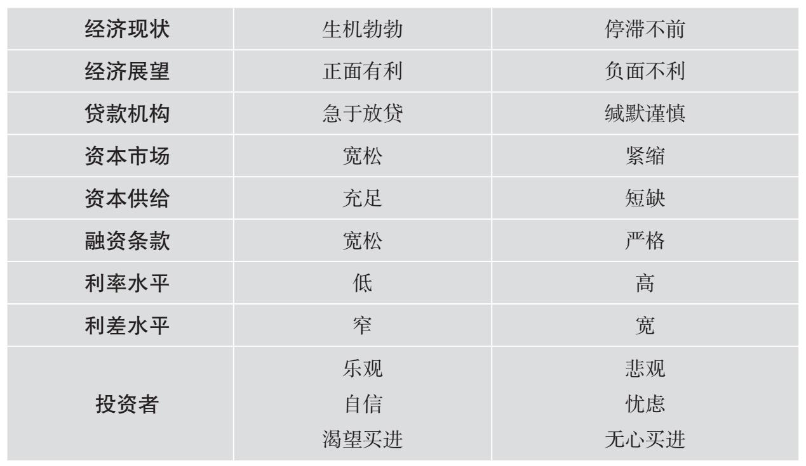
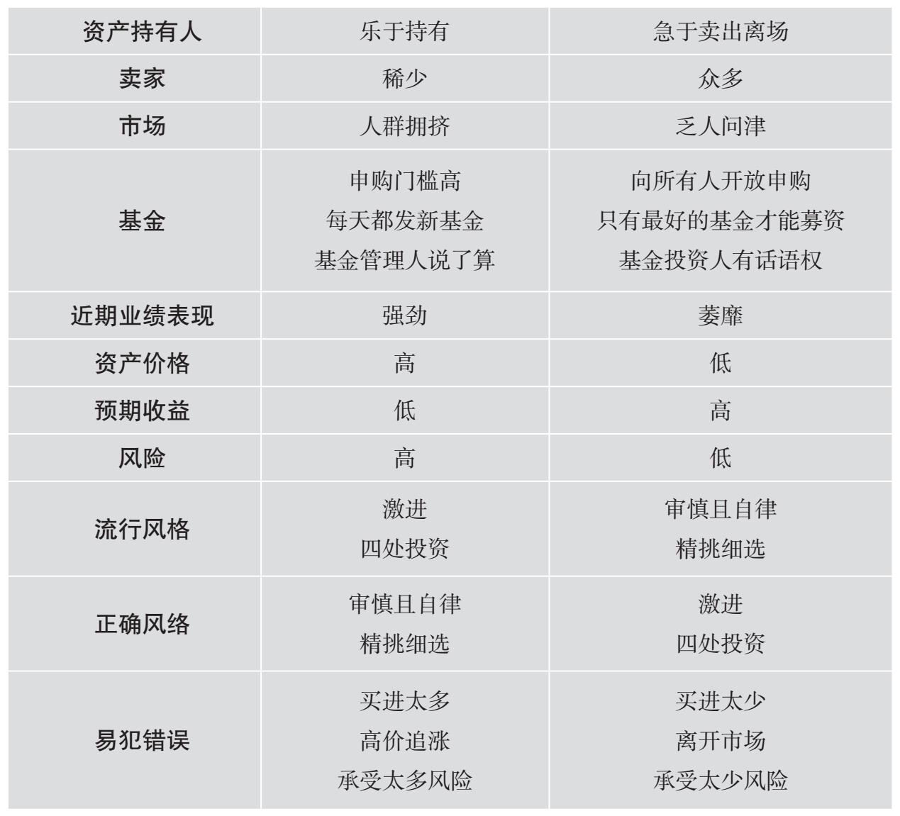
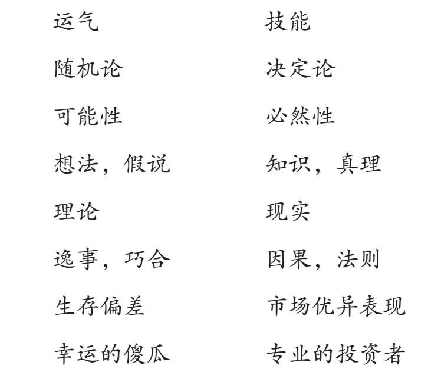

索引方式：微信读书（竖屏）

P1 封面：取得超越市场平均水平的投资业绩——必须要有“第二层次思维”。即使逆向投资也不会永远带来收益。极端价格不会天天出现，而投资者必然要在周期中非极端时间买进卖出，因此我们必须识别出不利的时机，采取谨慎的行动。

P4 推荐序1：巴菲特和本书作者霍华德·马克斯都信奉格雷厄姆的价值投资。

本书的核心可被归纳为一句话：逆向思考并逆向投资。

P7 \#\#\#刘建位总结出18件投资最重要的事\#\#\#

CH1 学习第二层次思维

P21 投资世界是二级混沌系统，大众对行情的预测会改变行情。地球的每一刻都与历史不同，每个投资事件我们都只能经历1次，没人能再造一个地球重现以往的大事件。既往结果不能被放心地复制。

P22 其实，关键问题是你想实现什么样的目标。人人都能取得平均投资表现——只需投资一个每样都买一点儿的指数基金即可。但是成功的投资者想要的更多，他们希望战胜市场。

P25 第一层次思维和第二层次思维之间的工作量有着巨大的差异，能够进行第二层思维的人数远少于能够进行第一层思维的人数。

CH2 理解市场的有效性及局限性

P32 对于有效市场假，我持保留意见，最大的分歧在于它有关收益与风险挂钩的方式

P33 某些资产是相当符合有效市场假说的，\#\#\#主要包括4个类别\#\#\#

P34 对于炒外汇，任何一个人所知道的知识不会系统性地多于其他人。对于主要股票市场，股票被错误定价及被人们发现这些错误定价的概率不大。

P36 我的结论是，市场的有效性是程度问题。我衷心感谢无效市场所提供的机会，同时我也尊重有效市场的理念，我坚信主流证券市场已经足够有效，以至于在其中寻找制胜投资基本上是浪费时间。

P37 总而言之，无效性是杰出投资的必要条件。试图战胜一个相当有效的市场就像抛硬币一样。

CH3 准确估计价值

P40 技术分析和动量投资都违背了随机漫步假说

P41 价值型投资者的目标是得出证券当前的内在价值；成长型投资者的目标则是寻找未来将迅速增值的证券。

P42 价值投资强调的是有形因素，如重资产和现金流。无形因素如人才、流行时尚及长期增长潜力所占的比重较小。某些流派的价值投资专注于硬资产。甚至有所谓的\#\#\#net-net投资\#\#\#

P45 总而言之，如果判断正确，那么成长型投资的上涨潜力更富有戏剧性，而价值投资的上涨潜力更有持续性。我选择的是价值投资法。持续性比戏剧性更重要

CH4 价格与价值的关系

P53 许多价值投资者都不擅长确认到底在何时应该卖出股票（很多人卖出过早）。不过，知道何时买进股票能够弥补因为卖出过早而导致的许多错误。

为确保价格的正确性，考察基本面价值是毫无疑问的，不过在大多数情况下，证券的价格至少还受到其他两个重要因素的影响：心理和技术（短期因素）

技术是影响证券供需的非基本面因素，也就是说，与价值无关。2个无法估计价格的情况下被迫交易的例子：杠杆交易中的强制平仓、现金流入共同基金。

P54 再没有比在崩盘期间从不顾价格必须卖出的人手中买进更好的事了。不过：

1.  强制卖家和强制买家只在罕见极端危机和泡沫时期才有，不能以此为生
2.  成为强制卖家是悲惨的，要保证自己能够在最艰难的时期坚持住不卖出

P55 基本面价值只是决定证券价格的因素之一，你还要设法利用心理和技术。

P58 总而言之，我相信从真实价值出发的投资方法是最可靠的。相比之下，指望依赖价值以外的东西（泡沫）获利，可能是最不可靠的方法。

\#\#\#思考4种可能的获利途径\#\#\#通过资产内在价值的增长获利。问题是价值的增长难以准确预测。在某些投资领域【最明显的是私募股权（买进公司）和房地产】，“主导投资者”能够通过积极管理致力于提高资产价值。

CH5 理解风险

P59 风险评估是投资过程中必不可少的要素\#\#\#三个有力的理由\#\#\#

P61 为了吸引资本，风险更高的投资必须提供更好的收益前景、更高的承诺收益或预期收益，但绝不表示这些更高的预期收益必须实现。

P64 学者们出于方便，选择了以波动性指代风险。我并不认为波动性就是大多数投资者所关心的风险，我确信风险就是损失的可能性。

P65 \#\#\#风险的5种形式\#\#\#流动性低也是风险的形式之一，它是一种无法在需要的时候以合理的价格将投资转化为现金的风险，也是一种一体化风险。

P67 务实的价值投资者相信：在以低于价值买进证券的时候，高收益、低损失概率是可以同时实现的。（博主注：可是在判断实际价值的时候有可能会犯错误）

P68 总而言之，前瞻性研究表明，多数风险都具有主观性、隐蔽性和不可量化性

P69 考虑到损失概率的定量难度，希望客观衡量风险调整后收益的投资者只能求助于夏普比率=超额收益/收益标准差。这种计算方法对于交易和定价频繁的公开市场证券是合理的，是我们现有的最好的方法。尽管夏普比率没有明确涉及损失的可能性，但是有理由相信基本面风险较高的证券，其价格波动性高于比较安全的证券。对于缺乏市场价格的私人资产——如房地产和整家公司——则没有主观风险调整的替代指标。

损失的可能性无法用回顾性方法及演绎推理法来衡量。

P73 未能将钟型分布和正态分布正确地区分，无疑是近期信贷危机的重要原因

P75 平心而论，我认为投资表现是一系列事件——地缘政治的、宏观经济的、公司层面的、技术的、心理的——与当前的投资组合相碰撞的结果。未来有多种可能性，但结果却只有一个。你得到的结果对你的投资组合可能有益，也可能有害，这可能取决于你的远见、谨慎或者运气。你的投资组合在一种情况下的表现与它在其他可能发生的“未然历史”下的表现毫不相干。

CH6 识别风险

P90 大多数投资者认为风险与否的决定因素是质量而不是价格。但是，高质量资产也可能是有风险的，低质量资产也可能是安全的。

CH7 控制风险

P91 归根结底，投资者的工作是以营利为目的聪明地承担风险。

P92 无论风险控制取得怎样的成绩，在繁荣时期是永远也表现不出来的，因为风险是隐蔽的、不可见的。我们看不到风险——发生损失的可能性，能看到的只是损失，而损失通常只在风险与负面事件相碰撞时才会发生。

CH8 关注周期

P103 我认为，牢记万物皆有周期是至关重要的。我敢肯定的东西不多，但以下这些话千真万确：周期永远胜在最后。任何东西都不可能朝同一个方向永远发展下去。很少有东西会归零。坚持以今天的事件推测未来是对投资活动最大的危害

P105 信贷周期是我最喜欢的，它具有必然性、极端波动性，也具有为适应它的投资者创造机会的能力。过程很简单：经济进入繁荣期→资金提供者增多，资本基础增加→坏消息极少，风险似乎已经减少→风险规避减少→金融机构扩大业务（提供更多的资本）→金融机构降息、降低信贷水平、为特定的交易提供更多的资本以及放宽信贷条款来争夺市场份额。

CH9 钟摆意识

P111 证券市场的情绪波动类似于钟摆的运动，投资者心理显示，他们花在端点上的时间似乎远比花在中点上的时间多。

P114 牛市有三个阶段：

1.  少数有远见的人开始相信一切会更好
2.  大多数投资者意识到进步的确已经发生
3.  人人断言一切永远会更好

P115 熊市的三个阶段

4.  少数善于思考的投资者意识到尽管形势一片大好但不可能永远称心如意
5.  大多数投资者意识到势态的恶化
6.  人人相信形势只会更糟

P117 在多数市场现象中，类似钟摆模式是明确存在的。不过，正像周期的波动一样，我们永远不会知道：钟摆摆动的幅度、令钟摆停止并回摆的原因、回摆的时机、随后朝反方向摆动的幅度。

CH10 抵御消极影响

P119 对于得到更多的渴望、担心错过的恐惧、与他人比较的倾向、群体的影响以及对胜利的期待——这些因素几乎是普遍存在的。结果就是错误——频繁的、普遍的、不断重复发生的错误。

无效性——错误定价、错误认知以及他人犯下的过错——为优异表现创造了机会。事实上，利用无效性是保持卓越的唯一方法。为使自己与他人区别开来，你应该站在那些与错误相反的一边。

CH11 逆向投资

P136 接受逆向投资概念是一回事，把它应用到实际中则是另一回事

1.  我们永远不知道市场钟摆能摆多远，也不知道逆转时会向反方向摆多远
2.  由于影响市场的各种因素的易变性，没有任何工具是完全靠得住的

逆向投资并不是一种让你永远稳赚不赔的方法。在大多数情况下，没有值得下注的过度市场。

仅仅做与大众相反的投资是不够的。考虑到各种困难，你必须在推理和分析的基础上，辨别如何脱离群体思维才能获利。不仅要知道与大众的做法相反，还知道大众错在哪里。

CH12 寻找便宜货

P144 精心构建投资组合的过程，包括卖出不那么好的投资从而留出空间买进最好的投资，不碰最差的投资。这一过程需要的素材包括：

1.  潜在投资的清单
2.  对它们内在价值的估计
3.  对其价格相对于内在价值的感知
4.  对每种投资涉及的风险及其对在建投资组合的影响的了解

举例来说，投资者会先将可能的投资范围缩小到风险可接受的限度内，因为可能会存在某些投资者不能适应的风险。比如在科技领域快速增长的板块里滞后的风险，以及某个热门消费品不再受追捧的风险，这些风险在一些投资者看来超出了他们的专业知识的范围。此外，投资者可能会发现，有些公司绝对是不可接受的，因为它们的行业太过难以预测，或它们的财务报表不够透明。

\>\> 估价过低的资产。应该到哪里去找呢？从具有下列特征的资产着手是个不错的选择：

• 鲜为人知或人们一知半解的。

• 表面上看基本面有问题的。

• 有争议、不合时宜或令人恐慌的。

• 被认为不适于“正规”投资组合的。

• 不被欣赏、不受欢迎和不受追捧的。

• 有收益不佳的追踪记录的。

• 最近有亏损问题、没有资本增益的。

保罗·约翰逊：这是一份很出色的“购物清单”。

如果提炼成一句话，那么我会说：便宜货存在的必要条件是感觉必须远不如现实。也就是说，最好的机会通常是在大多数人不愿做的事情中发掘出来的

\>\> 便宜货的价值在于其不合理的低价位——因而具有不寻常的收益——风险比值，因此它们就是投资者的圣杯。按照第2章的原则，这样的交易不应该存在于有效市场中。然而，我经历的每一件事情都在告诉我，尽管便宜货不合常规，但是人们以为的那些可以消除它们的力量往往拿它们无可奈何。

我们是积极投资者，因为我们相信我们可以通过识别好机会而击败市场。另一方面，许多摆在我们面前的“特殊交易”好到不像是真的，避开它们是取得投资成功的关键。因此，和许多事情一样，促使一个人成为积极投资者的乐观态度，以及一个人对有效市场假说的怀疑态度，二者必须保持平衡。

显然，投资者可能会因心理弱点、错误分析或拒绝进入不确定领域而犯错。这些错误为能够看到别人错误的第二层次思维者创造了便宜货

◆ 13 耐心等待机会

\>\> 与全球金融危机相关的繁荣——衰退周期，为我们提供了在2005到2007年年初以高价卖出，以及随后在2007年年底和2008年以恐慌价格买入的机遇。从许多方面来讲，这是一个千载难逢的机会，在周期中逆势而动的逆向投资者们有了展现自己能力的黄金机遇。但是在本章，我想指出的是，并不是总有伟大的事情等着我们去做，有时我们可以通过敏锐的洞察和相对消极的行动将成果最大化。耐心等待机会——等待便宜货——往往是最好的策略。

【微信读书评论】：这种等待是按年计算的，巴菲特等这次机会等了十年，被无数人嘲笑，连伯克希尔的股东都开始要教巴菲特怎么投资了，所以3月10日的访谈，巴菲特情绪特别激动，虽然看他以前的访谈，每次都说这是迄今为止最大的一次。然后持有的过程又是漫长的以年为单位来计算。

\>\> 耐心等待机会——等待便宜货——往往是最好的策略。

\>\> 等待投资机会到来而不是追逐投资机会，你会做得更好。在卖家积极卖出的东西中挑选，而不是固守想要什么才买什么的观念，你的交易往往会更为划算。

\>\> 错失制胜机会为什么会产生不良后果？要知道，投资者是普遍为金钱而竞争的，因此没人会在失去获利机会时完全无动于衷。

对于帮别人理财的专业投资者来说，其中的利害关系更为严重。如果投资经理在繁荣期错过的机会太多，得到的收益太少，他们就会承受来自客户的压力，并最终失去客户。这在很大程度上取决于对客户习惯的培养。

【点评】克里斯托弗·戴维斯：进行有效的客户管理的关键总是在于——降低他们的期待。

橡树资本管理公司一直态度鲜明地表达我们的信念：投资失败比失去一个获利机会更值得重视。因此，比起全盘获利，公司将优先考虑风险控制。

\>\> 高价会同时增加风险和降低收益。但是，问题在于我们能怎么做呢？

投资者该如何应对一个似乎只提供低收益的市场呢？我提出了几个可能性：

• 否认并进行投资。这种做法的问题在于你不会心想事成。简而言之，当被推高的资产价格表明不可能获得惯常收益的时候，做出惯常收益预期是毫无意义的。

• 径直投资——试着接受相对收益，即使绝对收益不具有吸引力。

• 径直投资——忽略短期风险，关注长期风险。这种做法不无道理，特别是当你承认市场时机难以判断、资产难以进行战术性配置的时候。但在这样做之前，我建议你先得到投资委员会或其他投资成员同意忽略短期损失的承诺。

• 持有现金——对于需要满足精算假设或花费率的人、希望自己的钱永远“被充分利用”的人，或对眼睁睁地看着别人赚钱而自己没赚钱长期感到不安（或者会丢掉工作）的人来说，这样做是有难度的。

【点评】塞思·卡拉曼：近年来，持有现金已经彻底过时了，却最终成了逆向投资者选择的投资行为。

• 就像过去几年里我一直不厌其烦重复的那样，将投资集中在“特定利基与特定人群”上。但是随着投资组合的增长，这样做的难度会越来越大。识别真正有天赋、有纪律、有耐力的投资经理当然并不容易。

事实是，当投资者面临预期收益和风险溢价不足的情况时，是没有简单答案的。但是我坚定地认为，有一种做法——一个典型误区——是错误的：攫取收益。

考虑到今天处于低风险一端的投资预期收益不足，而被大肆宣扬的解决方案位于高风险的一端，许多投资者正在将资本转向更高风险（或至少不那么传统）的投资。但是，当他们进行高风险投资的时候，恰恰是投资的预期收益达到历史最低点的时候，他们因风险递增而获得的收益增量是有史以来最低的，他们正参与到在以往预期收益更高的时候拒绝做（或做得较少）的事情中来。这可能恰恰是通过提高风险来增加收益的错误时间。你应该在别人都离场的时候，而不是在他们和你竞逐的时候承担风险。

\>\> 在低收益环境中得到较高收益，需要具备逆流而上的能力，以及找到相对较少的制胜投资的能力。

\>\> 另一方面，高收益环境所提供的高额收益机会是通过低价买进实现的，并且通常是低风险的。

\>\> 买进的绝佳机会出现在资产持有者被迫卖出的时候，在经济危机中，这样的人比比皆是。资产持有者出于以下原因，一次又一次地成为强制卖家：

• 他们管理的基金被撤销。

• 投资组合不符合投资规定，例如不满足最低信用评级或最高仓位限制。

• 因为资产价值低于与出借方在合约中约定的金额而收到追加保证金的通知。

\>\> 一般来讲，潜在卖家会在卖个好价和尽快卖掉之间做出权衡。强制卖家的妙处在于他们别无选择。他们被枪指着脑袋，必须不计价格卖出。如果你是交易的另一方，那么“不计价格”这四个字将是世界上最美妙的词汇。

如果强制卖家只有一个，那么无数买家会蜂拥而至，交易价格只会稍有下降。但是，如果混乱大规模扩散，就会同时出现大量的强制卖家，能够提供必需流动性的人则寥寥无几。

\>\> 在危机中，我们关键要做到远离强制卖出的力量，并把自己定位为买家。为达到这一标准，投资者需要做到以下几点：坚信价值，少用或不用杠杆，拥有长期资本和顽强的意志力。在逆向投资的心态和强大资产负债表的支撑下，你只有耐心地等待机会，才能在灾难中收获惊人的收益。

◆ 14 认识预测的局限性

\>\> 认识预测的局限性是我的投资方法的一个重要组成部分。

我坚定地相信了解宏观未来很难，很少人拥有可转化为投资优势的知识。不过我要补充两点：

• 对细节关注得越多，越有可能获得知识优势。通过勤奋的工作和专业的技术，我们能比旁人知道更多关于个别公司和证券的信息，但想要在对于整个市场和经济的认知上做到这一点则很难。因此，我建议大家要努力做到“知可知”。

• 我将在下一章详细论述的另一个建议是，投资者应尽量弄清自己在周期和钟摆中所处的阶段。这不会令未来变得可知，但它能帮助人们为可能的发展做好准备。

我不会试图去证明未来无法预知的观点。我们是无法证明否定句的，当然也包括这一结论。不过，我还没有碰到过永远知道宏观未来走势的人。

\>\> 【点评】保罗·约翰逊：我是这样总结这一章的：谨慎地对待你自己的预测，至于别人的预测则要更加小心！

\>\> 我在这个问题上的“研究”（我用了引号，因为我在这个领域付出的努力实在有限，此处仅将逸事当成严肃研究）主要包括：了解预测和观察预测的无效性。

\>\> 我用了《华尔街日报》上的三组半年经济调查数据来检验预测的效果。

第一，预测大体准确吗？答案显然是“否”。平均下来，6个月后及12个月后的90天国债利率、30年期债券收益率、美元兑日元汇率的预测值与实际值相差15%。6个月后的长期债券收益率的平均预测值与实际值相差96个基点（差异足够大到每1 000美元产生120美元的出入）。

第二，预测有价值吗？准确预见到市场变化的预测是最有用的。如果你预测到某种东西在今后并且永远不会发生变化，那么这样的预测不会为你赚太多的钱。准确预测到变化才有可能带来高额回报。

第三，预测来源于什么？答案很简单：预测大多由推论而来。预测的平均效率在5%以内。

第四，预测准确过吗？答案是相当肯定的。举例来说，每次在做半年预测时，都有人能够将30年期债券收益率的预测误差控制在10到20个基点内，即使利率变化很大。这样的结果比共识预测的70到130个基点的预测误差要准确得多。

第五，如果预测有时候很准——准得一塌糊涂——那么我为什么这么抵触预测呢？因为一次准确并不重要，重要的是长期都能准确。

我在1996年的备忘录中进一步列举了“提醒你应谨慎听取胜利者预测的两件事”。首先，调查发现，除了取胜的那一次外，胜利者通常预测得并不准确。其次，调查发现，胜利者的错误预测中有一半比共识预测错得还要离谱。

\>\> 有一种方法有时候是正确的，就是一直看涨或一直看跌；如果你持有一个固定观点的时间足够长，那么迟早你会是对的。即使你是一个门外汉，你也有可能因为偶尔准确地预见到别人没有预见到的东西而得到大家的赞赏。但是，这并不意味着你的预测总是有价值的……【博主注】在发达国家，一直看涨的正确率大于50%。“买入-持有”策略就是一直看涨的投资者在下赔率大于50%的赌注

对于宏观未来的预测可能偶尔准确，但并不是经常性的。仅仅知道一大堆预测里有几个准确是没用的，你必须知道哪几个是准确的。如果准确的半年预测来自不同的经济学家，那么很难相信共同预测到底有多大价值。

• 多数时候人们会根据既往经验来预测未来。

• 人们不一定是错的：未来的多数时候在很大程度上是既往的重演。

• 从这两点出发，可以得出“预测在大多数时间里是正确的”的结论：人们往往会根据既往经验做出通常准确的预测。

• 然而，根据既往经验做出的准确预测并不具备太大价值。正如预测者通常会假设未来和过去非常相似一样，市场也会这样做，从而根据既往价格延续性定价。因此，如果未来真的与过去相似，那么赚大钱是不可能的，即使是那些做出准确预测的人。

• 然而，未来每隔一段时间就会与过去大不相同。

• 此时的准确预测具有巨大价值。

• 此时也是预测最难准确的时候。

• 某些在关键时刻做出的预测能最终被证实是对的，表明准确地预测关键事件是有可能的，但同一个人持续做出准确预测是不太可能的。

• 总而言之，预测的价值很小。

\>\> 准确预测到2007—2008年危机的人至少有一部分原因是他们具有消极倾向。因此，他们很可能对2009年继续保持悲观态度。预测的整体效用不大……即使他们对过去80年里发生的某些重大金融事件的预测相当准确。

所以，关键问题不是“预测是否有时是准确的”，而是“总预测——或某个人的所有预测——是始终可行并具有价值的吗”。任何人都不应对肯定答案抱太大希望。

\>\> 保罗·约翰逊：人类愿意去进行预测（这显然是我们的天性使然），我猜想没有任何证据能够阻止大多数人去这样做。马克斯建议，**至少要保留一次自己的预测记录**。

\>\> “自信”是描述这一学派成员的关键词。相反，对“我不知道”学派来说，关键词——特别是在应对宏观未来时——是谨慎。这一学派的信徒普遍相信，未来是不可知，也是不需要知道的，正确目标是抛开对未来的预测，尽最大努力做好投资。

作为“我知道”学派的一员，你对未来侃侃而谈（说不定你还会让别人做笔记）。你可能会因为自己的观点而受到追捧，被人们奉为座上宾……特别是在股市上涨的时候。

加入“我不知道”学派的结果更加复杂。很快你就会厌倦对朋友或者陌生人说“我不知道”。不久后，亲戚们也不再追问你对于市场趋势的看法。你将永远体会不到千分之一预测成真以及被《华尔街日报》刊登照片的乐趣。另一方面，你也能避免所有的预测失误以及对未来估计过高所带来的损失。

\>\> 投资者必须回答的一个关键问题，是他们认为未来是否可以预知。认为可以掌握未来的投资者会采取武断行动：定向交易、集中仓位、杠杆持股、寄希望于未来的增长——换句话说，即行动的时候不把预测风险考虑在内。另一方面，那些认为不能掌握未来的投资者会采取截然不同的行动：多元化、对冲、极少或者不用杠杆、更强调当前价值而不是未来的增长、高度重视资本结构、通常为各种可能的结果做好准备。

第一种投资者在经济崩溃之前会做得更好，但是当崩溃发生时，第二种投资者会有更充分的准备和更多的可用资本（以及更好的心态）从最低点抄底获利。

\>\> 无论是进行脑外科手术、越洋竞赛还是投资，过高估计自己的认知或行动能力都是极度危险的。正确认识自己的可知范围——适度行动而不冒险越界——会令你获益匪浅。

◆ 15 正确认识自身

\>\> 市场周期给投资者带来了严峻的挑战，例如：

• 不可避免的市场涨跌。

• 对投资者业绩的重大影响。

• 无法预知的幅度和转折时机。

因此，我们不得不应付一股有着巨大影响但在很大程度上不可知的力量。那么，面对市场周期我们该怎么做呢？这个问题至关重要，但是显而易见的答案往往是错误的。

1.  第一种可能的答案，是我们应否认周期的不可预测性，加倍努力地预测未来，将新增资源投入战斗，并根据我们的预测结果进行投资。但是，大量的数据和经验告诉我，关于市场周期，唯一能够预测它的是它自身的必然性。此外，优异的投资结果来自对市场的更多了解。但是，真的有那么多人比大众更了解市场周期的转折时机和区间吗？我找不到令我满意的证明。
2.  第二种可能的答案，是承认未来的不可预测性，忽略市场周期。我们不再费力预测周期，而是尽力做好投资并长期持有。既然我们无法知道该何时增持或者减持，也不知道该何时更积极或者更防御，那么我们只能投资，完全忽略周期及其影响。这就是所谓的“买进并持有”法。
3.  不过，还有第三种可能的答案——在我看来最为正确的答案：为何不试着弄清我们处在周期的哪个阶段，以及这一阶段将对我们的行动产生怎样的影响？

在投资领域里……周期最可靠。基本面、心理因素、价格与收益的涨跌，提供了犯错或者从别人的错误中获利的机会。这些都是已知的事实。

我们不知道一个趋势会持续多久，不知道它何时反转，也不知道导致反转的因素以及反转的程度。但是我相信，趋势迟早都会终止。没有任何东西能够永远存在。

那么，面对周期，我们能做些什么呢？如果不能预知反转如何以及何时发生，那么我们该怎么应对呢？关于这个问题，我坚持我的意见：我们或许永远不会知道要去往哪里，但最好明白我们身在何处。也就是说，即使我们不能预测周期性波动的时间和幅度，尽力弄清楚我们处于周期的哪个阶段并采取相应的行动也是很重要的。

\>\> 如果能够成功预测钟摆的摆动并采取正确的行动该多好，但这无疑是一个不切实际的愿望。我认为以下做法更为合适：第一，当市场已经到达极端的时候，保持警惕；第二，相应地调整我们的行为；第三，最重要的是，拒绝向导致无数投资者在市场顶部或底部犯下致命错误的群体行为看齐。

\>\> 当我说现状可知（不同于未来）的时候，我并不是说这种认识是自发产生的。就像与投资相关的大多数东西一样，它需要付出努力，而它是可以实现的。以下是我认为在认识现状过程中需要注意的几个重要方面。

我们必须对现在发生的事保持警惕。哲学家桑塔耶纳说过：“忘记过去的人注定会重蹈覆辙。”同样，我相信那些不知道周遭正在发生什么的人一定会受到惩罚。

如果我们是警觉的人或是留心的人，就能够评估我们周围那些人的行为，并以此来判断我们应该做什么。

这里最关键的成分是“推断”——这是我最喜欢的一个词。每个人都能通过各种各样的媒体了解每天发生的事情，但是有多少人能够理解这些事背后所折射出来的信息：市场参与者的心理是什么样的，投资气候是怎样的，我们应该如何应对。

简单地说，我们必须努力想明白周围发生的事情的含义。当其他人无所顾忌，充满自信地激进买入时，我们应该高度谨慎。当其他人都吓得一动也不敢动，或者恐慌性地割肉卖出时，我们应该变得更加激进。

所以看看你的周围，问问你自己：投资人乐观还是悲观？媒体名嘴认为：现在的市场，投资人应该加仓买入，还是应该避开？新型的投资方案很容易被市场接受，还是被拒绝？证券发行和基金放开申购，被视为是发财的机会，还是亏钱的陷阱？信贷周期现在的阶段是资本更容易获得，还是资本更难得到？市盈率参照历史水平来看，是过高还是过低？信用利差收窄还是加大？

所有这些因素都很重要，但是它们都不需要预测。我们可以做出非常优秀的投资决策，只需要仔细观察现在的情况，并以此为基础去做决策，而并不需要猜测未来会如何。

\>\> 如果人们事后才察觉风险，那么其意义并不大。问题在于警惕与推理是否帮助人们躲过了2007—2008年市场衰退的全面冲击。

\>\> 小人物的市场评估指导：

这里有一个简单的练习，可以帮助你测量未来市场的温度。我列出了一些市场特性。从任意一对词语中选出一个你认为最能贴切地描述当前状况的词语。如果你发现你的标记大部分在左侧栏里，那么你就要像我一样，看紧自己的钱包。

表15–1 市场评估指南

《本来如此》，2006年3月27日

◆ 16 重视运气

\>\> 【点评】保罗·约翰逊：对我而言，本章的主题是这样的：学着诚实地对待你自己的成功和失败。学着认识运气在获得结果的过程中所扮演的角色。学着发现结果是怎么得来的——这与技能有关，也离不开运气。直到学会识别真正的成功源泉何在，一个人才能免于被不确定性愚弄。

\>\> 随机性（或者运气）对结果起着巨大的作用，应区别对待随机事件与非随机事件带来的结果。

因此，在评判投资结果是否具有可重复性时，我们必须考虑随机性对投资经理的表现的影响，必须考虑他们的业绩靠的是技能还是单纯的运气。

\>\> 摘录塔勒布书中的表格来总结他的观点或许是一个好办法。他在第一列里列出了一些容易被误以为是第二列的东西。

这种二分法实在太聪明了。我们都知道，在成功的时候，运气看起来像技能，巧合看起来像因果。“幸运的傻瓜”看起来像专业的投资者。

\>\> 长期来看，好的决策一定会带来投资收益。然而在短期内，当好的决策无法带来投资收益的时候，我们必须忍耐。

\>\> 第14章所描述的“我知道”学派的投资者认为预知未来是有可能的，因此他们构想出未来的样子，并在此基础上以收益最大化为目的建立投资组合，很大程度上无视其他可能性的存在。相反，“我不知道”学派采取局部最优法，把重心置于他们认为可能的情况下表现良好、在其他情况下表现不会太差的投资组合上。

“我知道”学派的投资者预测色子的走向，成功时归功于自己对未来的敏锐感觉，失败时归咎于运气不好。当他们正确时，必须要问的一个问题是：“他们真的能预见未来吗？抑或不能？”“我不知道”学派的投资者采用的是概率论法，所以他们知道投资结果在很大程度上是听天由命的，所以对投资者的赞扬或指责应有适当的限度——特别是在短期内。

“我知道”学派根据一两次掷色子的结果，迅速而肯定地将其成员划分为胜利者和失败者。“我不知道”学派知道，他们的技术应根据多次而不是一次结果（可能是一个罕见结果）来判断。因此，他们能够接受自己谨慎的局部最优法在短期内业绩平平的结果，但是他们相信，真正优秀的投资者一定是在长期有优秀的业绩。

\>\> • 我们应将时间用在从可知的行业、企业和证券中发现价值上，而不应将决策建立在对更加不可知的宏观经济和大盘表现的猜测上。

• 考虑到我们不能确切地预知未来，我们必须通过坚定持股、分析性认识持股、在时机不佳时减少买入等途径来保持我们的价值优势。

• 因为大多数结果可能会对我们不利，所以我们必须进行防御性投资。在不利结果下确保生存比在有利结果下确保收益最大化更为重要。

• 为了提高成功机会，我们必须在市场出现极端的情况下采取与群体相反的行动：在市场低迷时积极进取，在市场繁荣时小心谨慎。

• 考虑到结果的高度不确定性，我们必须以怀疑的眼光看待投资策略及其结果——无论好坏——直至它们通过大规模试验的验证。

【点评】克里斯托弗·戴维斯：这是一个非常好的总结。

与对世界不确定的认识相伴而行的其他表现为：适度尊重风险，知道未来不能预知，明白未来是呈概率分布的并相应地进行投资，坚持防御型投资，强调避免错误的重要性。在我看来，这就是有关聪明投资的一切。

【点评】乔尔·格林布拉特：对于优秀的投资者而言，时间的推进使他们有了更多的机会去演练自己的技能，长线投资回归可能造成的破坏性概率也会有所降低。

◆ 17 多元化投资

\>\> 拉莫指出，专业网球比赛是一场“赢家的游戏”，打出最多制胜球（令对手无法还击的快速而精准的击球）的选手赢得比赛。

其他人玩儿的就是“输家的游戏”了，游戏规则为输球最少的选手赢得比赛。胜利者只需在失败者击球落网或出界前连续回球即可。换句话说，决定业余网球比赛结果的，不是赢，而是输。我从拉莫的避险策略中认识到了自己的打法。

查尔斯·艾利斯进一步将拉莫的观点发扬光大，把它应用到了投资上。他认为市场是有效的，交易成本是高昂的，并由此得出结论：在主流股票市场中主动得分对投资者未必有好处。相反，投资者应该尽量避免输球。

\>\> 选择进攻还是防守，应从投资者对自我掌控能力的认识出发。在我看来，投资中包含许多投资者无法控制的因素。

\>\> 诸多条件尽在掌控，专业球员确实应该并且最好拥有得分的主动权，因为如果他们送出机会球，对手就会打出制胜球得分。相比之下，只有部分投资结果在投资者的掌握之中，投资者无须高难度击球，就可以得到不错的收益并拖垮对手。

\>\> 总而言之，即使经验丰富的投资者都可能打出失误球，击球过于主动更容易输掉比赛。因此，防守——重点在于避免错误——是每一场伟大的投资游戏的重要组成部分。

\>\> 这就是我对投资的看法。很少有人（如果有的话）能够顺应市场条件及时地改变策略。所以投资者应致力于一种方法——一种有望应对多种不同情况的方法。他们可能会抱着投资成功时多赚钱、投资失败时不赔钱的希望积极进取。他们可能会抱着形势好时不少赚、形势不好时少赔钱的希望，以防御为重。或者他们可能会平衡攻守，不再关注时机选择，而是选择出色的证券，在牛市和熊市中都赚钱。

显然，橡树资本管理公司青睐的是防御型投资。在繁荣期，我们认为只要能跟上大盘表现就好（在市场最火的时候甚至可能还会落后一点儿）。但在投资庸手都能赚大钱的繁荣期，我怀疑很多投资经理会因为表现平平而被炒。

\>\> 对你来说，得分和阻止你的对手得分，哪一个更重要？在投资中，你是去争取制胜投资，还是尽力避免致败投资？（或者更恰当的问法是：你会如何平衡二者？）欠缺考虑的行动会带来巨大的危险。

还要补充的一点是，攻守选择没有对错之分。条条大路通罗马，你的决策必须基于你的性格与学识、你对自己能力的信任程度、你所在的市场以及你为之工作的客户的特点。

投资中的进攻和防守是什么？进攻很好定义，它指的是为追求高额收益而采用积极进取策略并承担较高风险。但什么是防守呢？防御型投资者关注的不是做对，而是避免做错。

\>\> 做对和避免做错之间有没有区别？它们表面上看起来很像，但深入来看，它们所需的思维模式有很大的不同，由此带来的投资策略也有很大的不同。

防守可能听起来和避免不良结果差不多，但它没那么消极和无为。其实可以把防守视为一种追求更高收益的努力，只不过它的实现是通过避害而不是趋利，是通过持续稳健的进步而不是偶尔的灵光乍现。

防御型投资有两大要素：

1.  排除投资组合中的致败因素，最好的实现方法是：广泛而尽职地调查、提高入选标准、要求低价和高错误边际（见本章后文），不要轻易下注在没有把握的持续繁荣、乐观预测和发展上。
2.  避开衰退期，特别要避免暴露在崩溃危机下。除了前面提到的要排除投资组合中的致败投资外，防守还需要投资组合多元化、限制总风险承担并以整体安全为重。

集中化（多元化的反义词）和杠杆是进攻的表现。当它们起效时会扩大收益，反之会增加损失；积极进取策略会导致投资结果比高点更高或比低点更低。不过，如果过度使用积极进取策略，那么在形势恶化时，它们可能会危害投资生存。相反，防守能够提高你渡过难关的可能性，你会有足够长的时间来享受聪明的投资带来的最终回报。

【点评】乔尔·格林布拉特：这是多元化权衡的一个方面。你必须拥有足够强大的应变能力以应对糟糕的时期和坏运气，因此技能和策略才有机会在长线投资中获得成功。

\>\> 投资组合的安全性取决于你愿意放弃多少潜在收益。没有正确答案，只有权衡。

\>\> 选择很简单：设法通过积极进取策略将收益最大化，或者通过错误边际来建立保护。你不能在两方面同时做到极致。你会选择进攻、防守，还是兼顾（如果是兼顾，那么二者之间的比例如何）？

在获取高额收益和避免损失这两种投资方法中，我认为后者更为可靠。获利通常取决于对未来事件的正确判断，而将损失最小化只需有形资产价值已知、大众预期稳健并且资产价格较低即可。经验告诉我，后者也许更具可持续性。

必须在获利和减少风险之间——进攻和防守之间——取得平衡。在我担任投资组合经理之初，我做的是固定收益投资。收益是有限的，投资经理最大的贡献是规避损失。由于上涨是“固定”的，唯一的波动来自下跌，因此关键问题就在于避免下跌时的波动。

\>\> 另一方面，在普通股和其他更注重上涨的领域，投资仅仅规避损失是不够的，同时必须要有获利潜力。尽管固定收益投资者在很大程度上可以只进行防御型投资，但是要想超越固定收益投资——通常以追求更高收益为目的——就必须在攻守之间做出平衡。

关键是平衡。投资者除了防守外，还需要进攻，但这并不意味着他们无须重视二者的比重。投资者如果想获取更高的收益，通常就要承担更多的不确定性——更多的风险。投资者如果想得到高于债券收益的收益，他们就不可能单纯靠规避损失来达到目的。一定的进攻是需要的，随之而来的就是不确定性的提高。选择怎样的投资方式，需要谨慎而明智地做出决策。

\>\> 进攻——通过风险承担争取制胜投资——是一个高强度活动。它可能会带给你追求的收益……也可能带来失望。还要考虑其他因素：你捕鱼所在的水域的挑战性越大、潜在收益越大，越有可能吸引经验丰富的渔夫。除非你掌握的技术令你具备充分的竞争力，否则你极有可能成为牺牲者而不是胜利者。在不具备必需的竞争力的情况下，一定不要主动进攻、承担风险以及碰触有技术挑战性的领域。

除了专业技术，积极进取型投资也需要有勇气、有耐心的客户（如果你是投资经理）和可靠的资本。当形势不利时，你需要这些因素支撑你渡过难关。投资决策可能具有取得长期或平均业绩的潜力，但是如果没有这些因素的支撑，那么积极进取型投资者可能不会看到长期结果的到来。

\>\> 追求卓越表现的重点是敢于成就伟大……毫无疑问，投资者最重要、最基础的决策之一，是决定投资组合应承担多大的风险，应如何多元化、规避损失和确保不低于平均表现。为了追求更高的收益，你要做出什么程度的牺牲？

\>\> 我喜欢资金经理保持谨慎。我相信在许多情况下，避免损失和衰退比重复成功更容易，因此风险控制更有可能为长期优异表现打下坚实的基础。据我所知，最好的投资者具备以下特征：敬畏投资，要求物有所值和高错误边际，知所不知，知所不能

\>\> 【点评】霍华德·马克斯：投资委员会往往由于一个简单的原因就会表现得“制度化”，而且难以承受因看错而带来的后果。但是，盈亏底线是简单且绝对的：如果你十分抗拒犯错，那么你绝不会适应孤独——这伴随着严格意义上的成功的逆向投资。

\>\> 在投资中，几乎所有东西都是双刃剑。选择承担更高风险、以集中化代替多元化、利用杠杆放大收益都各有利弊。唯一的例外是个人技术。至于其他东西，有效就有益而无效就有害。正因如此，攻守抉择既重要又具有挑战性。

很多人将攻守抉择视为在勇往直前和故步自封之间的选择。然而，在善于思考的投资者看来，防守能取得较好的稳定收益，而进攻往往承载着过多无法实现的梦想。就我来说，我的选择是防守。

\>\> 防御型投资听起来很高深，不过我可以将它简化为：敬畏投资！担心损失的可能性。担心有自己不知道的东西。担心自己虽能做出高质量的决策，但仍会遭受厄运和突发事件的打击。敬畏投资能避免自大，令你保持警惕和大脑活跃；能令你坚持充足的安全边际，提高投资组合应对恶劣形势的能力。如果不犯错误，那么制胜投资自然会来。

◆ 18 避免错误

\>\> 在我看来，设法避免损失比争取伟大的成功更加重要。后者有时会实现，但偶尔失败可能会导致严重的后果。前者可能是我们可以更经常做的，并且更可靠……失败的结果也更容易接受。

\>\> 为了避免损失，我们需要了解并避免导致损失的错误。我会在本章中把在前面讨论过的关键问题汇总在一起，希望能够通过集中强调这些问题，帮助投资者对错误保持更高的警惕。我们以了解多种错误的存在并认清它们的样子作为出发点。

我认为错误原因主要是分析/思维性的，或心理/情感性的。前者很简单：我们收集的信息太少或不准确。或许我们采用了错误的分析过程，导致计算错误或遗漏了计算步骤。这一类错误不胜枚举，不过，本书更关注理念和心态而不是分析过程。

但是，有一种分析性错误是我想花些时间来探讨的，我称之为“想象无能”。它用来表示既想象不到所有的可能结果，又无法完全理解极端事件的结果的情况。

\>\> 有很多导致错误的心理/情感因素已经在前面的章节中探讨过了：贪婪和恐惧，自愿终止怀疑和怀疑，自负和嫉妒，通过风险承担追求高额收益，高估自己的预测能力的倾向。这些因素助长了繁荣和崩溃的发生，而大多数投资者都参与其中，采取着完全错误的行动。

另一个重要的错误——很大程度上是心理因素，但是它重要到值得单独归类——是没有正确认识到市场周期和市场的狂热，并选择了错误的方向。周期和趋势的极端不常发生，因此这不是一个常见的错误原因，但是它会导致重大错误的发生。群体心理强迫个人依从和屈服的力量几乎是不可抗拒的，也是投资者必须抵制的。这些错误同样已经在前文中讨论过了。

\>\> “想象无能”——无法提前理解结果的多样性——特别有意思，它对投资的许多方面造成影响。

如前所述，投资完全就是应对未来。为了投资，我们必须持有对未来的看法。一般来说，除了假定它会与过去十分相似之外，我们几乎别无选择。因此，很少有人会说：“过去50年的美股平均市盈率是15，我预测在未来几年它会变成10（或20）。”

因此，大多数投资者是根据既往——尤其是近期发生的事——推断未来。为什么是近期？第一，许多重要的金融现象的周期较长，意味着在下一轮周期重现之前，那些经历过极端事件的人往往已经退休或死亡。第二，正如约翰·肯尼斯·加尔布雷斯所说，金融记忆往往极其短暂。第三，所有曾经的记忆往往都会被最新的热门投资和那些轻松赚钱的承诺抹除。

大多数时候，未来确实与过去相似，因此这样的推断没有任何害处。但是在重要的转折时刻，当未来与过去不再相似的时候，推断会失效，你要么损失惨重，要么赚不到钱。

\>\> 认定“一定”会发生的事却没有发生，会令你痛苦不堪。即使你正确地理解了基本概率分布，你也不能指望事情会按照预期的方向发展。成功的投资不应过分依赖聚集分布的正常结果，而是必须考虑到离群值的存在。

\>\> 金融危机是见所未见的事件与无法承受这些事件的高风险杠杆结构相碰撞的结果。举例来说，抵押贷款衍生品的设计和分级，以房价不会出现全国性下跌的假设为前提，因为之前从来没有出现过这样的情况（或至少没有出现在近代的统计数据中）。但是接下来的房价大跌，建立在不可能出现大规模房价下跌的假设基础上的结构受到了重创。

另外，值得注意的是，某件事不可能发生的假设具有推动事件发生的潜力，因为认为事情不可能发生的人会采取高风险行动，从而导致环境发生改变。

\>\> 令我们进退维谷的难题。投资者到底应该投入多少时间和资本来避免不太可能发生的灾难？我们可以防备每一个极端结果，例如同时防备通货紧缩和恶性通货膨胀。但这样做的成本太过高昂，而且当我们的保护性举措最后被证明没有必要执行时，成本会减损投资收益……并且大部分时间里都会这样。假如再回到2008年，你也可以让你的投资组合表现良好，但那时你就只能持有国债、现金和黄金。这是一个切实可行的策略吗？也许不是。所以一般原则是，**避免错误很重要，但必须有限度（限度因人而异）**。

关于想象无能还有另一个重要方面。人人都知道资产有预期收益和风险，并且可以被预测。但很少有人了解资产的相关性。

\>\> 因此，想象无能首先是没有预测到未来可能发生的极端事件，其次是没有理解极端事件发生后的连锁后果。

\>\> 从很多方面来看，心理因素都是最令人感兴趣的导致投资错误的原因，它们可以极大地影响证券价格。当心理因素导致某些投资者持有极端观点并且无法被其他人的观点抵消时，就会导致价格过高或过低。这就是泡沫和崩溃的根源。

投资者如何在心理因素的影响下做出错误的投资？

• 屈从。

• 不知不觉地加入已被他人的屈从扭曲的市场。

• 未能利用市场的扭曲。

以上三点是同一件事吗？我不这么认为。让我们结合危害性最大的心理因素之一——贪婪——来剖析这三个错误。

当贪婪过度时，证券价格往往过高，进而造成预期收益过低，风险过高。资产代表着将会造成损失的错误……或可被利用的错误。

\>\> 前面列出的三个错误中

1.  第一个——屈从于不良影响——意味着贪婪并买进。
2.  第二个错误，也就是我们所谓的失察错误。你可能没有被贪婪诱惑，举例来说，你的401（k）计划可能以投资指数基金的方式稳定而被动地投资于股市。然而，加入（即使是不知不觉地）一个已经被他人狂热的购买行为推高的市场，将会对你造成严重影响。
3.  每一个不利影响和每一种“错误”市场，也都提供着获利而不是犯错的机会。因此，第三种形式的错误指的不是做错，而是没有做对。普通投资者能避免错误就算是万幸，而优秀投资者期待的却是从错误中获利。当贪婪导致股价过高时，大多数投资者希望不再买进甚至卖出。但是，优秀投资者可能会通过卖空而在价格下跌时获利。犯第三种形式的错误——例如，没有做空估价过高的股票是另一种不同形式的错误，即“不作为”错误，不过可能也是大多数投资者愿意接受的错误。

\>\> 如前所述，导致这些错误的心理因素是，出于“这次是不同的”的信念，投资者偶尔会乐于接受引起泡沫和崩溃的新奇理论。在牛市中，怀疑不足使得这种事情经常发生，因为投资者相信：

• 某些新发展会改变世界。

• 已经是陈规的模式（如商业周期的盛衰）将不再存在。

• 规则已经改变（如确定公司是否资信可靠及其债务是否值得持有的标准）。

• 传统价值标准不再适用（包括股票市盈率、债券收益率差或房地产资本化率）。

鉴于钟摆的摆动方式（见第9章），当投资者变得过于轻信而不再怀疑时，这些错误往往会同时发生。

\>\> 上述11个教训大部分可被归纳为一点：对你周围的不合格资金的供需关系以及人们想花掉资金的迫切程度保持警惕。我们都体会过资本不足时捉襟见肘的感觉：有价值的投资项目的销路极差，整体经济发展缓慢。这种现象被称为“信贷紧缩”。但是，相反的情况也不容忽视。目前还没有正式术语来描述这种情况，也许可以用“过多的资金追逐过少的投资”来描述。

\>\> 尽管识别和避免具体错误并不容易，但这是一个很好的时机，令我们意识到有许多错误潜伏在暗处，进而持有防御性更强的仓位。做不到这一点也是一个巨大的错误。

那么，投资者应该怎么做呢？以下是答案：

• 留意他人的轻率举动。

• 做好应对投资低迷的心理准备。

• 卖出资产，或至少卖出风险更高的资产。

• 减少杠杆。

• 筹集现金（如果你为他人投资，那就把现金还给客户）。

• 加强投资组合的防御性。

\>\> 尽管得不到优异的表现，但在衰退的市场中，人类的天性令防御型投资者及其客户因损失比别人少而得到安慰。这会产生两个重要影响。第一，令他们保持镇定，抵抗往往导致人们在低点抛售有心理压力。第二，令他们维持更好的心态与财务状况，更有能力逢低买进，在杀戮中获利。因此，他们通常在复苏期做得更好。

\>\> 常见的错误形式：

• 分析过程中的数据或计算错误导致错误估价。

• 对各种可能性及其后果估计不足。

• 贪婪、恐惧、嫉妒、自负、终止怀疑、盲从和屈服（或兼而有之）达到极致。

• 最终，风险承担或风险容忍过度。

• 价格显著偏离价值。

• 投资者没有注意到这种偏离甚或推波助澜。

理想情况下，聪明而审慎的第二层次思维者会留意分析性错误与其他投资者的失败，进而做出正确的反应。他们在过热或过冷的市场中探查估价过高或过低的资产。他们调整路线，避免犯别人犯下的错误并期待从中获利。投资错误的定义很简单：价格偏离内在价值。而发现并避免错误就没有这么简单了。

\>\> 当然，从定义来看，大多数人都会犯错误，因为如果不是因为他们行动的一致性，错误就不会存在。采取相反的行动需要逆向投资态度，而长期逆向投资会带来孤独感和错误感。

与本书中探讨的其他问题一样，如何避免错误、识别错误并采取相应的行动，是无法用规则、算法或线路图来表示的。我强调的是领悟力、灵活性、适应性以及从环境中发现线索的思维模式。

\>\> 有时投资中可能出现以下错误：

• 不买。

• 买得不够。

• 在竞争性标售时没有坚持出价。

• 持有太多现金。

• 没有使用足够的杠杆。

• 没有承担足够的风险。

这并不能代表2004年的情况。我从未听到过任何等待做心脏手术的人抱怨说“真想多上班”。同样，我认为不会有人在未来几年回过头来说：“真想在2004年多投资。”

相反，我认为2004年可能出现以下错误：

• 买入过多。

• 买入过于积极。

• 出价太高。

• 使用杠杆过多。

• 为追求高收益而承担过多风险。

有时投资错误是不作为：有些事情你该做却没有做。我认为今天的错误可能是作为：有些事情你不该做却做了。有时需要积极进取，而我认为现在需要的是谨慎。

《当今的风险与回报》，2004年10月27日

最后，重要的是要记住，除了作为（如买进）和不作为（如没有买进），还有错误并不明显的情况。当投资者心理平静、恐惧与贪婪平衡时，资产价格相对于价值可能是公允的。在这种情况下，投资者可能不需要采取紧急行动，知道这一点也很重要。不需要取巧的时候，自作聪明就会带来潜在的错误。

◆ 19 增值的意义

\>\> 增值型投资者的表现是不对称的。他们获得的市场收益率高于他们蒙受的损失率……只有依靠技术，才能保证有利环境中的收益高于不利环境中的损失。这就是我们寻找的投资不对称性。

就风险与收益来看，达到与市场一致的表现并不难，难的是比市场表现得更好：增值。这需要卓越的投资技术和深刻的洞察力。所以在这里，在本书接近尾声的时候，我们又回到了第1章，回到了拥有特殊技术的第二层次思维者身上。

本章的目的是阐明增值对于经验丰富的投资者的意义。为了达到这一目的，我要介绍两个来自投资理论的术语：一个是β系数，衡量投资组合相对市场走势的敏感度；另一个是α系数，我将它定义为个人投资技术，或是与市场走势无关的获利能力。

\>\> 市场收益是很容易实现的。一个按照股票市值比例持有构成某一特定市场指数的所有证券的被动指数基金，就能得到这样的结果。它反映出所选指数的特征——如上涨潜力、下行风险、β系数或波动、增长、昂贵或廉价、质量或差异——及其收益。它是投资的缩影，但不会增值。

于是我们可以这样说，所有股票投资者并非都从一张白纸开始，而是存在着简单模仿指数的可能性。他们可以走出去，按照市场权重被动地买进指数内的股票，在这种情况下他们的收益会和指数保持一致。或者他们可以通过积极投资而非被动投资来争取更好的表现。

主动型投资者有很多选择。首先，他们可以决定投资组合比指数更积极还是更保守，是长期坚持还是尝试选择市场时机。举例来说，如果投资者选择积极进取，他们可以通过增持指数中波动性更高的股票或者利用杠杆来提高投资组合的市场敏感度。这样做会增加投资组合的“系统性”风险，即它的β系数。（不过，理论上来说，尽管这些做法可以提高投资组合的收益，但是收益差异完全可以因系统性风险增加而得到充分的解释。因此，这样的做法不会提高投资组合的风险调整后收益。）

其次，投资者可以做出不同于指数的选择来锻炼自己的选股能力——在指数内，多买某些股票，少买或不买其他股票，然后再加上一些指数之外的股票。通过这种做法，他们可以减少投资组合对个别公司的特殊事件的暴露程度，从而避免只影响某些股票而非整个指数的价格变动。由于“非系统性”原因，他们的投资组合构成与指数构成出现分离，因此收益也出现偏差。不过从长期来看，除非投资者有远见卓识，否则这些偏差最终会被抵消，他们的风险调整后收益会与指数收益趋于一致。

在第1章中提到的悟性不高的积极型投资者比消极型投资者好不到哪儿去，不要指望他们的投资组合会有比被动型投资组合更好的表现。

\>\> 在忽略非系统性风险的前提下，β系数乘以市场收益即为特定投资组合的预期收益。如果市场上涨15%，那么β系数为1.2的投资组合的收益将是18% （加或减α系数）。

以理论分析信息后得出，收益的提高是β系数增加或系统性风险所致，且收益不会因补偿系统性风险之外的风险而提高。

\>\> 为了在市场表现良好时与市场表现保持一致，一个投资组合必须有适当的β系数和市场相关性。但是，如果在市场上涨时我们得益于β系数和市场相关性，那么它们会不会在市场下跌时伤害我们？

如果我们能持之以恒地做到在市场衰退时损失更少、在市场上涨时充分参与，那么原因只有一个：α系数或技术。

\>\> 不对称性——上涨时的收益高于下跌时的损失，并且超过单纯投资风格所致的结果——应成为每一位投资者的目标。

◆ 20 合理预期

\>\> 没有哪一种投资行为会轻易成功，除非其收益目标在绝对和相对的风险之下是明确且合理的。每一种投资的结果应该以你试图实现的目标作为开始。关键问题在于，你的收益目标是什么，你能承受多大的风险，你暂时需要多少流动资金。

\>\> 区别合理和非合理预期。除了问“这是否好得不像是真的”之外，再问一句“为什么会是我”。当销售人员在电话里向你推销一种自称可靠的生财之道时，你应该思考一下，他为什么会推荐给你而不是自己留着。同样，当一个经济学家或分析师分享给你一个“在未来肯定会发生的”观点时，你应该质疑一下，既然金融衍生工具可以被用于将正确的预测转变为巨额收益（无须投入大量资金），那么他为什么仍然在为生计奔波。

\>\> “你怎么确定你是在处于低谷时进行投资，而不是投入得太早？”发现低谷能让我们的预期变得合理。我的回答很简单：“你无法确定。”

“低谷”是一个节点——此时，某一资产的价格停止下跌并蓄势待发等候上涨。这只有通过回溯才能得以确定。

如果市场是合理的，不会出现低于实际价值的贱卖，而价格一旦过低，这时我们就可以认为是到达了低谷。但是，由于市场一直处于迭代过度的状态——价格在降至其实际价值后仍下跌不止，因此无法预测价格何时才会停止下跌。理解“便宜”绝不等于“不会大跌”是十分必要的。

我试着用一种逻辑化的方法来看待低谷。在下跌期间，有三个时机可以买进：下跌时、跌至谷底时、上涨时。我不认为我们会知道何时到达低谷，就算我们能够发现，这对于买进资产也并无太大的助益。

如果我们等到低谷已过、价格开始回升的时候，不少人会因为价格上涨而买进，这使持有者坚定了信心并且不会卖出。而资金补给不足则使买家难以大量购买资产。这时候，买家便会发现为时已晚。

它使买进行为开始降温，而这正是我们所希望看到的。好消息是，当价格下跌时，我们选择买进，而别人却以“没有必要空手接落刀”为借口不敢行动。不过，当刀如雨下的时候，最好的交易往往在此时应运而生。

伏尔泰曾经说过一句至理名言：“完美是优秀的敌人。”这对于投资领域极为适用，只有当条件达到完美时，人们才会坚持投资——例如，只在低谷时买进——这会令你错失很多机会。在投资中坚持完美往往会一无所获，我们所能期待的最佳情况是尽可能地进行大量的明智投资，在最大程度上规避糟糕的投资。

橡树资本管理公司是如何解决“应该在何时买入”这个问题的？我们会放弃追求完美，以及不会执着于确定何时到达低谷。更确切地说，如果我们认为出现了便宜货，我们就会买进。如果价格更加低廉，我们就会买得更多。要是我们投入了全部资本，我们理所应当会获益更多。

\>\> 我们绝不会这样说：“今天的价格很便宜，但是我们认为在半年内还会更加便宜，所以让我们等待观望吧。”寄希望于在低谷时买进是不切实际的。

\>\> 我鼓励你去考虑一下“足够好的收益”，认识到不值得费力去获取高收益以及没有必要去承担风险是很有意义的。

投资预期必须是合理的。背负无力承担的风险，任何投资都会让你身陷困境。在你接受所谓的天价收益——无风险、有着稳定且高于短期国债的“绝对收益”之前，你理应质疑它们能否实现，而不仅仅是为之倾倒。考虑一下：一个投资者如何运用自己的技能合理地使之成为现实，为什么你能够获得看似划算的潜在盈利机会？换言之，这些是否“好得不像是真的”？

◆ 21 最重要的事

\>\> 拥有成功的投资或成功的投资生涯的基础是价值，你必须清楚地认识到你想买进的东西的价值。价值包括很多方面，并且有多种考察方法。简单来说，它就是账面现金和有形资产价值，公司或资产产生现金流的能力，以及所有这些东西的增值潜力。

【点评】保罗·约翰逊：这一章中的所有摘要都是值得一读并牢记的。本章出色地对全书进行了扼要重述，而且值得投资者特别注意并定期重温。

为取得卓越的投资结果，你必须对价值有深刻的洞察。因此你必须学会别人不会的东西，以不同的视角看待问题，或者把问题分析得更到位——最好三者都能做到。

你必须以可靠的事实和分析为基础，建立并坚持自己的价值观。只有这样，你才能知道买进和卖出的时机。只有拥有良好的价值感，你才能培养在资产价格高涨并且人人认为价格会永远上涨的时候获利的纪律，或在危机时甚至价格日益下跌时持仓，并以低于平均价格买进的勇气。当然，为达到在这些情况下获利的目的，你对价值的估计必须准确。

价格和价值的关系是成功投资的关键。低于价值买进是最可靠的盈利途径，高于价值买进则很少奏效。

【点评】乔尔·格林布拉特：这是所有优秀投资背后的基本原则。

导致资产低于价值出售的原因是什么？买入机会存在的主要原因是对现实认识不足。高品质是显而易见的，发现便宜货则需要敏锐的洞察力。出于这个原因，投资者往往把客观优点误以为是投资机会。优秀的投资者却从未忘记，他们的目标是买得好，而不是买好的。

除了提高获利潜力之外，以低于价值的价格买进是限制风险的关键因素。买进成长型股票或参与“热门”动量市场都起不到这样的作用。

价格和价值的关系受心理和技术的影响，这是两种可以在短期内主导基本面的力量。这两个因素所致的极端价格波动提供了获利或失误的机会。为了得到前者而不是后者，你必须坚持价值的概念并应对心理和技术因素。

经济与市场周期上下波动。无论此刻它们朝向哪个方向运动，都会有大多数人相信它们会朝着这个方向永远走下去。这样的思想非常危险，因为它会扰乱市场，将价格推向极端，引发多数投资者难以承受的泡沫与恐慌。

同样，投资者的群体心理也呈现有规律的钟摆式波动——从乐观到悲观，从轻信到怀疑，从唯恐错失良机到害怕遭受损失，从急于买进到迫切卖出。钟摆的摆动导致人们高买低卖。因此，作为群体中的一员注定是一场灾难，而极端时的逆向投资则可能避免损失，取得最后的胜利。

特别值得一提的是，风险规避——适度的风险规避是理性市场必不可少的组成部分——有时过少，有时过度。投资者在这方面的心理波动是产生市场泡沫和崩溃的重要原因。

永远不要低估心理影响的力量。贪婪、恐惧、终止怀疑、盲从、嫉妒、自负以及屈从都是人类本性，它们强迫行动的力量是强大的，尤其是在它们达到极致并且为群体共有的时候。群体会影响他人，善于思考的投资者也会察觉到它们的影响。任何人都不要奢望对它们免疫和绝缘。不过，虽然我们能感知到它们的存在，但是我们绝不能屈从；相反，我们必须识别并对抗它们。理性必须战胜情感

大多数趋势——看涨与看跌——最终总会发展过度。较早意识到这一点的人会因此而获利，较晚参与进来的人则因此而受到惩罚。由此推导出我最重要的一句投资格言：“智者始而愚者终。”抵制过度的能力是罕见的，但却是大多数成功投资者所具备的重要特质。

我们不可能知道过热的市场将何时冷却，也不可能知道市场将何时止跌上涨。不过，虽然我们不知道将去向哪里，但我们应该知道自己身处何方。我们可以通过周边人的行为推知市场处在周期中的哪个阶段。当其他投资者无忧无虑时，我们应小心翼翼；当其他投资者恐慌时，我们应变得更加积极。

不过，即使逆向投资也不会永远带来收益。买进卖出的大好机会与极端价格相关，而就定义来看，极端价格是不会天天出现的。我们势必要在周期中的其他时候买进卖出，因为很少有人会满足于几年一次的操作。当局势对我们不利时，我们必须能够识别出来，并且采取更加谨慎的行动。

在价值坚挺、价格低于价值以及普遍消极心理的基础上买入，很有可能会取得最好的投资结果。然而，即使这样，在形势按照我们的预期发展之前，也可能会有很长一段时间对我们不利。“定价过低”绝不等同于“很快上涨”。这就是我的第二句重要的格言：“过于超前与犯错没有区别。”在证明我们的正确性之前，我们需要足够的耐心与毅力长期坚持我们的立场。

除了具备衡量价值的能力并且在定价适中时追求价值之外，成功的投资者还必须有正确应对风险的方法。他们必须突破学院派主张的将风险等同于波动的定义，并且理解最重要的风险是永久损失的风险。他们必须认识到，提高风险承担不是投资成功的必胜手段，他们还必须认识到，高风险投资会导致更广的结果范围和更高的损失概率。他们必须了解每项投资的损失概率，并且只在回报极为可观时承担这样的风险。

大多数投资者都简单地把注意力放在收益机会上。一些领悟力较高的人认识到理解风险和获取收益同等重要，但是极少投资者具备了解相关性——这一控制投资组合整体风险的关键因素所需的素质。由于相关性差异，具有相同绝对风险的个别投资能够以不同的形式组成不同风险级别的投资组合。大多数投资者认为多元化指的是持有许多不同的东西，很少有投资者认识到：只有投资组合中的持股能可靠地对特定环境发展产生不同的反应时，多元化才是有效的。

尽管正确的积极进取型投资能够带来令人振奋的结果——特别是在繁荣期，但它产生的收益不像防御型投资那么可靠。因此，损失少而轻是产生最好投资记录的部分原因。橡树资本管理公司多年来坚持的信条“避免致败投资，制胜投资自然会来”，其被实践证明是正确的。一个每项投资都不会产生重大损失的多元化投资组合，是投资成功的良好开端。

风险控制是防御型投资的核心。防御型投资者不仅会努力做正确的事，还特别强调不做错误的事。因为在逆境中生存与在顺境中实现收益最大化是相矛盾的，所以投资者必须取得两者之间的平衡。防御型投资者更注重前者。

错误边际是防御型投资的关键要素。尽管当未来按照预期发展时，大多数投资都会成功，但是一旦未来不按预期发展时，错误边际就能够保证结果的可接受性。投资者获得错误边际的方法有：强调当前有形而持久的价值，只在价格低于价值时买进，避免使用杠杆，多元化投资。强调这些因素会限制你在繁荣期的收益，但是在形势恶化时，它能最大限度地提高你全身而退的概率。我最喜欢的第三句投资格言：“永远不要忘记一个6英尺高的人可能淹死在平均5英尺深的小河里。”错误边际能带给你持久力，帮你度过市场低迷期。

风险控制和错误边际必须时刻在你的投资组合中有所体现。但你必须记住，它们是“隐蔽资产”。市场多数时候处于繁荣期，但是只有在衰退期——潮水退去的时候——才能凸显防御的价值。因此，在繁荣期，防御型投资者必须知道，自己的收益（尽管可能不是最高）已经取得了适当的风险保障……即使事后证明这种风险规避是不必要的。

投资成功的基本要求之一，也是最伟大的投资者的必备心理之一，是认识到我们无法预知宏观未来。很少有人（如果有的话）对未来经济、利率、市场总量有超越群体共识的看法。因此，投资者的时间最好用在获取“可知”的知识优势上：行业、公司、证券的相关信息。你对微观越关注，你越有可能比别人了解得更多

很多投资者认为自己知道经济和市场的未来走势（并采取相应的行动），实则不然。他们根据自己对未来的认识采取积极的行动，但很少能够取得理想的结果。建立在坚定但不正确的预测基础上的投资，是潜在损失的根源。

很多投资者（无论业余的还是专业的）认为，世界是有序运行的，是可以被掌握并预测的。他们往往忽视了隐藏在未来发展之下的随机性和概率分布。因此，他们将行动建立在他们对未来的唯一预期结果之上。这种做法有时候能够奏效，并为投资者赢得赞誉，但不足以带来长期而稳定的成功。无论是在经济预测还是投资管理中，都会有人是完全正确的，但一个人很少有持续正确的时候，这样的结果是没有任何价值的。最成功的投资者在大部分时间里都“接近正确”，这已经远比其他人做得更好了。

保持正确的关键在于避免经济波动、公司困境、市场震荡以及投资者轻信所带来的错误。虽然没有避免错误的必胜方法，但是毫无疑问，意识到这些潜在危险就是避免身受其害的良好开端。

无论是在衰退期限制损失的防御型投资者，还是在繁荣期争取收益的积极进取型投资者，都已经证明自己是有技术的。想要得到投资者真的是在提升价值的结论，我们必须考察他们在与自己投资风格不相符的环境下的投资表现。积极进取型投资者是否能在市场下跌时减少损失？保守型投资者能否在市场上涨时积极参与？这种不对称性就是真实技术的体现。投资者的制胜投资是否多过致败投资？制胜投资的收益是否大于致败投资的损失？繁荣期所带来的利益是否高于衰退期所带来的痛苦？长期结果是否好过单纯由投资者风格带来的结果？这些能力都是优秀投资者的标志。如果做不到这些，那么投资者可能得到的收益就是市场收益与β系数的乘积。

只有拥有非凡洞察力的投资者才能稳定而正确地预测支配未来事件的概率分布，并发现隐藏在概率分布左侧尾部的不利事件下的潜在风险补偿收益。

【点评】霍华德·马克斯：理解不确定性：上述文字极好地说明了该如何应对不确定性，即感觉到这些事情会发生，互相之间具有一定的相似性，评估价格（从该价格中获得潜在的利润）能否从当下的不确定性中向投资者提供可观的潜在回报。

这个对成功投资的要求的简单描述，建立在对各种可能收益和不良发展风险的理解基础上，捕捉到了你应该注意的要素。我把成功投资的任务托付给你，它会带给你一个富有挑战性的、激动人心且发人深省的旅程。

【点评】乔尔·格林布拉特：很好地理解价值以及如何对待价格浮动是成功投资的关键。尽管很多聪明人能够掌握价值评估的技能（特别是当他们可以遵守纪律地停留在巴菲特所谓的“能力范围内”），但绝大多数的投资者是无法适应瞬息万变的市场和个股异常波动的情况的。这也就是为什么马克斯在书中所提到的经验教训如此重要，我很高兴能够一遍又一遍地阅读本章（还有全书）——这是一本货真价实的投资经典著述。
