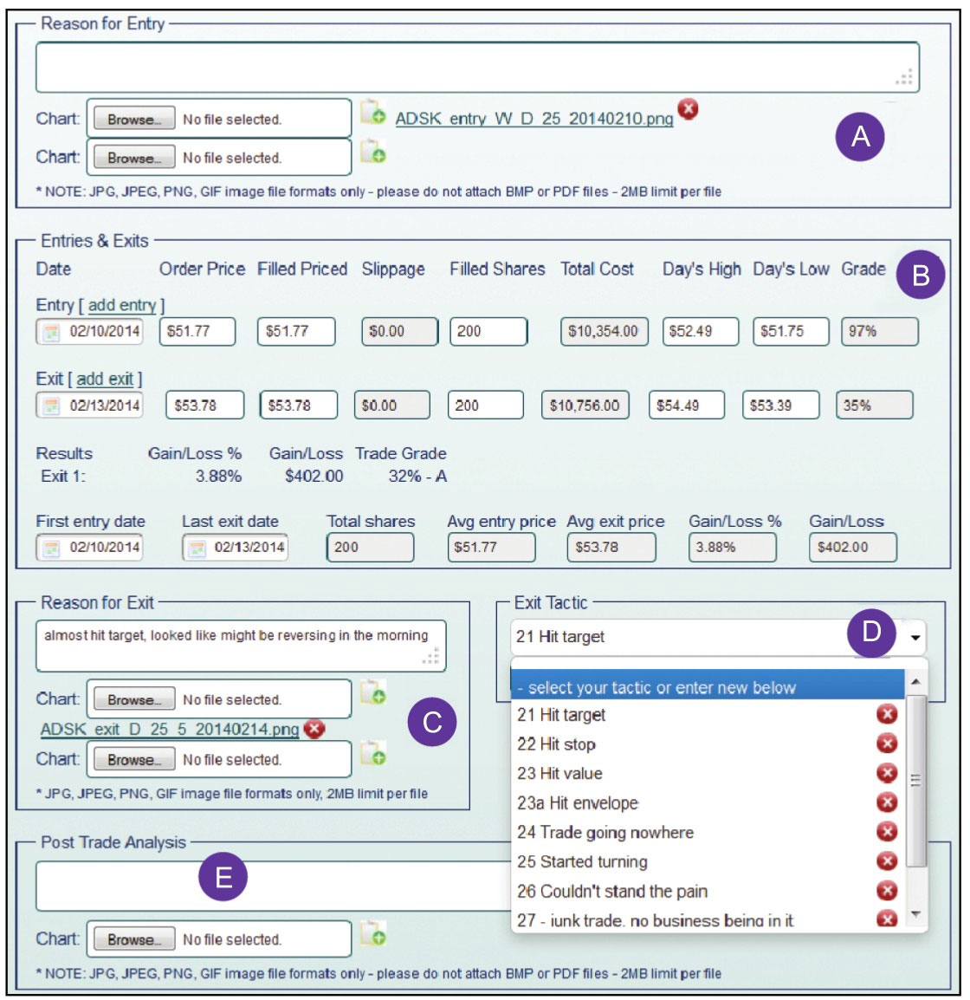

以交易为生（原书第2版）

亚历山大·埃尔德

◆ 前言

\>\> 在开始阅读此书前，请先问问自己：为了成为一位成功的交易者，你要做的最重要的一个步骤是什么？

1.  心理学很重要。
2.  技术分析也很重要。但要记住，当我们看图表时，我们仅需分析五种数据——开盘价、最高价、最低价、收盘价和成交量。在这五种数据之上，再堆加大量指标和图形只会徒增困扰。大道至简，如果你已经读过《以交易为生》第1版，你将看到我减少了技术章节的内容。
3.  由于金融市场是风险的温床，因此资金管理极为重要。
4.  心理学、交易技巧和资金管理是成功的三个支柱，但还有第四个要素将它们结合起来，那就是——“交易记录”。

◆ 1．交易——新的荒野

\>\> 交易者亏损，是因为游戏的难度，或因为无知，或因为缺乏自律.

\>\> 本书将教你如何分析市场、从事交易、控制风险和处理好自己的想法。我可以向你提供知识，只要你自己对此充满渴望。

谨记：要想享受刺激的运动，就必须遵守安全准则。只有降低风险，你才能收获更多的成就感和控制感。对交易来说同样如此.

\>\> 情绪化的交易是致命的。为了确保成功，必须实行防御性的资金管理。出色的交易者，必须像专业的潜水员小心谨慎地关注着自己的氧气供应那样，盯紧自己的资金.

◆ 2．心理是关键

\>\> 如果你的心智无法同步于市场，或忽视大众心理的变化，那你就没有盈利的机会。

\>\> 本书的内容安排

成功交易的三大支柱分别是心理、市场分析和风险管理，良好的交易记录则是把它们结合起来的关键。本书将帮助你学习这些。

第1章将介绍如何在交易中管理情绪。这是我在精神病医院执业过程中所发现的方法。它显著提升了我的交易效率，应该也可以对你有所帮助。

第2章将讨论市场的群体心理。群体行为比个体行为更原始。如果你了解群体行为，便可以避免随波逐流，反而能从市场群体的情绪波动中获利。

第3章将介绍图表形态如何反映群体行为。和调查取样类似，经典的技术分析也被运用于社会心理学中。支撑、阻力、突破和其他形态实际上都是群体行为的反映。

第4章将教你现代化的计算机技术分析方法，相比经典的图表方式，指标方式能以更好的视角反映群体心理。趋势跟随指标有助于判断市场趋势，而震荡指标可以标明趋势何时准备反转。

成交量与持仓量也可以反映群体行为。第5章将重点讨论这两个主题，以及市场如何随时间的推移而演变。群体的耐心持续时间很短，交易者若能够把握价格变动与时间的关系，将获得一定的竞争优势。

第6章将重点探讨股市的最佳分析工具。这对于股指期货和期权交易者尤其有用。

第7章将展示几种交易系统。首先介绍逐渐获得广泛使用的“三重滤网交易系统（triple screen）”，然后会对“动力交易系统（impulse system）”和“通道交易系统（channel trading system）”进行综合学习。

**第8章将讨论多种类别的交易工具。简要概述股票、期货、期权和外汇的优缺点，扫清笼罩在这些市场上的迷雾。**

第9章将讨论极其重要的资金管理主题。许多业余者往往会忽略这部分，而这却是交易成功的基本要素。即使你有一个出色的交易系统，但如果你的风险管理很薄弱，一小串连续亏损也可以摧毁你的账户。用风险管理的铁三角和其他一些工具武装起自己，你将变成一名更安全高效的交易者。

第10章将探讨交易的关键——设置止损、盈利目标和寻找入场机会。这些有实践意义的措施将协助你有效运用任何你喜欢的交易系统。

第11章将介绍好的交易记录的原则和一些模版。交易记录的质量是你成功最好的预测指标。我为你免费提供了我最喜欢的模板。

在本书的最后，有一个独立的重要的“学习指南”。它提出了100多个问题，每一个都与本书特定章节内容相关。设计这些问题是为了测试你的理解水平，发现知识盲点。当你完成各章节的阅读后，转到“学习指南”去回答相关问题，这会对你很有帮助。如果测试结果并不理想，别着急，去重读相关内容，再重新进行一次测试。

你会花很多时间来看这本书，当发现部分观点对你有用时，只有一个方法能评估它——用自己的数据去检验，亲自交易去实践.

◆ 3．你的胜算并不大

\>\> 游戏规则决定了大部分人要亏钱——交易行业的佣金和滑点正在漫无声息地消灭着交易者们。

进入或退出一笔交易都需要支付佣金。滑点是指你下达指令时的价格与你成交价格之间的差价。当你下达一个限价指令时，它将以你设定的价格或者更有利的价格成交，或者不成交。但当你急切地想入场或者退出时，下达了一个市价指令，通常成交价格会差于你下指令时看到的价格——滑点诞生。

\>\> 有两种类型的指令：限价指令和市价指令。你的滑点取决于你的选择。

限价指令是说——“以49美分的价格买入那个苹果”，它保证了价格，但不能保证成交。你不会付出超过49美分，但到最后你可能没有买到你想要的苹果。

市价指令是说——“买入那个苹果”，它保证会成交，但不保证价格一定会是49美分。当你下指令时，如果苹果价格在上升，当你按下买入按钮时，你支付的价格会比你在屏幕上看到的价格要高。这时，你便遇到了一个滑点。

市价指令的滑点随市场波动而上升，当市场开始飞奔时，滑点也会飞涨。

你对滑点会消耗多少钱有概念吗？只有一个方法可以找到答案：记录你下达市价指令时屏幕上看到的价格与你成交价格相比的价差，将价差乘以成交的股数或合约数。我几乎总是用限价指令，只有当止损时才用市价指令。

◆ 4．为什么交易

\>\> 人们因为各种理由进行交易，其中有些是理性的，但更多时候并非如此。

\>\> 交易吸引着那些愿意冒险的人，也让风险厌恶者对其敬而远之。普通人早上起床、去工作、吃饭午休、下班回家、就着啤酒吃顿晚饭、看电视，然后上床睡觉。如果他赚了点外快，就放进储蓄账户。而交易者有着自己独特的作息。将自己的资本置于风险之下后，他们放弃了按部就班的生活，离群索居，毅然跃入了未知的世界。

自我实现

许多人天生就有动力要力争做到最好，希望可以将自己的能力发挥到极限。正是这种自我实现的驱动力，以及游戏本身的乐趣和对金钱的渴望，激励着交易者们挑战市场。

优秀的交易者往往都是勤奋而精明的人，他们对新思想保持着开放的态度。好的交易者的目标非但不是赚钱，而且是做好每一笔交易。如果交易做好了，金钱自然会随之而来。成功的交易者不断地磨炼着自己的技巧以图尽其所能做到最好。

◆ 5．现实与幻觉

\>\> 将胜利者和失败者区分开来的不是智力或者秘诀，当然更不是教育。

\>\> 失败者的真正问题不在于资金多少，而在于过度交易和糟糕的资金管理。不管他的资金量多寡，如果他承担的风险太大，则不管交易系统多么完善，一段时间的错误交易总会让他亏光出局。

业余交易者既没料到自己会失败，也没准备好去管理这些失败的交易。将失败归咎于资本不足让他们有了借口去回避两个痛苦的事实：他们没有符合现实的资金管理计划，以及缺乏自律。

交易者想要在市场中生存和发展壮大，必须要控制损失。想做到这一点，你可以在每一笔交易中只用小部分本金去交易（见第9章，风险管理），从每一次小损失中吸取教训。

交易账户资金量大的一个好处是，设备费和服务费占总资本的比重更小。一个拥有100万美元的交易者花0.5万美元去上课培训，培训费只占他资本的0.5%。

\>\> 走入自动交易误区的交易者认为追求财富的过程可以通过程序自动实现。复杂的人类活动无法全部自动化。计算机学习系统无法取代老师，报税程序也尚未导致会计师失业。大部分人类活动都需要自己的判断能力，机器和电脑系统可以提供帮助但却不能取代人类。

\>\> 市场总是处在变化的过程中，不断地击败这些自动交易系统，昨天精准的策略今天就差强人意，到了明天可能就完全不起作用。合格的交易者在遇到麻烦后能迅速调整他的策略，但自动交易系统没这么强的适应能力，反而会自毁。

即使有自动巡航系统，航空公司还是会向飞行员支付高额薪水，原因是人才可以处理不可预知的事件。当客机在太平洋上被风掀掉了机顶，或者是在曼哈顿岛上空撞上了鹅群而损坏了两台发动机，只有驾驶员可以处理这种危机。

\>\> 处于苦恼中的交易者经常会向各式各样的“权威”去寻找帮助。

\>\> 在金融市场中存在着三类权威：市场周期权威、神奇方法权威、已故权威。市场周期权威总是宣称市场将要反转。神奇方法权威总在提出新的致富方法。已故权威逃脱了批评并且赢得了人们的崇拜，只是因为他们已经离开了这个世界。

\>\> 市场周期大师

数十年来，美国股票市场总是遵循着四年的周期。股票市场一般前2.5年或3年上涨然后1年或1.5年下跌。因此，每当重要的市场周期到来时，市场总会涌现出一批市场周期大师，每4年1次。这些权威的名声能持续2～3年，权威们声名远扬的时期正好与美国的每一波牛市一致。

市场周期大师对股市上涨和下跌进行预测，每次正确的预测都会增加他们的名气，然后会促使更多的人根据他们的预测去买卖股票。市场周期大师们对市场有着自己的偏好理论。这种理论——不管是周期理论、成交量理论，还是艾略特波浪理论——在走红之前都已经发展了数年时间。刚开始市场并不遵循这些鼓舞人心的大师们的拿手绝活，但市场不断变化，随后几年市场开始走向大师们的预测，这时候大师们开始声名鹊起，仿佛获得了高于市场的力量。

\>\> 神奇方法大师

市场周期大师往往产生在股票市场，而方法大师则主要在衍生品交易市场上大行其道。方法大师总是在发现一种新的分析或交易方法后异军突起。

交易者们总是在寻找一种能够胜过竞争对手的方法。就像骑士为宝剑痴迷，交易者们愿意为他们的交易工具一掷千金。只要这种方法能为他们带来源源不断的现金流，那不管多少钱都不算贵。

方法大师会向市场兜售一套新的取得利润的秘籍：速度线理论、市场周期理论、市场轮廓理论等。这些方法可能在刚开始时有效，但只要足够多的人了解了，并且在市场中运用它们，这些方法就不可避免地逐渐失效，被遗弃。市场总是能消磨掉每种方法的优势。

\>\> 已故大师

第三种市场大师是已故大师。他们的书不断再版，他们的市场理论被新一代热心的交易者仔细研究。有关敬爱的已故大师的高超技巧和其个人财富的传奇，在他们死后被不断颂扬。这些已故大师已经离我们而去，他们没法将自己的声誉资本化去赚钱了。但他们仍在世的追随者却能够用他们的名声和过期的版权继续赚钱。其中包括R. N．艾略特（R. N. Elliott），但最好的例子是W. D．江恩（W. D. Gann）。

\>\> 要战胜市场，我们必须记住交易的三大要素：良好的心态、一套合逻辑的交易系统和有效的风险管理计划。

\>\> 新手的通病是——只关注技术指标和交易系统而忽略其他要素。

你必须像分析你的交易那样分析你的心理情绪，以确保能做出正确的决定。你的交易必须建立在定义明晰的规则之上，你得学会规范资金管理，以确保在出现连续亏损后也不会被踢出局。

◆ 6．自我毁灭

\>\> 如果你是为了刺激而交易，就会出现各种严重的差错，同时承担不必要的风险。市场是无情的，情绪化的交易总会导致损失。

赌博

\>\> 赌徒分为三类：那些用赌博来消遣并能够随时停下来的正常人；以赌博为生的专业赌徒；被潜意识的需求所驱使，已经上瘾，一旦开始就难以停止的赌徒。

\>\> 交易股票、期货和期权给了赌徒们更高端、相比于赌马更体面的工作。相比于在赌马游戏中填数字，在金融市场中赌博有着更耀眼的光环，给人以高深莫测的感觉。

当交易顺心时，赌徒就很开心。一旦亏钱了，他们就感到极度失落。他们与专业交易者不同，专业交易者关注长期的计划，也不会因为任何单次交易就特别失落或兴奋。

赌博的关键标志是无法抵御想去赌的冲动。如果你觉得自己过度交易而收获无几，那就试着停止交易一个月。在这段时间里你就有机会重新审视你的交易

\>\> 自毁

\>\> 必须意识到自己的缺点，然后努力改变。坚持写交易日志——记录每次建仓和清仓的理由，寻找你成功和失败的重复模式。

\>\> 撞车大赛

所有社会成员都会为弥补自己无心犯错的后果而准备一笔保险资金。

\>\> 几乎所有的职业都会为其成员提供安全网，你的老板、同事或客户在你表现消极，有自毁倾向时，都会提醒你。但是在交易中却没有这样的安全网，所以交易比其他职业更危险。市场为自我毁灭提供了无限的机会。

\>\> 控制自我毁灭倾向

多数人终其一生反复踏进同一条错误的河流。有些心理模式会让他们在一个领域内成功，却让他们在别的领域踟蹰不前。

你得清醒地意识到自己的自我毁灭倾向。不要把自己的损失归咎于坏运气或者是其他人，你应该为最终结果负责。开始坚持记日志吧——记录你全部的交易记录，记录你为什么买入卖出，寻找成功和失败的重复模式。那些不会向历史学习的人注定会重复历史。

交易者需要心理上的安全网，就像登山运动员需要求生设备一样。我将在下面介绍匿名戒酒会的原则，它对交易者早期生涯的发展非常有用。严格的资金管理法则也很有用。最后，记日志能让你从自己的成功和失败中总结经验教训。

◆ 7．交易心理

\>\> 交易者成功或失败取决于他的心理情绪。你可能有一个出色的交易系统，但如果你有自负、恐惧或者沮丧的情绪，你的资金账户肯定要遭殃。如果你已经意识到了自己的恐惧、贪婪或赌博的情绪高涨，那么就暂停你的交易。

\>\> 成功的交易者，他们有一个突出的标志，那就是能够让自己的资金稳步增长而非大起大落。

你要学会尽量客观地遵循着资金管理法则来进行交易。列一个单子，记录你的每一笔交易，包括佣金和滑点。坚持记录你“购买前和购买后”的表格。在交易生涯的初始阶段，你得投入足够长的时间去分析自己，时间至少得和分析市场的时间一样长。

当我在学习交易的时候，我读过自己能买到的所有的交易心理学的书籍，许多作者都提供了敏锐的建议。有些人强调规则：“不能让市场左右你的判断；不要在交易时间做决定，有计划地交易或者权衡性地制订计划。”其他人则强调灵活性：“不要带着任何前提假设进入市场；当市场改变的时候，计划也要跟着变。”有些专家则强调独立——不要看商业新闻，不要看《华尔街日报》，不要听其他交易者的建议，只关注你自己和市场。其他人则建议保持思想开放，跟其他的交易者保持联系，接受新鲜的想法……每一条建议看起来都有效，但是彼此间又往往互相冲突。

我一直在阅读、交易，并持续关注着交易系统的发展及精神心理分析的实务。我从没想过这两个领域有什么联系——直到一次有了突发的灵感。我的交易理念的变化来自于精神分析学。

\>\> 改变交易的真知灼见

\>\> 精神疗法、药物治疗以及昂贵的医院或诊所能够让一个醉汉清醒过来，但要让他彻底远离酒精，却鲜有成功。大多数成瘾者很快又复发了，但如果他们能够积极参与匿名戒酒会（Alcoholics Anonymous, AA）或者其他类似的自助小组，那他们康复的概率就会高很多。

\#\#\#直接跳到第8章\#\#\#

◆ 第8章 交易工具

\>\> 主要的类别：

● 股票

● 交易所交易基金（ETF）

● 期权

● 差价合约（CFD）

● 期货

● 外汇

不管是哪一类，你需要确保所选交易工具满足两个重要的条件：流动性和波动性。

流动性指与这一类别中的其他交易品种相比的日均成交量。日均成交量越大，你进入和退出交易就越容易。在流动性不好的股票中，你或许能建立浮盈的持仓，但当你退出时，却变成亏损，因为买卖价差特别大。

\>\> 现在我只关注美国市场中日均成交量超过100万股的股票。这样我才能悄无声息、不受干扰地进入和退出市场。

\>\> 波动性是交易品种短期运动的范围。交易品种的波动性越高，交易机会就越多。受欢迎的股票往往波动性很大。许多公共事业部门公司的股票流动性很好，但因为波动性很低，而很难交易——它们常常在狭窄的价格区间里震荡。

衡量波动性的方法有许多，其中一个很实用的工具是“贝塔”（β, Beta）。它是任意交易品种的波动性与其交易基准——比如说大盘指数——的波动性之间的比值。

◆ 42．股票

\>\> 上市公司试图让他们公司的股票更具吸引力，以推高公司股价，因为这有助于他们进行股权融资或者发行债券。高管的奖金也经常会和股价联系在一起。

基本面的价值，特别是盈利，是推动股价的长期因素。

\>\> 市场里满是毫无价值的公司，有些公司盈利能力很弱，甚至没有盈利，但其股价在某些时点能对抗引力，冲破屋顶。新兴的引人注目的行业里，公司股票能依靠对未来的盈利预期，而不是真实利润，使股价高高在上。有着盈利的、运行良好的公司，如果市场对它们的前景没有信心的话，它们股票也可能一直盘整或者下跌。

沃伦·巴菲特热衷于说买入股票使你与一个狂躁抑郁的市场先生为伴。

\>\> 初学者往往同时追踪过多数量的股票。由于害怕错过机会，他们甚至会购买盘面分析软件。交易者如果没有交易好一只股票的清晰想法，那他同时去追踪许多股票，也不会有任何帮助。

\>\> 我们将在第10章“实践细节”中回到股票选择的问题。简而言之，限制你的自选股票池规模是个好主意。股票池可以很大也可以很小，这依赖于你的技巧和可支配的时间。

◆ 43．交易所交易基金（ETF）

\>\> 交易所交易基金（exchange-traded fund, ETF）是一种像股票一样交易的投资工具。有对应股票、大宗商品或者债券等不同类型的ETF，通常它们的交易价格接近其净资产水平。这些ETF设计出来是为了方便地跟踪相应指数、行业、国家、大宗商品、债券、期货或外汇市场。

\>\> 还有不喜欢ETF的理由

\>\> ETF行业一直对一个事实秘而不宣，就是实际存在两个ETF市场。一级市场仅仅对经授权的参与者开放——大型股票交易经纪商，他们和ETF发行者之间有进行大批量买卖的协议——常常以万份来计算。这些经纪商以批发的形式买入，然后以零售方式卖给你。你作为个人投资者只能坐在公共汽车的后排——也就是二级市场。

有个活跃的交易者朋友看过这章后，补充道：“我相信那些授权参与者也有权借入ETF份额进行大规模卖空。我的经纪商总是告诉我没有库存的ETF了，即使是那些很常见的ETF，我难以想象他们没有这些ETF的库存。当我问他们原因的时候，他们却守口如瓶。我好奇授权交易者的卖空交易应该如何解释。我想他们最终做的是否是配对交易（同时持有相匹配的两类资产，一个做看涨的买入交易，另一个做看跌的卖出交易，之间可以相互抵消系统性风险，获得配对资产的价差变动收益）。如果是这样，则隐瞒了增加了的抛压。

ETF的管理费用影响了投资者的收益。根据摩根士丹利的研究，在2009年，ETF整体没有跟上它们的目标指数，落后比例平均在1.25%，比2008的落后比例高了两倍。这些与目标指数之间的差异是你为要交易ETF，而不是单只股票所要承担的代价。ETF所追踪的目标指数越特殊，你所要付出的代价就越大。

一些ETF价格下跌得如此之快，它们的发现者不得不反复进行份额的折算，使价格重新回到两位数。但随着时间的推移，这些ETF终将重新跌到个位数，它们的发行者会再次进行下折，以使他们的ETF能吸引到新的上当者。

\>\> 唯一或多或少适合交易者的是，那些常见的ETF，比如标普500ETF（SPY）和纳指100ETF（QQQ）。总的来说，ETF对许多缺乏经验的个人客户有吸引力，但是普遍的估值折价和对目标资产的追踪误差，使它们的受欢迎程度在降低。记住一个重要的原则：世界上没有免费的午餐。具体到ETF则是，买者需要谨慎。

◆ 44．期权

\>\> 期权是一种衍生交易工具——一种关于某种证券，比如股票、指数或期货等的价格会在特定时间内达到特定价格的对赌。认购期权给了持有者在未来特定时间以特定价格买入特定数量证券的权力，但是否行权并非强制的。认购期权是对价格上涨的对赌。认沽期权给了持有者在未来特定时点以特定价格卖出特定数量证券的权力，但是否行权并非强制的。认沽期权买方认为未来价格会下跌。在每种期权交易中都会有两个群体：买方和卖方。买方买进期权，而卖方创造期权将它们卖给买方。

需要记住很重要的一点是，期权的买方作为一个群体，长期来说是亏钱的，除了偶尔会出现几笔幸运的交易。在交易的另一边，期权的创造者整体能获得稳定的收益，尽管偶尔有损失。

期权卖出者凭空创造出期权以满足买方的需求。

\>\> 股票、指数或者期货都只能有三种变化：上涨、下跌或者持平。当你买入认购期权，那么只有在市场上涨时你才会盈利；如果市场下跌或持平，你会输钱。有时候市场上涨了，如果价格没能在期限内达到指定价格，你也会输钱。当你买认沽期权时，只有在市场跌得足够快的时候你才会获利。期权买家只有在市场按照他所预见的方向，达到其所需要的变化速度时，才能获利；当市场虽然沿着他所预计的方向前行但速度太慢，或者保持不变，甚至朝相反的方向运动时，都会亏损。

◆ 45．价差合约（CFD）

\>\> 价差合约有几个缺陷。相对于合约的交易规模，价差合约的佣金通常比例非常高。买卖价差由合约供应商所控制，同时他们也控制着合约价格，这可能偏离标的证券的价格。换句话说，零售交易者所交易的对手是专业团队——专业团队在游戏过程中有移动门柱的能力。

◆ 46．期货

\>\> 期货是以确定时间和确定价格，交割确定数量特定商品的合约。期货合约多头和空头的权利和义务正好相反。在期权中，买方有交割的权利，但是没有交割的义务。如果你买入了认购合约或是认沽合约，你可以随时放弃离开，但是在期货中，就没有这样的奢侈了。如果市场朝不利于你的方向改变，你只能认赔出局或追加保证金。期货比期权更为严格，但期货对市场波动的反应更平滑，所以期货交易起来更为简单。期货的另一个优势是**总共只有几十个品种，更容易追踪。期货不像股票一样相互间的相关性那么高。**股票走势整体会一起波动，但是期货的走势却不相关，可以提供给人们更多的交易选择。

商品是经济大厦中不可或缺的基石。小麦是一种大宗商品，但是面包不是，因为面包里包含很多成分。老前辈们过去经常开玩笑说，商品就是把它们砸在脚上时会痛的东西——比如金子、糖、小麦、一桶原油。最近几十年里，很多金融工具开始像大宗商品一样被交易——比如股票指数、债券和外汇。期货包括金融期货和传统的商品期货。

买入股票的人会成为公司股东中的一员，但是当你买一份期货合约的时候，你没有拥有任何东西。你只是买入了一份有约束力的合约，在未来的时点要买入某种商品，它可能是一车小麦，也可能是一捆国债。而卖给你期货的人则承诺了交割的义务。你用来买股票的钱会转移到卖出股票的人手中，但是在期货市场中，你存放的保证金还在清算中心，作为担保品，确保期货到期时你会按时交割。那就是为什么过去叫它“诚实金”。在股票市场中，你会为借钱而付出利息，但是在期货市场中，你还能获取保证金的利息。

每份期货合约都有明确的规格和交割日期。大部分交易者会在交割日前平仓，以现金兑现盈亏。但是到期日仍然存在，这强制人们在到期前处理合约，让人面对现实。**在股票市场中，人们可以持有一只亏损的股票很多年，告诉自己那只是纸面上的亏损。但是在期货市场中，有交割日总是提醒着做着白日梦试图拖延亏损的人。**

大多数期货品种都有每日涨跌停限制，超过一定的价格就不再允许交易了。这些限制意在防止价格的非理性剧烈震荡，给人们时间来重新思考一下他们的头寸。连续几日涨跌停对被套住而不能离场的交易者来说压力巨大，他的账户将要血本无归。期货市场的全球化为你提供了一些紧急通道，使你能在其他地方平仓退出。就像乘飞机，登机之前，细心的交易者会先认清紧急出口在哪儿，而不是到需要的时候再去找。

**在股票市场中，大多数人都只做多，只有很少人做空。在期货市场中，与期权市场一样，多头的规模和空头的规模总是相等的**，因为如果有人买入一份开仓期货合约，必须有另外一个人对应地卖出开仓，也就是做空。如果你想交易期货，要对做空操作很顺手。

新手在期货市场的生存率很低——据说十分之九的新手在最初几个月就会被洗出局。要理解，危险的并不是期货本身，而是新手的风险管理能力欠缺。期货给成熟的交易者提供了非常好的交易机会，但是对业余交易者来说是很危险的。在你到期货市场中冒险之前，必须培养自己卓越的资金管理能力（将在第49～51节中详细讲述）。

期货和现金交易

为了比较期货交易和现金交易，我们做如下假设：当前是二月，黄金价格是1500美元每盎司，你分析认为它可能在几周内涨到1575美元。如果你有15万美元，你可以从经纪商那儿买入100盎司黄金并放入保险箱内保管。如果你的分析是正确的，几周后你持有的黄金就价值15.75万美元。此时，你可以卖掉它，扣除佣金前你赚到7500美元的利润，或者是5%的收益率——这很不错了。现在我们看一下如果在一样的情况下，买入的是期货结果会是什么样。

现在是二月，四月是下一个黄金合约的交割月。每份期货合约为100盎司黄金，目前价值为15万美元，但交易这份合约的保证金只用7500美元。换句话说，你用7500美元的保证金就可以持有价值15万美元的黄金头寸。如果你的分析是正确的，黄金价格上涨了75美元每盎司，你得到的盈利与用购买100盎司实物黄金得来的盈利差不多一样。但是现在你的投资收益率是100%，而不是5%，因为你使用的保证金仅有7500美元。

很多人在看到这组数字后，会有贪婪的冲动，而去成倍地买入合约。账户中有15万美元的交易者可以买到20份合约，如果在每份合约上他都可以赚一倍的钱，那么买入20份合约同样可以赚一倍的钱。如果这样重复两三次，他很快会变成百万富翁。

太棒了——但是这里面有一个陷阱。

市场很少以一条直线的方式运行。你的分析可能很正确，黄金在几周内从1500美元每盎司涨到1575美元每盎司，但是在这个过程中间曾下探到1450美元是完全可能的。如果你是买的实物黄金，50美元每盎司的下跌会造成总计5000美元的账面损失——不太愉快但还不是悲剧。但是对买了很多份期货合约的交易者来说，每份合约的保证金是7500美元，50美元的下跌保证金就亏光了，意味着出局了。经纪商会让他追加保证金，如果没有任何储备资金，经纪商会替他强行平仓。

没有经验的交易者总是一次买入太多的合约，市场小的波动就会立刻使他们出局。他们的分析可能是正确的——黄金可能上涨到了目标价位——但是新手因为买入太多合约，没有回旋的余地，所以注定失败。并不是期货打败了交易者，是拙劣的资金管理能力击败了期货交易者。

对于有很强资金管理能力的交易者，期货是非常有吸引力的。高收益率需要铁一般的纪律。新手炒变化更慢的股票会更好一些。一旦成为成熟的交易者，你观察期货会更加清晰。另外，读一些介绍性的书，比如乔治·安杰尔（George Angell）的《期货市场取胜之道》（Winning in the Futures Market）就是一本很好的书，其他的还有特维莱斯（Teweles）和琼斯（Jones）的《期货交易实用指南》（The Futures Game）。

\>\> **套期保值**

**期货市场有一种重要的经济功能：商业生产者和消费者可以利用它对冲商品的价格风险**，给予他们一种竞争优势。同时，期货还为投资者提供了品种比任何赌场都更丰富的赌博圣地。

**套期保值是持有与其商品现货头寸相反方向的期货头寸。**例如，大糖果厂商就能预测未来几个月需要多少糖。在糖的价格合适时，他可以在纽约或伦敦的期货市场买入相应数量的糖期货。在未来的几个月，他们需要的糖，通过持有糖期货的方式套期保值了，当他们需要进货的时候就卖掉相同数量的期货合约。

如果糖的价格上涨了，糖果厂买入原材料需要支付更高价格，但是他们持有的期货头寸的盈利大致抵消了现货的损失。如果糖的价格下跌了，他们在期货合约上是赔钱的，但买入原材料的成本下降了。而那些没有进行套期保值的竞争对手正在经历着风险。如果价格下降了，他们会买到便宜货，得到一笔意外之财，但是如果价格上升了，他们就亏惨了。进行套期保值的消费者可以集中注意力于他们的核心业务，不用受到未来价格波动的干扰。比如航空公司提前几年就可以知道未来需要多少航空燃油，买入期货合约可以保护他们免受燃油价格波动的影响，而**原油价格暴涨暴跌是很常见的**。

商品生产者同样可以从套期保值中获利。农业生产者可以在价格足以保证获利的时候，提前出售他们的小麦、咖啡和棉花。他们可以卖空足够的期货合约来覆盖他们预期的产量。从这点上来说，他们没有价格风险。如果价格下跌了，他们会通过期货市场的盈利来弥补现货市场的损失。如果价格上涨了，他们在期货市场的头寸会有所损失，但是在更高的价格上卖出真实的商品又把损失弥补回来了。

**套期保值消除了未来要买入或卖出商品的价格风险。可以让商人把精力放在他们的核心生意上，提供稳定的销售价格，获得长期的竞争优势。**

**套期保值者放弃了发横财的机会，但是也避免了价格波动的影响。**商业领域中存活着的企业更看重稳定。这就是为什么全球商品市场中埃克森、可口可乐和纳贝斯克（Nabisco）等都是商品期货市场的重要参与者。套期保值者都是顶尖的业内人士，好的套期保值部门不只是买了一份价格保险，同时还是一个利润中心。

**套期保值者把价格风险转移给了进入市场的投机者，这些投机者被潜在的利润所吸引。**有讽刺意味的是，有内部信息优势的套期保值者竟然对价格没有信心，而大众中的激进的门外汉会投大量的钱到期货中赌价格的变化。

最大的两个投机者群体是农民和工程师。农民是因为生产商品，而工程师则喜欢将科学方法运用到期货博弈中。很多农民最初进入期货市场是作为套期保值者，但是后来开始捕捉市场错误和投机。我总是会被有多少农民去交易股指期货所震惊。如果他们是交易玉米、牛或者大豆这些品种，与城市里的滑头交易者相比，他们对基本面认识的优势是存在的。但是在标普500指数上他们有什么优势呢？

供给、需求和季节性

**在期货市场中主要的牛市和熊市都是由供需驱动的。供给推动的市场倾向于更快更剧烈，而需求推动的市场倾向于更温和更慢。**为什么呢？想一下任意一种商品，比如说生长在非洲和南美的咖啡。

**需求的改变是由人们的习性改变驱动的，通常很慢。**咖啡的需求上涨是因为饮用咖啡更加流行了，每间酒吧里都有一台浓缩咖啡机。也可能因为饮用咖啡不流行了而出现需求减少，原因是经济不景气或是追求健康成为时尚。需求推动市场变化的节奏是很温和的。

现在想象一下某个主要的咖啡生产地受到了台风或是寒流的袭击，忽然全世界的咖啡供应量将减少10%，价格飞速上涨，人们的一些消费需求因为价格上涨而削减了。想象下一次新的OPEC会议达成大幅度削减原油供应的政策，某个重要的铜生产国发生大罢工。当一种商品的供应被减少或传言要减少时，它的价格会飙升，紧张的资源将重新分配给那些负担得起的人。

因为干旱、洪水和病虫害等威胁供给，粮食价格往往在春夏播种和生长季节期间大幅上涨。**交易者常说，在收获前农民有三次机会可能失去他的作物。一旦收获完成，供给就是已知的，需求则变成了价格的驱动力。需求驱动的市场运行通道更窄，所以盈利目标和风险都更小。**随着季节的变化，价格运行通道需要重新绘制，交易策略也必须相应调整。交易新手可能常常会觉得奇怪，为什么他的交易工具不起作用了。聪明的交易者则拿出一套适合于新季节的交易工具，并把旧工具收起来，等明年再用，就像他更换车子的普通轮胎和雪地轮胎一样。

**期货交易者必须了解他正在交易的市场的关键供需影响因素。**例如，在农产品关键的生长和收获月份，他必须保持对天气的关注。在期货市场中，趋势交易者倾向于寻找供应驱动的市场，然而波段交易者则在需求驱动的市场中也可以做得很好。

大多数大宗商品在不同季节之间波动。在美国，冰冻季节是燃料油期货的牛市。在佛罗里达州的霜冻季节，橙汁期货曾经有过疯狂的上涨，但由于在南半球的巴西柑橘产量的增加，现在它已经变得更加沉静了。季节性交易利用这种波动的优势，但你必须要小心，因为这些周期都很少完全相同。一定要通过技术分析审核你的季节性交易。

地板和天花板

**与股票不同，商品交易很少低于一定的价格低点（地板）或高于一定的价格高点（天花板）。地板价取决于商品生产成本。**不管是黄金还是糖，当一种商品价格低于该水平，矿工就会停止挖掘，农民就会停止播种。一些第三世界国家政府，渴望获得美元，同时想要避免社会动荡，可能会补贴生产，支付给当地人贬值的本国货币，而到世界市场上去倾销他们的产品。不过，只要有足够多的生产者停止生产并退出，供应将会萎缩，价格将会上涨，新的供应商便会被吸引进来。如果你看一下大部分商品20年的图，你会发现很多年以来，地板价都在相同的价格区域。

**天花板取决于替代品的成本。**如果一种商品的价格上涨了，消费者便会转向其他替代商品。如果重要的动物饲料（如豆粕）变得太贵了，需求将会转向鱼粉；如果糖变得太贵了，需求就会转向玉米甜味剂。

**为什么很少有人在地板价或天花板价的水平上进行交易呢？他们为什么不在靠近地板价的位置买入和在天花板价附近卖出，就像钓取水桶里的鱼一样轻松获利呢？首先，无论是地板价还是天花板价都不是石板一块那么稳定，市场可能短期内违背它。更重要的是，人性与这些交易是相冲突的。大部分投机者都没有勇气在市场上近乎沸腾屡创新高的地方卖出，或者在市场已经崩溃后的位置买入。**

升水、反转和价差

\>\> 所有的期货市场针对不同的交割月份提供了几种不同的合约。例如，你可以买入或卖出交割月份在今年9月或12月、明年3月等的小麦合约。**正常来说，近月合约比远月合约价格要便宜，这种关系叫作升水。**

**远月合约价格更高，体现了“持仓成本”——融资、存储和商品保险等成本。交割月份之间的这种差异称为溢价，套期保值者会密切关注它们。当供给收紧或需求增加时，人们开始买入近月合约，远月合约的溢价萎缩。有时近月合约变得比远月合约更加昂贵，市场反转了！出现了真正的短缺，人们愿意付出额外的钱以更快地拿到想要的商品。这种“反转”是商品市场出现牛市的最强烈标志之一。**

当你寻找反转的时候，请记住，有一个市场其升水反转结构是常态的，那就是利率期货。因为那些持有资金头寸的人在持续收息，而不是支付财务和仓储费用。

**专业人士不会等待反转出现——他们监测溢价的缩小或扩大。好的投机者能对最新的价格脱口而出，而场内交易商能告诉你最新的溢价。精明的交易者对不同交割月份之间的正常价差了然于心。**

**套期保值者是市场的主要空头力量，大多数投机者则是永远的多头，但场内交易者喜欢交易差价。差价交易表示在市场中买入某月合约的同时卖出其他月合约，也可以是做多一个品种的同时做空另一个相关品种。**

如果另一重要的动物饲料（如玉米）价格上升的速度比小麦要快，在某些时候牧场主将转而使用小麦，以代替玉米。他们将减少购买玉米，同时购买更多的小麦，把它们的价差拉回正常水平。差价交易者赌价格背离的回归，依靠价格恢复正常来获利。在前面那种情况下，差价交易者会做空玉米同时做多小麦，而不是在其中任何一个品种上直接进行方向性交易。

**差价交易比方向性交易更安全，并且保证金要求较低。业余者不懂差价，并对这些可靠的、但变化缓慢的交易兴趣不大。我找不到关于价差的书可以推荐，这说明专业人士开拓了这一领域并且把业余人士排除在了门外头。这是市场中为数不多的有利可图的领域之一，在这里专业人士可以获得很高的回报，但是没有人把它写成书传递出来。**

交易者持仓报告（COT）

经纪商向商品期货交易委员会（Commodity Futures Trading Commision）报告他们客户的持仓情况，而商品期货交易委员会不公布个体的数据，只向公众发布汇总的数据。他们的交易者持仓报告是期货市场上了解聪明资金在如何运作的重要信息来源。

交易者持仓报告能揭示三类交易者的头寸：套期保值者、大交易商和小交易商。套期保值者将他们的身份向其经纪商报告，这可以给自身带来一些优势，比如较低的保证金。大交易商指的是那些持有合约的数量超过政府设定的标准的交易者。除了上述两种之外的交易者是小交易商。

过去大交易商常常被认为是聪明的钱。但现在市场已经比过去大多了，报告要求的下限提高，而且大交易商更多是商品基金，他们中的大部分并不比作坊式运作的交易商聪明。现在聪明的钱是套期保值者，但是弄清楚他们的持仓并不像看上去的那样容易。

例如，交易者持仓报告可能显示，在某个市场中套期保值者持有市场70%的空头头寸。菜鸟可能会以为熊市来了而彻底离场，但他不了解正常的套期保值者会持有这个市场90%的空头头寸，70%的空头头寸意味着在经历非常疯狂的牛市。专业分析师分析交易者持仓报告时，会将现在的持仓和过去的正常水平进行对比，来寻找套期保值者（或者叫聪明的钱）与小交易商（多数是投机者）在相互死拼对方的时机。如果你在市场上发现聪明的钱完全压在一方，而小的投机者聚集在另一方，那么你可以利用技术分析来找到进入套期保值者那方的通道。

保证金和风险控制

期货的低保证金要求使得它们比股票回报更高，同时风险也更大。在美国，当你购买股票的时候，即便经纪商给你提供保证金贷款，你自有资金也至少要达到股票价值的一半。如果你股票账户上有4万美元，那么你最多可以买市值8万美元的股票，这是极限了。这个保证金限制条款是1929年股市崩盘后开始实行的。当时明显是由于过低的保证金导致过度的投机，最终导致严重的萧条。1929年以前，投机者可以用10%的保证金买股票——这造就了大牛市，但是当股价下跌时的强制平仓也使得市场在熊市中更加低迷。

期货市场上3%～5%的保证金比例是很常见的，这样交易者可以用少量的钱进行巨大的赌博。在瘦肉猪期货或者股指期货市场上，你可以用账户里的4万美元撬动百万美元的标的资产。

举个例子，如果金价是1500美元每盎司，你用7500美元的保证金买下100份合约，那么当价格变动达到75美元时，你就可以获得100%的收益。一个菜鸟看到这些数字惊叫“我早干吗去了”。他认为他找到了一条通向财富的光明道路。但是，这里还存在一个问题。在市场价格上升75美元之前，它可能先下跌50美元。这个不是很起眼的短暂的下跌将会触发追加保证金的要求，导致小的投机者账户爆仓，不管最终他的判断是否是正确的。

低门槛的保证金标准吸引着上瘾者，让他们的财富瞬间化为乌有。只有当你能严格遵循资金管理原则，而不会变得疯狂不理智时，期货交易才是适合的交易。专业投资者先投入少量的初始头寸，当交易朝着有利于他们的方向变动时再渐渐增加仓位。他们会逐步增加合约数量，并在盈亏平衡线之上设置止损位。

当你开始对期货感兴趣的时候，建议首先涉足那些你了解其中一些基本面的品种。比如你是畜牧养殖员、建筑工人或贷款人员，那么相应去做牛、木材或利率期货是较理性的。如果你没有特别的兴趣爱好，那些相对便宜的期货市场是较好的起点。在美国，玉米、糖和平缓时期的铜等品种对初学者来说是比较好的市场。它们流动性好，波动性大而且单价不是很贵。

我们在第9章（风险管理），将再讲到期货市场。你将学到期货合约是否适合交易取决于标的资产的价格、波动性和你账户里的资金规模。

账户较小的期货交易者有时交易迷你合约。例如，一份黄金期货的标准合约代表100盎司黄金，但是迷你合约只代表20盎司。迷你合约的交易时间与标准合约相同，迷你合约基本上跟随标准合约的价格走势。其佣金也与标准合约类似，所以相对来说从每次交易中提取佣金的比例更高。由于它们的成交量比较小，它们的滑动价差通常会更大。有一个例外是股指期货，迷你合约比标准合约成交量更大。

◆ 47．外汇

\>\> 外汇市场上除了进出口商的套期保值需求外，大部分交易都是投机的。

◆ 第9章 风险管理

\>\> 好的交易系统在一段时间内实现的盈利比亏损要多，但即使是设计最细致的交易系统也不能保证每次交易都成功。没有交易系统可以确保从不遭受亏损，甚至要避免出现一系列连续亏损都很难。

◆ 48．情绪与概率

\>\> 金钱能激发强烈的情绪。赚钱或者赔钱产生的情绪会影响我们的交易。

急切下单的新手可能会因兴奋而眩晕。但他很快就会发现市场提供的这种乐趣代价十分昂贵。我在事业之初，曾听一位专业的交易者说：“成功的交易应该是有些无聊的。”他每天都花费很长的时间做功课，筛选市场数据，计算风险，坚持记录。这些耗时的任务并不有趣——但他的成功正是建立在这些枯燥乏味的工作之上的。新手和赌徒们觉得很好玩，但结果是以损失为代价。

另一种错误是反复盘算持仓头寸中的盈亏。新手幻想着持仓浮盈可以买到什么，或者比较持仓浮亏和自己的工资，就吓傻了。反复想钱的问题，干扰了我们及时去做决定。专业的交易者总是集中精力管理交易，他们只有在平掉头寸之后才会去关注账户中的资金。

交易者在持有头寸时去计算浮盈，就像是律师在审讯之中就开始盘算着用酬金买什么好一样。

\>\> 专业的交易者不会在持仓过程中计算得失。他们只是在账期末——比如说月末，才会去统计盈亏情况。

\>\> 把精力集中在管理交易上，钱随后自然会来。

另一个关键点是：专业人士不会因为单次交易的成败而生气。在市场中有太多的随机成分。交易中我们可能每个步骤都是对的——但是仍然可能会以失败告终。

\>\> 交易对智力的需求比较适度，但是它对情绪的需求是巨大的。

◆ 49．风险控制的两条主要原则

\>\> 即使是最周全的交易计划也有可能会出差错，因为市场有随机性。即使是最好的分析和最清晰的交易结构也不能完全避免事故的发生。你唯一能控制的只有风险。

\>\> 资金管理的两大支柱是2%原则和6%原则，2%原则可以帮助躲避市场鲨鱼式的攻击，6%原则可躲避市场食人鱼式的攻击。

\#\#\#剩余内容有关止损，跳过\#\#\#

◆ 第10章 实践细节

\>\> 每种方法都可能赚钱，也可能赔钱。你应该选择那些吸引你、让你很舒服、适合你能力和气质的交易方法。没有一种交易方法是适合所有人的，就像没有一种运动是适合所有人的一样。

要想成功地交易，先要选定一种交易模式。在进行行情数据扫描之前，你应该十分清楚你想要找到什么。开发你的系统，并通过一些小交易先测试一下，确定你可以遵守交易纪律。你必须确定在你看到设计好的交易信号出现时，会按计划交易。

不同的交易风格需要不同的入场技术、不同的设定止损线和确定盈利目标的方法，以及不同的扫描行情数据的方法。但是，有几条关键的原则是适用于所有交易系统的。

◆ 53．怎样设定盈利目标：“足够”是关键词

\>\> 在每次交易时，记下你的入场价格、盈利目标和止损线，以便比较你的风险和收益。盈利的潜力应该至少是风险的两倍。

\>\> 在交易事业的早期，我从来不考虑盈利目标。如果有人问起来，我会回答我不想限定盈利的潜力。今天，我肯定会嘲笑这种答案。

\>\> 当计算交易者的盈利潜力时，我们陷入了一个悖论之中——你的预期持有时间越长，盈利潜力越大。在一个月内，股票上涨幅度肯定能比一周多。但另一方面，你持有的时间越长，不确定性越大。对短期价格变化来说，技术分析很可靠，但是长期内可能会出现很多重大失误。

在以前关于选择交易时间长度的章节中，我们检验了三种主要的选项。长线交易或者说投资，持有期是以月来衡量的，有时甚至是年。波段交易可能就几天，有时可能是几周。日内交易是以分钟来计算的，甚至很少用到小时。

移动平均线和通道线可以帮助我们设定波段交易的盈利目标。

\>\> “堕落天使”（fallen angels）是一款用来寻找投资机会的扫描程序。它能找出那些从最高价位下跌了超过90%，不再进一步下跌，反而慢慢开始上涨的股票。一只跌去了90%价值的股票有很多理由继续下跌，但是如果它选择了上涨，可能意味着它就要开始反转了。

寻找“堕落天使”的最好时机是当熊市开始显示出底部信号时。此时，很多股票在熊市攻击中存活下来，并开始从底部慢慢恢复。

◆ 54．怎样设定止损线：不要异想天开

\>\> 在我之前写的《以交易为生Ⅱ：卖出的艺术》一书中，我用了很长的一章讲解设定不同形式止损线的复杂之处。此处我不再重复自己已经说过的，而是做一个精练的归纳。

\>\> 不要把止损位设在太明显的位置，也就是图上谁都能看出来的位置。设止损位时要比显眼的位置更近或更远一点——要与集中的群体保持距离，因为你并不想做一个平庸的交易者。

同样的道理，不要把止损位设在整数价格上。如果你是在80美元买入的，不要把止损位设在78美元，而应该设在77.94美元。如果做日内交易时，你的入场价格是25.60美元，不要把止损位设在25.25美元，可以移到25.22美元，甚至是22.19美元。整数价位会吸引很多人——把你的止损位设在稍远一些的位置，先让其他人承受第一次价格下跌触发止损线的冲击，可能你的止损线就不会被触及。

◆ 55．这是A级交易吗

\>\> 我把“这是一笔A级交易吗？”这个问题加入到了我的“交易准则”之中——我们将在下一章中讨论相关的交易管理表格。无论什么时候我发现有潜力的交易机会，我都会问自己这个问题，如果答案为“是”，我再开始计算风险水平、头寸规模，谋划买入价位。但如果答案为“不是”，我就会翻过这一页，继续寻找下一个交易机会。

\>\> 接下来的小节，是关于交易计划的部分，你将会看到怎样使用我命名为“交易单”的表格，以更客观的方式做交易决定。每笔交易都有一系列参数，在交易正激烈的时候，很容易就忽视掉其中一些参数。就像飞行员需要飞行前的例行检查清单一样，交易者在决定下单前也需要检查一下他的清单。

◆ 56．仔细搜寻可能的交易

\>\> 从开发一套你信任的交易系统开始，一旦你有了交易系统，搜寻交易机会就变得很有逻辑性，并且很明确。

◆ 第11章 保持良好的记录习惯

\>\> 市场在分发奖惩方面并不始终一致。这样的情况时有发生，比如一笔缺乏计划的交易赚钱了，而一个计划周密、执行认真的交易却亏钱了。这种随机性使我们颠覆了本应遵守的原则，鼓励草率地进行交易。

好的记录交易日志的习惯是培养和坚持纪律性的最好工具。它将心理、市场分析、风险管理联系到了一起。

\>\> 记录下你的交易计划可以确保你不会错过任何一个重要的市场影响因素。记录交易日志的习惯将帮助你避免掉入冲动交易的陷阱。

\>\> 我们都会犯错误，但是如果你能坚持复习自己的交易日志，并且反思过去的错误，你不太可能会重蹈覆辙。好的交易日志记录习惯能让你成为自己的老师，并让你的账户净值出现奇迹。

快速浏览一篇文章不会使你变成一个有纪律性的交易者。你必须投入时间来完成功课，接受止损的痛苦，先有付出才能有收获。随着你账户的增长，你会体会到成就带来的无与伦比的快感。

让我们来回顾一下交易日志的三个核心要素：

（1）纪律的第一步是完成功课（我会提供一份功课进度表的模板）。

（2）纪律的进阶是写下你的交易计划。

（3）纪律的高潮是执行这些计划并且完成交易日志（我会提供一个在线交易日志的链接）。

对于这些提供的文件请按自己的喜好来使用。市场是庞大而多样化的，并不存在所谓“万能”的分析、交易以及交易日志系统。基本的原则都在这本书中，但怎样理解它们是因人而异的。

◆ 57．每日功课

\>\> 每天早上，我都会花30秒来做一个自我心理测试，来客观评价自己的交易备战状态。

◆ 58．制作并评价交易计划

\>\> 任何交易计划都要依据所采用的策略量身定做。交易计划必须能提示你检查财报期、分红派息日期，以及期货交割日期，使你避免被可预见的新闻所侵袭。它必须清楚地记录你计划好的买入价、目标价、止损价以及交易规模。

把交易计划写下来能让其变得真实。一旦你进入了一笔交易，并且你的股票开始出现波动，你可能会感到紧张，而忘了去执行特定的操作。在进入交易之前，先写下计划能帮你在风暴中建立一个理智和稳定的堡垒，它能帮助你不会忽略任何必要的事情。

真正好的计划要有能衡量其质量的标准。我们将在后面章节探讨这种标准，操作起来花费不超过一分钟，但却能鼓励你只去实施那些有更大成功可能性的计划。它会提示你放弃那些成功概念较小的计划，不去追逐不靠谱的交易想法。

\>\> 我有两种交易单对应所有交易系统，一种对应买入，另一种对应卖空。这里我们来看看其中一个我最偏好的策略的交易单。你可以借鉴它作为设计自己交易单的基础。

无论何时，当一笔潜在交易吸引了我的注意时，我首先会判断它适合哪种交易系统，然后找到对应的交易单。这时，如果是一笔看起来非常诱人的交易机会，但我没有任何交易系统能与之匹配，那么我不会进行这笔交易。决定好交易系统之后，我写下日期和股票代码，然后按照后面所示的为潜在交易进行评分。如果评分足够高，我继续完成交易计划；否则，我就把这张表扔进垃圾箱，然后去寻找其他交易机会。

\>\> 很多年以来我都坚持写下自己的交易计划，逐渐培养了一种在执行交易计划前，给交易计划打分的方法。读到丹尼尔·卡尼曼教授的《思考，快与慢》一书后，我坚定了给交易计划打分这一信念。这本关于决策制定的书是由获得诺贝尔奖的行为经济学家撰写的，它强调了简单评分系统的价值——能让我们的决定多一些理智，少一些冲动。

为你的交易计划评分（交易的阿氏评分）

\>\> 使用交易表

当你对某只股票产生兴趣，并且交易的阿氏评分肯定了你的交易想法，完成交易表将有助于你专注于此交易最核心的部分。

◆ 59．交易日志

\>\> 坚持写交易日志能帮助你成长，成为更好的交易者。

持续记录详尽的交易日志是很烦人的事——所以只有严肃的交易者才会去做。

多年来，我致力于开发一种易于更新和分析的交易日志记录系统。最初的时候，我在纸质日记本上记交易日志，将打印的图表贴在上面，并标记出来——至今我仍在自己的交易桌旁边保留着一份这样的“古董”。随后我在Word电子文档中记录日志，然后是在Outlook中。最终在2012年，克里·洛沃恩和我一起创造了一种基于网络的交易日志 。

59-1展示的是我们的交易日志。即使你更喜欢自己构建交易日志，也可以看看这个。参考一下在你自己的交易日志中，有什么是需要有的。

图59-1 网页版交易日志（部分）资料来源：Spiketrade.com。

A部分：交易日志需要我回答为何决定交易这只股票。我通常会空着这个格子，因为我喜欢用Snaglt软件在线图上写下这些观点。在欧特克（ADSK）的例子中，我附上了合成的线图，包括周线图、日线图和25分钟线图。

B部分：记录下入场和退出的日期和价格。记录滑点和买入量、卖出量及交易等级。

C部分：退出的原因，需要附上显示入场点和退出点的合成线图。

D部分：退出策略的清单要比交易策略的清单长。退出的原因可能是到了目标价或止损价，也可能是到了价值区间或包络线。我也可能会因为股票不再延续趋势方向或者开始掉转方向而选择退出。还有两种消极的退出：已无法承受下跌的痛苦，或是买入后发现这是一笔糟糕的交易。

E部分：交易后的回顾分析。我喜欢在退出交易两个月后回顾这笔交易。我设计了一个跟踪图表，用箭头标记出入场点和退出点，然后写下时过境迁后对这次交易的评论。这是吸取经验教训最好的方法。

网页版交易日志设计的初衷是使日志简洁而有逻辑，方便你计划、存档和从中学习提升。我们已经看过网页版交易日志的几个部分了。图38-1展示的是其中三个部分——建立、风险和参数。图55-2展示的是交易日志网站中的策略箱。

我们中的大部分人会很快忘掉过去的交易，但是交易日志网站会提示你对它们进行回顾。当时你在K线图最右边区域艰难地决定买入卖出，如今这些K线已经到了图表的中间位置了，这个时候你可以重新审视你当时的决定，并学会如何改进它们。

三种好处

记录交易日志会有三大好处。第一个好处是即时的——写完日志能有更好的秩序感。第二个好处是会在1～2个月后，当你开始回顾已经结束了的交易时。第三个好处是，当你积累了几十个记录后，你会有多种方法去分析它们，并且能从你的资金曲线中有所成长。

秩序感与结构感来自记录好每笔交易的计划、入场点和退出点。究竟在什么价位入场，你的目标价是多少，在哪里安排止损。决定好这些数字能加强你的纪律性。因此你不会轻易地去冲动买入，把有浮盈的股票持有过久，或让亏损的股票因为没有止损而越亏越多。填写风险管理参数能帮助你控制交易规模。将退出价记录下来能让你面对自己的交易成绩。

在退出交易一两个月之后，回顾每笔交易是最好的学习方式之一。交易信号在图形右侧时，可能会显得模糊不定。而当你在图形中间看到它们时，已变得无比清晰。回顾你已经完成了的交易，并且加上一个“交易后”图表，能让你重新评估自己当时所做的决定。现在你可以清楚地看出自己做得对还是不对。你的日志能给你珍贵的经验和教训。

我在周线图上做战略性决定，在日线图上做战术性决定。因为我的日线图会显示5～6个月的数据，每个月我会花几个小时去回顾我两个月前退出的交易。例如，在3月底或4月初，我会回顾所有在一月退出的交易。我会找出它们现在的图表，用箭头将入场点和退出点标注出来，并写下对每笔交易的评价。

\#\#\#两个例子（见图59-2和图59-3）\#\#\#
