《有效资产管理》读书笔记

P3 译者序：2001年之前的中国股市基本都是消息层面的短线投资，之后价值投资才得以应用。本书从风险和收益的关系入手，论述了不同证券资产历史收益及风险的关系，由此引出投资组合的构建，以及如何根据市场价格变动对投资组合进行调整，作者指出市场时机选择和证券选择非常重要，但是资产配置及其调整是投资长期成功的关键性因素。

P5 前言：将4种资产以任何合理的比例进行搭配，其绩效表现几乎都超过了同期绝大多数专业的投资管理人。

本书的研究方法是收集各类资产以往的绩效数据，测量它们的风险和收益，计算过程内含了一个重要假设——投资组合要定期恢复平衡。

市场时机选择和股票或共同基金的挑选策略在长期是不可能实现的。去寻找4种资产的合适比例要远比挑选所谓最好的股票基金或者预测市场的高点和低谷重要得多。加里·布林森等人总结说基金收益中超过90%的部分都要归功于资产配置，而市场时机选择和股票与基金的选择技巧仅仅有着不到10%的功劳。

主动式投资管理人“似乎”表现不错的领域有：小型公司股票、房地产投资信托和外国股票。但这些都是虚幻的表象。（up注：本书作者是美国人，本书所说的外国都是指美国以外）

P10 导论：读者要学会靠自己进行成功的投资，使用“地图”，而不是把希望寄托在专家的意见上。要在你思路清晰的时间一页一页地精读本书，只有数学细节可以跳过不读。为了找到清晰有效的终身投资策略，读者需要做到以下几点：

1.  不要匆忙改变自己的资产配置，花时间去学习和规划。
2.  理解金融市场中风险和收益的本质以及二者的基本关系。
3.  了解各种各样的投资类型的风险和收益的特征。
4.  明白资产组合理论。
5.  估算你能够承担多大的风险，定做一个在该风险水平下最大收益的组合。
6.  做好购买股票、债券和共同基金的准备。

CH1 总论

P13 每年定投5000元到年利率3%的定期存单，如果通货膨胀率（物价上涨指数）也是3%，那35年后你的本金+利息的购买力**只剩下**107436元。

假设每年弗雷德叔叔通过投掷硬币来决定让你获利30%（本金×1.3）或亏损10%（本金×0.9）。用二项分布计算出年化收益率8.17%，远高于定期存单，标准差20%。美国普通股在1926\~1998年中的收益率是11.22%，这与抛硬币决定×1.3还是×0.9的例子在同一个水平上。更重要的是，抛硬币和普通股的“风险”是基本相同的

投资的基本法则之一：从长期来看你将会为承担风险而得到补偿。

年化收益率（几何平均值）≤ 平均收益率（算术平均值）

P18 标准差是一种度量风险的工具，各类资产年化收益率的标准差范围：

1.  货币市场（现金）：2%\~3%
2.  短期债券：3%\~5%
3.  长期债券：6%\~8%
4.  美国股票（保守型）：10%\~14%
5.  美国股票（激进型）：15%\~25%
6.  国际股票：15%\~25%
7.  新兴市场股票：25%\~35%

晨星公司提供共同基金过去3年、5年和10年的年化收益率的标准差。有时候你只能得到一两年的收益率，这时可以**估算**年化收益率的标准差：S年≈（S季×2）或者（S月×3.46）

P19 标准差的值意味着在2/3的时间中，资产的年化收益率会围绕着均值上下一个标准差波动。设年收益率的数学期望为E，标准差为S；意味着

1.  在2/3的时间中，实际年化收益率会在E-S和E+S之间波动；
2.  可以预期到
    1.  6年一遇的(E-S)亏损、
    2.  44年一遇的(E-2S)亏损、
    3.  740年一遇的(E-3S)亏损。（up注：隐含假设是收益率服从正态分布）

P20 \#\#\#扩展：正态分布在投资世界的局限性以及其他的风险度量方法\#\#\#

CH2 风险和收益

P22 需要多久才能对某个**类型**的资产长期收益和风险有充分认识？期望收益：20\~30年的年度数据；风险：5\~10年的月度数据。

P23 \#\#\#表格：5种资产在1926\~1998年的年化收益率和标准差\#\#\#

美国国债有：①30天期国库券、②中期(5年)国库票据、③长期(20年)国债

P25 数据表明：20年国债的收益和5年国库票据的收益几乎是一样的，并没有因承担风险而获得补偿。原因之一是保险公司喜欢用长期债券精确地冲销其需要定期支付的长期债务。为什么经验老道的投资者也会选择长期债券呢？答案是长期债券“超额风险”可以通过构造适当的资产组合来消除。通过分散化投资而消除掉的风险叫做**非系统风险**，剩余不能被分散的风险叫做**系统性风险**。

P26 “大型公司股票”这类资产包括各种类型的大型公司或指数。经通胀调整后，这类资产的实际收益率超过8%，标准差是20.26%（这与P13抛硬币的例子相似）。本书中“大盘股”“标准普尔指数”“标准普尔500指数”这些词可以相互替代

P27 “小型公司股票”指市值排在上市公司中倒数20%的公司股票。

P29 图2-4、图2-6、图2-7和统计学分析：股票的持有期越长，亏损的风险越低

P30 在不同时期用1美元本金投资30年得到x美元，这称为最终财富价值。当你用最终财富价值的标准差来度量风险时，股票风险通常会随时间而增加。这并非无关紧要的或理论上的区别。可能对于风险最好的定义就是赔光钱的可能性。想清楚哪种**风险度量方法**最能匹配你的需求和理解能力至关重要。

P31 每个人都可以通过定投单一资产变得富有。心理因素导致个人投资者喜欢追涨杀跌，难以做到长期持有。幸运的是，有多种方法可以降低单一资产最初的风险，甚至有时在你的投资组合中加入少量高风险资产反而能够降低其波动性。

P33 杰里米·西格尔的《股市长线法宝》研究了200年来美国股票的收益。

P34 表2-2总结了11种资产1970\~1998年间的表现

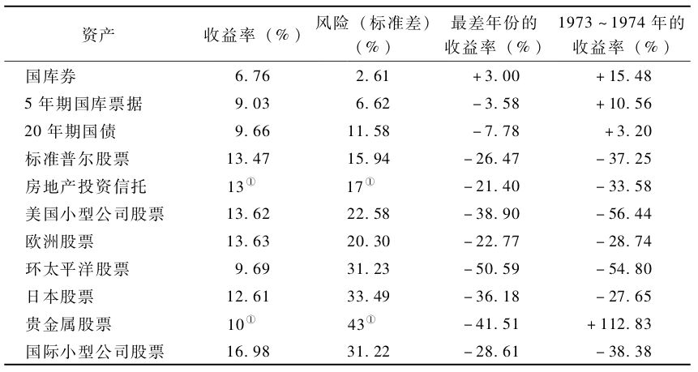

表2-2 ①为作者最好的估计（见文中的解释）。

房地产投资信托（REITs）是一类通过经营和管理商业不动产来获利的公司。我在数据库中剔除了那些主要通过住房抵押贷款获利的REITs，只加入了权益型REITs。发源于摩根士丹利资本国际指数（MSCI）的欧洲股票、环太平洋股票和日本股票指数都代表了各自地区最大盘的股票。贵金属股票代表了黄金和白银的采掘业。最后，国际小型公司股票是美国小型公司股票的外国等价物。这个指数由空间基金管理公司（DFA）拥有，建议投资者谨慎使用，因为在1988年之前它的数据只涵盖两个国家：英国和日本。

P35 REITs领域的构成在过去的5年中发生了戏剧性的变化，数据可能不再适用于当前了。因此，REITs和贵金属的长期收益率数据太值得怀疑，不应该被用来进行财务规划。

房地产投资信托（REITs）和贵金属的收益率很低，很多投资者还是愿意持有他们。主要原因是他们认为这样可以很好地对冲通胀风险，而持有其他股票和债券在通胀环境下则会受到负面影响。这等同于说贵金属和REITs的风险可以通过分散化投资而消除。第3章和第4章会更详细地讨论这个问题。

P37 \#\#\#图2-10在坐标系中比较各类资产的收益均值与标准差\#\#\#

问题：盲目地用过去的收益去预测未来的收益是很危险的。

1.  预测长期债券相对容易一些，对它们收益的一个很好的估算值就是息票率。债券价格和利率的变化方向是相反的。尽管长期债券市场波动性显著，其长期收益率也只不过比票面利率高一点儿。
2.  股票收益不容易预测。股利贴现模型：股票的价值是由它未来所有股利的折现值（CF：第7章）组成的。原理：在足够长的时间中，所有公司都会破产。简化为公式：股票收益率=股利收益率+股利增长率+倍数变化。不幸的是自从**2000年以来情况就不同了**，谨慎的投资者不应该期待收益和股利仍会存在倍率
3.  对其他种类的资产运用类似分析就比较困难了。
    1.  有迹象表明欧洲股票和日本股票的期望收益率应该和美国股票一样。
    2.  美国小型公司的股票收益率应该更高。
    3.  环太平洋地区和新兴市场股票现在的收益率在3%\~4%之间，它们可能比美国股票有更高的增长率——当然风险也会更大。
    4.  最异常的要数REITs，他们当前的收益率达到了不可思议的8.8%（CF：P35）
    5.  国库券收益率几乎无法预测。因为它息票每个月都会变化。

P41 最有用的估算期望收益方法就是通胀调整后收益，也称“实际收益”。\#\#\#表2-3适合快速粗略计算实际收益\#\#\# 如果我能承受**一生中仅发生一次**的60%损失，那就用表2-3构建一个包括50%新兴市场股票和50%贵金属股票的投资组合。我的经通胀调整后的期望收益率 = 0.5×6%+0.5×(0\~4)%=(3\~5)%

72法则：收益率乘以资产翻倍所需时间约等于72。换句话说：

1.  年收益率12% 将会使资产每6年翻一番。
2.  年收益率9% 将会使资产每8年翻一番。
3.  年收益率8% 将会使资产每9年翻一番。
4.  年收益率7.2% 将会使资产每10年翻一番。
5.  年收益率6% 将会使资产每12年翻一番。
6.  物价上涨率4% 将会使现金每18年损失一半的购买力
7.  通货膨胀率3% 将会使现金每26年损失一半的购买力

CH3 多元资产组合的市场表现

P49 将你的投资组合分布于几种不相关的资产，可以在提高收益的同时降低风险

两种拥有正收益的资产不会持续保持强烈的负相关性。

将收益彼此不相关的资产混合起来可以降低风险，因为当一种资产贬值时，另一种资产很有可能正在增值，但这种说法并不是绝对的。

在真实的投资世界中，偶尔会发现两种股票或债券不具有相关性，产生几个百分点的额外收益，并适度降低了风险。但在长期中从不存在完全负相关性。

在真实世界中，你似乎能找到无限的资产，并可以用其建立无穷无尽的投资组合。但是，对于每一个级别的风险，能够带来最高投资收益率的投资组合只有一个。更糟糕的是，正确的或最优的资产配置策略只有在回顾过去时才会被发现；未来20年的最优配置和过去20年的最优配置毫无关系。

P53 例3-1 这个模型仅由两种资产组成：第一种是与弗雷德叔叔投掷硬币的收益率分布相同的资产。它会以相等的概率带来+30%或-10%的收益率，在这个例子中我们称之为股票；第二种资产会以相等的概率带来0%或+10%的收益率，我们称之为债券。这里所说的股票长期收益和风险与真正的股票很相似，债券的长期收益和风险也和5年期国债相似。这个组合的收益有四种可能的结果：

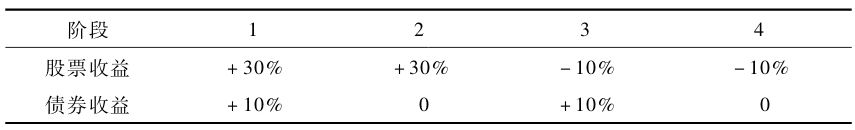

你可以按任意比例对这两种资产进行长期投资，在每年年末你必须将组合重新调平到这个比例。我们假设你选择了股票和债券各一半的比例，换句话说，在每年年末，你的一半资产进行了0或+10%（债券）的硬币投掷，另一半则进行了+30%或-10%（股票）的硬币投掷。如果某一年债券收益为+10%但股票收益为-10%，在年末你就拥有了更高价值的债券和更低价值的股票，你必须卖掉一些债券并用这些钱去填补股票价值的缺额。类似的，在那些股票获得30%收益的年份，你必须将足够的股票转变为债券以使组合的比例重新变为50/50。原因：

1.  调平可以在增加投资组合长期收益的同时降低风险；
2.  不对组合比例进行调平最终将会导致整个组合全部变成了股票，股票的高收益会使你的风险收益比达到更高的水平；
3.  调平的习惯有助于培养投资者低买高卖的投资思路。

例3-2 假设你选择了25%的债券和75%的股票。Rb和Rs代表了债券和股票各自的收益率，在任意时间段该投资组合的收益率为：（0.25×Rb）+（0.75×Rs）

因此，如果某一时期股票的收益率为+30%，债券的收益率为+10%，那么投资组合的收益率是：（0.25×10）+（0.75×30）=25%

收益率的四种可能的结果如下：

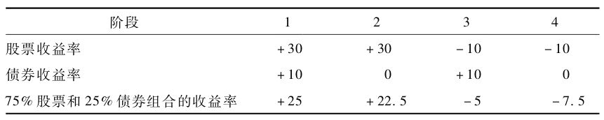

该投资组合的年化收益率是7.70%，标准差是15.05%。首先，注意这个组合的收益率仅仅比全部投资股票时要低0.47%，但它的风险（标准差）降低了5%。（换句话说，降低1/4风险所付出的代价仅仅是收益减少了1/17。）这是对分散化投资的好处的又一个例证。这个例子提供了一种简单而又强有力的方法去研究最常见的分散化投资工具——股票和债券组合的风险和收益特征。

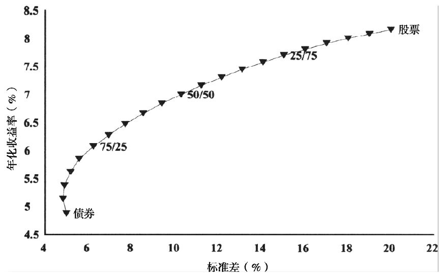

上图的右侧部分显然，当你在股票组合中加入少量债券时，整个组合的风险大幅下降，收益却损失不多。然而，图的左侧部分却值得注意。当你向一个债券组合中加入少量股票时，收益如预期般增加了，但同时风险也略微降低了。

P54 最低风险的组合包含大约7%的股票，一个股票占12%的投资组合风险与全债券组合相同。因此，以最小化风险为目标的投资者也必须持有一定量的股票。

P55 真实的资产几乎总是不完全相关的。换句话说，一种资产获得超额收益可能会使另一种资产也获得超常收益。相关程度用相关系数来表示，它的值在-1到+1间变动。完全相关的资产的相关系数是+1，不相关的资产的相关系数是0，完全反相关（或负相关）的资产的相关系数是-1。理解相关系数最简单的方法就是在一张图上画出两种资产很多期的收益，如下图。

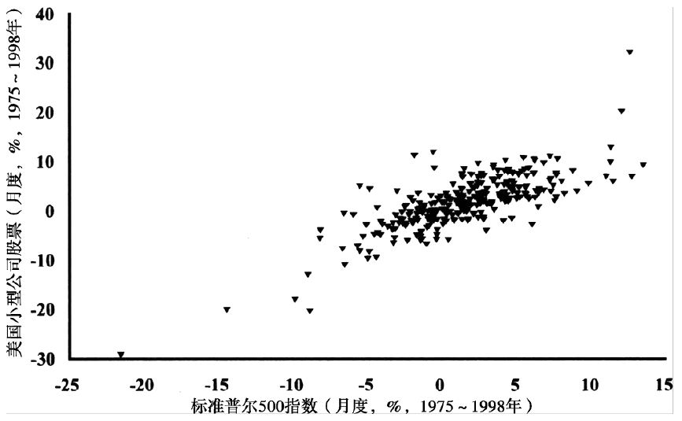

图3-3 标准普尔500指数/美国小型公司股票，相关系数0.777

画出了从1975年1月到1998年12月的24年中两种资产总共288个月的月收益。图中每一个点都表示两种资产某一个月的收益，x轴（横轴）和y轴（纵轴）分别代表其中一种资产的收益率。如果这两种资产是完全相关的，那所有点都会落在一条直线上。（如果相关系数为正，那所有点会组成一条从左下向右上延伸的曲线；如果相关系数为负，那所有点会组成一条从左上向右下延伸的曲线。）如果两种资产不相关，那这些点将会分散在整个图上。

P56 用Excel或Quattro Pro软件可以用CORREL函数计算2种资产的相关系数。还可以生成各个资产数据的相关性矩阵。

CH4 真实世界中投资组合的市场表现

P57 真实世界中，像上一章一样不相关的情况很少出现，大多数相关系数都聚集在0.3\~0.8之间

P59 \#\#\#图4-1描述了不同比例的股票与20年期国债组合在1926\~1998的收益率均值和标准差\#\#\# 向纯债券组合中增加15%的股票完全没有增大风险，但收益却上升了。在我们越过50/50的点时，想组合中继续加入股票只会略微增加收益，但风险却大大增加。曲线向上凸出和向左凸出说明分散投资可获取超额收益。

P60 对图4-2的解读：有时用少量长期债券或国库券来分散风险或许会有优势，但通常情况下使用6个月\~5年期的债券来分散风险都不会犯太大错误。

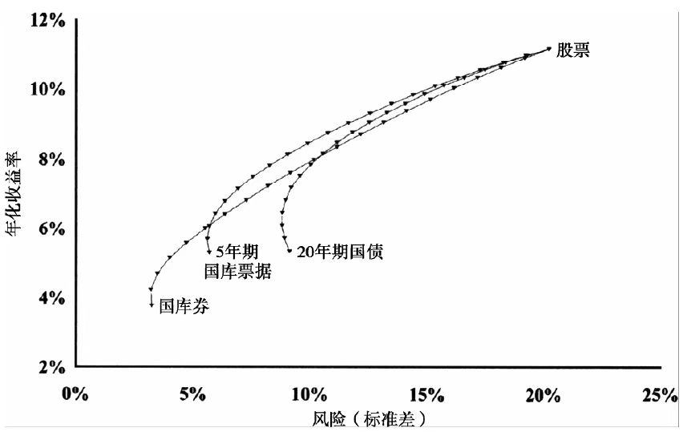

图4-2 （1926\~1998）

P61 如果你觉得自己的投资组合风险过高，你有两种方法去降低它。

1.  低效而复杂的方法：减少对风险资产的投资。例如将小型公司股票换成大型公司股票，将外国股换成国内股，将工业股换成公共事业股。
2.  高效而简单的方法：继续保持你最初在各个类别的股票中的资产配置，只是将少量的股票替换为相同价值的短期债券。这被称为风险稀释。

风险稀释的图形意义：加入更多短期债券可以让图4-2曲线从右上往↙移动

P62 如果我们希望建立包含很多种相关性低的资产投资组合，有必要用外国证券

P64 在2000年此书正在写作时，股市专家受近因效应影响发言称外国资产危险

P67 乔瑞和戈兹曼认为：谨慎的投资者应该了解幸存者偏差。标准普尔500指数和EAFE组成了“幸存者”，1920年存在的股票市场中的很多现在都已经消失了。很多国家市场的收益率都达不到美国的高度。但是，他们的出的结论还是比较乐观的。他们发现以各国GDP为权重构建的国际投资组合的收益率要比美国国内组合大约低1%，但与此同时标准差却大大降低了。

P69 \#\#\#图4-6\#\#\#很好地研究了近因效应。50/50比例配置不会比最优配置差太远

P70 小型公司股票比大型公司股票收益更高。（CF：P27）

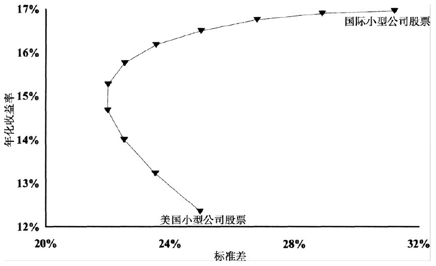

上图画出了1970～1998年间美国小型公司股票与国际小型公司股票组合的表现。注意这条曲线“凸出”的程度。在曲线的最右端，要注意向组合中加入美国小型公司股票是怎样在不损失收益的同时降低风险的。在曲线另一端，向组合中大量加入国际小型公司股票可以在不增加风险的同时显著地增加收益。

P74 \#\#\#图4-9：用5年期国库票据去稀释6种股票类基础资产\#\#\#（CF：P61）云图的左上部分就是我们想要得到的——给定风险水平上的最高收益，这被称作“有效边界”，但下一年的有效边界位置不可能临近前一年的位置。用完整的27年的数据画云图4-10就会更平坦。则是因为短期内资产的年收益率差别很大，但长期内这些差别都会趋于消失。没有人会知道现在的有效边界在哪。

1992～1996年间位于有效边界上的投资组合包含了大量标准普尔成分股和欧洲股票，但在长期中该投资组合的主要成分则是日本股票、美国小型公司股票和贵金属股票。事实上，如果你计算出整个时间段的前半阶段（1970～1983年）的有效边界，并用此来配置你后半阶段（1984～1996年）的投资组合，你将承担极大的风险。前半阶段由日本股票、贵金属股票和美国小型公司股票构成的位于有效边界上的投资组合在后半阶段损失惨重。

没有人能时刻与市场保持一致。随时间变化而改变资产配置会导致灾难。

P75 定期调平组合比例至目标值，也即“政策性配置”。从情感上讲，这通常很难实现，因为它总是要求投资者与整个市场背道而驰。总是与大众做出相反的举动是成长为“逆向投资者”的有效方法。你将必须卖出人们喜欢的资产并买入他们所厌恶的资产。最好的买入时机在产生前都经历了**几年**难以忍受的**熊市**。

⭐P78 拥有固定资产配置策略的小型投资者比大型机构专业人士有三点优势：

1.  不会被客户的看法影响调平。
2.  可以投资小型公司股票。大型机构的巨额资金不适合买一些交易量很小的小型公司股票。（up注：这是“冲击成本”的另一种表述）
3.  在业绩糟糕时不会被炒鱿鱼。

CH5 最优资产配置

P81 \#\#\#对前四章的总结\#\#\# CF：第6章讨论市场时机选择和主动式股票选择会失败的原因；第6、7章都研究了真正市场运行过程和理论运行过程的细微差别；我们将在第7章看到，判断一个市场板块是否便宜是非常简单的；第8章探讨更具体的细节问题来充实我们的资产配置计划。

P82 历史的最优配置在用于确定未来配置时表现非常差劲。

计算历史最优配置的2种方法：excel和MVO优化器（CF：附录A）

MVO会根据三个数据迅速计算出投资组合的最优配置比例。这三个数据是：①每种资产的收益率；②每种资产的标准差；③所有资产间的相关系数。

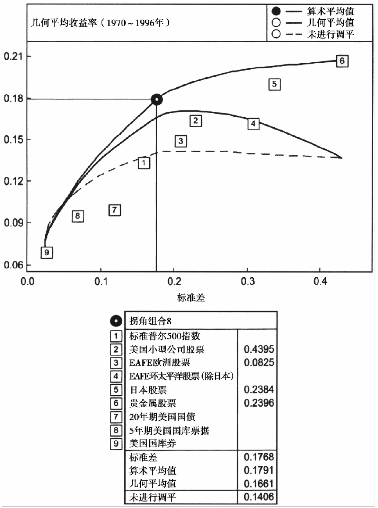

用MVOPlus软件利用临界线技术生成了一系列“拐角投资组合”，它确定了1970\~1996年间9种资产任意组合的有效边界。下表是10中组合中各资产的比例数据。上图就是调平前后的有效边界图形。拐角1是方差最小的投资组合，也即风险最低的投资组合。注意该组合中92.5%是国库券，另外7.5%是我们通常所说的高风险资产。人们所认为的处于合理风险范围内的资产大都在拐角7和拐角8之间。组合1至组合6几乎都是由短期债券组成的，而8以上的组合风险都很高。组合10是风险最大的投资组合。

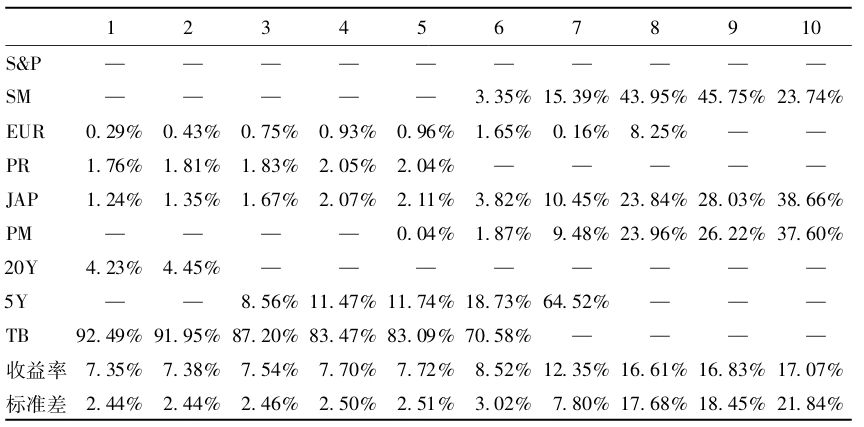

P87 最优化方法的致命缺陷：它过分偏好在最近时期拥有高收益的资产。对未经加工的历史收益进行最优化就等同于踏上了通往贫民窟的不归路。

资产收益在长期有“回到均值”的趋势，在过去10年取得骄人收益的资产在未来10年中的收益很可能低于平均值。

P90 在现实中几乎不可能找到三种以上相互无关的资产，因此通过分散化只能降低1/4\~1/3的风险，不要奢望更多了。

更糟糕的是，**在严重的熊市中相关系数要高于理论值**，分散化投资降低风险的作用在严重的熊市中经常会失效。对投资组合简单的事后检验是对MVO方法一个有价值的补充，人们可以了解给定的投资组合在熊市中的表现究竟如何。

P91 反对国际化分散投资的一个主要观点是对主权风险的担忧，即投资者的资产可能会被外国政府没收或在战乱中湮灭。二战前，德国在战争中被摧毁，埃及在战后被国有化。拉丁美洲国家在20世纪中像时钟一样有规律地不停发生债务违约。长期国际投资的风险不该被低估，但正确理解长期风险的数学特征很重要。

以1998年之前的数据来看，没有任何证据表明**经济全球化**会导致国际化分散投资失去意义。唯一的例外是欧洲市场在过去20年中相关性不断上升。

P92 也许分散投资带来的最重要益处并不是降低风险，是调平红利和心理益处：

1.  通过培养逆市而动的习惯，投资者在学会自力更生的同时也可以对市场情绪一笑置之。**对市场情绪和“专家建议”的不信任是投资者最有用的工具。**
2.  投资者对任何一个市场的敞口都是有限的，不会在一种资产赔光家当。

P93 观察表5-3全球大小盘的相关系数可以看出：尽管每个国家的小型公司股票波动性都要高于本国的大型公司股票，但由**全球的小型公司股票构成的投资组合其波动性仅比类似的由外国股票和本国大型公司股票构成的组合要略高一些**。

小型股票真正的风险是它们的跟踪误差。理性的投资者要做到：①远离近因效应，②用大型+小型公司股票来对冲风险。

P94为了配置资产，要依次回答3个问题：

1.  我想持有多少种不同的资产形式？答：大盘股、小盘股、国际股、黄金
2.  传统性？答：我不怕在10年内暂时落后。（CF：P99）
3.  我愿意承担多少风险？答：35%（CF：P61）

P95 一级投资组合（复杂性最低）：大盘股票、小盘股票、外国股票、短期债券。这四种资产都有对应的廉价指数基金可供购买（up注：符合国情，在中国也有）。假设你是少数的能接受100%股票投资组合的人，你就只需要前三种。CF：P100

P96 二级资产组合就是把一级中的“外国股票”分为外国大型公司股票和外国小型公司股票，再加上新兴市场股票和房地产投资信托（REITs）。

P97 三级资产组合的思路：股票资产不仅可以按公司规模来划分类别（大小盘），还可以按价值型/成长型定位法来划分（up注：晨星网站的3×3投资风格箱）

如果你能将整个世界分成10个不同的区域，每个区域中都有大型公司股票和小型公司股票，也都有价值型股票和成长型股票。这就已经有40个种类了。这还不包括股票所属的部门（REITs、贵金属、自然资源、公用事业等）或各国债券等。并非所有种类都能在市场上购买到。如果你并非真心喜欢投资，而且你也没有时间和耐心去处理复杂的投资组合，我不建议你选择三级资产组合。

P99 均等比例的配置在大多数情况下都足够好了。如果你能忍受跟踪误差，那就拥有更高比例的小型公司股票和外国股票的激进型组合吧。

P100 本书第一版建议激进型投资者可以选择100%的股票。然而，新世纪到来时我建议即使最激进的投资者也应持有25%左右的债券；中等激进的投资者50%债券；保守的投资者70%债券。CF：P95

P101 \#\#\#麦当娜的投资组合\#\#\#：适合意志最坚定和最善于独立思考的人。

\#\#\#差距组合\#\#\#：适合有精力打理、传统、风险承受度低的人。

CH6 市场的有效性

P105 研究1945～1964年共同基金的表现，并未发现基金业绩存在持续性的证据。一般来说，上一年中的明星基金经理在第二年都业绩平平。从这以后，人们对基金经理的业绩表现做了大量详细分析，结论是惊人的。许多研究发现存在微小的业绩持续性，但持续性的效果太微弱了以至于在支付过基金管理费后尚不及市场表现。业绩持续性通常仅存在于短期中（少于一年），在长期中并不存在。

P107 对投资技巧的统计学检验要用到“标准误”，还有是否为抽样调查法选取

P109 客观地说用标准普尔500指数的跟踪误差来度量价值型基金经理的业绩是不合理的。通过计算基金的阿尔法值（α值）可以避免这个问题。阿尔法值是指考虑到市场敞口、公司规模中位数和价值导向之后基金经理所取得的超额收益率。例如，如果一个基金经理的阿尔法值为每年-4%，这意味着该经理的业绩比回归所选择的基准指标每年低4%。奥克马克基金前29个月的阿尔法值非常惊人，并且在统计学上是显著的，p值为0.0004。这意味着该基金在前29个月中靠运气取得骄人业绩的可能性只有不到1/2000。**躲开资金规模过度膨胀的基金！**

P110 基金成本的四个层面：

1.  公布在募集说明书和年报中的基金费用比率（expense ratio，ER）。费用比率仅仅包含基金咨询费（基金经理的报酬）和管理费用
2.  交易佣金。它并不包括在费用比率中，它的表述方式过于模糊。
3.  交易股票时的买卖价差。“价差”对最大型、流动性最好的公司来说大概是0.4%，最小的公司可能会高达10%，外国股票的价差在1%～4%之间。
4.  市场冲击成本。主要存在于大量股票被交易的时刻。

P111 美国投资者的基金成本：大盘基金＜小盘和外国股票基金＜新兴市场基金

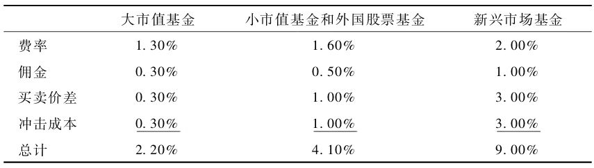

P112 随手可得的财务信息正是证券分析失败的原因\#\#\#曾经有过的1月效应\#\#\#

P115 成功的关键是避免损失而非追求获胜。投资最容易失败的例子是频繁交易

P116成功的关键都是避免损失而非追求获胜。最容易犯的错是频繁交易导致成本高企。最彻底的规避损失的策略是简单地买入并持有整个市场，也就是指数化

P117 \#\#\#表6-5\#\#\#可以看到主动型基金经理每年平均要亏损1%\~8%。对于大市值基金，这意味着指数型基金将会带来的额外收益为1.6%（即25年期标准差）。

P119 用晨星的数据库分析表明指数化更适用于大市值基金。

P121 理论上讲**指数化优势最大的领域应该是新兴市场**。

指数化策略在一个领域似乎会失败，即小市值成长股领域。无论主动型还是指数化，避免在该领域进行投资或许才是最明智的策略。

P122 幸存者偏差：杂志中的统计样本不是过去10年中曾经存在过的基金，而是那些至今为止仍然幸存的基金。《漫步华尔街》的作者发现这个效应使得公布的基金平均业绩高于真实业绩1.5%。晨星公司的数据库也只包含幸存至今的基金。

P123 如果要为基金所得纳税，更应指数化（博主注：中国人不用看税收这一节）

P125 人类既无法挑选好的股票，也无法选择好的市场时机。购买并持有随机组合或指数化组合，会比试图分析市场走势的行为获得更大的收益。

P127 “自相关性”描述了过去每天、每周、每月和每年的价格变化是否与随后的价格变化存在相关性。一个收益序列和它的滞后序列之间的相关性叫做自相关

1.  正的自相关意味着高于或低于平均收益的趋势将会重复或者延续。一种资产或证券的“趋势”就是由正相关定义的。
2.  负自相关定义了所谓的“均值回归”，即高低收益总是交替产生的。
3.  零自相关即为随机游走。

\#\#\#自相关性表数据\#\#\#显示了大型公司股票指数的趋势效应在**以天为单位**时是显著的，但当单位时间更长时则并非如此。

P129 坎贝尔等人解释说大小盘之间存在高度显著的“交叉自相关性”，即大型公司股票的涨跌通常会伴随着小型公司股票的涨跌。

我们所见到最大的自相关性也是在0.2范围内，这意味着明天的价格只有不超过4%的部分能够被今天的价格所解释，这可赚不了多少钱。这对免税投资者的启发：不要频繁调平你的组合。

P130 如果资产价格在相对长时间中有延续的趋势，那么在短时间内进行调平不是好主意。如果资产有趋势效应，那长期年平均方差会大于短期。

**数学信号：只在资产的平均自相关性小于或等于零时进行调平。**在现实中，每年最多调平1次。

在真正的随机游走的理论世界中，调平资产组合的策略不存在任何优势。

好在真实世界与随机游走世界存在着细微的偏差，使得投资者可以从中获利

CH7 那些零碎的话题

P132 在对特定的细节进行讨论之前，任何投资指南都不能算是完整的指南。现在你已经掌握了资产类别的业绩表现和投资组合构建的基本概念，接下来我们要用以下领域的知识把这些基本概念串联起来。这些领域包括：价值投资和三因素模型、“新纪元”投资、套期保值、动态资产配置以及行为金融学。

问：在长期中有没有可能战胜市场呢？答：不可能。

更好的问题：市场中是否存在这样的资产，它们的收益与自身风险不匹配？答：存在，比如贵金属和其他“硬资产”（收藏品、贵重的宝石等）。

股票有没有什么特征能预测期望收益的高低呢？答：公司规模（即大小盘）

股票的长期表现超越了其他所有资产，这是因为买股票就相当于购买了我们如今持续增长的经济。

P133 价值投资需要估值，即辨别个股或整个股市的价格何时昂贵或何时便宜。（讨论股市整体或其中某个独立的市场部门的估值是最简单的。）3种度量方法：

1.  市盈率(P/E ratio)=股价/每股收益。然而，公司的利润是不稳定的。即使是最大最稳定的公司，其利润也经常会消失。极少的情况下整个美国股市的净利润都会消失（大萧条）。此外，公司财务人员很容易就可以对利润报表进行篡改，从而使财务数据变得毫无意义，因此市盈率的作用是有限的。精明的本杰明·格雷厄姆在观测后发现，公司利润只有在取数年的平均值时才能提供有价值的信息
2.  市净率(P/B ratio)=股票总价值/净资产账面价值。所有公司都有账面价值，这可以看作是公司所有资产的净值，公司财务人员通常没有动机去篡改它。
3.  股息收益率=股息/股价。公司支付的股息可以高于净利润，但无法长久。小公司或高速增长的公司通常根本不支付股息，它们需要将所有利润用来支持企业增长。然而不久以前，增长缓慢的大型公司的股息收益率还经常会超过5%。

P134 \#\#\#图7-1\#\#\#画出了过去73年美国市场的市盈率在7\~20之间。当市场的市盈率等于7时，它是相当便宜的；当它大于20时，则是相当贵的。

\#\#\#图7-2\#\#\#画出了市场的市净率曲线。市净率小于1的股票是便宜的，市净率大于5的股票是偏贵的。市净率直到前不久都还在1（便宜）～3（昂贵）之间变动，平均值为1.6，但最近它却飙升到8。由于最近的数据，一些人开始质疑这种方法在度量价格贵贱方面的有效性。

\#\#\#图7-3\#\#\#画出了股息收益率曲线。历史上它在2.5%（昂贵）至7%（便宜）之间变动，平均值大约为4.5%。收益率越高，股价就越便宜；收益率越低，股价则越贵。目前股息收益率为历史最低点，这同样使很多人质疑该方法的有效性

小型公司股票的市盈率和市净率走势与大型公司股票相似，股息收益率则小得多，美国以外的**各国之间的会计准则不同**；尽管如此，大多数EAFE国家的市净率走势似乎都与美国相似。

⭐P136 我们还发现，当估值较为便宜时，长期收益通常较高；当估值较为昂贵时，长期收益则较低。这个发现是否有实用价值还值得商榷。

在任何时候，总会有一些股票比另一些便宜，那么购买相对便宜的股票是否有用呢？大量数据证实了这一猜想。

P137 投资者希望从价值股中索取的收益越来越高。那怎样买到便宜的股票呢？

1.  道氏市盈率策略，从保罗·米勒收集的数据看来：
    1.  市盈率最低的股票（最受冷落的股票）的收益率远远高于市场收益率
    2.  市盈率最高的股票（最受追捧的股票）的收益率则远远低于市场收益率
    3.  与风险有关的数据，低市盈率股票的标准差和“最大年亏损”要高于高市盈率股票和整个道琼斯30指数。低市盈率股票较高的标准差源于它们在过去数年中带来的高额收益。**如果从亏损的年份数或亏损大于10%的年份数来看，低市盈率股票的风险事实上要低一些**。（up注：我的理解是赚钱比均值多太多也会让标准差升高，这不是亏损风险）
2.  道氏股息策略：买入道指中股息收益率最高的（即股息相同时最便宜的）

P139 1992年6月，法玛和弗伦奇发现所有股票的收益变化都可以用两个因素解释：公司规模和市净率。在引入市净率后，市盈率就没有使用价值了。（up注：有些专门讲价值投资的书不是这么说的，看看那些书的出版时间是否早于1992）

P140 大多数读者认为拥有高收益率（便宜）股票的公司是“差公司”，而拥有低收益率（昂贵）股票的公司是“好公司”。**好公司——坏股票**：好公司的股票通常表现都很差，而差公司的股票通常表现都很好。本杰明·格雷厄姆在50年前写了《证券分析》，讲授寻找便宜安全股票的方法（**低市盈率、低市净率、高股息收益率**）。**按理说他的方法应该早就过时了，但它至今依然有效。**无论用市盈率、市净率还是股息收益率来衡量，不卓越的公司都比卓越的公司便宜得多

P141 价值股还是成长股？

成长股的投资者相信它们可以挑选出那些利润可以持续增长的公司，从而使他们获得不断增长的收入流。不幸的是，目前存在的成长型公司都很昂贵，其股票的市盈率通常比整个市场要高2～3倍。一个增长速度比市场中其他公司高5%并且市盈率为市场的2倍的公司需要以该速度持续增长14年才能使股东收回成本。今年的成长股下一年很可能会变成价值股，这会给股东带来巨大损失。与此相反，业绩平平的价值股经常会以强劲的利润增长震惊整个市场，这通常只发生在某个特定年份价值股中少数几只股票上，但这对整个投资组合的影响是巨大的

哈根研究发现：成长股的确有过利润高速增长的时期，但这种高增长随着时间在不断衰减，而且它们的利润从未超越过价值股。如果你希望在长期中靠成长股来出人头地，你的股票利润的增长幅度必须至少比价值股高3倍。

法玛、弗伦奇和兰考尼肖科等人对低市盈率和低市净率股票的表现优于成长股这一结论达成了共识，但对其原因却存在分歧。法玛和弗伦奇是虔诚的“有效市场学家”，他们坚信价值股更高的收益一定伴随着更高的风险。

另一方面，兰考尼肖科和同事坚持说拥有更高收益的价值股并没有更高的风险，并拿出了令人信服的证据。对每一种规模的公司，价值股组合的年化收益率都要比同等规模的成长股组合高出几个百分点，并且风险要远低于后者。事实上，价值股超越成长股恰恰是因为他们的风险更低。在牛市期间成长股的表现要好于价值股，但在熊市期间价值股亏损程度要远小于成长股。到最后，价值股的收益率可能要高于成长股，仅仅是因为价值股在熊市中表现得要更好。

P143 法玛和弗伦奇根据三因素模型而提出的假设是更高的收益必然伴随着更高的风险。简而言之，任何股票资产的收益率都可以分为以下四种：

1.  无风险利率，即货币的时间价值。通常以短期国库券利率表示。
2.  市场风险溢价。指暴露在股市风险中所获得的额外收益率。
3.  规模溢价。指持有小型公司股票股票所获得的额外收益率。
4.  价值溢价。持有价值股所获得的额外收益率。

每个人都可以获得无风险利率，因此在法玛和弗伦奇的理论中，最重要的决策是你在其他三个因素上的敞口是多少。如果你是个十足的懦夫，你可以只持有国库券而完全不持有其他三种资产。如果你对风险的承受能力很强，你可以将你在三种资产上的敞口最大化，并且仅持有小型公司价值股。

\#\#\#图7-4画出了5年期年化市场溢价\#\#\#市场溢价年平均为5.65%。市场溢价在5年滚动时间段中只有78%的时候是正值，看来这确实是不确定的。

\#\#\#图7-5 画出了5年期年化规模溢价\#\#\#过去36年中的“规模溢价”（用纽交所中市值排在后50%的上市公司收益率减去前50%的公司收益率）是1.71%。我在图7-5中画出了该溢价的走势，它的5年期滚动收益只有53%的时间为正。

最后来看一下最富有争议性的溢价，我将其画在图7-6中。在这一领域投资36年的溢价（市净率最低的股票收益率减去市净率最高的股票收益率）是年均3.77%。从图中可以看出该溢价具有相当的持续性，87%的时间中都为正值。

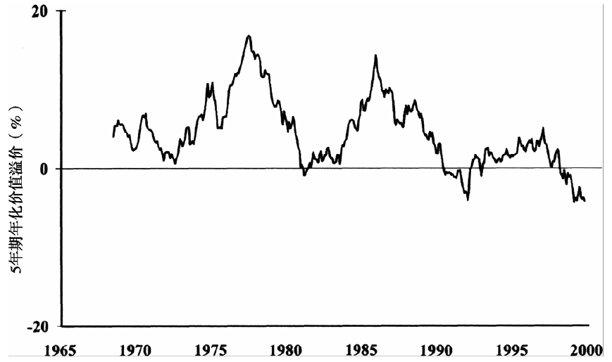

图7-6 5年期年化价值溢价

研究显示在很长一段时间美国和很多其他国家的市场都有这三种溢价存在的痕迹。此外还有其他溢价吗？关于趋势型股票风险特征的讨论目前还没有定论

P146 三因素模型还可以用来评估基金经理的表现。大多数基金经理的卓越表现要归功于他们对风险因素的敞口，极少有人能通过统计学意义上的技术来获利。

最终，资本市场的奖励流向了那些能够**在三种风险因素以及职业风险中找到平衡**的聪明人。周期性的“价值型”公司的员工应该尤其谨慎地持有价值型投资组合，因为在严重的萧条中他们的工作和投资组合都会遭到或多或少的损失。在困难时期中能够维持工作的人，比如邮递员和讨债人等，更适合持有价值股。

P147 投资模式有时的确会发生改变：在1958年，股票收益率有史以来第一次低于债券收益率，人们纷纷预期灾难即将到来。然而什么都没有发生（除了债券表现依旧卓越），股票收益率再也没能超过债券收益率。

但是，投资的规律和数学以及万有引力一样是客观存在，很难违背的。可以指出的是1958年股息收益率一直在增长，但债券利息则并非如此，它是固定不变的。因此债券收益率超过股票收益率也不是不可能的。

人们经常听到这样的论调，即随着科技进步的不断加速，美国公司正处于利润大幅上升的临界点。回顾一下历史会对你有帮助。1830～1860年的岁月见证了人类历史上两个最具有变革意义的发明——蒸汽机和电话。当然，在过去30年中也产生了非常多的科技创新。

事实上，我们已经听过这种新世纪的论调了——第一次是1926～1929年，然后是20世纪60年代末。在这两个时期中传统思想都认为：“过去的股票估值方法过时了，为那些站在科技进步的刀刃上的公司支付其利润的50倍甚至100倍的价格是可以接受的。”这个时期的情形就像格雷厄姆的《证券分析》描述的对高科技和网络概念股的狂热追捧差不多。

P150 股息贴现模型（DMM）有一个看似简单的假设：由于所有公司最终都会破产，因此股票、债券和整个市场的价值就等于将其所有未来股息或利息贴现到当前的价值总和。因为未来1美元的股息放到今天并不等于1美元，因此其价值必须被减小，也即贴现，以此表明你想立即拥有这1美元所需付出的代价。被减去的这一部分比例叫做贴现率（DR）。

贴现率可以被想象成一个理性的贷款人向借款人收取的利率。世界上最安全的借款人是美国财政部。如果美国财政部向我借一笔长期贷款，我会收取他们6%的利息。如果承诺每年给1美元的利息直到永远，我愿意借给他16.67美元。

下一个借款的是通用汽车公司。没有美国政府的安全性高。因此我收取它7.5%的利息。在该贴现率水平上每年支付1美元的永久贷款的价值为13.33美元

最后，王牌赌场向我借钱。借钱给这种小丑存在的风险使我向他们收取12.5%的利息。这意味着每年支付1美元利息直到永久，只能获得价值为8美元的贷款

P156 外国股票和债券的持有人不仅要承受该证券的内在风险，还要承受汇率波动的风险。例如，以英镑计价的债券价值会随着英镑汇率而变动。这种汇率风险可以通过在期货市场卖出英镑期货合约来消除（套期保值，也称为对冲操作）。

对外国债券来说，因为汇率变动导致的债券价格变动正好被期货合约的反向变化所抵消，结果是套期保值后的债券要比未套期保值的债券有更低的风险。

对外国股票来说，短期中套期保值事实上增大了欧洲股票投资组合的风险。

是否进行套期保值对收益率影响不大。但是，真实世界中不存在完全一样的两种事物。在未来数年中汇率风险可能会带来巨大收益或惨重损失，且无法预测

幸运的是，套期保值的优势（降低单一资产的风险、带来正收益）和劣势（增强了与其他资产的相关性）在很大程度上相互抵消了，**在长期中是否套期保值对风险和收益的影响都不大**。然而，在短期中，这种影响可能会相当大。

把套期保值的成本也考虑进来。对机构型共同基金来说，套期保值的手续费、佣金和机会成本都微不足道，大概最多也不超过十几个基点。套期保值真正的风险来源于远期汇率合约本身。

更重要的是，要知道套期保值的程度会强烈影响短期内外国股票和债券基金的业绩。如果你的一只基金在某个年份表现差劲仅仅是因为你为贬值的美元进行了套期保值，不要为此烦恼。只要你的基金坚守套期保值的策略，当汇率波动时你将获得回报，而汇率波动的情形几乎总是在不停地发生。

P161 去尝试动态配置之前应该先掌握固定配置。偶尔将你的配置改变成股票价值估计的相反方向并不是什么坏主意。过度平衡法：仅限在**该调平时**（CF：P130），发现该资产**价格**（而不是比例）下跌x%就将其比例上调千分之x，反之亦然。

不能受政治经济环境的影响改变配置，只能根据纯粹的市场估值来改变配置

P163 本书最重要的前提是，理性的投资者会根据当前现实的投资情况做出有逻辑性的决策。但人并不是理性的。行为金融学研究：

1.  自负：普通投资者会认为他们的业绩比市场高出2%
2.  近因效应：金融史表明，由于近因效应的存在，绝大多数股票投资者都是凸性的——即当股价上升时，投资者不理性地预计收益率会上升，因此他们会买进更多股票。如果绝大多数投资者都表现出凸性，那么理性的投资者就是凹性的。（债券投资者受近因效应影响较小，因此凸性较弱）
3.  目光短浅的风险厌恶心理：对潜在短期损失的过度关注。

CH8 执行

P168 如果你能承受w%的损失，就持有(2w+10)%的股票（w≤35）；

如果你x年后要用这笔钱，那股票的比例不能超过x/10。（CF：P54、P59）

（up注：3年内的可预见支出，比如学费，最好投入期限合适的国债）

P170 \#\#\#中国目前对个人投资基金不上税\#\#\#

P172 \#\#\#中国目前没有一个基金公司能同时提供这11种分散板块的基金\#\#\#

P175 交易所交易基金（ETFs）也属于指数化投资。劣势：ETF的购买和出售都需要支付佣金和买卖价差，因此持有ETF要更昂贵一些。此外，ETF只在每季度末进行股息再投资，因此相比于连续股息再投资的传统基金，ETF的业绩要落后一些。从整体来说，如果你不是一个主动型交易者，对你来说ETF没有真正的优势

P176 对于债券型基金，本书推荐避税投资者直接选择利率最高的公司债基金。（up注：公司债券的风险CF《哈利·布朗的永久投资组合》）

P177 对于那些想在债券中投入资金超过5万美元的投资者，可以考虑使用债券阶梯。定期购买5年期（开始的时候可以买一至两年期）国债会产生不同期限的稳定现金流。国债被认为是无风险的，国债和公司债券收益率的差额被称作“安全性的价格”。当这个差额很小时，安全性成本就很低，此时应该购买国债。

P179 \#\#\#把大部分避税效应好的资产放进应税账户中，其余放进避税账户\#\#\#

P181 从纯粹的理财角度来说，你应该将资金尽早投入你的投资计划中。然而，如果你还没有习惯持有风险资产，你需要花一定的时间来适应市场的波动。你同样要花不少时间来劝说自己相信调平是个好主意，尤其是当你发现自己花大把的钱购买的一种、几种或全部资产投入了一个长期熊市的时候。

实现充分投资的传统方法是美元成本平均法。它是指定期向一只基金或股票中投资相等的数额。假设一只基金的价格在5美元到15美元之间浮动，我们分别以5美元、10美元和15美元的价格分3次每次购买100美元的基金。现在基金的平均购买价格是10美元，但用美元成本平均法得到的平均购买价格事实上要低于这个数字。价格为10美元时可以购买10份，5美元时可以购买20份，15美元时可以购买6.67份，总共是36.67份。因此基金的平均价格为每份8.18美元（300/36.67），这是因为我们在价格低时可以买到比价格高时更多的份额。

美元成本平均法是一个非常棒的投资方法，但它并不是免费午餐。在5美元时买入20份需要很大的勇气，因为你是在最悲观的时候进入市场。证券价格只有在大量消极情绪广泛传播的情况下才会变得便宜。不要低估了执行美元成本平均法计划时所必需的纪律。还有另一种更好的逐步投资的方法叫做价值平均法。

价值平均法和美元成本平均法很相似，但二者有一个重要的区别：价值平均法要求投资者在市场底部投入比顶部更多的资金，这样会带来比美元成本平均法更高的收益。你可以**把价值平均法当作美元成本平均法和调平法则的结合体**。（价值平均法反过来用也很有效。如果你退休了，正在经历理财周期的分配阶段，你可以在市场顶部卖出比底部更多的资产，能使你的资产维持更长的存续时间。）

你并不是一定要使用美元成本平均法或价值平均法。如果你已经持有较高的股票敞口好多年了，可以立即进行你的投资，并根据你的计划重新配置你的资产

当你将所有的现金和债券都转入你希望的配置后，事情就变得简单了。你只需定期将你的账户调平到政策性配置或“目标配置”。（CF：P130）

P185 多大的调平区间可以产生最大的调平红利？答案很复杂，但基本围绕于一点上，即找到这样一个调平区间，使投资组合中各资产的相关性最低，并且年化方差最高。换句话说，在给定的时间段中，当你选择的收益率数据的区间不同时，比如每天、每周、每月、每季度、每年等，对应资产的方差和相关系数都会不同。**使资产拥有最低相关性和最高方差的收益率区间就是最优的调平区间**。我见过几种相似的投资组合最优调平区间，它们从最短的一个月到最长的数年之久。对于给定的投资组合，我们可能无法提前预测其最优调平区间，但一般的规律是，较长的调平区间会更好一些。这是源于我们在第7章中说过的趋势效应。如果你对调平的理解有困难，不用难过。这是一个非常**复杂**的领域，甚至连最老练的投资者也经常会对这些概念产生误解。思考调平区间问题最简单的方法就是考虑只包含美国和日本股票的组合。由于过去几十年中美国股票价格几乎直线上升，而日本股票价格几乎直线下跌，尽可能不调平（比如每10年调平一次）要比频繁调平更好。不过即使你每一两年就调平一次，你也不会损失得太多。

P186 \#\#\#对于应税账户，我可以给出更明确的建议：尽可能少进行调平。\#\#\#

P189 在第7章中我们讨论了动态资产配置，即根据资产的估值随时调整你的政策性资产配置。不要轻易尝试动态资产配置，除非你已经至少在几轮市场周期中成功地进行了调平。如果你已经做到了，要记住只有在某种资产变得便宜并且价格暴跌时才可以增加该资产在组合中的比例。永远不要在发生某些经济或政治事件时增加你对某种资产的配置，也绝对不要在听了某个分析师信誓旦旦的言论后这样做。反之，仅在股市上涨阶段该种资产价值大幅上升时才减少该资产配置。

即使你从没打算改变你的政策性配置，及时了解市场估值也同样是个好主意。到目前为止，这样做的最简便的方法就是购买晨星公司的Principia共同基金数据库。然后查看市盈率、市现率（股价/每股现金流）、市净率和股息收益率

P191 退休期间有一种独特的风险叫做“久期风险”。为了研究这种风险，我们从所有投资品中最简单且风险最低的1年期国库券说起。国库券在实际中是零息债券，需要以折价的方式进行购买。例如，5%收益率的国库券会以0.9524美元的价格进行拍卖，并将以面值（1美元）进行偿付。如果在债券发行之初收益率突然涨到了10%，那债券的价格会下跌至0.9091美元，价值瞬间损失了4.55%。

但如果投资者将债券持有到期，他将会收到所有5%的收益，这与收益率和价格完全不变是一样的。一年之后，投资者就可以轻松收获利润了——投资者可以将全部资金按照双倍的收益率进行投资。因此“无差异点”就是国库券一年的期限

现在来看持有5%收益率的30年期国债的投资者。如果在购买债券之后很短的时间内收益率同样上升10%，倒霉的投资者受到沉重一击——债券现在的价值还不到最初的53%。然而，债券和国库券有很大的不同，债券支付的息票可以用来以更高的收益率进行再投资。因此，从债券的灾难中恢复过来的时间要远少于30年，我们倒霉的债券持有者只花了10.96年就实现了盈亏平衡。在金融界中这个10.96年的期限被称为债券的久期，对支付息票的债券来说，其久期总是小于债券期限，有时候甚至要小得多（对零息债券来说，债券期限和久期是相等的）

久期同样是一种极好地度量投资风险的方法。久期越高，风险就越大。

久期几乎总是被用来分析债券，但这并不意味着你不能用它来分析股票。建立股票市场的久期模型是很简单的。例如，股票当前的收益率为1.3%，如果股价下跌75%，**而股息的数额保持不变**，那你就可以将股息以5.2%的收益率进行投资，这个收益率是之前的4倍。（up注：将股息以1/4的价格买入同样的股票）这将增加你的收益，最终的状况会比低收益率高股价的时候要好。要多久才能赶上呢？这取决于最初的收益率和股价下跌的幅度。对于如今1.3%的收益率

1.  若股价下跌25%，股票的久期将是63年；
2.  若股价下跌50%，股票的久期将是51年；
3.  若股价下跌75%，股票的久期将是33年；
4.  若股价下跌90%，股票的久期将是19年。

P193投资者有没有办法可以缩短其投资组合的久期呢？有。由于收益率的大小会影响久期（收益率越高，久期越短），你可以通过每月向组合中增加投资来提高组合的收益率。（up注：可以理解为低位补仓，降低平均成本单价）

如果你已经退休并依靠退休金生活，你将既没有足够的时间去度过久期，也没有能力去增加投资来缩短久期。如果你正处于事业旺盛期，正在不断增加投资，那你就有足够的时间去缩短久期。

P194 我们所面对的最大风险其实是在离世前花光了所有的钱。这叫短缺风险

利用退休金计算器就能很容易地帮你算出短缺风险，但更重要的是**培养对该问题的直觉**。让我们从估算你的税前退休金需求开始分析。假设你确定在除了社保之外每年还需要4万美元的收入。为了使计算简单化，我们去掉通胀因素，这可以通过使用实际投资收益或经通胀调整后的收益来实现。这样你面对的就总是当前购买力不变的美元。我们已经讨论过，股票和债券组成的投资组合真实收益率合理估计大约是4%左右。这意味着为了维持你的组合价值不变，你应该每年花掉组合价值的4%。如果你能维持组合的真实价值不变，那你也能够维持你的支出数额不变。需要的储蓄=需要的收入/**通胀调整后收益**=40000/0.04=1000000

这个计算假设你希望本金保持不变。如果你希望在30年中按计划逐渐减少资产，那你就只需要691681美元。用金融计算器上的年金/抵押贷款函数来算出

掌控投资成本很重要，基金费率每增加2%就会使退休金储蓄的需求翻倍。

但是，在退休金计算中还有一个更严重的问题。退休计算器几乎都会做出同样的错误假设，即我们获得的收益每年都相同。例如，在上面的计算中我们假设我们每年都会获得4%的收益。我们知道，在实际中，投资收益不可能每年都相同。因此好年份和坏年份的先后次序变得很重要。

\#\#\#一系列对最坏情况的计算\#\#\#如果你退休那天正好是一个漫长而残酷的熊市的开端，你将每年只能从组合中提取初始资金的2%。如果在你退休之初遇到一个持续的牛市，每年能够提取初始资金的6%甚至更多。

最后，美国政府提供了一种充满诱惑的摆脱当前困境的方法——通货膨胀保值债券（TIPS），那你退休后30年的生活都可以成功地得到保障。对广泛分散化的投资组合的虔诚信徒来说，这个选择会令他们相当困扰。我发现推荐这种方法比较困难，但至少在避税账户中适当投资于TIPS并不是坏主意。

**总结本书最重要的10点**

（1）风险和收益是不可避免地纠缠在一起的。不要期望能从安全的资产中获得高收益；投资于历史上曾带来高收益的资产很可能会给你造成惨重损失。

（2）那些不以史为鉴的人注定会重蹈覆辙。要对不同类别的股票和债券的长期历史表现有所了解。那些不了解历史的投资者是失败的投资者。

（3）投资组合与构成组合的各个资产的表现是不同的。一个安全的组合不一定要剔除掉高风险的资产，过度依赖安全的资产反而可能会增加整个组合的风险。即使最追求安全性的投资者也会持有一定数量的风险资产，由“安全的”大型公司股票组成的投资组合往往要比由有风险的小型公司股票和现金组成的组合有更低的收益和更高的风险。

（4）给定的风险程度，有一种投资组合会带来最高的收益。这个组合处于资产配置的有效边界上，不幸的是它的具体位置只有在事后才能知道，投资者在事前找到有效边界的愿望是不可能实现的。聪明的资产配置者要找到在多种情况下的市场表现都能接近目标值的资产配置比例。广泛包含国内和国外的大型公司股票和小型公司股票，并同时包含各种股票资产所对应债券的组合，似乎是最好的。

（5）关注投资组合的整体表现，而不是其中某些组成部分的表现。投资组合中总会有一小部分亏损严重，但这对你整个组合的表现仅仅有非常微弱的影响。

（6）要认识到调平的好处。对资产价格下跌的正确反应是买入更多该种资产，对资产价格上涨的正确反应则是卖出一部分该种资产。调平只是将这种策略规范化的一种形式。市场的持续下跌会使调平看起来只是在浪费资金，但资产价格最终总会扶摇而上，你会因为你之前的耐心而收获丰厚的回报。

（7）市场比你聪明，也比专家聪明。要知道即使停止的钟表一天中也有两个时点是正确的。甚至最笨的分析师偶尔也会选到一只好股票，并很快会因此受到路易斯·卢凯瑟的采访。没有人能永远正确地预测市场的走势。在长期中几乎没有哪个基金经理可以战胜市场，那些在过去做到的人不太可能在将来还会继续保持不败战绩。不要随大流，那些追随着象群奔跑的人最终都被踩扁了。

（8）要了解证券价格的贵贱。注意留心市场估值。只有在证券价值变化时才应该改变你的政策性配置，并且这种改变应该向着资产价格变动的反方向进行。市场的历史教导我们，经济和政治因素对市场价值的预测是毫无用处的，当市场处于暗淡无光的萧条时期时是购买资产的最佳时期。

（9）好公司的股票通常表现较差，差公司的股票通常表现较好。在挑选股票和基金时要以“资产价值”为导向，估算资产价值的最好方法是市净率。

（10）在长期中很难战胜低费用的指数型基金。尽可能将你的投资指数化。债券型基金的费用应该低于0.5%，美国国内股票基金的费用应该低于0.7%，外国股票基金的费用应该低于1%。

CH9 投资可以用到的资源

假如每年你只阅读一本有用的金融学书籍，你将会比大多数专业人士还要明智，并且你的钱袋子也会逐渐鼓起来。下面所有我将为你推荐的书都写得非常好

推荐书单：

（1）《漫步华尔街》，伯顿·马尔基尔著。这是一本非常好的投资学入门读物，它介绍了股票、债券和共同基金的基本知识，并着重介绍了有效市场概念。

（2）《共同基金常识》，约翰·博格著，该书是《博格谈共同基金》的更新版。该书含有大量的你想知道的有关共同基金这个重要投资工具的所有细节知识。博格先生是先锋集团创始人兼董事长，他已经在这个行业呼风唤雨数十年。我强烈推荐这本文字优美、观点独特的书籍。该书同样讨论了过去几年横扫投资界的民主化进程。直到10年前，他在书中描述了那些复杂的共同基金分析方法，这些依然是一大帮有资格使用昂贵的私人数据库和电脑主机的职业投资人的分析方法。博格几乎所有的工作都是靠他购买的晨星客户端和一个能干的统计学助理来帮助他完成。这种工作对任何有类似软件和能力的小型投资者来说也不难。

（3）《资产分配》，罗杰C.吉布森著。该书与本书观点大部分相同，并更加关注个人财富质量特点。这本书定位的读者群体是金融咨询师。

（4）《全球投资》，由罗杰·伊博森与加里·布林森合著。这是一部详尽介绍可投资资产历史的优秀著作。即使一位知情投资者也不可能完全了解市场历史，该书能在这个领域提供最好的帮助。想知道过去200年的美国股票每一年的收益是多少吗？过去500年的黄金价格是多少吗？过去800年的利率和通货膨胀率是多少？你都可以在这本书中找到这些问题答案。正如该书的书名一样，作者同样也在一个分散化投资组合中，站在外国资产的角度给出了优秀的观点。该书在资产组合理论和市场有效性方面给出了富有价值的见解。

（5）《投资的头号法则》，这是来自特维迪与布朗的一本免费的小册子。这本书是对他们公司的基金低调营销，同样也是我见过的最好的支撑价值分析的数据汇编集。这本书在网上也可以找到，网址是http://www.tweedy.com。

（6）《新金融学：有效市场的反例》，罗伯特·哈根著。如果你被特维迪的小册子激发了兴趣，并疑惑为什么经过这么多年价值投资依然有效，那么这本书就是你要读的书了。这本书文风很活泼，甚至有点古怪。说得不好听点就好比本杰明·格雷厄姆遇到了亨特·汤普森。

（7）《价值平均策略》，迈克尔·埃德尔森著。这是一本极其有用的书，它会教你如何将一大笔钱配置在多种资产上。遗憾的是这本书（英文版）已经绝版了，如果幸运的话你可以在某些大型二手书店的书架上找到它。

（8）《聪明的投资者》，本杰明·格雷厄姆著。这是他早年与大卫·多德合著的经典著作《证券分析》的可读性更强的普及版本。尽管这本书的内容与市场联系很紧密并且应当被每一个认真的投资者阅读，但它更适合那些感觉自己在被迫购买股票的人去阅读。如今许多最成功的投资管理人起初都是从这两本书中获得对金融的灵感的。观察市场中的超常现象，并思考“格雷厄姆对此会如何评价”是一件非常有趣的事情。（如果你被格雷厄姆迷住了因而打算阅读《证券分析》的话，你一定要读1934年的原始版本。这个版本最近由麦格劳-希尔公司再版。）

（9）《华尔街日报》。《华尔街日报》事实上是3份报纸的集合。第一部分是极好的国民报纸，对于现代社会面临的主要问题和事件做出敏锐和深刻的评论，同时也有着很多离奇古怪的观点。第二部分是商业期刊，出色地网罗了大量商业资讯。第三部分包含了每日报纸中最完整的金融数据，同时也有金融评论。每周都会有一期叫作“投资参考”（Getting Going）的个人理财专栏，它包括了个人投资、个人资产、税收和退休策略，甚至一些资产组合理论，光这个系列就已经让这份报纸物超所值了。我家中有很多这样的文章，并且数量还在稳步增长。

（10）加入美国个人投资者协会。入会费用几乎可以忽略不计，在成为会员后你就可以获得该协会的期刊，其中包含了很多个人理财方面优秀的文献。

（11）如果你家中或工作单位中有电脑，那就去订购晨星公司的共同基金数据库。这将花费你一年95～600美元不等的费用，具体费用大小要看你更新软件的频率和数据的深度。这项服务能使你在目前超过1万只共同基金中游刃有余。这个软件的主要优势是它可以使你自定义你的基金筛选标准。

对于少数那些对本书中的**数学和理论**部分感兴趣的人，我推荐以下书籍：

（12）《资产组合选择》，哈里·马科维茨著。这本书以相当通俗易懂的文笔阐述了均值-方差分析法。另一本更正规的教材叫做《资产组合选择和资本市场的均值-方差分析法》。它主要面对那些有着深厚数学背景的人。

（13）《股票、债券、票据和通货膨胀》，由伊博森公司出品，这本书包含了从1926年起的许多美国重要资产的极其详细的金融数据，同样也含有对资产组合分析中涉及的数学操作和运算的精妙叙述。

最后，我总是被问到如何“跟上”金融发展的脚步。其实，更准确的说法应该是“回顾”。与当前市场形势保持一致的最有效的方法就是尽可能多地去了解市场的历史。要想了解市场的历史，一个极好的起点就是去阅读查尔斯·麦基的《非同寻常的大众幻想与群众性癫狂》，这本书最早出版于1841年，现在可以很容易地找到它的重印版。这本书最开始的几章详细记载了几个世纪之前发生的密西西比阴谋、南海泡沫和郁金香泡沫，你会发现自己正在阅读的是网络股灾难事件，只是简单地换了几个名字。

此外，我推荐詹姆斯·格兰特的几乎所有著作，此人娱乐性的写作风格和对金融历史的领悟能力是首屈一指的。（《思维的金钱价值》、《留心市场先生》、《繁荣之过》都是非常好的入门作品。）

如果你真的很想跟上金融的脚步，那就去订阅《金融杂志》（订阅费用为每年80美元，其中包含了美国金融协会的会员资格）和《金融分析师》（订阅费大概每年150美元）。这些杂志中的文章比较深奥，专业术语多，而且还充斥着晦涩难懂的公式，但每一期杂志中都有一篇很重要且容易理解的文章让你的订阅费用物有所值。这类杂志只适合专业的金融人士去阅读。

当我写作本书的前一版本时，我对网络上提供的建议和数据的质量没什么建议。现在就不同了，如今网络上有用的信息资源非常丰富。
