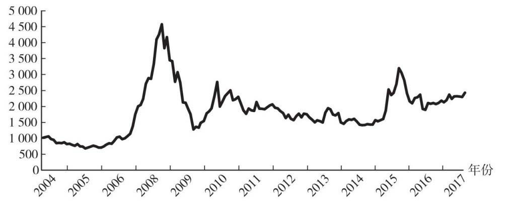
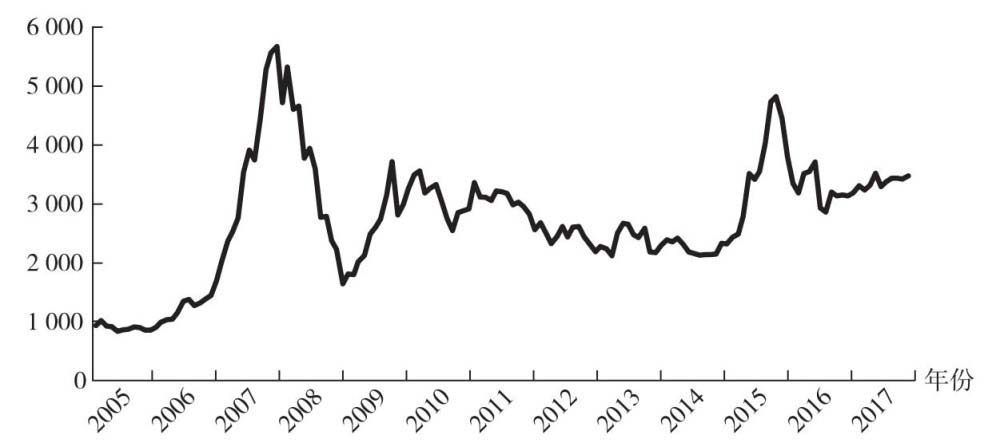
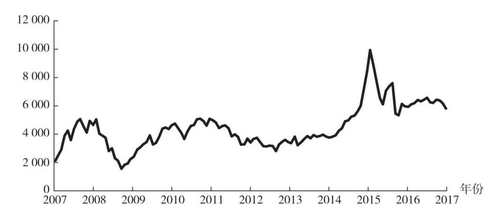
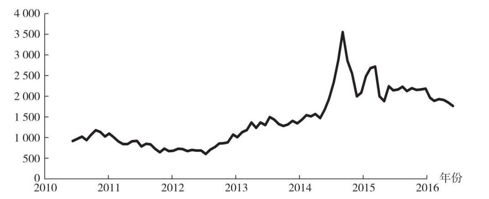
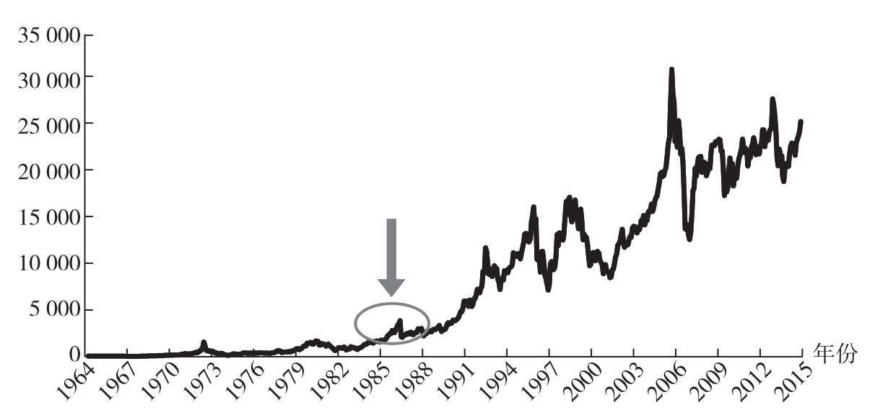
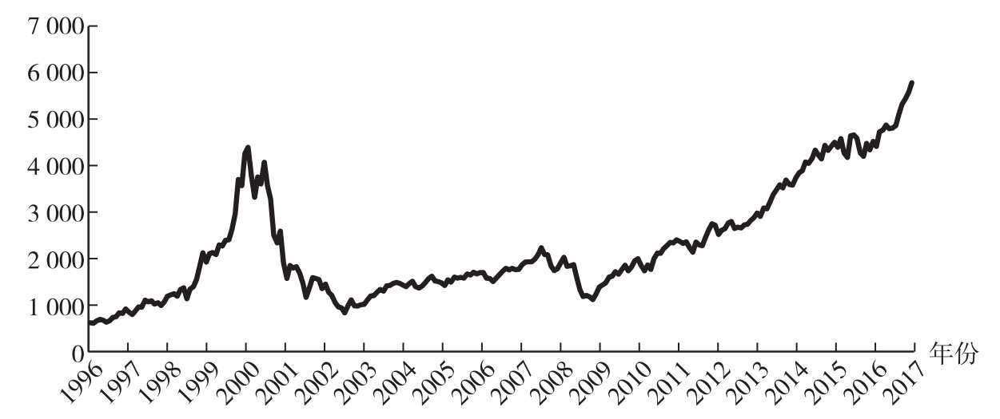
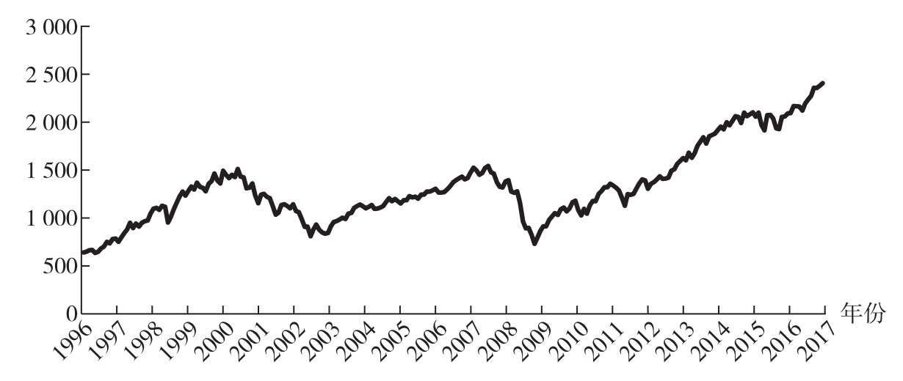
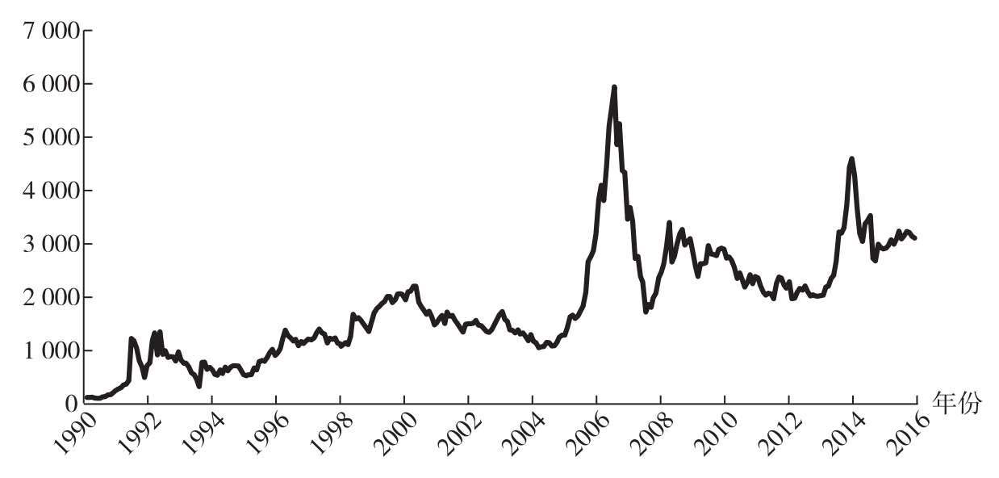

《指数基金投资指南》

银行螺丝钉

◆ 序言一

\>\> A股几千只股票基金，过去十几年整体收益都不错，平均达到了10%以上

\>\> 为什么股票基金盈利不错，但是基金投资者整体盈利不好呢？

最主要的一个原因是投资者大多是在牛市最火热的时候才入场。

\>\> 股票市场的收益并不是均匀的，80%的收益出现在20%的时间里。只有长期持有下来，才能等到下一次牛市的出现。

\>\> 本书讲解了“低估值定投指数基金”的理念。

◆ 序言二

\>\> 打理家庭财产时，可以选择持有50%的沪深300指数基金，15%的上证红利基金，30%的标普500指数基金，5%的纳斯达克指数基金。

◆ 前言

\>\> 本书的第一章，是给基金新手的建议，介绍了资产以及基金的基本知识。每个人都有一个财务自由的梦想，而要实现这个梦想，首先要学会区分消费与资产，只有通过长期积累资产，我们才能实现财务自由。

第二章和第三章介绍一类适合绝大多数人投资的特殊基金，也是股神巴菲特唯一在公开场合推荐的基金——指数基金。

第四章介绍指数基金的估值。估值指标是股票经常使用的，指数基金相当于一篮子股票，自然也可以套用这些估值指标。常用估值指标有哪些？它们有什么好处和局限？我们该怎么查找指数的估值呢？掌握了估值和价值投资的理念，我们就可以挑选出适合定投的指数基金。

第五章介绍了最适合指数基金的投资方法，也就是定投。通过定投低估值的指数基金，我们可以在指数基金上获得更好的长期收益。

第六章就是实际操作了，也是本书的重点：如何为自己设计一个定投计划。书中用了几个实际的案例，来展示如何围绕指数基金构建定投计划。

第七章介绍了另外两类基金品种，货币基金和债券基金，以及如何用它们来做好家庭资产配置。

第八章，介绍了在长期定投指数基金的过程中，会遇到的一些心理问题。投资指数基金的策略并不难，为何长期以来没有多少人能坚持？这一章是我对常见心理问题进行的一些分析，并介绍了我自己的一些经验和感悟，供读者参考。

◆ 第3章 常见指数基金品种

\>\> 国内的指数基金的开发虽然远不如成熟市场，但也已经有了近500只各式各样的指数基金供我们挑选。

\>\> 本章挑选了一些比较重要的指数基金进行分析。

◆ 指数基金的分类

\>\> 指数基金最常见的一种分类，就是分为宽基指数和行业指数。

\>\> 行业指数基金受行业特性的影响非常大。

\>\> 先介绍指数和它的特点，再来介绍对应的指数基金产品。

◆ 常见宽基指数基金

\>\> 上证50指数是从上交所挑选沪市规模最大、流动性好、最具代表性的50只股票组成样本股。上证50指数是从2003年12月31日，从1000点开始起步的，在此之前没有上证50这个指数可供追溯。

指数会有发布日期和基准日期。

指数的发布日期是这个指数正式推向市场可供投资者查询的日期。不过指数公司会往前推一段时间，作为指数的基准日期。像上证50，它是2004年1月2日发布的，但却是以2003年12月31日为基准日期开始运作的。

图3.1 上证50指数历史走势图

这个走势图反映的是A股上交所大盘股的历史走势。从图中可以得出：

·总体走势是上涨的。

·从2003年年底以来，国内股市发生过三轮比较明显的牛市，分别发生在2006～2007年、2009年和2015年。其余时间里股市大多波澜不惊，走平或者阴跌。

·A股经常暴涨或暴跌，所以指数基金也带有这个特征。这个特征是我们投资指数基金需要特别注意的一点。

\>\> 虽然说上证50是上交易所挑选规模最大，流动性最好的50只股票，但实际上指数挑选股票的时候，还有一些潜规则，例如：上市不满一个季度的股票不选；暂停上市的股票不选；财务上有问题的股票不选；多年亏损的股票不选。

这些规则基本国内的指数都会默认遵循，可以一定限度地保护指数基金投资者的利益不受损失。

上证50里，规模最小的都有350多亿，规模最大的有万亿级别的公司。

\>\> 这些股票基本都是关乎国计民生的大公司，一般是国家控股或在对应的行业里是数一数二的龙头公司。这种大公司也被称为蓝筹股。

\>\> 上证50并不是一个投资市场整体的指数，它更多的是投资大盘股。

\>\> 简单地说，场内基金在证券交易所上市，可以有“申购赎回”和“买入卖出”两套交易体系，其中买入卖出方式需要在证券交易所中进行，是通过股票交易软件来操作的。如果基金没有在证券交易所上市，那就是场外基金，它只有“申购赎回”一种交易方式。

\>\> 追踪同一个指数的不同指数基金，它们的单价可能会差很多，有的基金单价是0.9元，有的基金单价却是3元。这主要是由于基金成立时间的不同而导致的，对我们的投资并没有什么影响。

\>\> 为何要避开规模较小的指数基金？

如果一个指数基金规模较小，它清盘的概率就比较大。基金清盘并不是说我们的投资血本无归了，而是按照某一个基金净值强制赎回，导致我们的投资中断。如果基金规模太小，那么基金公司运作这个基金可能就是亏本的，基金公司就有可能停止这个基金的运作。所以一般挑选指数基金的时候，会避开规模较小的指数基金，最好规模在1亿以上再考虑。

\>\> 沪深300指数（简称沪深300）是由中证指数公司开发的，从上交所和深交所挑选规模最大、流动性最好的300只股票。它的成份股数目比上证50多，也都是以大公司为主。沪深300指数所包括的公司，从市值规模上来说，占到国内股市全部规模的60%以上，比较有代表性，所以沪深300也被认为是国内股市最具代表性的指数。

\>\> 沪深300指数是从2004年12月31日的1000点开始的。图3.2为沪深300指数的历史走势图。

图3.2 沪深300指数历史走势图

\>\> 指数基金有明显的先发优势，即早期推出的沪深300指数基金的规模远比后期推出的基金规模大。

挑选指数基金，一般有两种思路。**第一种思路是寻找费用最低、误差最小的品种，这是“指数基金之父”约翰·博格所提倡的。**因为基金费用越低、误差越小，指数基金的表现就越贴近于指数。这也是挑选指数基金最常用的方式。

第二种挑选指数基金的思路，是寻找有特色的增强型指数基金。

\>\> 什么是增强型指数基金？

有的时候，股市会出现一些比较明显的能获得超额收益的机会。于是，有的指数基金就会在追踪指数的基础上，去做一些操作来赚取超额收益，例如打新、量化模型等，希望相对于指数获得一些增强收益。这就是增强型指数基金。

要注意的是，增强型指数基金的增强操作，一般都不公开，是否能长期持续也不能保证。目前是通过观察历史比较长的增强型指数基金的效果来分析是否有增强收益的。相比普通的指数基金还是有一定风险。

目前国内的增强型指数基金不多，也不是每一只都能相对指数获得超额收益，是有一定风险的，表现不好的增强型指数基金甚至还不如原指数的表现。这里介绍几个针对沪深300指数的增强型指数基金，历史增强效果还不错。

增强型指数基金主要是场外指数基金，所以在挑选场外指数基金的时候，可以考虑一下表现好的增强型品种。

\>\> 联接基金是一种场外基金，通过申购赎回来交易。但它并不直接投资股票，而是通过投资对应的场内指数基金来实现复制指数的目的，也是指数基金的一种。

很多基金公司成立ETF基金（交易型开放式指数基金）的时候，大多数也会成立对应的ETF联接基金。ETF联接基金是投资到对应的ETF基金上的，一般不会再单独收取基金管理费。

\>\> 将全部沪深300指数的300家公司排除，然后将最近一年日均总市值排名前300名的企业也排除，这样可以最大限度地避免选入大公司。在剩下的公司中，选择日均总市值排名前500名的企业，这就是中证500指数。

\>\> 它是从2004年12月31日1000点开始的。图3.3为中证500指数的历史走势图。

图3.3 中证500指数历史走势图

\>\> 什么是创业板呢？

我们都知道国内有上交所和深交所，我们平时说的股票，其实说的就是在这两个证券交易所上市交易的股票，它们大多在主板上市交易。

在主板上市交易，门槛是很高的，公司需要达到一定规模，而且也要有足够的盈利才可以。但是有一些小公司，目前盈利还不好，达不到主板上市的条件。国家就给这类公司提供了一个门槛更低的市场：创业板市场。

创业板市场是放在深交所下面的。

\>\> 创业板在国内的历史还比较短，是2009年10月30日正式上市，目的是为中小型企业/创业型企业/高科技产业公司提供一个上市融资渠道。

从世界范围来看，二板的上市公司，其长期的经营风险还是要高于主板的上市公司的。

\>\> 创业板指数是为了衡量创业板最主要的100家企业的平均表现而设立的

\>\> 创业板50指数，是从创业板指数的100家企业中，再挑选出流动性最好的50家。

\>\> 创业板的上市公司，本身大多规模就较小，特别是规模排在后面的创业板公司，因为规模小、成交量低，指数基金投资这类企业很可能买不到需要的股份数量，在流动性上可能会存在问题。所以目前国内的创业板指数基金，大多是以创业板指数和创业板50指数为基准设立的，剩下的并不纳入。

创业板指数是从2010年5月31日1000点开始的。因为国内创业板历史比较短，它对应的指数历史自然也不长。从2010年到2014年，创业板处于下跌或比较平缓，只有2015年上半年出现过一波牛市。不过从2016年以来进入一轮下跌周期。图3.4是创业板指数的历史走势图。

图3.4 创业板指数历史走势图

1.  红利指数

\>\> 策略加权，则是按照别的方式来决定个股权重。

例如红利指数，就是按照股息率来决定权重，哪个股票的股息率越高，这个股票的权重就越大。所以有的股票市值规模虽然小，但股息率高，可能在红利指数中占比反而更高一些。

关于市值加权、策略加权的来源，在本书最后一章也有更详细的介绍。

\>\> 有研究表明，能实现高现金分红的股票，长期持有的平均收益率高于现金分红低的股票。

\>\> 红利指数有很多种，但它们整体有一些共同的特点。

特点之一：高股息率，在熊市更有优势

\>\> 现金分红并不受股价涨跌的影响。同样是分红100万，熊市分红后100万能买到的股票份额，远比牛市分红后100万能买到的股票份额多得多。

也就是说，熊市分红后再投入的效果非常出众

\>\> 特点之二：能持续发放现金股息的公司，盈利能力和财务健康状况好的概率越高。

\>\> 特点之三：提供分红现金流。

1.  中证红利指数：由中证指数公司编制，同时从上交所和深交所挑选过去两年平均现金股息率最高的股票，成份股数量扩大到100只。
    1.  **红利机会指数**：在传统红利指数的基础上增加了一些筛选条件。

传统的红利指数，一般只是挑选高股息率的股票，没有其他的要求。但是红利机会指数有3个要求：过去3年盈利增长必须为正；过去12个月的净利润必须为正；每只股票权重不超过3%，单个行业不超过33%。

符合这3个要求的成份股才能入选，所有入选的股票再按照股息率排名选出股息率最高的100只股票，构成红利机会指数。

这样做的好处有两方面。一方面长期分红的根本来源是盈利，挑选盈利增长、净利润为正的股票，可以去掉很多盈利走下坡路的高分红股。这样筛选出来的股票，长期分红能力会更强。另外盈利增速高也会带来更好的收益。

另一方面则限制了指数行业的占比，这样可以避免某些特殊时间段某些行业占比过高的情况，长期更加稳健。像2007年的时候，当时钢铁行业整体高分红，就占据了红利指数很大比例。限制行业占比，可以避免某些行业仓位过重，降低风险。

红利机会指数是由国际知名的指数开发商标普公司开发的，代码也跟国内的指数代码不同，是由英文字符组成的，代码为CSPSADRP。

2.  基本面指数

\>\> 怎么知道一个企业基本面的好坏呢？目前一般从4个维度去衡量：营业收入，现金流，净资产和分红。而基本面指数也正是从这4个维度去挑选股票的

3.  央视财经50指数

\>\> 央视财经50指数是由中央电视台财经频道联合五大高校，包括北京大学、复旦大学、中国人民大学、南开大学，以及中央财经大学，以“成长、创新、回报、公司治理、社会责任”5个维度为考察基础，结合专家评审委员会与50家市场投研机构的投票，并由中国注册会计师协会、大公国际资信评估有限公司从财务与资信评级两个角度进行评定，在A股市场上遴选出50家优质上市公司组成其样本股，再经深圳证券信息有限公司对五个维度进行权重优化，编制成央视财经50指数，共50只样本股，每个维度各10只。

这种由专家评审委员会选股的指数在美国也有一个非常出名的例子：标普500指数。这个指数会放在后面的篇幅中进行介绍。

简单说，央视50指数就是专家们投票选出来的50只股票。其实创立这个指数的原理就是认为专家能够选出更好的股票。它和前面介绍过的指数都不太一样：一般的指数，它们的选股规则是透明的，已经写在纸面上的，但是央视50指数是依靠专家们的选股能力来选股的，其规则并不透明，是一种很特殊的指数

\>\> 也会挑选一些有特色、成长性好、前景不错的小盘股。从行业分布上看也比较均匀。与上证50等大盘股指数所不同的是，这是一只大小盘兼具的指数

4.  恒生指数

\>\> 有部分QDII基金暂停申购，但可以赎回。原因是我国限制人民币外流，所以部分基金没有换外汇的额度了，基金无法将人民币换为外币，但是可以换回来。

这是投资QDII基金需要额外承担的一种风险。不过从总体上来看，虽然QDII基金有额外的风险，但是对我们普通投资者来说还是很有用的。通过这种基金可以很方便地配置非人民币资产，一般也没有太大的额度限制（如果是个人用人民币兑换外币，每年有额度限制，但是申购这些QDII基金，并不占用个人的外汇额度）。

QDII基金在内地兴起也就是近几年的事，所以目前QDII指数基金的品种还不多，主要是集中在投资中国香港、美国等股票市场上，但也足够我们普通投资者使用了。

\>\> 恒生指数是从1964年100点开始的，它历史悠久、收益稳定，是一个老牌的优秀指数。恒生指数投资的是所有在中国香港上市的公司中规模最大的50家企业，这一点与上证50指数很相似。像我们熟悉的中国移动、腾讯等，都在中国香港上市，它们自身的规模很大，所以也会被入选到恒生指数里。

恒生指数代码是英文字符，HSI。

\>\> 恒生指数的特点，其实也是香港股票市场整体的特点。

特点之一：历史悠久，成熟开放。

特点之二：跟内地紧密相关，但投资者以境外投资者为主。

\>\> 图3.9中的圆圈处就是1987年股灾，在当时来说是一件非常轰动的大事件，但因为指数具备长生不老和长期上涨的特点，当年的大股灾现在看来只是一个小小的波浪。

图3.9 恒生指数历史走势图

\>\> 最近3年国家先后开通了沪港通和深港通，内地资金正在夺回港股的定价权，这是过去几十年里港股所没有发生过的事情。到2015年，内地投资者交易量在港股中的占比提升到了21.9%，仅次于欧洲（34.2%）和美国（22.5%），但港股仍然是以欧美为主。

相信下一个十年，内地投资者夺回港股定价权就是大概率事件了，港股市场也会成为中国第三大证券交易市场。

\>\> 特点之三：“老千股”导致个股投资风险巨大，普通投资者投资港股的最好方式——港股指数基金。

港股还有一个比较奇葩的现象，就是“老千股”。老千是作弊的意思，老千股就是指钻了很多政策的空子，利用股票市场来为自己谋求利益。

9.H股指数

\>\> 如果一家公司在内地注册，但是在香港地区上市，这样的公司就是H股了。内地公司到香港上市的有很多，从1993年青岛啤酒到香港上市至今，已经有160多家企业到香港上市。为了衡量这些公司股票的表现，恒生指数公司编制了恒生中国企业指数，也就是通常说的国企指数，简称为H股指数。

最初在香港上市的H股不多，所以早期的H股指数只有10只成份股。不过从2000年开始，H股指数进行了一次改版，改为挑选40只成份股，一直沿用至今。

\>\> 特点之一：内地公司在境外的“代言人”。

\>\> 特点之二：与内地经济紧密相关，但仍然是以境外投资者为主。

\>\> 这就是H股一个很有意思的地方：它经常会因为世界范围内的意外事件导致下跌，但实际上背后公司并不受什么影响。这会为我们提供很多投资机会。

特点之三：H股与A股指数的亲密关系。

10.上证50AH优选指数

\>\> AH股轮动策略：买入AH股中相对便宜的那个，卖出相对贵的那个。

上证50AH优选指数（简称50AH优选指数），就是利用这一原理来获得超额收益。

\>\> 特点之一：成份股与上证50相同。

\>\> 上证50指数、H股指数、50AH优选指数的异同点：

·上证50指数：27只纯A股+23只同时具备A、H股的公司中的A股。

·50AH优选指数：27只纯A股+23只同时具备A、H股的公司中相对更便宜的那一类。

·H股指数：17只纯H股+23只同时具备A、H股的公司中的H股。

\>\> 特点之二：成份股入选50AH优选指数时，如果成份股同时具备A股和H股，选相对便宜的那个。用文字描述为，经过汇率调整后，如果A股价格/H股价格\>1.05，说明A股贵，则选相对便宜的H股；反之，如果A股价格/H股价格\<1.05，则说明A股便宜，选A股。

换句话说，50AH优选指数认为，正常情况下，A股应该比H股贵5%。

\>\> 特点之三：每个月第二个周五，进行一次轮动。

11.纳斯达克100指数

\>\> 纳斯达克是我们比较熟悉的一个股票市场，包括很多新兴经济体，像大家熟知的苹果（Apple）、微软（Microsoft）等公司都在纳斯达克100指数里。纳斯达克100指数投资的是纳斯达克规模最大的100家大型企业。

纳斯达克100指数的代码是NDX，简称纳斯达克100。纳斯达克100从1985年100点开始，到2017年5月31日是5788点。32年上涨了57.8倍，年复合收益率约为13.5%。图3.12为纳斯达克100指数的历史走势图。

图3.12 纳斯达克100指数历史走势图

其中最疯狂的一段是1995年到2001年，纳斯达克100从400多点一路上涨到4816点，暴涨10多倍。随后纳斯达克100出现暴跌，从4800多点下跌到800多点，暴跌80%多，这一跌幅在全球所有指数中也是数一数二的。

从1995年到2001年，纳斯达克的这一段疯狂的历史，就是著名的“互联网泡沫”。

12.标普500指数

\>\> 要想入选标普500，得是一个行业排在前面的领导者。所以标普500是一个附带主观判断的蓝筹股指数，有些类似于前面提到过的由专家选股的央视50指数。标普500指数倾向于选择行业的领导者、长期盈利更好的公司。这也导致了标普500的估值表现与一般市值加权的指数有一定的差异。因为有人为选股的因素在内，所以标普500各个行业的分布、大小型公司的选择都比较均匀，自身质量非常不错。

\>\> 标普500的指数代码是SPX。它历史悠久，是从1941年的10点开始的，到2017年5月份，标普500已经上涨到了2400点。在76年的时间里上涨了240倍，年复合收益率大约是7.4%。图3.13为标普500指数的历史走势图。

图3.13 标普500指数历史走势图

需要注意的是，这个收益不包括标普500指数每年成份股的分红，如果加上平均每年2%～2.5%的股息收益率，标普500指数在过去76年里给投资者带来了9%\~10%的年化收益率。这就是美国股市的长期平均收益率。

实际上标普500指数的收益，在过去的20年里稍弱于同期的港股和A股。毕竟过去20年是中国经济崛起的阶段，上市公司的平均盈利增长比美股高很多。

1.  其他指数和指数基金
    1.  \>\> 上证综指

上证综指是国内历史最悠久的一个指数，指数代码为000001。从这个代码也可以看出它的重要性。我们平时在新闻里听到的上证3000点、6000点，其实说的就是这个上证综指。

综指指的是综合指数，上证综指包括了上交所全部的上市公司，目的是反映上交所所有股票的走势。

上证综指是从1990年12月19日100点开始的，到2017年5月，上证综指上涨到了3100点，28年的时间里上涨了31倍，其实收益也是不错的。图3.14为上证综指的历史走势图。

图3.14 上证综指历史走势图

不过上证综指因为包括的股票数量太多，不好开发成对应的指数基金。追踪上证综指的指数基金是无法把所有的股票都买齐的，所以一般是通过抽样来挑选一部分股票，用近似拟合的方式实现对上证综指的追踪。

1.  列举一下中证指数公司开发的一系列指数。

·中证100：大盘股为主，沪深两市规模最大的100只。

·沪深300：大盘股为主，沪深两市规模最大的300只。

·中证500：中盘股为主，排除沪深300后，沪深两市规模最大的500只。

·中证800：大中盘股，沪深300+中证500。

·中证1000：小盘股为主，除去中证800外，最大的1000只小盘股。

另外中证指数公司还开发了中证全指。中证全指目的是覆盖A股全部市场上的股票，除了亏损比较严重的公司和上市不足3个月的新公司。不过中证全指没有对应的基金产品，它主要是为了方便统计A股的整体走势时使用的，其指数代码为399985。

1.  等权重指数

什么是等权重指数呢？像上证50指数、沪深300指数等是市值加权的指数，也就是按照市值规模来挑选股票，谁市值越大谁占的权重就越高。而红利指数是根据股息率加权的指数，股息率越高所占的权重就越大。

而等权重指数则是分配给每个成份股完全相同的权重。

\>\> 等权重指数一般每隔一段时间会强制再平衡一次，一般是一年一次。

这种指数的好处是避免了部分股票在指数中的占比过高。有的指数中，部分成份股占比比较高，几个成份股就占据了指数40%～50%的权重，这样相当于指数的成份股被某几只股票“绑架了”，而等权重指数是最分散的一种指数，每个成份股都是均匀买入的。

不过，等权重指数也有缺点，就是流动性比较差，它的流动性取决于流动性最差的那个成份股。

流动性是投资股票的时候一个很重要的参考因素。简单理解流动性的话，就是看买卖某只股票是否比较顺畅，想买的时候能否买得到，想卖的时候能否卖得出去。有的股票成交量很低，每天只有几万元的成交额，那么这只股票的流动性就比较差。

1.  价值指数是一种比较有特色的策略加权指数。

前面提到过，基本面指数会按照基本面来加权，其实价值指数跟它很相似，只不过用的是4个估值指标来进行筛选：市盈率、市净率、市现率和股息率。估值指标是投资股票类资产时非常重要的辅助工具，也是本书的一个重点内容，在后面的章节中会详细介绍如何使用它们来投资指数基金。

这里的价值，实际上说的是“市盈率、市净率、市现率较低，股息率较高”的股票。这类股票一般被称为价值型股票，而价值指数就是这类股票的代表。价值型股票作为一个整体，它的表现会比市值加权的指数要好一些，这是它的一个特点。

◆ 行业指数基金

\>\> 行业指数的投资风险更高一些，不仅要考虑投资价值，还要考虑不同行业自身的特点和当前所处的发展阶段。

\>\> 行业指数基金的投资难度确实大一些，所以在刚开始接触指数基金投资的时候，建议从宽基指数基金开始入门，积累了足够多经验后再投资行业指数基金。

◆ 投资者笔记

\>\> 常见的行业指数基金有：必需消费行业的指数基金、医药行业的指数基金、可选消费行业的指数基金、养老产业的指数基金、银行业的指数基金、证券业的指数基金、保险行业的指数基金、金融行业的指数基金、地产行业的指数基金等。

《指数基金投资从入门到精通》

老罗

10个笔记

◆ 内容简介

\>\> 本书的写作初衷是写一本让大家能看懂的、干货满满的、注重实战而不是理论知识和教条堆砌的指数投资书籍。对于很多上班族而言，如果平常几乎没有研究股票和基金的时间和精力，那么定投指数基金将会是一个不错的投资方式，这类投资者可以好好看看老罗关于定投章节的内容，从中可以学习到定投的优势、定投金额、定投品种以及止盈的方式等相关知识。

◆ 前言

\>\> 本书主要内容

第1章，指数基金的魅力，让大家更深刻地了解指数投资的优势以及为何指数投资在海外大行其道，了解指数基金之父为何看好指数基金的发展，知道为什么连股神巴菲特都多次推荐指数产品，这些内容将更有利于读者对指数投资的理解。

第2章，指数的介绍，介绍了指数划分的体系，并指导读者如何去研究一只指数的基本情况，以及如何运用指数的估值指标帮助自己判断指数是否具有投资价值，最后对于市场常见的宽基、行业、策略以及海外知名指数一一进行介绍和分析，这将对大家以后投资相关指数基金的帮助很大。

第3章和第4章是指数基金投资入门知识和技巧，更多地帮助大家了解指数基金在投资方面的一些小常识和技巧，让大家在同等情况下挑选到更好的指数基金。

第5章和第6章分别对指数基金的两个重要品种ETF和分级基金进行了详细介绍，帮助大家了解ETF和分级基金的投资策略和套利方法。

第7章和第8章主要针对定投进行了由浅入深的讲解。告诉大家指数基金的定投可能是适合很多散户的投资方式，如何选择指数基金进行定投，定投的关键是微笑曲线，但是为什么有些投资者定投坚持不下去，牛市来临如何进行定投止盈，等等。

第9章介绍指数基金投资策略，讲解了指数基金这种工具如何进行策略的运用，大家可以在这些策略中找到适合自己的投资策略，并在实践中不断运用。

◆ 2.3 研究指数的基本方法

\>\> 如何获取指数估值的相关数据呢？一般是通过以下三种途径。

第一种：各种财经网络平台。比如老罗话指数投资微信公众号（微信搜索：index_fund）以及老罗话指数投资的雪球公众号，每天都会更新当天市场主流指数及行业指数的估值数据并分享给大家。另外，还有且慢、雪球以及广发基金APP等平台都会发布指数估值数据。

第二种：指数公司的官网。大家可以登录中证指数公司官网 http://www.csindex.com.cn/或国证指数官网http://www.cnindex.com.cn/，找到相关行业板块的估值数据。

第三种：WIND或choice等金融终端。WIND金融终端属于收费的软件，是一般基金公司、证券公司以及私募基金公司必备的软件，如果大家不想花这个费用，可以通过前面介绍的两种免费方式获得相关数据。

◆ 3.1 了解场内基金与场外基金

\>\> 总体上而言，对于普通上班族来说，在没有那么多时间和精力的情况下，建议选择投资场外基金，而且场外基金做基金定投更方便，可以设置好参数，自动扣款定投。如果对自己的操作有信心，且上班时间比较空闲，积累了丰富的市场知识和实践经验，那么投资场内ETF也是不错的选择

◆ 3.3 读懂基金名称A、B、C

\>\> 1.股票型/混合型/债券型基金中的A、B、C

（1）A类通常为“前端收费份额”——即申购时直接扣除申购费用

如广发沪深300ETF联接A类（270010），对于申购金额小于100万元的小散，原则上要收取1.2%的申购费，但目前通过广发基金官网（通过钱袋子）申购打1折；而赎回费则随着持有期限增加而降低，持有2年以上免赎回费，如图3.13所示。前端收费模式是当前投资者最常用的基金收费模式，大家平常申购的场外基金普遍都是前端收费模式。

\>\> （2）B类通常为“后端收费份额”——即申购时不扣除、赎回时扣除申购费

后端收费模式与前端收费模式的唯一区别在于申购时不扣申购费，待赎回时再扣，申购费率也会随持有期限增加而降低，但需要投资者持有较长时间；后端收费份额的赎回费与前端收费份额一样，随着持有期限增加而降低，如图3.14所示。但并非所有基金公司都对股票型产品设置B类份额。总体而言，目前选择后端收费模式的投资者比例较低。

\>\> （3）C类通常为“销售服务费模式”——免申购、赎回费，按日提取销售服务费

C类基金免申购费，持有一定期限以上免赎回费（如广发沪深300ETF联接基金C类（002987）持有7天及以上就无需赎回费），不过基金公司会按天收取销售服务费（如广发旗下指数基金C类份额按年收取0.2%的销售服务费）。

C类份额是近来新出的一种收费模式，很多投资者都不了解，实际上对于持有时间不确定、以做波段为目的的投资者而言，C类份额无疑是短线投资低成本的一类品种。老罗还是以广发沪深300ETF联接基金C类份额来举例说明。

同样申购广发沪深300ETF联接基金并持有1个月，选择A类份额最高成本可达1.7%，最低也需要0.62%，而选择C类份额只需0.0167%的成本，选择A类最高成本为C类的100多倍（如果持有7天，前者费率甚至高过后者400多倍），如表3.1所示。当然，投资C类的成本并非都低于A类，当投资者长期持有基金时，C类份额的成本就要高于A类份额。

◆ 3.4 主流指数基金比比价

\>\> 不同投资者投资哪一只沪深300和中证500交易成本最低。

鉴于分级基金A、B类份额以及指数增强产品风险收益特征跟所跟踪的指数会产生较大偏差，故不在本书比较的范围内，本节分析的基金产品均为严格跟踪指数的基金份额。另外，由于ETF申赎金额较大，基本是机构与大户的专利，散户二级市场交易成本主要取决于券商佣金，因此也不在本书讨论范围之内，本书主要讨论场外购买的指数基金的费率比比价。

1.沪深300指数产品费率测算

在剔除ETF、指数增强产品后，目前可供申购赎回、跟踪沪深300的标准指数产品仍然高达25只。鉴于A股大多数投资者持有期限都较短，在此老罗按照4个月的持有期限来预估所有的基金成本。

统计发现，如果投资者持有期限为4个月，那么广发沪深300ETF联接C类份额（002987）的成本是最低的，仅为0.27%，其次是天弘沪深300，成本为0.35%。如果期限更短的话，持有广发沪深300ETF联接C类份额（002987）的成本会更低，因为该产品不收申购费、持有7天及以上也不收赎回费，7天之内赎回收取惩罚性赎回费，在所有销售服务费模式份额（也就是常说的C类份额）中，惩罚期限是最短的，尤其适合短线交易。当然，如果打算长期持有（通常一年以上），还是普通的前端收费份额（A类份额）更省钱。

◆ 4.2 了解指数基金跟踪误差那些事

\>\> （1）尽量选择跟踪同一个指数的指数基金里面规模最大的。这样避免大额申购赎回导致对规模造成冲击，从而影响跟踪误差。

（2）尽量选择跟踪同一个指数非分级指数基金。众所周知，分级基金由于在大额折溢价容易引来大量套利资金，从而需应对大额申购或赎回导致跟踪误差增加。另外，分级基金的费率也高于普通指数基金。

（3）估值套利需谨慎。其实很多投资者容易被基金管理公司的宣传软文误导，举个例子来说，多数持有乐视网的基金已将其估值调整至3.91元，2018年乐视网要复牌后，很多基金公司宣传旗下的基金乐视网的权重较高，如果乐视网在3.91元估值价上面打开跌停板，当天乐视网就会按照实际的价格估值调回去，基金产品当天就能获得这部分调回去的额外收益，从而实现套利。

但是老罗认为这个套利听起来很美，结果并不美。以创业板50指数基金2017年四季报显示乐视网占比6.09%，在2018年2月8日乐视网打开跌停收盘报于 5.08 元，理论上当天基金会因为估值调整导致多赚取（5.08÷3.91-1）\*6.09%=1.8%的额外超额收益，而实际呢，当天创业板50指数涨幅为1.64%，而创业板50基金当天涨幅1.72%，仅仅跑赢0.08%。

这是什么原因呢？（1）投资者认为这个能套利，不断申购，规模增大稀释了乐视网的占比。数据显示，截至2018年2月8日，创业板50基金规模9亿元相比2017年2亿元规模增幅达到350%，相当于乐视网的占比已经稀释到只有1.35%，所以超额收益理论上只有0.4%左右。（2）由于2月8日乐视网打开跌停板，基金经理并不是神仙，不一定能全部卖在最高点，所以很可能卖掉乐视网的价格低于5.08元。

另外，实际上投资者并不知道这个跌停的股票什么时候打开跌停，如果提前申购，市场下跌，自己的资产还会承受市场下跌的风险；如果打开跌停的当天申购，当天晚上估值就会调整回去，投资者已经不能享受到估值调整带来的收益。所以，运用估值调整套利这个东西听起来很美，实际没那么简单，投资者在进行套利的时候一般考虑几个问题：（1）市场是不是在底部了？（2）这个基金值得持有吗？（3）基金规模会不会因大额申购稀释停牌股票的占比？等这三个问题想清楚，再进行估值套利，不要被市场上的一些宣传的软文蒙蔽了自己的双眼。

◆ 附录B：指数基金常见问题解惑

\>\> 1.指数基金规模是不是越大越好？

答：购买的指数基金资产规模不要低于5000万元，因为如果规模太小，怕大额申购赎回对指数跟踪会有影响，一般1亿元以上没什么问题。另外，也不是规模越大越好，比如2016年和2017年新股上市比较多，在这种情况下，很多2亿元左右的指数基金跑赢指数本身很多，例如中证全指数金融指数2017年涨幅14.39%，而广发中证全指金融地产ETF联接C份额2017年涨幅19.06%，跑赢跟踪指数4.67%，主要原因就是靠基金本身参与新股打新贡献（公募基金打新配售比例是最高），全指金融地产指数基金全年平均规模在1亿元左右，打新贡献就较多。反之，若中证全指金融地产基金规模是100亿元，打新的贡献可能只有0.04%。所以，凡事没绝对，不是任何时候规模越大都越好。

《指数基金投资至简》

天弘指数基金研究小组 丁学梅 黄泥 王潞怡 王煜慧 张恒昕

6个笔记

◆ 第七章 如何挑选：只选对的，不选贵的

\>\> 看过了散户、民间高手、机构投资者对指数基金的看法，相信你对指数基金的了解又深了一些。接下来几章，我们将系统地总结一些关于指数基金的投资方法，包括如何挑选单只指数基金、指数基金的投资方式、如何定投、如何通过在线投顾服务来更好地享受指数基金带来的投资成果

\>\> 股票指数按照选股的规则可以分为规模、行业、主题以及策略指数。

规模指数

规模指数可以说是指数体系中最为重要的一个指数类别，因为它不仅为市场提供了丰富的分析工具和业绩基准，也为指数产品和其他指数的研究开发奠定了基础。常见的规模指数如表7.1所示。

表7.1 规模系列指数



行业指数

行业指数顾名思义就是先把股票按照一定的行业分类规则划分为不同的行业，再把这些股票按照一定的规则编制成指数，比如计算机行业、医药行业等。现在比较权威的行业分类体系有全球行业分类体系（GICS）、证监会行业分类、中信行业分类、中证行业分类等。

主题指数

A股市场永远不缺热点，比如“一带一路”，国企改革、人工智能等。有些热点可能是稍纵即逝的，但有些具有长期发展的生命力。主题指数就是通过发现经济的长期发展趋势以及使这种发展趋势产生和持续的驱动因素，将能够受惠的相关产业和上市公司对应的个股编制成的指数。

策略指数

策略指数相较于前几个指数来说要复杂一些，具体是指根据不同的投资策略从市场中挑选出符合要求的成分股，然后将这些成分股编制成指数。举个例子，比如某基金经理认为自己的策略非常好，能持续获得很好的收益，并且该基金经理也能用一套规则解释清楚自己的选股逻辑，那就可以根据他的逻辑来制定出指数的编制规则，编出一只策略指数。所以策略指数是在被动投资的基础上融入了部分主动投资的理念。

目前常见的策略包括多因子、红利、成长等聪明贝塔策略以及等权重、风险平价等策略

\>\> 按照投资策略和交易方式，指数基金大致可以分为普通指数基金、指数增强基金、ETF及ETF联接基金、LOF、分级指数基金

\>\> 由于缺乏做市商机制，ETF的流动性并不理想。

但中国人的创造力是无限的，当把ETF引入以后，人们发现它好像有点儿“水土不服”。怎么办？那就改造它，让它“中国化”！不是说在交易所交易ETF有困难吗？那就把它移到场外，于是就出现了ETF联接基金。那ETF联接基金是否就完美了？当然不是。由于ETF联接基金移到场外后跟普通场外基金一样，会面临场外申购赎回规则带来的资金利用效率较低问题，所以追踪指数基金的精准度也不如ETF。从本质上来看，ETF联接基金只是一个名字带有ETF的场外指数基金，而且需要注意的是，ETF联接基金的资金不是直接投资股票的，而是投资对应的ETF基金。

LOF

LOF的全称是上市型开放式基金，也是在交易所交易的基金。LOF最大的特点是既可以场外交易，又可以场内交易。它与ETF的区别还是挺大的。可以这么理解LOF，它相当于为场外基金拓展了一个不一样的“销售渠道”，将场外基金放在交易所内交易。所以LOF没有ETF只能“一篮子”股票申购赎回的机制，也没有ETF的高交易效率，而且一般申购门槛也要低于ETF。

\>\> 投资者要选择适合自己的产品和交易方式。普通指数基金和ETF追求的是跟踪精准，而高效的系统以及完善的人员配置有助于大大提高效率，因此基金公司的整体实力就很重要。衡量基金公司整体实力的最常见指标就是旗下管理的资产总规模，因为基金公司的主营收入一般是管理费，而管理费跟其管理的资产规模是成正比的。跟其他行业一样，收入越高的公司自然设备和技术越先进，人才配置越高。但如果要选择指数增强基金的话，投资者还需要额外关注基金的管理团队，分析其投资能力，确认能为自己带来“增强”。

\>\> 同样的指数基金，不同的基金公司，费率会有所不同，所以投资者在投资相同类型的指数基金时，最好选择综合费率最低的基金。此外，比如有些指数基金后面带有A或者C，A类是指该基金要收申购赎回费，但不收销售服务费，C类是指该基金不收申购赎回费，但要收销售服务费。由于申购赎回费是一次性收取的，但销售服务费是按天计提的，所以短期投资选C类更合适，长期投资选A类更合适。毕竟A类是你在买的时候就一次性收完费了，而且持有期越长，赎回费也越低，所以适合长期投资。但C类是你持有多少天，就收取多少天的销售服务费，而且一般满7天就不收取赎回费了，所以适合短期投资。长期和短期怎么区分？一般是建议大家算一下哪个份额更便宜，如果不愿意计算也可以简单按照1年来划分，持有期在1年以内建议买C类。

看跟踪误差

投资者还要看跟踪误差。跟踪误差是用来衡量指数基金收益率与标的指数收益率之间偏差的指标，跟踪误差越大，说明基金的净值收益率与标的指数收益率之间的差异越大。现在很多平台都会直接呈现指数基金的跟踪误差供投资者参考，十分方便。同样类型的产品，要优先选择跟踪误差小的基金。
