索引方式：微信读书（划线笔记）

◆ 年轻的价值投资者，新鲜的价值投资书（孙旭东）

\>\> 如果不是因为阅读了本杰明·格雷厄姆的不朽名著《聪明的投资人》，巴菲特可能还要过很多年才能成为价值投资者。

问题是，格雷厄姆的著作固然经典，却因时代久远、国情不同而显得有些晦涩、难于理解。据说，有些相当有名气的投资人也没有通读过《证券分析》一书。“李杜诗篇万口传，至今已觉不新鲜”，这也是人之常情。就我个人而言，也曾受益于《巴菲特的护城河》、《投资者的未来》、《股市真规则》、《价值的魔法》、《投资最重要的事》等书籍，这些书的作者既不是格雷厄姆，也不是巴菲特，美中不足的则是仍为“舶来品”。

◆ 价值投资，谁都可以拥有，也值得拥有

\>\> 在投资方式的选择上，具体的某个人该何去何从呢？个人觉得考虑三个原则

1.  风险收益比低且长期来看正收益
2.  自己能不能掌握。
3.  有没有影响生活。

\>\> 价值投资的本质是从实业的角度理解股票投资，这一理念从格雷厄姆开始就一直被视为价值投资的精髓。那些围绕在我们周围的各种实业，具体而鲜活，没有什么神奇莫测的东西，林奇的《战胜华尔街》就是这种思路的完美注释。基于以上两点，而不是博弈厮杀的观念，价值投资人生活和投资一样也相当平和，费雪的《夜夜能安睡》就是这一原则的最好注解。

◆ 前言

\>\> 价值投资被某些人误解很深，我想存在以下原因：

（1）价值投资有长期持有，低换手率，投资低市盈率、低市净率股票的特征，但并不意味着长期持有，低换手率，投资低市盈率、低市净率股票反过来就是价值投资。事实上，公司价值有很多个层面，价值投资所衍生的投资策略也远比大部分人所认为的丰富。

（2）中国经济高速发展，公司短短几十年走完国外相同公司上百年历程，公司发展变化快，内在价值也易变，并不容易把握。

（3）上市公司侵犯中小股东权益屡见不鲜，很多上市公司没有什么价值，价值投资自然无从说起。

（4）赚快钱心态严重，通常以赌博方式进行投机，不关心公司运营，对自身权益漠不关心，上市公司也迎合这种心态，大部分时间价格高于价值。

（5）证券市场自身的复杂性，短期是对的决策长期看可能是错，短期错的决策长期看是对的，价值投资虽然终将有效，但不是一直有效，这就使得投资者更难以抓住投资的本质规律。

\>\> 写作此书的意义在于：①西方经典价值投资书籍，例如《聪明的投资者》、《证券分析》都是以西方上市公司案例作为说明，且年代较为久远，中国投资者缺乏相应的背景，不容易理解，本书希望以国内案例为证，向读者展示丰富的价值投资内涵。②虽然价值投资的本质从未改变，但形式上随着时代的发展而改变，诸如营销学、管理学、产业经济学等学科的发展，丰富了价值投资理论，我希望能够从上述角度阐述公司价值。③价值投资的观点散落于网络上的各个角落，初学者的认识因而零散，我希望能够系统向各位呈现价值投资的各个要素。最后希望本书能够令更多的投资者更加关注公司运营和内在价值本身。

◆ CHAPTER 01 为什么要投资

◆ 1.1 如果我们不理财

\>\> 国家统计局的统计数字，改革开放30多年，CPI年平均涨幅大约是5.6％

◆ 1.2 各项资产的长期回报率

\>\> 在中国，股票资产也取得不俗成绩，上证综指从1990年末发布，期初点位为100点，至2015年约为4000点，25年平均年化收益率为16％左右。沪深300指数从2005年初发布，期初点位为1000点，至2015年约为4000点，11年平均年化收益率为14％左右。

也许有人说了，中国房地产、古玩、珠宝等实物在过去收益率更高，或许如此，不过我认为这很可能是阶段性产物。世界上最富有的人几乎全部是企业家，拥有价值不菲的股权或者股票，从来没听过哪个富人能通过守着一块地，一些房产持续待在富豪榜上的，都必须靠公司不断的发展从而实现财富的增值。当然，房地产投资的优势在于可以通过稳定且长期的债务进行杠杆投资。

那么，去创业好不好？有能力的人自然好，但是绝大部分的人并不具备创业的野心、条件、资源和能力，创业成功回报高，也面临极大的失败风险。对于普通人，最省心省力的办法还是购买各行各业最优秀的公司的股票。股票是公司股权的分割，流动性好，很少一笔钱就能够投资，而创业还有房地产之类的实物投资的资金门槛就较高。

当然，人们对股票的长期收益率也不抱太高的期望，一般在10％左右。如果能够长达几十年做到平均每年20％或者以上的增长，那就是世界级顶级投资大师的标准，而如果能够做到长期平均每年百分之十几的收益率，则能够被称为国际一流的投资大师。

◆ 1.3 投资错误很悲惨

\>\> 如果你的投资理念错误、方法错误，整天过分追逐的是短期收益，干的都是高买套牢和高买低卖的事，没亏光就不错了。市场上存在的不靠谱投资方式：

1.  听媒体炒股
2.  听专家炒股
3.  跟庄炒股
4.  听内幕消息、小道消息
5.  委托理财靠谱吗？相对上述方式委托理财可能靠谱些，不过也要看委托的是谁，如果所托非人，则面临把钱亏光或卷钱跑路风险。一般而言，即便我国公募基金业面临着基金经理频繁变更，老鼠仓等问题，但机构作为一个整体仍然能比散户取得更好的收益。

显然，最值得信任的是我们自己！只能依靠自己不断提升对投资理念、知识和品种的认识。

◆ 1.4 证券投资与交易门派

\>\> 一 价值投资派

投资原理：以证券的内在价值为基准。

细分派别：低估价值股投资、成长股投资

\>\> 二 技术分析派

投资原理：依靠K线图去预测股价的未来走势。

细分派别：图形分析、指标分析、趋势跟踪、波浪理论

\>\> 三 事件派/热点派

投资原理：选美理论。

细分派别：主题炒作、环球宏观投资、公司事件投资

\>\> 四 套利派/对冲派

投资原理：多方、空方两头下注，利用相关资产价格的价差的收敛或者扩大盈利。

细分门派：股票多空、市场中性、事件驱动、可转债套利、危机证券对冲、固定收益套利对冲

\>\> 五 指数投资派

投资原理：绝大部分投资者很难跑赢市场指数，跑不赢指数就投资指数。**指数投资派如果稍微学习一下价值投资派对证券价值的看法，便能够很好地回避在指数高点买入所面临的风险**。价值投资派会建议懒惰或者学艺不精的门徒转投指数投资派。

\>\> 如果证券市场中有100个投资者，那么起码会有70个人属于技术分析和事件/热点这两大帮派，当中可能只有极具天赋的2～3人到死的时候通过证券投资获得巨额财富。可能会有10个人属于价值投资派，但当中会有大半例如6人因为学艺不精，认为价值投资无用而中途转投其他门派，剩下4人不断学习，最终会获得巨额财富。还有10人属于指数投资派，当中有耐心持续投资又稍微懂价值投资的投资者终将富有，但应该只剩下5个。最后剩下10个人是套利派/对冲派，其中多为机构投资者，能够存活的应该也不到一半。所以，证券市场是残酷的，以目前我国状况，一百人中只有十几个人最终能够通过证券市场富有。

◆ 1.5 应有正确的投资理念

\>\> 价值投资和指数投资是我认为正确的投资理念，而技术分析、事件/热点两派容易演变成纯粹的投机行为

◆ 1.6 应具备的投资知识

\>\> 不要被庞大的学科知识吓到，知识是永远学不完的，掌握最核心几门知识后，边实践边学习。

◆ 1.7 应具备独立思考能力

\>\> 人类虽然经过进化，但动物本能很难消失，演化出从众的心理，总以为人多的地方会更加安全，恰恰因此遭受灾难。此外，成功的投资者还需要控制自身的情绪和人性弱点，这部分内容将在第2章阐述。

◆ 1.8 价值投资与处世哲学

\>\> 价值投资者并不骄纵奢侈。

◆ CHAPTER 02 什么是价值投资

\>\> 价值投资者要回答的两个问题：

1.  折扣问题。究竟价格是价值的几折才购买？
2.  价值问题。
    1.  什么是资产价值？
    2.  如何确定资产的价值？
    3.  如何确保价值在短期内尽可能不发生变化或者贬值？

◆ 2.1 证券主要定价原理

\>\> 股票价值的多种形式，比如清算的价值、账面的价值、重置的价值、盈利的价值、成长的价值、不同所有者不同价值，这一套体系我们在第6章系统的价值评估中将会介绍。不过，证券的主要定价原理仍然是其所对应的资产未来能够带来的现金流贴现的总和。

\>\> 银行一年期定期存款利率较低，大约3％，可以被认为是无风险的贴现率。如果我们的钱用于投资债券，根据债券的历史收益率水平，贴现率为6％左右。如果我们投资股票，根据股票长期的历史收益率水平，一般回报在10％左右，所以股权的贴现率应该为10％左右。公司为获得利润所承担的风险偏高，贴现率可以上调；风险偏低，则可下调。

\>\> 为什么长期看股票价格必向价值回归？因为如果股票太贵，前几大股东（多为产业股东）就会纷纷减持股票，直到卖光，只需要花费套现所得的一小部分钱便可再造同类型公司。其他产业资本见该类型公司股票能够卖得如此之贵，就会纷纷创办该类公司加剧行业竞争，或者上市增加该类股票的供给。一些此前低买的精明投资者会因股价太高，股息收益率下降，股票长期回报下降的因素卖出股票。上市公司本身因为股票处于高估值也会加大融资力度。这些因素都会增加流通中股票的供给，促使股价下降。

◆ 2.2 市场的有效性

\>\> 市场在消息反应的速度上非常有效，你知道或者不知道的消息，市场早已反应。市场问题在于股价会出现过度反应消息的情况，存在涨过头与跌过头。

◆ 2.3 能力圈

\>\> 交易标的都应该是他们了解和熟知的标的，处于他们认识的能力范围之内。价值投资者从来不应该因为某些标的最近在赚钱，就去买入。世界上有无数种赚钱的方式，但我们只能赚我们最明白和最能把握的，

\>\> 对标的公司至少需理解以下方面：①公司的产品；②商业模式；③业务或运营流程；④管理层；⑤行业竞争情况与公司地位；⑥公司长期发展前景；⑦财务报表。如果你在5分钟内不能向别人阐述清楚一家公司卖的是什么产品，靠什么盈利，业务模式如何，建议你不要购买它的股票。

◆ 2.4 寻找竞争优势公司

\>\> 至少要确保所投资的公司能够比较好地生存下去，公司价值就算不增长也不会贬值。

◆ 2.5 安全边际

\>\> 安全边际有两个作用：①防范错判风险，②投资利润来源。

\>\> 价格是价值的七折值得轻仓投资，五折值得重仓，折扣越多越值得投入，也就是说如果一个股票没有50％～100％的盈利空间，购买意义不大。

\>\> 低估价值投资强调现在的价格要比现在的价值低，但也要确保公司未来的价值不会下降，最好仍然能够上升。

\>\> 成长价值投资强调公司未来的价值快速增长，即便现在以合理价格买入，相对未来的价值也是非常便宜的。

\>\> 一般而言，B股和港股上市公司估值较A股更为便宜，这就给了我们观察安全边际或者低价买入对投资收益率影响程度的机会。

◆ 2.6 以所有者角度买入和持有

\>\> 某几天的行情可能就决定了一年大部分的收益率，你错过了涨幅最好的那几天，全年收益会差很多，

◆ 2.7 知道何时卖出

\>\> 价值投资并不等于简单机械地长期持有，也会寻求卖出股票的机会。对于价值投资者而言，最喜闻乐见的是市场发疯，愿意以一个极高的估值和价格买走手中的持股，股价透支了未来好多年公司增长的业绩。

◆ 2.8 投资组合

\>\> 通过分散投资来规避单一持股风险，以防范黑天鹅事件。单一持股或者行业持有比例建议不超过总资产的25％。

◆ 2.9 控制情绪及人性弱点

\>\> 股票价格是边际定价，假如上市公司有100个股东，99个股东不交易，剩1个股东与潜在投资者交易，那么全体股票的价格就由这一笔交易价格决定。市场的高点往往是最疯的交易者买出来的，而低点是最恐惧的交易者卖出来的。

◆ 2.10 价值投资难点

\>\> 价值投资难点在于：①投资者自身认识有限，收集到的信息与利用的评估方法有限，不能客观地评估公司，对公司价值认识错误。②世界变得太快，企业的发展出乎意料。③无法控制自身情绪和人性弱点。

◆ CHAPTER 03 宏观经济重要吗

\>\> 形成宏观的看法，或者听别人的宏观或市场预测，纯属浪费时间。事实上，它还是很危险的，可能让你的视野变得模糊，看不清真正重要的东西。

◆ 3.1 宏观经济内在的复杂性

\>\> 10个经济学家会有11种不同观点。

◆ 3.2 人为干预宏观经济的复杂性

\>\> 当经济内生的作用力和人为的反作用力共同发力时，经济就更加无法准确预测了。

◆ 3.3 股市通常是经济的先行指标

\>\> 当你看明白经济形势时，股市行情也已经结束。

◆ 3.4 经济与股市关系不一

\>\> 理论说得很完美，经济复苏时，持有股票，繁荣中后期卖出股票，衰退期持有现金，萧条期末买进股票，还有在各种时期进行行业股票轮动，问题是我们判断不出经济的周期怎么走，周期的大小和长短根本不知道，即便预测对了经济，也预测不了股市的反应。

◆ 3.5 经济的长期增长潜力很重要

\>\> 从某种角度来说，价值投资就是在赌国运，赌国家的长期经济增长，价值投资者更是爱国者，毕竟只有我们最了解中国的一切。

◆ 3.6 宏观经济对周期股投资很重要

\>\> 宏观经济会对大宗商品的价格产生明显影响，而大宗商品的价格对周期型公司的营业收入和营业成本有明显影响，进而影响到公司利润和股票表现。当然，如果购买的周期公司估值非常非常的便宜，公司又是行业龙头，经营稳健，做好长期持有打算，宏观因素可能也没那么重要。

◆ 3.7 经济大趋势因素很重要

\>\> 抓住能够从大的趋势性因素中受益的公司股票将会获利颇丰。下面列举几个大的趋势因素。

1.  人口。人口数量和结构的变化将对经济产生重要影响。第三波人口高峰期人群的购房需求一旦完结，中国的房地产景气程度将会有所下降。
2.  技术。每一轮大的经济向上周期都归结于一类新技术的扩散，而每一次新技术的扩散都会产生引领当时股市的龙头股。
3.  制度。好的经济制度能够使得资源配置效率高，交易费用低，确保了科技顺利转化，推动社会经济的发展。
4.  政策。20世纪90年代末，中国终止了福利分房，推行住房商品化，从此拉开了房地产行业的黄金时期。

◆ 个人总结

\>\> 如果投资者精通宏观经济分析，自然是好事，但不懂也没太大关系，只要记住宏观经济是有循环往复周期即可。

◆ CHAPTER 04 如何选择行业

\>\> 有的行业中大部分的公司能够轻易获得长期超额利润，而有的行业竞争激烈，鲜有公司获得超额收益。

◆ 4.1 行业的供需和分类

1.  行业的种类。从大的类别看，股票市场可以分为约30种行业，如图4-1

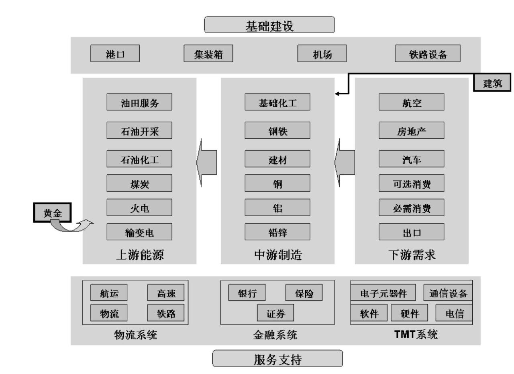

图4-1 行业关系链

2.  行业的需求与供给。分析的难点在于产品和服务的价格往往是边际定价
3.  行业的划分
    1.  根据与经济周期关系分类

● 成长型行业：销售收入和利润增长速度相对不受经济周期影响，依靠技术进步、推出新产品、提供更优质服务等实现快速增长。例如爆发的互联网行业

● 周期型行业：销售收入直接与经济周期相关，行业波动较经济波动更大，经济衰退时的产品购买被延迟到经济复苏，如珠宝业、耐用品（收入弹性大）、证券行业、钢铁、采掘业、航空、机械设备等。

● 防御型行业：价格受经济周期影响小，销售收入和利润缓慢增长或变化不大，如食品业、医药、烟草、公用事业中的水、燃气、高速公路等。

对企业所在行业划分为周期和非周期行业是十分必要的，它显著影响着公司的风险因素，从而影响公司的价值判断，后面第七章我们将有所论述。成长、周期、防御三种类型的界限不一定非常清楚，有些行业可能兼具当中两种。

1.  根据发展前景分类。如何判断行业的增长前景是否广阔呢？
    1.  第一是这个行业的目标顾客群，有的行业几乎涉及所有的人，例如食品、医疗，而有的行业只涉及小众人群，例如户外探险、极限运动，目标顾客群大的行业未来必定会发展出大市值公司。
        1.  第二是目标顾客群产品的渗透率，如果渗透率不高，存在继续增长的空间，当大部分顾客都拥有了产品时，则该行业变为成熟行业。\#\#\#图4-2\#\#\#所示为美国各个行业产品的渗透率的演变。
        2.  第三是顾客的人均消费水平
        3.  第四是产品的结构

● 朝阳行业：未来发展前景看好的行业，创立之初常常十分弱小（幼稚行业），但拥有巨大的增长空间，如信息行业、新材料、新能源等。

● 夕阳行业：未来发展前景不乐观的行业，营业收入通常会萎缩的行业如钢铁业、纺织业等。

1.  根据所采用技术的先进程度分类

● 新兴行业：采用新兴技术进行生产、产品技术含量相对高，如电子商务、航天、基因工程等。

● 传统行业：采用传统技术进行生产、产品技术含量相对低，如农业、资源型企业、电力、食品饮料等。

1.  根据要素集约度分类

● 资本密集型行业：需要大量投资的行业，例如钢铁、重工业、房地产等。由于此类公司需要大量资本支出，自由现金流低，因而公司合理估值都不会太高。

● 技术密集型行业：技术不断更新的行业，例如手机、计算机、互联网行业。此类公司则面临前述技术变革的风险。

● 劳动密集型行业：需要大量人员劳动力的行业，例如纺织、制造业、餐饮业等。在中国人口红利结束的背景下，未来面临着人员工资不断上涨的压力，如何更有效地提升人员的工作效率成为公司的竞争优势来源。

◆ 4.2 行业生命周期与证券投资

表4-1 行业生命周期特征

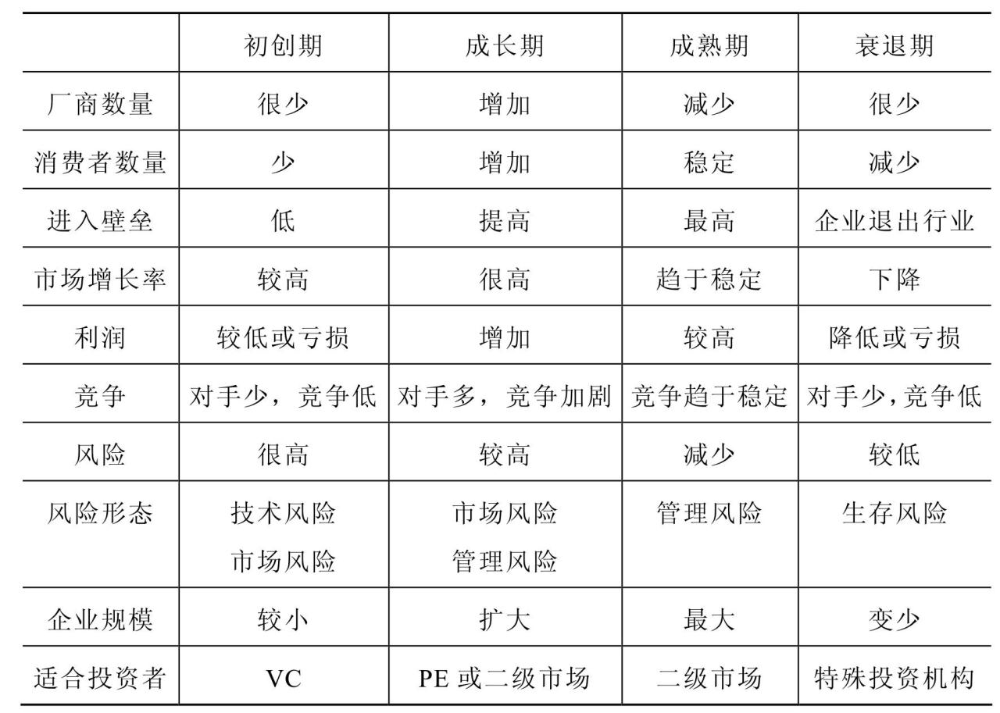

◆ 4.3 行业结构分析

表4-2 行业的市场结构分析

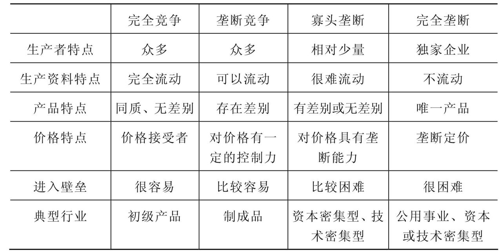

◆ 个人总结

\>\> 在宏观经济下行时，更应注重投资行业的选择。

\#\#\#跳过中间的章节\#\#\#

◆ CHAPTER 07 系统的价值评估

\>\> 仅仅会判断公司的竞争优势无法构成价值投资的内涵，如何在此基础上确定公司的内在价值是本章所要解决的问题。

◆ 7.1 估值体系

\>\> 公司价值不是简单的低市盈率或者低市净率，也不是现金流贴现模型机械静态的运用，投资者首先应当在观念上建立一套相对完善的估值体系，知晓公司价值的构成，选取适当的方法与工具进行评估，并且明晰这些运用的背后存在哪些难点和局限。

那么什么才是一个较为完善的估值体系呢？按照从低到高的价值划分，一个公司的价值分别有清算价值、账面价值、重置价值、盈利价值、成长价值以及不同所有者不同价值。

\#\#\#中间跳过很多节\#\#\#

埃斯瓦斯·达莫达兰所著《投资估价》一书研究得出美国股票市盈率的倒数和长期国债利率之间的相关关系高达0.795，长期国债利率每上升1％，股票市盈率的倒数将上升0.716％。而当公司利润增长速度越快，公司股票实际的投资回收年限就越短，合理的市盈率应该越高。

三 正常盈利下市盈率经验倍数

为什么这里强调的是正常盈利状态的公司，因为亏损的公司计算的市盈率是负数，该指标失效，而微利的公司因为其净利润的分母小，计算出来的市盈率会高达成千上万，指标会非常高，但是公司的估值实际未必真的高。

按照经验判断，对于正常盈利的公司，净利润保持不变的话，给予10倍市盈率左右合适，因为10倍的倒数为1/10=10％，刚好对应一般投资者要求的股权投资回报率或者长期股票的投资报酬率。

对于未来几年净利润能够保持单位数至30％增长区间的公司，10～20多倍市盈率合适。30倍市盈率以上公司尽量别买，并不是说市盈率高于30倍的股票绝对贵了，而是因为仅有少之又少的伟大公司既有超高的盈利能力又有超快的增长速度，能够长期维持30倍以上的市盈率，买中这种股票需要非同一般的远见和长期持有的毅力。一般的公司也不可能长期保持超高的利润增长速度，因为净资产收益率受到竞争因素的限制，长期能够超过30％的公司凤毛麟角，对应的可持续增长率也不会长期超过30％。如果你组合里都是30倍市盈率以上的公司，奉劝还是小心谨慎些好，因为能够称为伟大公司的真的非常稀少。

**60倍市盈率以上为“市盈率魔咒”或“死亡市盈率”，这时候股票价格的上涨最为迅猛，市场情绪最为乐观，但是很难有公司、板块以及整个市场能够持续保持如此高估值**，例如，2000年美国的纳斯达克市场，2000年和2007年的中国A股市场，1989年的日本股票市场等，无一能够从市盈率魔咒中幸免。2015年中国的创业板股票市场市盈率已经高达100倍，我们可以拭目以待，唯一的疑问是泡沫何时会破裂。

美国股票市盈率整体处于10～20倍的波动区间，平均在14、15倍，其倒数对应6.5％～7％的长期回报率，而6.5％～7％长期回报率是由每年利润实际增速3％～3.5％以及3％～3.5％的股息回报构成。

\#\#\#中间跳过几段\#\#\#

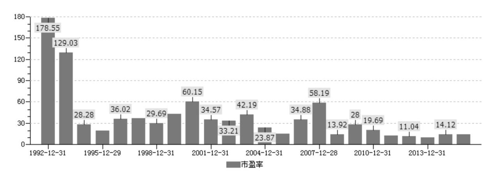

图7-5 上证综指市盈率分布图

图7-5所示为上证综合指数各年度市盈率分布状况，中国由于是新兴市场，投资者以散户为主，不够理智，市盈率波动区间基本集中在10～60倍区间。2000年和2007年上证综指市盈率均达到了60倍左右，因而开启了两次长达5～6年的大熊市。中国股市的特征是牛短熊长，牛市时股价上涨速度令人瞠目结舌，同时也透支着上市公司未来多年的业绩增长，因而需漫漫熊市通过公司业绩的逐步上涨消化高估值。中国股市因为新股发行制度为审批制、资本管制、中国人赌性过强等因素，导致众多的上市公司长期处于高估状态，虽然也出现过涨幅数倍的大牛市，不过之后终究是一地鸡毛，过去很长时间内股票资产的回报率并不尽如人意。在中国过去25年证券市场发展过程中，真正整体处于低估的时间只有3个，股份制改革前期的2005年，上证综指1000多点，处于10多倍的市盈率水平。2008年因为经济危机引发市场恐慌使得上证综指最低1600点，也是10倍出头的市盈率水平。而刚刚过去的2011—2013年熊市期间，上证综指长期处于两千多点，仅10倍市盈率左右。投资者只要对市盈率指标熟悉，拥有大的格局观，就不难做到在过去几年的熊市中播种，即便是买到2500点而不是最低的1800点。最低点通常很难买到，但低估区间是可以买到的。中国经济增长较快，整体市盈率15～25倍大致是合理区间。目前，上证指数4500点（2015年4月），对应20倍左右的市盈率，并不算便宜，长期投资回报率正在下降，而且指数中分化严重，大盘蓝筹仍然较为便宜，但众多中小盘股票估值处于严重泡沫区间，下跌风险巨大。

四 市盈率国与国的比较

市盈率可以从大的方向上指导资本在全球市场的流动，如果哪个国家股市的市盈率较低，就存在获利的可能性。在全球投资上做得最为知名的投资大师莫过约翰·邓普顿。约翰·邓普顿被福布斯资本家杂志称为“全球投资之父”及“历史上最成功的基金经理之一”。邓普顿在20世纪50年代首开全球化投资的风气，他认为世界各国有不同的经济盛衰循环，不应将获利机会限制在单一国家内，若加上以个别公司由下而上的选股方式，发掘世界各地的投资潜力，不但可使风险分散，还可为资本创造利润。邓普顿曾经说过，人们总是问我，前景最好的地方在哪里，但其实这个问题问错了，你应该问：前景最悲观的地方在哪里？而他的另一句名言则是：街头溅血是买入的最佳时机，甚至包括你自己的血在内。

市盈率是邓普顿全球投资的指路明灯，正是市盈率指引邓普顿在20世纪60年代进入日本市场，80年代进入美国市场，在90年代后期又进入韩国市场，最终都获得巨大成功。邓普顿的例子也说明了少数几个重大的投资决策才真正改变了人的一生。

20世纪60年代，邓普顿在日本股市市盈率仅有4倍时进行投资，而同期美国股市市盈率大约19.5倍，但是日本整体经济维持在10％左右的增长速度，日本公司当时的利润增长率极高，而美国经济增长速度仅在4％左右。1960年代的日本被美国投资者认为是一个工业落后的小国。

\#\#\#中间跳过几段\#\#\#

\>\> 五 市盈率运用

（一）历史对比

市盈率的一个运用是将公司目前估值状况与自身历史估值状况进行对比。计算出历史各年度的平均市盈率、最大市盈率、最小市盈率等数据，再与目前的市盈率对比，就可以大致知道股票的估值便宜与否，如果处于历史市盈率的下轨，则较为便宜。不过值得一提的是历史数据未必能够简单用来对比，因为公司所处的发展阶段未必相同，公司所面临的竞争环境未必相同。表7-2所示为兴业银行历史市盈率数据。

表7-2 兴业银行历史市盈率

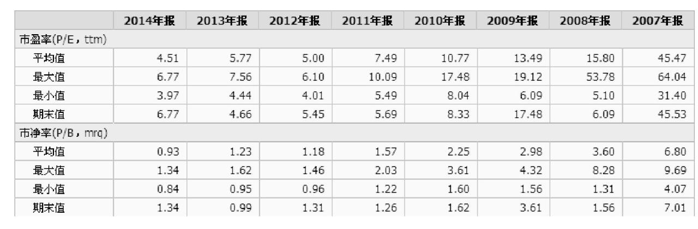

（二）同行对比

市盈率另一个常见用法是用标的公司的市盈率和同行可比公司或者行业平均市盈率比较，以得出标的公司便宜与否，而不同行业之间的公司无法直接比较市盈率高低。问题的关键就在于选择可比的公司，而事实上没有两家公司是完全一样的，投资者在选择可比公司后，仍然需要考虑风险、增长速度、现金股息支付率、销售规模、行业地位等因素，对选择的市盈率进行调整才能够使用。如表7-3所示，如果你相信兴业银行在行业内拥有竞争优势，未来能够脱颖而出，利润增长速度较快，风险偏好适合，但目前兴业银行的市盈率却是行业里较低的几位，那么兴业银行可能是被低估的。

**国内A股市场目前存在一个显著偏见，喜好小盘公司**，认为其规模小未来增长速度快，增长空间高，因而给予小盘公司比行业龙头公司更高的估值倍数。而事实是行业龙头公司为什么能被称为龙头，恰恰是因为过去强有力的竞争优势导致其不断领跑行业，规模才能够做大。未来绝大部分的行业市场份额仍然会继续向大公司集中。小公司中确实可能会有少数几家因为其机制灵活，商业模式创新等因素会后来赶上，但小公司作为一个整体是低于行业龙头大公司的。上述偏见就给了价值投资者买入的机会。例如，格力电器一直处于空调行业的龙头地位，2010—2014年近五年来，不论净资产收益率还是净利润增长速度平均都高达30％，市场份额也越来越高，但是由于投资者的小盘股偏好，过去5年格力电器股票大部分时间市盈率仅在10倍左右波动，给予了投资者持续购买便宜绩优股票的机会，2010—2015年，格力电器股价已经上涨约4倍，如图7-9所示。同样的偏见还发生在地产股龙头万科的身上。

（三）动态市盈率

用上一年度的公司净利润数据计算而得的市盈率被称为静态市盈率。静态市盈率的缺点在于使用的是历史数据，无法反映对公司未来的预期。假设公司的静态市盈率为10，但未来一年净利润下滑一半，来年的市盈率就变成了20，这时静态市盈率仅是使得公司估值看起来便宜罢了。相反，如果公司未来一年净利润能够增长50％，市盈率就下降到了6.7，静态市盈率就会低估了公司的价值。因此，我们会使用动态市盈率来弥补静态市盈率的缺点。动态市盈率是指以下一年度的预测净利润计算的市盈率，等于股票现价除以下一年度每股收益预测值。除了可以计算下一年度的动态市盈率外，还可以计算下两年、三年的动态市盈率。此外，还存在TTM（Trailing Twelve Months）市盈率，中文称为滚动市盈率，是指利用已经公布的过去四个季度（12个月）的每股收益和股价计算的市盈率。

值得注意的是，分析师盈利预测往往根据过去的数据线性推测未来，在公司基本面没有发生拐点前，这样的做法是可行的，但是一旦发生拐点，则预测的合理股价与现实中的股价就存在天壤之别。在预测公司利润增长速度时，也需考虑利润本身的规模大小，利润基数越大显然增长越困难。分析师的盈利预测整体上存在乐观倾向，预测数据往往较实际值高。《麦肯锡季刊》（2010年5月）中《股票分析师，依然“太牛”》一文指出，在过去的25年间，分析师始终是一成不变地过于乐观，他们预计每年盈利增长率的范围是10％～12％，而实际的增长率为6％。在这段时期内，盈利的实际增长率超过预测的情况只出现过两次，这两次都出现在衰退过后的恢复期中。平均来看，分析师的预测几乎百分之百都过高。而根据我对中国A股分析师2005—2006年盈利预测的一项研究，结论是，A股分析师的盈余预测同样带有乐观倾向；在年初的分析师预测中，只有约20％的预测能最终落在偏离真实值正负10％的范围内，而到了年末，这一比例则达到了45％左右；越多分析师对公司盈余做出预测，越能有效地减小预测的误差；分析师在钢铁、有色金属等周期性行业上极易产生乐观或悲观的预测，因此，在利用分析师预测进行估价时，需要根据行业的差异对预测的可信度做出判断。

六 投资大师眼中的市盈率

（一）彼得·林奇的PEG

PEG指标（市盈率相对盈利增长比率）是用公司的市盈率除以公司的盈利增长速度。 PEG指标是著名基金经理彼得·林奇发明的一个股票估值指标，是在PE（市盈率）估值的基础上发展起来的，它弥补了PE对企业动态成长性估计的不足，PEG告诉投资者，在同行业的公司中，在市盈率一样的前提下优先选择那些增长速度高的公司，或者在同样的增长速度下选择市盈率较低的公司。

PEG，是用公司的市盈率除以公司未来3年或5年的每股收益复合增长率。市盈率仅仅反映了某股票当前价值，PEG则把股票当前的价值和该股未来的成长联系了起来。比如，一只股票当前的市盈率为30倍，传统市盈率的角度来看可能并不便宜，但如果其未来5年的预期每股收益复合增长率为30％，那么这只股票的PEG就是1，可能是物有所值。当PEG等于1时，表明市场赋予这只股票的估值可以充分反映其未来业绩的成长性。如果PEG大于1，说明公司的利润增长跟不上估值的预期，则这只股票的价值就可能被高估，PEG作为一个估值的工具，本质上还是现金流折现模型，是为了方便计算简化成为一个系数，1倍PEG总体上是对未来3年的复合增长率在20％～30％之间，之后按5％稳定增长，同时在12％的风险水平下对投资合理估值的经验总结。随着高增长速度和年限、稳定增长率水平、对未来风险水平的预期等因素的变化，合理PEG的标准也会随之改变。

PEG告诉投资者相对市盈率估值而言更应该关注公司的利润增长情况。短期内，利润增速高的股票在一段时间内走势都会强劲，即便估值已经偏高。例如美的电器2009年ROE比格力好，股价走势就比格力强，招商银行2009年ROE低，利润衰退大，股价就落后于行业乃至大盘表现，潍柴重机出个净利润增长100％的预告，股价就会连续三个涨停板。这时，估值就往往会被市场放到第二位。事物的另一面是并不会存在很多的公司能够长期保持很高的增长。现在A股的一种谬论是中小盘的公司市盈率很高但是未来增长也很高，所以股价是有支持的，并且喜欢列举腾讯、百度、阿里巴巴的例子证明长期高市盈率是可以的。问题是上述三家都是事后才被证明盈利的持续高增长，而且无数的互联网公司中也就诞生了这三巨头，它们的成功也是基于无数细分领域的小公司倒下了，期望每家公司都能够成为行业巨头的想法并不现实。此外，一些公司的增长是通过不断增发新股融资，股东加大投入才实现的，这些公司本身的内源增长并不高。

（二）戴维斯双击

在低市盈率买入股票，待成长潜力显现后，以高市盈率卖出，这样可以获取每股收益和市盈率同时增长的倍乘效益。这种投资策略被称为“戴维斯双击”，反之则为“戴维斯双杀”。

戴维斯双击的发明者是库洛姆·戴维斯。戴维斯1950年买入保险股时PE只有4倍，10年后保险股的PE已达到18倍。也就是说，当每股收益为1美元时，戴维斯以4美元的价格买入，随着公司盈利的增长，当每股收益为8美元时，一大批追随者猛扑过来，用“8×18美元”的价格买入。由此，戴维斯不仅本金增长了36倍，而且在10年等待过程中还获得了可观的股息收入。

（三）约翰·聂夫的成功投资

约翰·聂夫1964年成为温莎基金经理，直至1994年退休，著有《约翰·涅夫的成功投资》一书。约翰·聂夫在温莎基金31年间，复合投资回报率达13.7％，战胜市场3％以上，22次跑赢市场，总投资回报高达55倍。约翰·聂夫自称低市盈率投资者，对市盈率的理解较为深刻，以下为他运用低市盈率的投资法则。

1.低市盈率（P/E）；

2.基本成长率超过7％；

3.收益有保障（股票现金红利收益率要高）；

4.总回报率相对于支付的市盈率两者关系绝佳；

5.除非从低市盈率得到补偿，否则不买周期性股票；

6.成长行业中的稳健公司；

7.基本面好。

七 避免市盈率误用

虽然市盈率指标简单易用，但也正是因为简单使得投资者缺乏系统考虑公司基本面的情况，误用市盈率的情况普遍存在。以下为较为常见的误用之处。

1.周期公司误用。周期行业，由于产品大多同质化，公司盈利取决于产品的供求关系。在行业波峰时周期公司盈利状况很好，市盈率分母较大，市盈率较低，给了投资人估值看上去很便宜的错觉，但正是因为丰厚的利润吸引了产品供给的增加，很可能发生行业反转，公司盈利下降的情况，股价下降，市盈率反倒上升。而在行业低谷时，公司普遍亏损或者微利，市盈率高达成百上千，股票估值看上去很贵，但真实却可能很便宜，一旦走出低谷，盈利上升，反倒出现股价越涨市盈率越低的情况。因而周期公司除了关注市盈率指标的变动，更需要结合后面我们所说的市净率指标判断。

2.前景变差，业绩下滑。运用市盈率最关心的仍然是公司未来的发展前景，投资者要确保买到的不是未来业绩大幅下滑的公司，否则即便现在买入的市盈率再低，也无济于事。

3.现金流差。市盈率指标关注的是公司的净利润情况，这使得在使用时缺乏从DCF模型的角度去思考公司的现金流情况。如果公司利润状况不错，但是经营性现金流净额很少，而投资性现金流净额又很大，这样低市盈率的公司，其实背后是因为公司的价值低。

4.风险过高。之前我们提到市盈率的驱动因素之一是贴现率，风险越大的公司贴现率应该越高，市盈率水平越低。如果某些行业或者个股市盈率低于其他，未必真的便宜，很可能是因为承担了过高的风险，例如财务风险过高，运营风险过高等。

5.忽略增长及空间。现金流贴现模型显示公司大部分价值来自于未来永续增长部分，而这部分就和公司增长的空间相关。行业及个股的增长速度和空间很大程度就决定了行业与行业之间，个股与个股之间的市盈率差异。

6.忽视可持续的经营利润。计算市盈率要扣除非经常性损益，考虑到投资收益、补贴或者资产重估收益等因素，关注利润是否来自主营业务，持续性如何。有的公司利润也是来自主营业务，但主要集中在单个项目，单个项目一旦完成，利润不可持续。

7.假账风险。由于市盈率计算基于公司净利润水平，而净利润是公司选择会计政策、会计估计编制出来，人为调节的空间很大。如果投资者选择了一份虚假的财务报表作为价值评估，将得不出任何意义。

8.用别人更贵来证明自己便宜。投资者经常用估值很高的同行业公司来证明标的公司的便宜，事实上，两者可能都是很贵的，只是参照公司更贵，这正是比较估值法的重大缺陷。

总的来说，市盈率大致反应了股票的贵贱，但是高市盈率未必真贵，低市盈率未必真便宜，仍然需要具体分析。从概率来说，如果一个组合涵盖了来自不同行业的低市盈率公司，那么这个组合长期跑赢市场指数的机会很大。

◆ 7.4 市净率

\>\> 市净率（PB，price to book value)指的是每股股价与每股净资产的比率，或者以公司股票市值除以公司净资产。一般来说市净率较低的股票，投资价值较高，相反，则投资价值较低，但在判断投资价值时还要考虑当时的市场环境以及公司经营情况、盈利能力等因素。

市净率估值优点在于净资产比净利润更稳定，市盈率对微利或者亏损的公司而言并不适用，但是微利或者亏损的公司仍然可以使用市净率进行评估，除非公司资不抵债。

一 低市净率组合回报

类似低市盈率组合，低市净率组合同样被众多的研究和实践证明能够长期跑赢市场指数。

\>\> 类似低市盈率组合，低市净率组合一样不能保证每个年度均战胜市场。

申万风格指数系列中同样有将市净率按照低、中、高三个组别分别编制了三只市净率指数。三只市净率指数从1999年12月30日开始计算，当时的数值均设定为1000，截至2015年5月5日，低市净率指数点位是7209点，也就是在15年的时间里收益率为620％，而中市净率指数点位为5415，高市净率点位仅为2302。申万风格市净率指数同样证明了在中国低市净率组合收益率长期是能够大幅战胜高市净率组合。图7-10所示为低、中、高市净率指数走势。

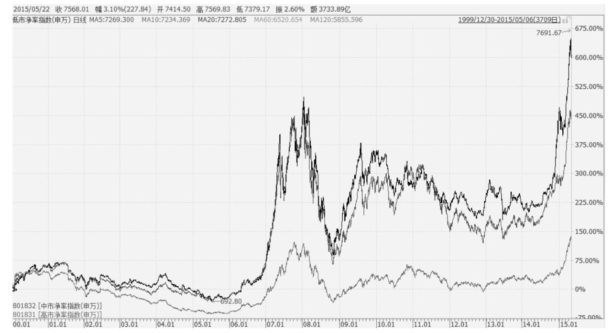

图7-10 低、中、高市净率指数走势图

二 市净率驱动因素

市净率显著和以下三个因素相关，只有在充分考虑了影响市净率的各种因素后，才能对公司的市净率是否合理做出判断。

假设直接将公司净利润当成未来现金流进行贴现，那么一个常数增长的贴现模型可以表达为：

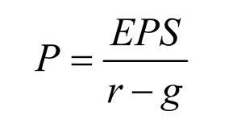

其中：P=公司股票价值；

EPS=下一年预期的每股收益；

r=股权投资要求的回报率（贴现率）；

g=每股收益的增长率（永久性）。

上述公式左右两边均除以BV，可以写成：

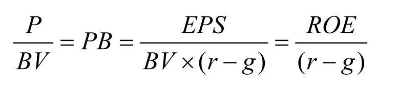

其中：BV=账面净资产

ROE=净资产收益率

因此，我们可以看到市净率指标最主要和净资产收益率、贴现率、增长率这三个参数相关。如果公司的利润不增长，则PB=ROE/r，r值一般取10％左右。大多数的竞争行业中的公司净资产收益率长期会和社会平均的股权投资回报率相同，短时期太高或者太低都会引发竞争对手的进入或者退出，从而使得公司净资产收益率也会围绕在10％左右波动。这样一来，对于大部分不增长的公司，合理的市净率就在1倍左右，如果公司有所增长，合理的市净率就会略微超过1倍。仅有少数公司长期具备超强的竞争优势，净资产收益率远大于10％，则这样公司的价值就会远超账面净资产，合理市净率就为几倍。如果存在市净率小于1的股票，即便该公司盈利能力较差，但是存在着账面价值和重置价值作为支撑，很有可能是投资机会。

邓普顿在20世纪70年代末进入美国股票市场除了市盈率较低的因素以外，市净率也跌破1倍，而历史上道琼斯工业指数跌破1倍市净率只有2次，前一次是处于经济大萧条时期的1932年。如果根据通货膨胀对道琼斯工业指数成分公司持有资产的账面价值进行调整，当时的整体股票价格仅相当于重置净资产的0.59倍，站在重置价值的角度看，投资价值更为突出。如图7-11所示。

而在中国A股市场，上证综指从未跌破过1倍市净率，最低是2013年的1.34倍，在刚刚过去的这几年熊市，由于小盘股偏好，倒是有众多业绩仍然出色的大盘蓝筹公司跌破过1倍市净率，虽然我们并不能够精确预计出指数的底在哪里，但是过去几年的熊市无疑成为股票投资播种的好季节，如图7-12所示。

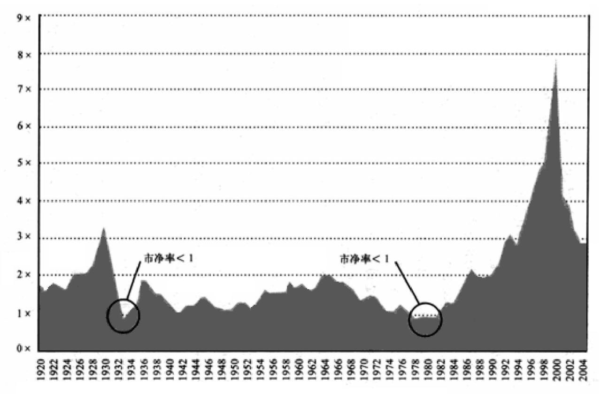

图7-11 道琼斯工业指数市净率图

图片来源：《邓普顿教你逆向投资》

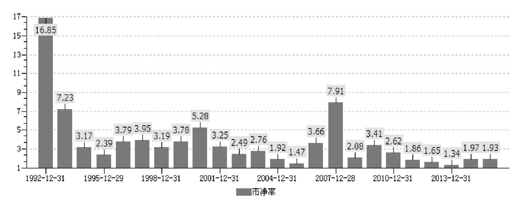

图7-12 上证综指市净率图

三 ROE与PB组合

根据上述PB与ROE的关系，我们不难理解为什么那些净资产收益率高的公司市场价格高于账面价值，而那些净资产收益率低的公司市场价格低于账面价值。真正吸引投资者注意的是那些市净率和净资产收益率不匹配的公司，投资低市净率但高净资产收益率的股票，回避低净资产收益率但高市净率的股票。

\>\> 四 避免市净率误用

市净率同市盈率一样会存在误用的情况，以下为较为常见的误用之处。

1.市净率低不代表一定有价值。市净率的一个重要驱动因素是净资产收益率，因此，那些跌破1倍市净率的股票很可能是因为净资产收益率非常低，不到10％，公司的盈利价值本身就很低，所以只配享有很低的市净率。投资者投资这类型的公司除非看到净资产收益率有提升的可能，或者是有资产价值释放的可能，以及分配较高的现金股利的可能，否则就真的是花了低价钱买了次货。

2.资产重估或资产虚增导致市净率低。账面净资产虽然不像净利润一般变动幅度很大，但是如果公司同样存在财务造假，账面净资产实际价值很小，市净率评估也会高估了公司的价值。此外，在香港股票市场，有许多地产股的地产价值本身就经过重估，账面报出来的数目就是重估后的价值，而地产重估操纵空间同样很大，因此在香港股票市场中，看到极低市净率（低至0.1、0.2倍）的地产股也不真代表股票有价值。再说，那些看上去很值钱的地产，如果不处置发放现金股息给股东或者进行开发，资产价值没有得到释放，基本是和小股东不相关的。

3.风险过高。市净率的另一个重要驱动因素是贴现率。如果公司承担着过高的风险经营，很可能某些判断失误，就会造成账面净资产全部损失殆尽。

◆ 7.5 市盈率与市净率的组合

\>\> 市盈率和市净率都是评估公司价值的重要方法，一个从盈利的角度来看估值，而另一个从资产的角度来看估值，而将两者同时用于评估公司价值，会发现许多更有价值的信息。连接市盈率和市净率关系的是公司的净资产收益率。我们从以下公式可以看出三者的关系。

P/EPS×EPS/B=P/B即PE×ROE=PB

公式表明，PB和ROE、PE正相关。如果PE不变，ROE越高，PB越高；ROE不变，PE越高，PB越高。除了ROE和PB、PE相关外，PB、PE的驱动因素均有利润增长率G这个指标，因此继续扩展开来，一个公司的估值需要从PB、PE、ROE、G这四者的组合来看。

\>\> 一 高PB、高PE组合

\>\> 绝大部分的公司其实不具备超高增长与超高ROE，高PE与高PB往往是巨大泡沫的特征，面临巨幅下跌风险。

\>\> 二 高PB、低PE组合

该类公司仍然具备较高的ROE，但往往利润增速不高，或者被认为增长空间有限，如果ROE能够持续维持高位，并且有所增长，低PE或许代表着存在价值低估的可能性，回报较好，如果ROE不能够维持高位，高PB将会带来巨大的股价下跌空间。

\>\> 三 低PB、高PE组合

该类公司经营业绩不佳，处于微利状态，造成PE倍数很高，甚至有的公司亏损，PE为负值。盈利低下的原因可能是由于行业周期陷入了低谷，也可能是自身管理不善。市场知道其业绩差，也给以很便宜的估值（以PB衡量），如果ROE一直处于低位，股票回报较差。这类公司ROE日后如果能够提升，属于“困境反转型”或者“业绩提升型”，涨幅将会惊人，但是得出判断需要掌握到行业或者公司的最新信息，以及对公司变化和产业环境的深刻洞察。

◆ 7.6 估值五要素简化模型

\>\> 做价值投资的朋友们都会面临着如何结合上市公司的基本面情况对股票进行估值的问题。采用DCF之类的贴现模型往往考虑因素较多，甚至要具体预测到某一会计科目，被人戏称为精确的错误。而用市盈率、市净率等相对估值方法又简单片面地只考虑某一因素，容易掉入估值陷阱。我根据自身的投资经验总结了影响估值的五大要素，即增长空间、增长速度、增长效率、ROE（净资产收益率）、风险。根据这五要素，投资者至少可以理解为何不同行业之间的估值不同，同一行业的公司之间估值也不同。在此基础上，我发明了一个简化的估值模型，希望能帮助大家对股票进行评估。

一 增长空间

巴菲特有一个投资原则是“这家企业是否有良好的长期前景。”一个公司能否成长壮大是建立在其是否拥有充足增长空间之上的。贴现模型中都会假设一个永续增长率，永续增长率越高，股票估值就越高，增长空间就是对这一参数的通俗理解，那些拥有巨大增长空间的企业自然会受到投资人的喜好。

公司的增长空间主要来源于它所在行业的增长空间，从哪些方面去考量一个行业是否有增长空间呢？我认为可以从顾客群的渗透率、人均消费水平、产品结构等方面判断。例如，前些年某即时通信公司客户数量占我国人数比例较低，由此判断仍有成长空间。某体育服饰公司认为我国人均年运动服饰消费量远低于发达国家人均水平，由此得出仍有较大的发展空间。而某食品公司认为我国冷鲜肉占肉类消费结构相比发达国家较低，也判断增长空间巨大。公司的增长空间还源自它对同行业其他公司空间的挤占。例如，即便行业没有增长空间，拥有新商业业态、模式的公司对旧有公司的空间的挤占。增长空间的因素或许也解释了前两年市场对新能源、新材料等新兴行业的炒作。总的来说，企业需要有竞争力，这样增长空间才是属于自己的，而不是属于其他公司或者行业的。

二 增长速度

增长速度是显著影响股票估值水平的因素之一，毕竟长期的增长空间较为遥远，短期公司收入、利润的增长速度则是可以被大家预测和证实的。许多投资人很喜欢用PEG指标对快速增长的公司进行估值。短期收益的快速增长并不能使贴现模型中前几年的贴现值提高多少，但重要的是短期增长后的收益能够保持的话，那么长期的每一期收益都能得到大幅提升，从而企业长期的价值就能得到大幅提升。由于经营杠杆等诸多因素，利润的增幅往往较收入增幅快，但收入乃利润的源泉，保守的投资者可以选择收入的增长速度作为股票的估值因素。而收入则可通过对销售产品的数量、价格及结构等方面进行预测。

三 增长效率

如果某一公司的利润增幅虽然很快，但却被存货、应收账款等占用了绝大部分的现金流，而另一公司利润增幅也很快，但需要不断将利润投回公司进行资本支出才能增长，股东根本不能自由支配利润，那么这两类公司的增长质量和效率高吗？回答显然易见。一般而言，贴现模型中对公司自由现金流的定义为扣除调整税后的净营业利润+折旧摊销-资本支出-运营资本支出，上述两种公司后两项较大，造成了自由现金流的下降，公司价值自然也随之下降。

我用经营性现金流/净利润与投资性现金流/净利润两个指标来衡量公司增长的质量与效率。前一个指标大于一为佳，后一个指标在净利润增长速度越快的情况下尽可能地小最好。例如风机行业虽然基本也是挣多少利润就资本支出多少，但却实现利润连续数年翻倍增长的奇迹。而钢铁行业也是挣多少就投多少，但即便行业景气时增速也不算快，更别提近年利润不断下滑仍需进行高额资本支出了。这一特性造成了重资产公司与轻资产公司的估值差异，究其原因与行业特性、商业模式等因素相关。在我观察到的行业中，白酒、软件、百货的经营性现金流优异，投资性现金流又相对较低，因而历来在所有行业中享有较高的估值。

我还发现如果某一公司即将进行数量是净利润几倍的投资，那么该公司股票往往会跑输行业指数很长时间。这或许是因为大的投资项目投产后市场不确定或初期产能利用率较低，而企业又因大额投资借债太多，产生的利息费用与折旧费用拖累了利润水平。

四 ROE

如果只用一个指标来衡量公司是否经营优秀，那这个指标非ROE莫属，许多投资人也把高ROE列为选股的必选指标。公司也只有在ROE大于股东权益成本的情况下实现上述利润增幅才有意义，否则利润增长越快，股东价值毁损越多，利润的增加也只是建立在不断地高资本投入却低产出之上。公式利润可持续增长=ROE×（1-分红率）也可看见，只有在高盈利能力的情况下，利润增幅才有可能越快，盈利能力对公司利润再投所产生的复利效果起着至关重要的作用。值得注意的是，估值时用到的ROE应是长期均衡ROE，不是某一两年过高或者过低的ROE，公司的长期ROE水平显著影响着市净率的高低。

长期高且稳定的ROE则表明公司可能存在着某些竞争优势来获取超额利润，大多数价值投资者都喜欢投资这类业绩持续优异的公司。当然也有投资者喜欢投资ROE提升的公司，这类公司ROE先前并不优异，但因为行业周期、管理提升、资产剥离、分拆等因素大幅提升，股价更是一鸣惊人，俗称黑马股投资。

公司的长期ROE在我看来取决于两大因素：其一，公司所处行业的产业结构，波特五力模型对此做出了很好的阐述。进入壁垒、替代产品、供方议价实力、买方议价实力、现有竞争对手等五种竞争作用力决定了行业的盈利能力；其二，公司拥有的资源与能力，包括研发能力、生产能力、销售能力、财务能力等诸多能力决定了公司的竞争优势，公司拥有更高的经营效率就更可能拥有超额收益。

影响公司ROE的因素很多，但有两个比较容易观察又重要的因素被我看中。一是产品的差异化；二是市场份额或集中度。产品的差异化程度决定公司对消费者的议价能力，也使潜在竞争对手不易进入，更避免了同现有竞争对手打价格战。而维持甚至不断上升的市场份额则证明了公司的持续竞争力。行业的市场份额如果被少数几个公司占据，集中度很高，则证明了行业内竞争相对不激烈，对于客户和供应商的议价能力更强，更能充分享受整个产业链的繁荣。例如看好众多的钢铁企业，不如看好三大铁矿石厂家。看好分散的房地产行业，不如看好更为集中的工程机械。虽然高ROE有迹可循，但我承认判断ROE的变动趋势是非常困难的事情，消费者偏好的改变、新技术的产生、更强的竞争对手、投资失误等诸多因素都会让原本的高ROE跌落，使得投资者遭受重大损失。持有持续走高ROE的股票是投资者梦寐以求的事情！

五 风险

风险非常容易被投资人忽视，在贴现模型中的表现形式就是贴现率了。即使公司的收益情况不错，但承担了过高的风险，估值也会降下来。一般而言，贴现率取8％～0％，这是由美国长期股票收益率统计而来。

我认为存在三种风险，分别是财务风险、经营风险及市场风险。财务风险，即由财务杠杆所带来的风险，并非所有负债都是风险，顾客的预收款及拖欠供应商的应付账款自然多多益善，但有息负债就越少越好了，因为还不起顾客和供应商还可以动用借款资源，但有息借款还不起，所有人都会上门逼债，企业就面临现金流断裂和破产风险。我用有息负债率[(短期借款+一年内到期的非流动负债+长期借款+长期债券)/所有者权益]衡量财务风险，当公司该指标大于1时，风险偏大。

经营风险则是由经营杠杆所带来的风险，经营杠杆越高，说明成本刚性较大，抵御经济波动的能力较小，收入的小幅减少就能带来经营利润的大幅下滑。要了解经营杠杆需深入了解公司的成本结构，固定资产比例指标[(固定资产+在建工程)/总资产]也可从一个侧面来衡量。

市场风险体现了企业收入对经济周期的敏感程度，与行业特性相关，对企业所在行业划分为周期和非周期行业是十分必要的。周期行业公司在经济低迷时收入下降更多，利润下降更厉害，因而在熊市中下跌最为惨烈。我认为衡量周期性的一个办法是看其产品供给时间以及产品的使用寿命。供给时间与使用时间较长的例子是造船业，2007年航运火热，某船厂时间表居然排到了2011年，而造出的船舶可用一二十年，该公司股票至今一蹶不振。

自然，估值中的贴现率可由上述三种风险而定。

六 简化模型

根据上述五要素，我发明了一个简化的估值模型，公司的合理市净率=(1+净利润增幅)3×(ROE/贴现率)。该模型事实上是粗略计算的一个两阶段贴现模型，贴现模型中的第一阶段是保持了3年期的增长，第二阶段利润永续不变。经过我的演算，简化模型的计算值略微小于该贴现模型的计算值，两者差异不大。简化模型包括两部分，短期（未来三年）净利润的增长部分和由短期增长所带来的长期净利润水平保持不变部分。之所以用（1+净利润增幅）的三次方是因为我认为太长期盈利预测并不现实，市场上的分析师最常见的也只是预测了三年的利润，而且事实证明误差已经非常大。ROE为投资人认为公司未来可能长期保持的ROE，值得注意的是我国公司财务计算的是期末ROE，这里需要转换为期初ROE，转换公式为期末ROE/（1-期末ROE）。至于贴现率取9％～11％，风险大的，取大值。至此简化模型已经量化了五要素中的三要素，而增长空间则需靠人为主观判断，如果认为存在显著的增长空间，可把估值结果上调10％～20％。增长效率则需考察现金流量表情况，如果经营性现金流优异，投资性现金流又相对较低，也可上调估值10％～20％。

◆ 7.7 估值的四个层次

\>\> 第一个层次的股票估值是股价跌破净资产。如果公司长期的ROE能够维持5％～10％，甚至更高，而市净率又只有净资产的一半左右，就是比较容易把握的机会。当然这并不是说只要跌破净资产就可以随便买入，但是只要具备一定的商业常识和会计知识，还是能够挑选出有大幅上涨潜力的股票，并不需要对公司及行业的前景有多么深刻的理解，毕竟公司的账面价值或者是重置价值比较明显。我曾经写过一篇这种投资策略的文章《现金分红股价上涨奥秘与“烟蒂”股投资策略》。我提过：①“烟蒂”公司继续维持经营现状的话，光收股息，收益率也还可以。②碰上经营状况恶化的话，往下跌的空间较小，毕竟还有净资产的重置价值作为支撑。③万一运气较好，可以碰上三种上涨因素。概括起来就是向下空间有限，股息收益率不错，存在向上空间。

\>\> 第二个层次的股票估值介于1～3倍市净率之间。股票长期回报大致要求为10％，一些不错的公司长期净资产收益率能够达到百分之十几到百分之二十几，除以10％，市净率就是1倍多到2倍多。如果它们都不增长，市盈率大概就在10倍左右，如果能够增长，又有很大的增长空间的话，市盈率可以更高，市净率也可以突破3倍，具体估值方法我写过一篇名为《估值五要素》的文章论述（http://xueqiu.com/2751308955/21489163）。不过，公司业绩不都是增长同样面临下滑风险，所以ROE在10％～20％多的优秀公司给1～3倍的市净率，大致能够保障我们买到的是估值合理或者低估的价格。如果要确保股票在这个估值区间是低估的，就需要更加确定公司有更高的增长和更广的空间，则需要对公司的认识和研究更加深刻。

\>\> 第三个层次股票估值则是3倍市净率以上。在这个估值水平以上，公司成长因素占据了价值的绝大部分，因此需要对公司的基本面做出深刻的研究和对公司业绩做出细致的预测，还要加上很大的运气成分，才能确信公司始终处于如此高得估值。我认为这个已经超出一般专业散户的能力范围，需要相当的行业知识与经验背景才够研判得出公司的前景。在这个层次的竞争取决于信息优势和洞察力。

\>\> 第四个层次的股票估值则属于超级盈利能力加成长能力的超级牛股。这些公司拥有远超30％的ROE又拥有超高的增长。基本上我只见识过3种长期处于该估值层次的公司，以茅台为代表的白酒、澳门赌场股、腾讯，这些公司过去的业绩表明当时即便市净率10倍，市盈率四五十倍可能都不算贵。

◆ 7.8 现金股息再投

\>\> 一 现金股息的重要性

格雷厄姆对内在价值的定义为被事实所确定的价值，这些事实包括公司的资产、盈利和股利以及具有确定性的前景。在我看来，现金股息不但是构成公司内在价值的重要因素，更会显著影响到长期投资回报率。让我们先来理解现金股息的重要性。

第一，发放现金股息能够使得股东价值最大化。公司赚到了利润，对于管理层而言，大部分会更倾向于将利润留存公司内部，而不是发放给股东，因为利润留在公司内部，管理层就能够控制更多资源。发放现金股息可以避免过多利润留存公司被挥霍或者乱投资。

第二，现金股息降低了公司财务造假风险。持续较高比例的现金分红且又不筹资证明了公司财务的真实性，不真的赚到利润，又怎么会有钱发放给股东。

第三，现金股息再投资拥有复利效果。对于利润不增长的公司，每年的回报率是一样的，但是如果公司能够发放现金股息，投资者再将现金股息用来购买越来越多的股份，日后收到的现金股息也就越来越多，能够起到复利投资的效果。

第四，避免公司倒闭一无所有风险。如果利润一直留存公司而不发放，万一公司倒闭，多年积累将一无所有。

现金股息是熊市保护伞和牛市加速器！熊市中，现金股息是持续买入低估股票的现金来源之一，通过现金股息再投资可以积累更多的股份，从而缓冲投资组合价值的下降。牛市中，一旦股价上涨，这些额外股份就会提高收益率，因而还是收益加速器。

二 现金股息是左口袋掏右口袋吗

经常有投资者来电问我：“公司不是现金分红了吗？为什么我的总资产还少了点啊？”我说：“发放了现金分红，股价要除权除息相应降下来，还要扣红利所得税。”他就说：“那分不分，我的资产都一样，那分红有何用啊。”我无言以对。确实啊！从时点上来说，分不分现金股利，分多还是分少，对于投资者的总资产都是一样的。这就好比一颗苹果树结了苹果，整棵树卖12元，与把苹果摘下来卖2元，树卖10元没有任何差别。但是差别就在以后，好的苹果树能够年年摘下2元的苹果，卖的钱不是越来越多了吗？所以分红从时点来说无关紧要，但在长时间里却至关重要的影响到了股票的价值。

三 现金股息再投魔力

杰里米·西格尔所著《投资者的未来》向读者展示了现金股息再投资的神奇魔力。据该书介绍，如果在1871年把1000美元投资在股票上，那么到了2003年底，剔除通货膨胀因素后，这些美元的价值将增加到近800万美元。而如果没有进行股利再投资的话，积累的价值将不足25万美元。此外，杰里米·西格尔还举了两个公司的具体例子来证明现金股息再投所达到的复利威力，这两个例子同样令人震惊！

表7-15所示为1950—2003年期间IBM和新泽西标准石油两家公司的经营发展状况，IBM所处的新兴科技部门在过去的50年间占经济中的比重处于扩张阶段，而新泽西标准石油所处的传统能源部门则是不断收缩，可以看见IBM不论收入、利润、股利等增长指标全部都高于新泽西标准石油。

\#\#\#表7-15 1950—2003年年度增长率\#\#\#

在知道已知信息后，如果给投资者一个机会能够在1950年的时候投资这两家公司，那么投资者会选择哪家？毫无疑问，绝大部分的投资者会选择增长速度更快的IBM。事实也是如此，IBM在1950—2003年期间，股票价格年复利增长率为11.41％，胜于新泽西标准石油的8.77％。看到这，你真的以为IBM的投资者赢了吗？不要忘了投资者的资产等于股价乘以股数，再考虑现金股息再投资购买股票导致的股份变动因素后，结论逆转了。

由于IBM的增长速度高于新泽西标准石油，所以IBM的交易市盈率也就一直高于新泽西标准石油，这并不稀奇，好货自然价更高。但却正因为如此，更高的股价导致IBM的股息收益率要小于新泽西标准石油，从而在现金股息再投资购买的过程中，能够积累的股份数量要小于新泽西标准石油。在长达50多年的时间，通过股利再投新泽西标准石油的股东积累到的股票数量是原有的15倍，而IBM的股东积累到的股票数量仅为原有的3倍，如表7-16所示。

\#\#\#表7-16 1950—2003年平均价格指标\#\#\#

因此，虽然新泽西标准石油的股价表现不如IBM出色，但是由于估值水平低，股利再投积累到股份数远多于IBM，从而总收益率上新泽西标准石油每年高于IBM 0.59％，如表7-17所示。这点差别看似微不足道，但如果在1950年分别投资1000美元在新泽西标准石油和IBM上，前者可以积累到126万美元，后者为96.1万美元。

\#\#\#表7-17 1950—2003年收益率来源\#\#\#

这并非两个单独的特例，杰里米·西格尔的研究表明，那些看起来属于旧经济部门的老牌公司，配以低估值和股利再投，在时间的长河里，复合收益率远比你想象的要高。投资说到底是现实与预期的平衡，公司虽好，可市场对它的预期更高，估值过高，最终投资收益率未必高。

四 股息收益率估算

投资者再预估未来年度股息收益率可以用如下公式快速计算。

未来股息收益率=1/PE×历史现金分红比例

可见，市盈率越低，历史现金分红比例越高，获得的股息收益率就可能越高。

五 现金股息再投增长模型

如果我们将公司所发的现金股息再投资购买公司股票，公司利润的增长再加上所拥有公司股票的数量增加究竟可以使得我们的资产以多快的速度增长呢？可以用以下公式模拟。

现金股息再投资产增长速度=[1+ROE×(1-分红率)]×[1+(ROE×分红率)/PB]-1

这个模型假定公司利润增长由净资产收益率和分红率决定，且该两项指标不变，公司估值倍数也不变。模型的前半部分其实就是传统教科书中的公司净利润增长模型，即我们不进行现金股息再投时的资产增长速度。而后半部分的模型则是说明现金股息用来购买股票能够买多少股，也就是股份数目的增长速度，公司的增长速度乘以股份数目的增长速度就等于我们资产的增长速度。可以看出如果后面的PB越低，我们的增长速度可以越快。虽然假设比较静态，不过也可以作为参考，否则因为净资产收益率、分红率、利润增速、估值的不同，我们很难直观看出不同公司之间分的现金股息再买入公司股票的收益情况如何。

因为可以现金股息再投，所以小散户资产增长速度能够长期超过大股东！

六 现金分红股价上涨奥秘与“烟蒂”股投资策略

（注：本文发布于2014年6月9日的雪球网博客，自发布之日至2015年5月，文中所提及的中国光大控股、厦门港务、香港中旅、宝业集团分别上涨143％、205％、109％、48％，同期恒生指数上涨20％）

现金分红股价能上涨？没错，这就是我的观点。A股投资者一般认为现金分红不过是把钱从股东的左口袋装到右口袋，没有区别，反而是送配股票能使股价能上涨。但我认为送配股票没有实质意义，而现金分红对于那些股价低于净资产的股票来说，是增加价值的。

◆ 个人总结

\>\> 上述介绍的各种价值评估方法都是建立在对公司基本面的深刻理解上的，如果脱离了对公司的理解，输入的是一些垃圾的估值假设参数，投资者则很难靠谱地评估一个公司的价值区间。

◆ CHAPTER 08 股价趋势的含义

\>\> 价值投资是利用市场的错误定价即失效来获利，但是市场并非经常出错，恰恰相反，市场大部分时间很可能是有效的，股价的变动会包含投资者的情绪，包含投资者知道或者不知道的信息，如何看待市场正确的时候值得研究。

◆ 8.1 股价的趋势

\>\> 技术分析入门门槛最低，有股价变动图，任何人都可以说上一二，广受小散户喜爱，不过我认为绝大部分技术分析没有什么用。技术分析包含形态分析、指标分析、K线分析、波浪分析等，可以复杂无比，很多人说得头头是道，但其实是把自己都给忽悠了，而且即便相同的图形也是众说纷纭，没有统一结论。好比形态分析，W底形态多往下多走一步可以变成M形头部。指标分析中，那么多的技术指标通过金融工程回测不是胜败概率各半，就是无法始终保持超额收益。而K线分析，看着是黄昏之星，感觉马上要跌了，但一根阳线改变情绪，两根阳线改变观点，三根阳线改变信仰。至于波浪分析，大浪里套小浪，上升浪里有下跌浪，怎么解说都可以。

不过技术分析中也有我认同的地方，即趋势分析。趋势分析讲究跟踪趋势，不轻易预测股价走势。我大部分时间还是听从价值投资指挥，但是也会参考股价趋势信号，小部分时间选择相信趋势信号，这并非矛盾，因为市场既有其有效的一面又有无效的一面，价值投资用来应对市场的无效，而趋势跟踪用来应对市场的有效，如何进行切换就因人而异，因交易品种、环境而定了。价值投资解决了选股的问题，而趋势分析解决的是买入或者卖出时机选择的问题。股价趋势还代表了投资人的情绪，如何利用好人的情绪值得思考。

\>\> 一 什么是趋势

\>\> 我关注的趋势都是中长期的趋势，股票绝大部分的盈利或者亏损都来自这种大的波动，而股票短期来看大部分时间接近于随机游走的模式，难以区分趋势，也无法把握，第2章也介绍过短期的波动操作难以持续成功，因而我比较不看重短期趋势。

\>\> 二 趋势的含义

趋势的含义之一：在于趋势可能代表了市场的有效性。市场是全部投资人参与博弈的地方，股票价格是全部信息的综合反映，你知道关于公司的信息会在价格里体现，你不知道的公司信息也会在价格体现。在资本市场最经常发生的事情是，你手中的股票价格最近一直在涨（或跌），但是你却搜索不到任何的消息，直到一段时间过后，上市公司突然宣布了一个重大利好（或利空），于是你才恍然大悟之前的股价变动原来是这个缘故。发生这种现象一是别的投资者知道了公司内幕信息买入从而推高股价。二是其他投资者通过他的渠道和方式观测到了公司信息，率先买入，不计数量，推高了股价。

\>\> 三 移动平均线

移动平均线是最常用来跟踪趋势的手段，也是技术分析中的精华，掌握了移动平均线这一简单的跟踪趋势方法，其他复杂的技术分析几乎没有学习的必要

\>\> 四 具有强趋势性的A股

中国的股票市场趋势性强的特征非常明显。2014年5月29日我在新浪微博写得“牛市要来了，至少是阶段性的牛市，金融、地产龙头股已经走强，处于长期均线之上”，后来一年多上涨指数果然出现了一波从2000点涨到5000点的大行情，直到2015年6月26日，指数跌破60日均线。

\>\> 五 均线策略是否有效？——以沪深300指数检验股

我2009年时曾以深300指数作为考察样本，分析60日、120日、250日均线对于趋势判断的有效性，即当K线突破均线后完全站上均线第二天起，买入指数组合，而当K线完全跌下均线第二天起，卖出指数组合。分析的阶段是2003年（Wind拟合出沪深300指数2005年前的数据）～2009年4月。结论如下：

2003年1月14日至2009年4月3日，6年的时间里，60日均线一共发出了21个买卖信号，其中正确的信号为11个，正确率为52％，虽然正确率不高，但详细观察错误信号，发现诱使投资人错买错卖所造成的损失一般只在正负5％左右。60日均线基本上做到了把握住大波段，而只犯小错误。每次错误的假突破的时间大多在十几天（有的更短），指数突破均线的时间越久，成功概率越高。2003年1月14日至2009年4月3日，简单持有指数收益率为130％，采用均线策略收益率则高达601.6％，原因在于均线抓住了单边牛市而躲开了单边熊市。

120日均线比60日均线发出更少的信号，只发出9个信号，正确率77.7％，2003年3月28日至2009年4月3日，简单持有指数收益率为113.9％，而采用120日均线策略收益率为559.7％，略微逊于60日均线策略收益率，但考虑60日均线策略比120日均线策略多交易10次，交易成本高，因此两种策略可谓旗鼓相当。

250日均线策略只发出4次买卖信号，正确率目前为100％。在2003年12月23日至2009年4月3日期间，该策略累计收益率为345.5％，逊于前两种，同期指数收益率为115％。估计因为时间太长虽然能把握更加长期趋势可不够灵敏而延误了买入和卖出时机。

六 趋势追踪难点

每一种交易策略都有其优缺点，趋势追踪自然不例外。趋势追踪面临的难点如下：

1.震荡市，均线会反复发出交易信号，交易成本、冲击成本上升。可能在大幅度的单边市来临前，投资者反复止损导致的亏损就承受不了。

2.需要一定的涨幅或者跌幅才能确定趋势，一年的盈利就那么十几至二十几个点，错过一两天的涨幅才追入和承担一两天巨幅的下跌才止损，一年下来收益率会损失不少。股价表现好的阶段就那么几天，在趋势的末端介入，盈利的空间大幅减少。

3.忽视基本面因素，不问个股所承担的风险因素，在上涨最疯狂也是趋势最强时买入，可能遭遇暴跌或者停牌等风险因素爆发。

\>\> 七 市场、板块与个股趋势运用

趋势跟踪从上到下分别考虑市场、板块和个股因素。首先是市场因素，如果市场的趋势向下，即便个股出现突破而买入，也要尽量少买。当大势不利时，个股成功的概率较低。其次，如果选择的个股都有向上趋势，但一只来自股价普遍表现较好的行业，而另一只所处的行业股价表现都较差，那么选择强势行业中上升趋势的个股。在分析个股时不妨看看行业指数或者行业内其他上市公司的趋势，如果行业内的公司股价都处于向下趋势，而所选个股趋势向上或者震荡，可能是其自身基本面优异，比其他公司更能抵抗下行风险，但也要小心最终会被行业的不景气拖累。当然，在个股选择中，不论如何最好还是选择行业中趋势最好的个股。

◆ 8.2 价值与趋势

\>\> 证券市场既有效又无效，它既强得不可战胜，又蠢得不可理喻。

为什么说市场是非常有效的呢·举个例子，金融危机还没来，股票指数已经跌了，经济还未正式确认复苏，股价已经涨了。套用巴菲特的话“如果你想等到知更鸟报春，那春天就快结束了”。我们分析的各种基本面因素无论多齐备都是片面的，而市场价格本身才知道全部的信息。所以股价走势往往走在财报披露前，更走在分析师评级之前。在信息传递的灵敏度上，市场比谁都有效。那么市场的无效之处在哪里呢？它的无效之处在于变动的绝对额经常是出问题的，在我们理智地知道了大部分基本面信息的条件下仍然出现了过度高估和过度低估的情况。市场悲观时认为萧条会永远持续，而乐观时则认为繁荣是永恒的，这就出现了错误定价。例如2007年的中国股市和2012年11月的中国股市，60倍PE和10倍PE，理智的人都知道要干些什么。

我的价值趋势交易体系就是建立在上述认识之上。证券价格终将会向价值回归，而价格趋势本身很可能告诉了一些我们不知道或者从未想到的信息。公开的基本面信息很重要，可惜它不够快。趋势信息够快，可惜它最终无法摆脱基本面的牵引。因此，价值趋势交易体系由投资组合+基本面+估值+趋势组成。

一 投资组合

该部分论述详见本书第9章内容。

二 基本面与估值

基本面与估值的关系我已经在《估值五要素》一文阐述过，影响估值的五大要素，即增长空间、增长速度、增长效率、ROE（净资产收益率）、风险。其实估值五要素既是价值评估的具体方法，又是基本面的分析框架。

不过价值本身不是PE、PB、DCF之类的评估办法，价值的体现有很多种，例如清算价值、账面价值、重置价值、收益价值、成长价值。在不同收购者、持有者眼中的价值更不一致。常规的价值投资手法是投资以往业绩优秀的企业，此所谓白马股投资，再深入可以投资业绩平平甚至亏损的企业，但这种企业会变革，换股东、换管理、换战略就有变好的趋势，此所谓黑马股投资。再来就是特殊事件投资了，投资相当于已经动外科手术的企业了，例如拆分、资本重组的企业。三种价值投资层层递进，一切都那么顺其自然。

价值投资还有一不可少的条件是安全边际，之所以需要安全边际因为估值并不是精确的，而且可能判断错误，安全边际同时也是超额收益的空间。在我看来，如果价格是价值的70％～80％就可以买入，如果价格更低，只有价值的50％就值得重仓。

价值投资之所以困难除了大多数的人没有上述系统的价值观以及未留有足够的安全边际外，最大的难点在于价值随着时间、企业的变动也在变动。我们常常依赖过去的信息去预测未来，去判断价值，这都是基于未来是过去的延续这一简单假设上的。可惜世界远非是线性运动，一些因素在悄无声息地积累，积累到一定数量就发生了质的变化，成了意料之外的黑天鹅事件。这些悄无声息的因素并不能被我们觉察，但很可能就体现在了市场价格变动的趋势里。这也是价值趋势能够一定程度上克服价值投资的弱点，但是价值趋势始终是立足于对价值的深刻理解的基础之上的。

三 趋势

在我看来，市场价格趋势，既代表着已公开信息，又代表着未知的信息，还代表着市场情绪。而均线是跟着趋势的绝佳指标。我喜欢选择的均线有60日均线及120日均线，它们都属于中长期趋势，如果股价持续在60日或120日上方运行就是向上趋势，反之亦然。趋势涵盖的信息同样不言而喻。当我们觉得某些股票估值偏高，不敢买入时，股价趋势仍然向上，结果财报披露时好得超出我们预期，贵原来有贵的道理。同样，我们觉得某些股票历史数据很好估值也很便宜，但股价趋势是向下的，结果过了段时间财报披露，业绩差了好多。

可是趋势的弱点是什么呢？当基本面估值可能互相很匹配，又不存在某些重大的未知变化，趋势不明，均线反复震荡，按照趋势指引我们会反复无谓的交易。这就需要基本面的配合，如果选择了优秀的公司业绩在不断上涨，最终会刺激到股价上升，重新形成向上趋势。也就是说好的基本面可以使得我们在较短时间摆脱震荡趋势，避免了持久的反复交易。

价值投资与价值趋势有着明显的不同。如果投资者看上了某只股票，信奉价值投资的话会越跌越买，仓位随着价格逐步变重，也就是左侧交易。但是价值趋势不会越跌越买，而是在股价已经从低点反弹了百分之十几或者二十几突破了中长期均线后才会买入，也就是右侧交易。为什么我会选择价值趋势？假设一只股票合理估值为15倍PE，价值投资者会选择在10倍PE开始建仓，7倍PE左右就重仓了。但会存在两种情况，一个是低估了市场恐慌的情绪或者股票基本面变坏的程度，股价有可能最低跌到静态的4倍市盈率，然后反弹，价值趋势这时可以5倍市盈率买入。另一种情况，股价从15倍PE下跌，但没有跌到10倍PE，市场就隐含变好的预期，12倍PE就止跌了，然后伴随业绩上涨股价也在上涨。在这种情况下价值投资者可能很难买到这只股票，但是价值趋势却有可能在14倍PE时买入。

四 基本面、估值与趋势

价值趋势最大获胜概率是在基本面优质+低估值+中长期均线开始向上这一时候，可以说这是三方面的同一方向的共同合力。同理，如果存在基本面优或者变差+高估值+中长期均线向下的情况，那么这样的股票日后有很大概率是大幅下挫的。当然，上述是两种比较极端的情况。更多的时候市场处于价值与价格的模糊区间，即看不出股价是明显偏贵或者便宜。在这种情况下如果出现向上趋势，我认为应该轻仓买入，如果出现是下降趋势，那么原来持股的仓位要进行减仓，如果是振荡，很抱歉，部分仓位会因为要跟踪趋势而反复交易了，能否尽快走出振荡，就取决于所选股票的基本面是否强劲了。至于仓位究竟应该变动多少确实很难说得清楚，取决于对公司基本面的掌握程度，取决于估值水平，取决于对公司的信心了。还有一种情况运用价值趋势也非常难受，就是基本面好，估值又低，但却是下降趋势，如果没有参与还好，可以继续等待，可要是已经持有，我倾向坚持慢慢熬吧！我试图总结出一套根据各种不同的情况机械操作的方式，不过现实情况太复杂，也仅供参考，如表8-1所示。总之，价值趋势不是万能的，它仍然试图在不同的情况下，下不同的注进行大概率的赌博。

◆ 个人总结

\>\> 价值趋势交易体系归纳起来是用基本面选股，趋势选时，基本面加估值定仓位，试图做的是在不同情况下，下不同的注进行大概率的赌博。当然，有不少价值投资者认为左手趋势右手价值是无法融合在一起的，但我却相信它们能够互补所短。这一切都源自我对市场的认识，它既有效又无效，既可知又不可知！

\#\#\#9.1节到9.3节跳过\#\#\#

◆ 9.4 资产动态再平衡

\>\> 传统的资产动态平衡同样存在缺陷，如果股票资产只是从非常低估的状态上升到了低估的状态，即便经历了大幅上涨，股票资产仍然具备长期的吸引力，但是传统资产动态平衡会将股票资产减持。如果股票市场长期处于一个缓慢稳步上涨的慢牛状态，传统资产动态平衡收益率肯定不如单纯持有股票指数基金。对此，资产动态平衡可以结合估值情况考虑。

当市盈率处于10倍或者以下时，10的倒数是10％，考虑到中国经济的成长性，股票资产的长期回报率肯定超过10％，较债券资产长期6％的收益率有明显超额收益，这时投资者应该将绝大部分资产转移到股票资产，例如90％的资产是股票资产，同时如果有持续现金流，可以源源不断地将资金的90％用于定投股票指数基金，大胆下注，重仓股票资产。随着指数不断地上涨，定投股票指数基金的比例在下降。当股票指数市盈率处于20～25倍时，其倒数是5％～4％，考虑增长的因素，20～25倍市盈率的股票资产的吸引力和长期6％收益率的债券吸引力旗鼓相当，因此定投中一半的资金可以投资股票，另一半投资债券。当股票指数市盈率大于30倍时，股票资产的长期吸引力小于债券，定投绝大部分资金要用于投资债券或者保留现金，此外原来持有的股票资产需要资产再平衡进行减持。当股票指数市盈率处于60倍时，股票资产完全不具备长期吸引，应该将股票资产比例减少到0～10％。2015年7月，我国沪深300指数市盈率处于15倍左右，仍可以将超过一半以上的资金放在相关指数基金上。

资产动态再平衡告诉了投资者一种理智的仓位配置方法，在市场估值水平处于低位时，下重仓，等到市场逐步上涨，仓位减少。然而绝大部分投资者的仓位模式是，市场低迷时，他们不敢买入，等到市场越是上涨疯狂时，他们追加最多的资金，仓位越重，这也正是为什么指数高峰的时候伴随着巨额成交量，而低谷时成交冷清。

◆ 9.6 个股仓位控制

\>\> 凯利公式可应用于多次的随机赌博游戏，解决如何投注可使资金的复利增长率最高，且永远不会导致完全损失所有资金。它假设赌博可无限次进行，而且没有下注上下限。

凯利公式：f=(bp-cq)/bc

式中：f为现有资金应进行下次投注的比例；b为投注获胜时的盈利率；c为投注失败时的亏损率；p为获胜概率；q为落败概率，即1-p。

凯利公式最简单的例子：如果有一种赌博机会，你可以不断重复下注。假若你赢的概率是p=0.6，输的概率是1-p＝0.4。如果赢了，你用来投资的钱就翻倍；输了，钱就全部损失了。那么，你每次应该用你手中资金的多少去投资以便达到最好的回报？显然，一次就把全部钱都投进去不是一个好的策略。如果赌错了，根本就没有再捞回来的机会。正确的答案是：f=（1×0.6-1×0.4）/1×1=0.2你每次应该用你手头资金的20％去赌。在获胜概率不变的情况下，平均每赌36次，你手里的钱就会翻一番。如果获胜概率p\<0.5，就不应该参与。

\>\> 股票的投资盈利率怎么估算呢？其实可以假设股票回到合理估值，投资者可以赚百分之几。投注失败时的亏损率又如何估算？（博主注：如果不是以个股为赌注，而是以指数为赌注的话。可以用指数的平均收益率及其标准差建立正态分布模型，用正态分布计算器算出盈利概率和亏损概率。）

◆ 9.7 忘记初始成本

\>\> 运作投资组合时，应尽可能从零开始，也就是说，不管什么时候，你都要假设你手上全是现金，问自己如果手中都是现金现在应该如何配置资产和证券？（博主注：在一些短期赎回的惩罚较高的基金或国债中要谨慎行事）

◆ 个人总结

\>\> 如果说前述章节提到的价值趋势是勤奋型的交易选手选择，那么资产动态平衡则更适合懒人型投资选手。它们分别代表着证券市场价格波动一直交替存在的两种现象，即动量和均值回归（或称为反转）。

◆ CHAPTER 10 价值投资策略

\>\> 掌握了公司分析技巧，熟悉了价值评估方法，那么价值投资的机会在哪里呢？当中又会涉及哪些投资工具和品种？本章将展示丰富的价值投资策略。

◆ 10.1 低估绩优

\>\> 低估绩优策略就是尽可能地以越便宜的价格买入越优质的公司，这些优质的公司的业绩在过往的财报中都能得到体现。低估绩优策略是价值投资中最常见的策略，它的一个假设前提是过往出色的公司在未来出色的概率会更高。

\>\> 低估绩优按侧重点不同分为两类：低估类和成长类。低估类更强调股价远低于公司现在的价值，价值投资的鼻祖格雷厄姆就属于此类。成长类更强调公司未来的价值会快速成长远高于公司现在的股价，费雪是成长类投资者的代表。

低估类价值投资的特征是市盈率、市净率低，净资产收益率中等或者偏高，收入或利润低位数增长或者不增长，股息收益率尚可或者可观。

成长类价值投资的特征市盈率、市净率中等尚可接受，不会一味强调上述指标要很低，但强调收入或者利润要高速增长，长期增长空间巨大，净资产收益率未来高，投资此类公司非常需要投资者具有远见，抓住大势，对能力要求高。一般而言，收入和利润能够以20％～30％甚至更快的速度连续多年增长就是快速成长型公司，这种公司多为中小型公司，处于生命周期早中期和新兴行业。当然，也有一些大中型公司处于行业集中度提升期，收入增速不高，但由于形成垄断地位，利润增速同样很快。

如果你能够以低估类的价格买到成长类的公司，你就高兴吧！成长类投资如果偏离价值太远（不论现在的价值还是未来的价值）就属于概念或主题炒作了。

◆ 10.2 困境反转

\>\> 困境反转型的公司是受事件影响暂时生产经营困顿的公司，这类公司原先经营状况不错，业绩可以，但因为某些灾难事件，生产经营暂时出现困顿，或者仅仅是对投资者的心理产生影响，股价被恐慌心理打压得比较便宜，如果能够从困顿中恢复过来，投资收益率可观。

会对公司生产经营产生重大影响的危机事件从宏观上可以分为：①经济危机，例如次贷危机和欧债危机；②政治危机；③战争危机；④政策危机，因为国家颁布的整顿行业相关政策所引发的危机；⑤自然灾害，包括地震、海啸、火灾、传染疾病等。

从微观上看，危机事件可以分为：①重大事故，包括安全事故、环保事故；②产品、服务质量危机；③舆论危机，因为公司或领导人不恰当的言行造成的舆论压力；④投资失败；⑤其他导致需求消失事件。

投资困境公司就是相信公司能够走出困境，这需要考虑公司有下列条件支持。①大股东背景，实力雄厚的大股东一般不会对旗下上市公司陷入困境置之不理；②公司自身根基，包括此前在顾客心中树立的品牌、产品品质、营销能力、公关能力、行业地位等因素，例如肯德基爆出了多次食品安全问题，可每次事件都没过去多久，消费者还是继续吃。在钓鱼岛事件中，日企汽车虽然受到冲击，但凭着一贯优秀的产品品质，事件消退后销量就恢复了。③关联程度越小越好，事件没有直接涉及公司，最好仅是对投资者心理产生影响，顾客推迟购买、减少购买，但不会永远不购买。④检查是否存在别的主要原因导致长期下跌趋势，而危机事件可能只是加重了下跌，即便危机解决了，公司也无法扭转长期颓势。⑤事件不具备反身性，事件不会因为造成了公司股价的下跌而反过来对公司的经营产生影响。一些靠融资而活的公司和金融类公司就存在反身性。⑥资产负债表是否足以应对事件冲击。危机事件的爆发对公司股票影响的情况不一，有的是事件爆发后仅仅一天就能够见底，而有的则可能需要几个月的时间才见底。

投资困境公司需要结合估值状况，需要足够便宜，在入场时机上最好等待恐慌情绪释放完毕，因为危机事件股价下跌会异常快，短期均线（例如10日）走稳是买入信号，保守点等待中长期均线走稳入场。恐慌情绪的高潮点往往会在股票已经便宜得不能再便宜的基础上，开盘交易时，仍然立刻大幅下跌20％～30％甚至更多，但会很快回升，K线带有很长的下影线，基本这是见底信号。即便如此购买困境公司仍可能会短期套牢，但就是要买在血洒街头时，包括自己的血。

\>\> 案例：次贷危机和欧债危机

2008年的美国次贷危机震撼全球，其高潮应该是2008年9月15日美国投行雷曼破产。2008年10月股神巴菲特买入并呼吁买入，股指仍然继续下跌，至2009年3月最低点6469点，离巴菲特呼吁买入时点也套了20％～30％，但是此后却开启了美国长达6年多的牛市，如图10-3所示。如果投资者选择根据120日均线操作，应该能够在8000多点买入。

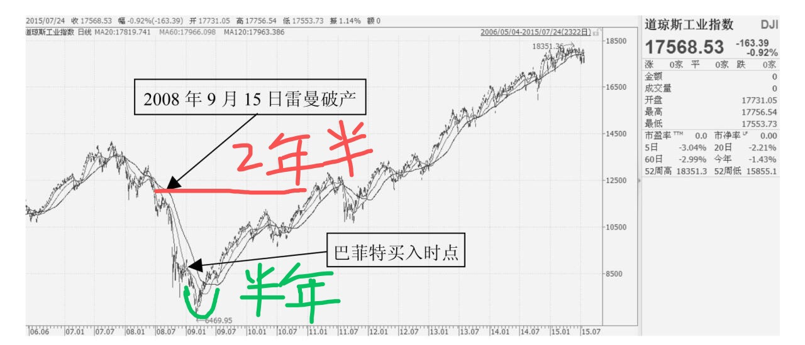

图10-3 道琼斯工业指数走势图

欧债危机始于美国次贷危机之后，2011年9月，欧债危机到达阶段高潮，全世界媒体都在铺天盖地地报道欧债违约事件，当中以希腊违约最严重，金融界的“地震”、“海啸”又卷土重来，仿佛世界命悬一线。这本来与香港市场并无直接关系，香港上市公司多为中国内地公司，受到欧债危机影响很小，但无奈香港是国际金融中心，欧债危机使得来自各国的机构投资者不得不抽出资金以应对，这就使得恒生指数大跌，众多缺乏流动性的中小盘股票跌得就更惨了。如图10-4所示，恒生指数最低曾跌倒了16000多点，但奠定了日后牛市的基础，至2015年4月，恒生指数上涨到28500多点。不幸的是，恒生指数在2015年的6、7月份又再次受到希腊违约的烂事影响，外加中国中小盘股票股灾，在估值不贵的情况下又大幅下挫至22800多点，港股中小盘股票几天内跌幅超过50％的比比皆是。不过，我认为，这又为恒指另一轮的牛市打开了空间。

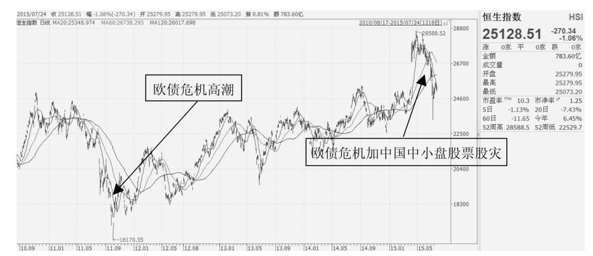

图10-4 恒生指数走势图

\#\#\#待补充\#\#\#

◆ 10.9 指数定投

\>\> 如果我们假设这个投资者再精明一些，懂得前一章所提到的资产动态再平衡，指数估值高位时少投，而估值低位时投更多，结果应该是财富可以在累计1576万的基础上再增长许多。
