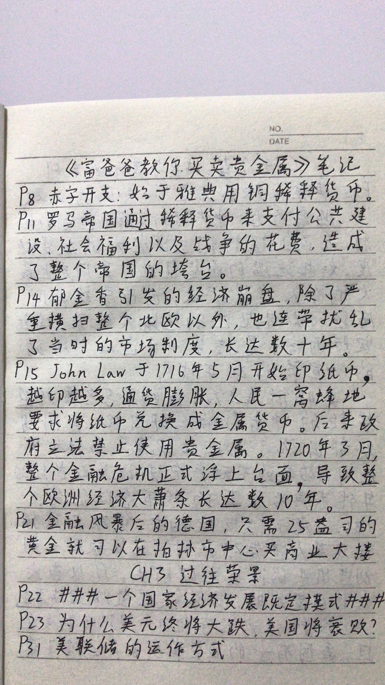
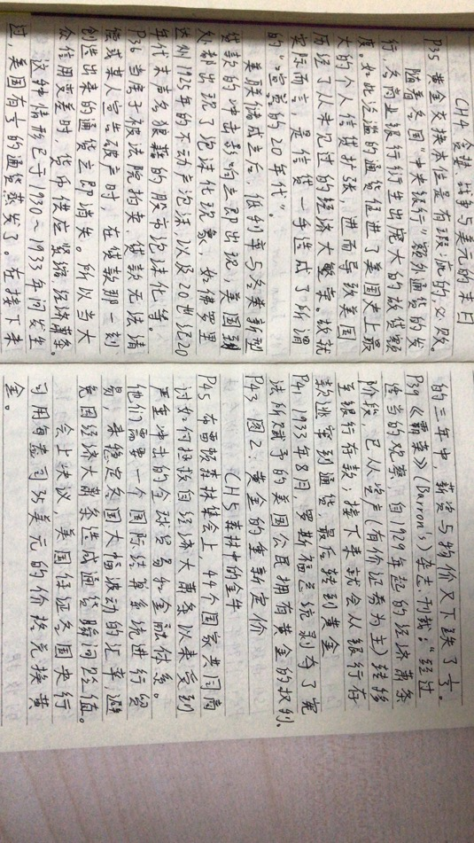
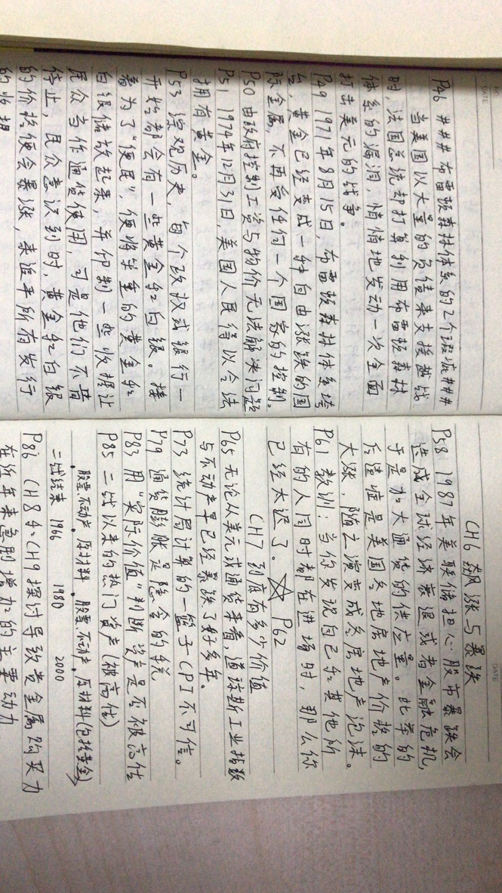

索引方式：纸质书2010.11第1版第1次印刷

本书第一部分研究一些历史上的经济景气循环周期、纸币等，以及对黄金、白银所产生的影响。

本书第二部分指出2010年一千美国政府超额通过供给的后果。

本书第三部分教你如何在巨大的金融风暴中保护自己，还讲述了白银与黄金的区别（博主注：在2020年的中国，银行还没有白银回购业务）。

**前三部分只有纸质笔记，以下从第四部分开始。**

P209 如果你接受了我介绍的“循环周期”的概念，同时也想成为这样的景气循环投资者的话，那么从定义上说你进场的目就是要投资整个景气循环的波段。千万不要再市场进行修正时恐慌，更不能在波段中途改弦更张。\#\#\#例子：房地产热门却是泡沫、镍铅锌等一般金属并非金钱\#\#\#

P210 如果你拥有一个诉诸文字、清楚明确的计划，那么每当自己有疑虑时，便可以拿来随时参照。这么一来你就能借着合理的研究和调查，来冷静地分析自己的那些疑惑，而不是匆忙草率地下决定。

我的投资计划

1.  目的：要赚取足够的本金用于买入高现金流的资产。
2.  策略：善用循环周期来投资，找出每一个循环周期中表现绩效最佳的投资。我认为在中国房地产崩盘之际贵金属表现最佳。
3.  战术：由高到低逐渐赎回基金，\#\#\#参照P228的比例\#\#\#定投到贵金属中，视情况提取实物金条。

P213 测试：我到底是什么样的人？

1.  风险承受度：9（刺激）
2.  倾注精力的程度：3（长期投资者）
3.  投资的原因：9（未来财富）
4.  年龄：3（年轻）
5.  投资组合规模：8（小）

P214 我相信早早确立投资目标并坚持到波段结束的投资人，远比拼命尝试买低卖高的投资人拥有更高的获利机会，这是因为后者无可避免地会自认为行情到头了而提早出场。

实体贵金属是截至目前在贵金属投资领域中最安稳、也最不需要费工夫的方式。风险承受度较低以及对美元的价值存有疑虑的人适合拥有75%，甚至100%的贵金属。

P215 我仍旧相信大型采矿业的股票实际上比投资共同基金更加安全，风险相对小。因为基金要收管理费，而你所费的功夫却没差多少。投资股票你只需要交易户头辅之好的信息即可。

P217 \#\#\#优秀的团队（信息来源）：见本书附录（从图书馆借的书没有附录）\#\#\#

P219 在目前的景气循环之下拥有实体的金银可以视为最终极的投资方式。

P220 每位投资者都应该拥有一些永远不打算卖出的黄金和白银等贵金属。

想要购买实体金银，基本上有两种金银币业者可供选择：网络商家或者实体店面。（博主注：在2020年的中国不需要看本节内容，散户买贵金属直接去中国工商银行开通网银）

P222 应该拥有什么样形式的金银？（博主注：在2020年的中国适合投资的当然是投资型金条，而不是收藏型金章、纪念币等等）

如何储放你的金银？（博主注：在2020年的中国没有像美国那么多的选择）

P226 那些看不见摸不着的、可以在网络上立即进行买卖的金银：

1.  股票型指数基金（ETFs）：适合短期买卖，而不是长期投资持有。
2.  数字金银币交换中心：在这个交易系统中买卖**并非**在跟全世界的市场同步进行交易
3.  数字贵金属货币：保管费用低，是在**国外**拥有金银的最佳选择。参见：GoldSilver.com
4.  在个人退休金账户（IRA）中储放金银（博主注：在2020年的中国没听说过）

P228 再次强调，我所管控的投资组合中，有将近50%-70%都投资于**实体**的贵金属，大约20%-40%投资于贵金属类的股票，有5%-10%分配在能源以及其他材料的股票上，而最后的5%才属于现金投资。截至目前，这种配置策略都没有让我失望过。

其中我所拥有的**实体**投资中，有将近10%-50%的黄金，以及50%-90%的白银都是储放在自己的家中。你在家中储存量的多少，取决于你自己投资量的多少；但是一般来说，应该储存3-100盎司的黄金，以及100-10000盎司的白银左右。无论你决定放多少，最主要的依据就是要在任何经济或政治的状态下都能随手取得。至于我所剩下的实体贵金属，绝大部分都分散在美国各地储放着，少部分储存在海外其他账户之中。对我而言，利用不同的地方来储存的确有分散风险的功能。

P229 关于白银还有一点永远只购买0.9999的纯银，这种白银在工业界的需求量极高。
