索引方式：微信读书（竖屏）

P4 第5版序

投资的4条箴言：

1.  最重要的是决定长期资产组合，即投资多少股票、不动产、债券和现金
2.  投资组合应该由使用现金的真实目的和时间决定。
3.  在每类资产内部及不同资产类别之间充分地分散投资。
4.  要有耐心，坚持执行。

市场逐渐由那些规模庞大、反应迅速和博闻强记的专业人士及专业机构主导。过去的几十年种美国市场发生的根本变化：

1.  机构投资者的交易从占市场整体交易的10%增长到95%。
2.  交易数量突飞猛进。由300万股激增至50亿股，衍生品交易量100亿股
3.  排名前50的机构投资者占整体市场交易的一半。

专业人士和机构也很难打败市场，积极主动型基金经理中赢家极少；且在这些市场赢家的投资业绩记录产生之前，识别出他们的机会微乎其微。

在遭受失望之前解雇资金经理人，而在成功显现之前雇用新的经理人，这样不断改变经理人几乎是不可能的。这样与经理人的“约会”被认为是十分浪费时间和精力的行为，应该被所有严肃认真的投资者所摒弃。

P7 第1版序

成功的投资主要依赖于常识性的东西。用你的常识发掘一种资产作为投资对象，让你付出的每一分钱都能买到价值最大的资产。这意味着要“逢低吸纳”。如果购买公司资产份额支付的价格只有其内在价值的一部分，那么未来资产价格下降的风险会更小，而价格上升的潜力和机会更大。（博主注：这是价值投资）

显然，分散投资就是这样一个常识，分散化投资会产生高于预期收益的资产，并将其用于弥补收益低一些的资产。即使最成功的专业投资者也不敢指望他2/3以上的投资资产能高于平均。因此，资产分配和分散化是长期投资成功的基石。

分散化投资意味着不要把所有的资产都投向任何单一的公司、行业或者国家。因为国家不同，其熊市和经济周期出现的时间也不同。经济状况的变化对不同类型的资产的影响也不同。在不同类型的资产之间分散化投资能让组合的波动更小。

从较少财富开始，逐渐积累资产，需要勤俭节约。在制定家庭预算计划时，需要将大量比例的收入用于储蓄，严格遵守和执行该预算计划才能逐渐变得富有

专业人士也无法获悉每一个熊市何时出现，大多数国家每十年出现2次熊市和经济衰退。资金上的准备意味着你必须要准备好可以渡过任何熊市难关所需要的资金，财务计划还必须提供额外的资金使得在资产价格低到不合理时还有能力买进。

多数投资者都在出售时，资产价格会下降：多数人都在购买时，价格会上升。这个事实使得投资和其他行业完全不同。例如，当你询问的10位医生都赞成服用某种药物时，显然你会服用该药物。但是当你征求意见的10位证券分析师都认为你应该买入特定种类的资产时，显然你应该出售，采用相反的操作。原因在于如果百分之百的投资者都在购买，只要一个人改变想法开始出售，那么你就已经错过了在巅峰价格出售的机会。如果在其他投资者买入资产的同时买入相同的资产，很难取得超越他人的投资业绩。

在选择购买何种资产时有许多判断资产价值的标准，其中一种最值得信赖的标准就是资产价格相对于资产收益（博主注：市盈率）有多高。然而，更重要的是资产价格相对未来5～10年可能的收益有多高。资产份额是获得未来收益的权利。收益的增长通常是卓越管理的结果。判断管理者的管理能力很困难。以下3个简单的提示可以在很大程度上帮助业余投资者正确判断这家公司的管理能力：

1.  这家公司相对于竞争者其增长速度是否更快？
2.  它的利润率相对于竞争者是否更高？
3.  所投资资产每年的赢利能力是不是比其他竞争者更高？

历史显示了多种不同资产类型的价格波动频率和波动幅度。合适的资产分配可以帮助削弱资产价格波动对资产组合的影响。由于人类行为的加速，资产价格在未来可能波动幅度更大，波动更加频繁。不能依赖于短期业绩选择投资顾问。应该至少在一个完整的市场周期中判断投资顾问的管理业绩和能力。这有利于平衡掉投资顾问的运气成分，揭示其由于专业技能和投资常识带来的回报。

在约翰M·邓普顿成为投资顾问的时候，美国只有400万股民，现在美国有4800万股民。美国现在共同基金的投资规模是55年前的1000多倍。（博主注：这里的2个“现在”是指第1版序言撰写时间1989-04，本书正文中的现在时态一般指2014年）如果在25岁时开始每年投资2000美元，假定每年平均总体收益率为10%，算复利且免税，等到65岁时账户金额将累计至接近100万美元。

P11 译者序：本书贯穿始终的一个概念就是，投资者制定分散投资于多种资产类别的资产分配战略，之后无论面临市场如何变化，始终坚定不移地坚持该目标资本配置。这对中国资本市场也具有很大的意义。本书内容包罗万象，涉及哲学。

P18 导论

《塔木德》（公元前1200年～公元后500年）可能是世界上最早提倡资产分配的。按照现在的观点重述：“每个人都应当建立一个分散化的投资组合，其中1/3配置到不动产类的投资，1/3配置为普通股股票，另外1/3配置给债券。”

这种观点现在仍然是一个好的投资建议！我们来仔细研究这个投资策略。整个均衡的投资组合是1/3为固定收益类投资，另外2/3为权益类投资。投资于固定收益的1/3资产缓解了投资于权益类的2/3资产的内在波动风险。而分散投资于两种不同权益类资产，其未来不同的收益模式也降低了权益类投资的风险。

《塔木德》不知出于何人之手，也不可能预测到今天的投资环境。在过去的20年间，民主国家和自由企业已经取代了世界上许多的专制国家和中央主导的经济体。新的资本市场正在形成，投资工具日益丰富。世界各地的人可以通过因特网几乎无成本地即时交流各种信息。世界确实变得更小，联系日趋紧密，一个地区的经济事件可以立刻影响全球其他市场。

尽管投资环境发生了这么多变化，今天的投资者和100年前的投资者并没有什么不同，他们仍然想要更高的收益，想要在保证收益的同时避免风险。

信任在客户与投资顾问的关系中至关重要，然而它可能不足以带领客户度过市场极端状况，市场极端情况出现时风险增加，客户的情绪冲动可能战胜理智。

众所周知，大多数投资者在出售资产、购买资产的过程中很容易作出错误的决定。《投资者行为定量分析》比较了1986～2005年20年间股票型共同基金投资者的平均投资业绩和标准普尔500指数的收益差异。该研究发现与标准普尔500指数11.9%的年度收益率对比，股票型共同基金投资者的实际平均年度收益率仅为3.9%。原因主要在于，客户为了追逐过去近期表现良好的基金和市场，定期地将资金从一只基金重新配置转向另一只基金，结果适得其反。研究总结道：

投资收益更加取决于投资者的行为，而不是基金业绩。相比那些不断在市场中择时交易的共同基金而言，长期持有投资对象的基金业绩更高……金融投资顾问最重要的作用就是保护客户，避免损害其投资和储蓄的行为。

好消息是，这个问题有了解决方案，即不断教育客户在资产市场的行为和投资组合管理的原则。在合适的参考框架下，知情的客户在其投资顾问的引导下可以自信地建立恰当的资产分配策略。随着时间的推移，资产分配策略是投资组合风险和收益的首要决定因素。因此，客户积极地参与到投资组合的设计非常重要

本书为投资专业人士和客户提供了一个严格的框架，基于该框架他们可以制定重要的投资策略，影响投资组合的业绩。本书的主题之一是，一项成功的投资管理需要成功地管理客户的预期。成功地实施该投资决策框架必须达到的条件：

●概念清晰；

●客户无需花费过多时间即可理解自己这方的责任；

●有利于根据客户量体裁衣，根据其特殊需求和环境构建全天候的投资策略；

●对后续步骤和策略标准化；

●无论市场环境如何变化，投资策略在未来需要持续相关有效；

●帮助客户有耐心、有纪律地执行资产分配策略，同时坦然接受任何情况。

◆ 第1章 资产分配的重要性

\>\> 随着机构投资者交易的增加，全职的专业投资者不像过去一样与业余的个人投资者交易和竞争，而是与他们的同类竞争。

\>\> 通过市场自由的动态调整，最终证券交易价格使得证券需求等于供给，从而实现市场出清。因此自由市场的价格反映了市场对证券内在价值的一致预期

\>\> 大多数的市场异质现象（market anomalies）确实表明资本市场并非完全有效，但大部分研究结论都支持资本市场在某种程度上是有效的这一论断。毫无疑问，信息处理技术的加速进步和发展会推动市场未来的有效性不断提高。因此，人们可以持续战胜市场的情况变得越来越不可能。

指数基金使用的快速增长切实证明了资本市场是否有效这一问题不只是学术界的兴趣所在。在有效的资本市场中，人们预期积极的资产管理由于存在更高的交易成本，最终将产生低于平均收益率的投资业绩。如果这是真的，那么在这场游戏中战胜市场的一种方法就是永远不要和市场游戏。因此，指数基金的投资者就选择不参与在市场中进行证券选择的游戏。

\>\> 即使在有些情况下资金管理机构由于其自身独特的洞察力可以获得超常的投资业绩，一旦被其他资金管理机构发现这一获利过程并加以利用，他们的优势也会随着时间而消失殆尽。

在计算机出现之前，《资产组合选择》第一次以数学模型的形式描述了由于在不同收益率模式的资产之间进行组合投资，导致资产组合风险下降的过程。

\>\> 分散化效应是指某种特定资产类型或者证券的加入对整个资产组合波动性风险和收益特征的影响。

因此，现代资产组合理论将人们的关注重心从单项证券转移到将资产组合作为一个整体考虑。分散化概念也需要重新思考其含义。最优分散化远不止简单地采用许多篮子来装鸡蛋。它还非常强调寻找远远不同于其他篮子的篮子。这点非常重要，因此每个篮子的独特的收益模式之间可以部分抵消，从而平滑了整个资产组合的波动性。

\>\> 传统的仅以美国股票和债券为基础分散化的投资组合在未来投资领域中变得越来越不够。投资组合的构建和设计包含下列步骤：

（1）确定投资组合中包含的资产种类。

（2）确定投资组合中每种资产类型长期需要配置的目标比例。

（3）明确所配置的每种资产类型的比例区间，在这个区间中根据每种资产类型的投资业绩改变配置比例，从而利用业绩更好的资产类型。

（4）在每种资产类型中选择证券。

前两项步骤构成了资产组合波动性风险和收益特征的基础，因此经常被称为投资政策决议。在决定把哪些资产类型放入资产组合中时，投资顾问应当首先假设投资组合中包括所有主要的资产类型，除非存在明确、合理的理由说明某种或多种特定的资产类型不应当放入资产组合中。

投资顾问可以采用多种方法决定分配给每种资产类型的目标权重。现代投资组合理论建议在有效市场中，一般风险容忍度的投资者应当根据不同资产类型在全球财富总和中所占的比例，完全复制该比例构建投资组合。然而在实践中，客户存在独特的需求和环境，相互之间区别很大。因此不建议对所有客户采用唯一的目标资本配置，即为了适应布的大小而对所有的人进行裁剪。客户的投资目标、相应的投资时间和波动容忍程度一起决定了客户的投资组合结构，是否为了追求本金的稳定而愿意接受相应更低的收益率？抑或以更高的波动性为代价追求资本的增值？在任何一种情况下，在不同种类资产类型中进行最优资产分配的目标都是相对于假定的波动性水平，帮助客户实现最高的预期收益。

在步骤（3）中，每种资产类型都会设置承诺投资的最小和最大限值。举个例子来说，如果相对其他资产类型而言，股票被认为存在超常的吸引力，那么股票的配置比例应该变为它的投资比例上限。在其他时候认为股票的价值存在高估时，股票的投资比例则变为其最低的配置比例，这体现了投资管理过程中的市场择时维度。市场择时交易行为之所以可以成功，在于其假设不同资产类型之间的定价机制存在失效，而同时投资者可以依赖于其高超的技术识别出错误的定价机制，并根据定价错误进行交易。

在步骤（3）中为每种资产类型设置最小和最大限值，目的在于避免极端地配置资产组合带来的风险，最小化这一风险。市场择时交易者采用多种策略，试图识别和应用错误定价的资产类型。试图通过市场择时交易提高投资业绩的大部分做法都可能失败。**在我看来，市场择时交易不值得去做。**

在步骤（4）中，投资顾问可能建议采用积极或者消极的证券选择方式。

1.  如果采用消极的方式，投资顾问可能推荐由多种资产类型构成的指数基金，在最小化交易成本和管理费用的同时最大程度地将资产分散化。
2.  积极的证券选择方法认为，对于单项证券存在可以利用的市场定价错误，而这可以通过精湛的分析技术识别和发现。积极的基金经理人必须获得超过交易成本和相关费用的收益，从而增加资产价值。这虽然难以达到，但并非不可能。

传统观点平等地看待投资管理和投资过程中的第三步和第四步——市场择时交易和证券选择。但**在上述第三个步骤和第四个步骤中取得成功的可能性很低**，因为有大量专业投资人士致力于市场择时交易和选择证券。然而，投资管理中的第一个步骤和第二个步骤，即选择资产类型和确定他们在资产组合中的相应权重，已经对投资组合的未来业绩产生了重要影响，这一影响在未来仍会持续下去

毫无疑问，“价值增值”投资建议的焦点正转向如何有益于投资顾问和客户更好地参与到合适的资产分配中。投资顾问和客户协同合作，探究上述问题，最终达成一致意见，以投资政策说明书的方式记录下来。投资政策说明书中列示的投资框架可以作为参考，相对客户的财务目标评价投资业绩和监督投资过程，这样投资顾问和客户都获得了共同分享投资框架带来的好处。这也可以解开投资管理的秘密，在市场处于周期性阶段，偏离既定的投资政策的企图很大的时候，提高客户对设计恰当且合理的投资决策遵守的可能性。

如果资产分配是资产组合业绩的关键决定变量，那为什么投资顾问和投资者如此固执地将这么多的注意力放在证券选择和市场择时交易中呢？一部分原因是由历史观念决定的。高超的分析技术可以战胜市场这一观念深深地扎根在资金管理职业中。许多专业投资人士私下里担心，如果不是人们预期证券选择和市场择时交易可以导致更加优秀的投资业绩，他们就可能失去工作了。

市场的现实会顽固地持续下去。大部分资金经理人的投资业绩一直低于市场平均水平，那些一时可以获得超过市场投资业绩的经理人，在后续的时间中超过市场投资业绩的机会还不到一半。这个结论并不奇怪。专业人士充斥着整个市场，而明显地，其中大部分都无法获取超过市场平均水平的投资业绩。考虑到在试图进行证券选择和市场择时交易产生的交易成本和管理费用，可以预计在未来，大多数资金经理人在他们投资的市场中仍然持续地获得低于市场的投资业绩。

\>\> 市场择时交易和证券选择带来的希望具有十分强大的诱惑。投资者都希望享受市场状况良好带来的欢乐，避免市场状况糟糕带来的痛苦。因此，他们深信最专业的资金经理人可以通过成功的市场择时交易和证券选择实现财富增值。

投资者一旦在1000个资金经理人构成的总体中识别出30位资金经理人，这些经理人在过去五年中每年的投资业绩都优于同行业其他经理人时，投资者很容易迅速地假定这些投资业绩是由于经理人高超的技术导致，而不是运气的作用。

投资业绩的短期变化主要受偶然事件影响。许多投资者没有意识到这一点，他们经常会不断地将资金从一个经理人那里配置到另一个经理人那里，追逐那些投资业绩数据。有高超投资技术的经理人可能存在，但他们非常稀少，需要非常长的时间才能识别，通常为几十年。

由于精湛的投资分析技术使用的市场不同，技术带来的预期收益也有所区别。不是所有构成资本市场的单个子市场都是一样有效的。比如说机构投资者对小公司股票的研究不如大公司股票一样多，因此小公司股票价格的有效性就更低一些。就像许多美国以外资本市场的有效性不如美国资产市场的有效性一样高。当存在低效的市场时，卓越的投资分析就会发现投资机会的存在，利用这些机会就可以产生价值增值。我们不应该忽视这些投资机会，但我们应该预计到，随着时间的流逝和更多投资者利用这些机会的行为出现，这些市场的有效性得到提高，可能的额外收益将会逐渐缩小。

\>\> 今天的投资管理需要一种全面的方法同时关注投资世界和客户状况。投资顾问帮助客户设计适宜的资产分配策略，实现客户目标，同时鼓励客户严格地遵守策略，这样投资顾问才是有价值的。客户被训练到透过投资顾问的肩膀，仔细查看和评估投资业绩。如果客户认为投资策略没有发挥作用，他们将寻找新的投资顾问。在投资管理中，看法通常不同于现实。这就是为什么客户和投资顾问分享相同的有关于资本市场和投资管理过程的参考框架是如此重要。

投资顾问很容易落入这样的陷阱，就是当实际上客户对投资的了解十分有限时，却假定客户掌握了基本的投资概念。冒着退化的风险，建议投资顾问在一开始就花些时间向新客户阐述专业术语，解释投资的概念，从而避免上述危险。在下一章我们将讨论美国资本市场的历史业绩。你可能已经很熟悉，但需要记住对许多客户而言这可能是全新的完全不了解的领域。因此，为了向投资专业人士提供方法，和客户一起建立相同的参考框架，我们在下一章对基本的知识进行回顾。掌握了这些知识以后，对那些更加适合他们的投资政策，客户就会觉得更加适宜

◆ 第2章 美国资本市场投资业绩：历史性回顾

\>\> 顾问会要求客户描述其财政状况、陈述其投资目标以及明确其风险承受程度。根据以上的信息，投资顾问为客户设计出合适的投资策略。然而，这一过程也存在着一些问题，例如投资顾问如何确定客户对投资业绩有现实的预期？如果客户的风险承受度过度受到恐惧的影响，而这种恐惧来自于投资知识的匮乏，那该怎么办？此时，问题不是出在资本市场上，而是出在客户身上。投资顾问能否确信客户可以清楚地分辨投资管理过程中的所有风险，及其引发的一些危险？

\>\> 股市崩盘之后，如果投资顾问的策略是基于无法进行市场时机选择的观点，而客户则坚定地认为投资顾问有责任保护其资产避免股票市场的大跌，那么客户与投资顾问的关系便陷入了困境。

客户对投资业绩的预期常常盲目乐观，人们通常觉得能够在比实际更低的波动率下获得更高的收益。因此投资管理要首先管理客户的预期，然后管理他的钱。在执行投资策略之前，使客户和投资顾问保持共同的投资世界观是十分重要的。

现实预期对于形成现实的投资目标是十分必要的。客户必须理解所有的风险类型，也必须准确地评估在特定条件下每种类型的相对重要性。虚幻的理想化的投资观念必须打破。不存在既可以稳定的保本，可以提供击败通胀的流动投资工具。客户任何未修正的错误概念迟早会浮上水面，这通常会阻碍投资管理过程。

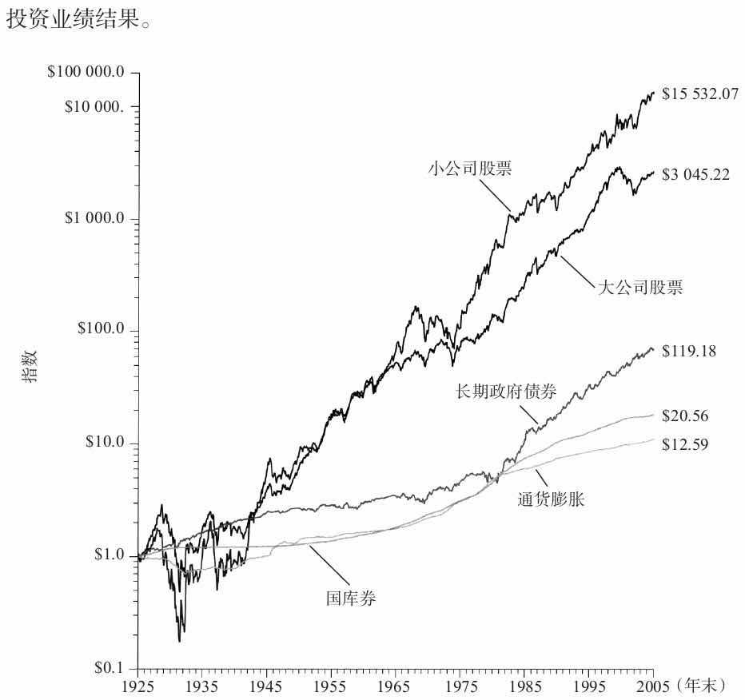

图2-1 美国资本市场中的投资财富指数（1925年年末=1美元）

由晨星公司发布的年刊《股票、债券、票据和通胀》，里面的数据涵盖了从1926年到现在的所有时期。在这数十年中，资本市场经历了战争与和平时期，通货膨胀和通货紧缩时期，以及若干个经济扩张与经济紧缩周期。图2-1描绘了在1925年年末各种投资工具每1美元投资的复利年收益的累积结果。

建立投资策略时，客户同样需要培训以获悉投资期限的重要性。在这个过程中客户出现的投资世界观可以作为投资管理过程的基础，用于帮助客户达到他们的财务目标。这些培训任务可以通过对资本市场历史业绩进行彻底回顾来完成。

◆ 通货膨胀

\>\> 各国政府是通胀的主要受益者，部分原因在于税收结构的征税对象是名义收入而不是实际收入，从而导致财富从私人部门转移到公共部门。

◆ 短期国库券

\>\> 一般而言，现金等价物定义为任何短期的、高质量的附息证券，与短期国库券有着很多相同的优点和缺点。尽管来自现金等价物的实际收益偶尔转为负值，但平均预计它们将提供比平均通胀高出1%～1.5%的税前收益。

◆ 债券

\>\> 债券是可协商的公司或政府机构的本票。它们通常先支付一系列的利息，然后到期时支付本金。债券的市场价格通常并不同于其票面价值。多种因素决定了债券的市场价格，包括现阶段的利率环境、债券的票面利率、信用、到期日、提前赎回条款和课税状况。债券通常被称为“固定收益证券”。债券价格很大程度上依赖于当时的利率环境。由利率变动引起的债券价格的波动被称为利率风险。

\>\> 债券未来现金流的现值（利息支付加上偿还的本金）等于债券当前市场价格的折现率，就是债券的到期收益率（数学上，它是债券的内在收益率）。到期收益率通常被简单地称为“收益率”，它受年利息支付、到期年限、债券买入价和到期日的赎回价格之差的影响。必须区分债券的到期收益率和当期收益率（current yield）的不同，当期收益率仅仅是债券每年的利息支付除以当前债券的市场价格。当债券的市场价格低于其票面价格时，债券的到期收益率将大于其当期收益率。这种情形出现的原因是，随着到期日的临近债券价值逐渐增加，直至在到期时达到面值，到期收益率受到债券价值的年平均增长的影响。相反地，当债券的市场价格高于其面值时，债券的到期收益率将低于其当期收益率。

\>\> 传统的债券可以很容易地用三种特征去描述：利率风险敏感性、信用、课税状况。在其他因素不变的情况下，到期期限越长，给定利率变动的幅度以及债券价格波动幅度越大。（CF：本章附录）

\>\> 长期债券的收益率对当前的通胀率的变动并不是那么敏感，因为长期债券的收益率反映的是对整个债券存续期限的通货膨胀率的一致预期。因此，当通货膨胀率发生变化时，收益率曲线的长期部分移动得更少。

◆ 长期政府债券

\>\> 购买长期政府债券，向政府借出资金、延长投资期限时，我们便放弃了短期国库券本金价值稳定的特征。政府债券的收益率由三个部分组成：通货膨胀率、实际无风险利率和承担利率风险而获得的风险溢价。持续地支付三个部分的政策是应对长期困难的良药。

长期债券未能支付投资者由于承担利率风险而预期得到的风险溢价。长期政府债券的业绩如此剧烈恶化，以至于到1981年年末短期国库券自1925年之后累积的业绩实际上已经超过了长期政府债券累计的业绩。图2-1显示1981年年末，通货膨胀率、短期国库券收益指数和长期政府债券收益指数相交。

\>\> 在整整86年期间，长期政府债券提供5.7%的复利年收益率（CF：中期政府债券5.4%）。这极大地超过了短期国库券的收益率和通胀水平，不过因为这些相对的业绩关系重新发展，自1981年起它经历了数个壮观的债券年份。我们看到，在这些通货紧缩和反通货膨胀的时期，长期政府债券提供了极好的收益。在通货膨胀适中的时期，由于通胀是可以预期的，因此长期政府债券的收益良好。然而在高通胀时期，长期政府债券如同其他长期固定收益类债券一样，收益很差

◆ 中期政府债券

\>\> 中期政府债券最短的到期年限不低于5年。由于到期时间更短，这些债券有着比长期政府债券更低的利率风险敏感性。因此，预期中期政府债券的年度总收益率比长期政府债券低，但是比短期国库券的年度总收益率大。

\>\> 这个增长速度相当于5.4%的复利年收益率（CF：长期政府债券5.7%）。

◆ 长期公司债券

\>\> 公司债券有违约的可能，所以投资者按照概率加权的复利收益率（对违约性进行调整之后）将会小于到期收益率。为了补偿投资者承担的信用风险，公司债券的收益在经过各种违约风险的调整后，应该高于长期政府债券可获得的收益。我们称这种补偿为“违约溢价”。从历史上看，中等和低等信用质量的债券在对所有资本的损失调整之后，为投资者提供了更高的净收益。（1+长期公司债券复利年收益率）/（1+长期政府债券复利年收益率）-1=0.38%（CF：第3章附录）

◆ 大型公司股票

\>\> 普通股票表示一个公司的所有者权益，购买一份普通股的投资者购买了其中的一部分。不同于固定收益证券的是，普通股既没有固定的到期日，也没有固定的承诺支付安排。在获得收益之后，一个企业必须首先支付给债券持有人的和其他债权人的部分。因此，企业债权人比股东在支付方面有更高的确定性，普通股比固定收益债券更具有风险。因为企业的债券持有人和其他债权人对企业的收益和资产有优先的索赔权，因此，普通股股东又称为拥有剩余的所有权。

股票持有人的收益表现为股利或者资本增值的形式。股利依照由股东选出的董事会的决定支付。未支付股利部分可用于再投资，为公司未来成长提供了融资来源。与任何商业所有者类似，普通股股东共同承担了企业的上涨潜力和下跌风险。由于承担了更大的风险，普通股股东在未来期望更大的回报。股票市场价格通常反映了投资者对经济状况的评估：商业的经济前景越好，股票价格水平越高

图2-1和图2-10的大公司股票业绩数据是基于标准普尔500指数得到的，标准普尔500指数包括了500只蓝筹股，即美国大公司的股票（在1957年之前该指数包括了90个最大市值份额的股票）。这些股票被认为是主导产业中的龙头企业，并且它们一起占据了2011年12月31日美国股票市场总价值的75%。

\>\> 即使股利收益已被用于生活费用，大公司股票的平均资本增值已经保持在通胀之上。在这个意义上，将大公司股票看作长期的通货膨胀指数投资是合理的。这在考虑到美国经济长期实际的增长之后就一点也不奇怪了。

例如，假设一个经济体的年通货膨胀率为3.5%，这将导致商品和劳务价格在接下来的20年内翻倍。如果我们假定在接下来的20年间，企业在对这些商品和劳务的生产维持在同一水平，然后保持与现在相同的利润率和市盈率，那么之后即使企业所有的收入都支付股利，企业的利润、股利和股票价格将同样翻倍。

\>\> 我们期望构建一个广泛多样化的普通股组合，通过产生一系列股利的方式维持其购买能力（即跟上通货膨胀）。一开始股利可能在一个中等水平，但可以增长到使其购买能力维持在平均水平。相比之下，债券承诺的职能是按名义价值计算的本金的收益。这一固定的收益最初高于普通股获得的平均股利收益率，但它的上限相对而言是固定的。你也可以确信债券的本金部分将败给通货膨胀。

从历史上看，普通股在消费价格相对稳定、通货膨胀率相对较低的环境下表现要好得多，而在通货紧缩时期或者是高通胀时期的表现相对糟糕。正是未预期到的通货膨胀损害了普通股的业绩，尤其是在短期。在长期公司可以针对通货膨胀作出调整，但在短期这些调整更加难以实现。除非出现灾难性的经济事件，普通股作为一种投资工具可以为长期保存和提高购买能力提供良好的投资选择。

◆ 小公司股票

\>\> 小公司股票更高的收益率与其更高的波动性相关联。同样，小公司股票倾向于有更高的贝塔值，这使得它们更容易受到整体股票市场变动的影响，因此再次证明其拥有更高的收益率。最后，可以认为大公司可能倾向于处在更成熟的商业阶段，因为现在所处的阶段在快速成长期间之后，而不是之前。

图2-1 美国资本市场中的投资财富指数（1925年年末=1美元）

◆ 附录：债券久期

\>\> 到期时间并不是首选的利率风险敏感性的测度，因为它仅仅考虑了基于到期日还本的时间。相应地，到期时间忽略了期间利息支付的时间和大小。因为债券现值的主要部分可能由利息支付构成，一个更好的利率风险敏感性的测度应该把这些支付也考虑进去。债券的久期可以实现这个目标。久期可以通过计算债券的利息支付和本金偿还的加权平均时间得到，这里支付的权重是由支付的现值除以当前债券的市场价值决定。短期内，久期是债券所有者从债券发行人那里获得资金现值的加权平均时间。（CF：《有效资产管理》对久期的描述更简单点）

◆ 第3章 **美国**资本市场投资工具的相互关系

\>\> 本章将阐述不同类型风险下的收益率：通货膨胀风险、利率风险、信用风险、权益风险和小公司风险。由于承担上述风险而获得的额外回报称为风险溢价。第2章讨论了美国资本市场上的各种投资工具，本章将以这些风险溢价为构成部分，建立简单的模型，预测这些投资工具未来长期的复利年收益率。

\>\> 由于承担更长期的利率风险而要求增加的收益率一般被称为期限溢价。

\>\> 平均而言，短期国库券的复利年收益率比通货膨胀率高0.6%；而长期政府债券的复利年收益率比短期国库券收益率高1.7%。

\>\> 大公司股票经过调整的收益率与短期国库券收益率之间的差异称为权益风险溢价。如果我们假定未来大公司股票的隐含波动率和过去的情况不存在重大区别，进一步假定由于承担的波动性，在未来市场对大公司股票定价时同样给予了和历史情况一样的风险补偿，那么**5.8%将是未来权益风险溢价的合理估计**。

\>\> 需要重点强调的是，这些模型以各种投资工具之间长期的历史关系为基础。相应地，它们代表了许多存在显著区别的子样本期间的平均值，子样本期间的实际结果和依据上述模型的预测结果之间可能相去甚远。

\>\> 上述模型只是根据历史数据得到的未来证券收益的单个点的估计值。对未来业绩的更好描述中应该加入未来业绩结果可能的区间说明。投资顾问同客户分享收益不确定性的信息，提供客户一个评价之后投资业绩的背景环境非常重要

◆ 总结性的对比和含义

\>\> 客户经常误解他们面临的自有资金的投资风险。长期下去，客户制定的投资组合决策往往不能体现他们的最大利益。这突出了提供给客户对资本市场历史详细的回归的价值。**一个充分了解通货膨胀风险、利率风险、信用风险和权益风险的客户将处在更好的位置，可以作出更加符合其财务目标的明智的投资决策。**

\>\> 在比较这些投资工具的收益时，客户经常被这些小小的增量收益率对财务积累的影响所震惊。例如，短期国库券的复利年收益率为3.6%，这导致1美元的投资到2011年年末增长至20.56美元。同比一下，大公司股票的复利年收益率比短期国库券高6.2个百分点，这使得在相同的期间，期初1美元的投资将增长至3045.22美元。同样地，小公司股票的复利年收益率比大公司股票的复利年收益率只高2.1个百分点，然而这样低的增量收益率在2011年年末产生了15532.07美元的惊人价值。上述例子很好地阐述了“复利的奇迹作用”。

不同投资工具之间的复利年收益率差异相对温和，它们的标准差有更大差异

\>\> 大公司股票的年度总体收益率可以分为两个部分：期间股利收入和资本增值。如果我们衡量每一部分的偏离程度，我们将发现资本增值部分的标准差是19.6%，相比期间股利收入部分的标准差相对较小，仅为1.6%。由于股利收入部分很稳定，因此大公司股票的收益波动几乎可以完全归结为价格的变动。

大公司股票股利收入相对稳定，对此一个可能的解释在于大部分公司制定股利政策的行为。公司的利润每年都在波动。然而与其支付一个随着利润不断波动的股利，大公司更愿寻求将股利设定为占利润的一个合适比率，从而使得无论经济情景好坏都可以支付。除非绝对必要，公司一般不愿意削减股利，同时也只有在确定公司利润存在相对永续的增长，足以维持更高的股利支付率时才会提高股利。这一行为导致股利支付呈现出相对稳定、缓慢增长的模式。

大公司股票收益率中的资本增值部分的复利年收益率为5.5%。这仅仅只比业绩最好的付息投资工具——长期公司债券的总体收益率少0.6个百分点。从本质上说，广泛分散化投资的普通股投资者过去获得的长期资本增值不仅足以维持其购买能力，而且可以提高其购买能力。这使得股利现金流量可以用于消费。因为广泛分散化投资的普通股投资组合在期间内通常平均可以赶上通货膨胀率，因此其股利流量也可以用于消费。重点是“在期间内平均”这一短语，这是因为在短期普通股的波动性相对更高，给每年的收益率产生了很大的不确定性。因此，短期和中期的结果可能很大程度偏离通过在更长期间研究投资业绩得到的正常关系。

普通股投资组合能够产生相对稳定、增长的股利现金流量的能力对希望追赶上通货膨胀的投资者而言非常重要。

\>\> 在与客户回顾表3-1的信息时，强调必须以相对其他投资工具的收益率差异评估收益率数据是至关重要的。例如，在对比短期国库券3.6%的复利年收益率和大公司股票9.8%的复利年收益率时，它们之间的关系最好表示为两者之间6.2%的收益率差异。有时候，这两者之间的关系被错误地认为存在倍数关系。也就是说，认为大公司股票9.8%的复利年收益率是短期国库券3.6%的复利年收益率的2.7倍是错误的。（CF：第2章的◆长期公司债券；CF：本章附录）

表3-1 年度总体收益率描述性统计特征（1926～2011年）

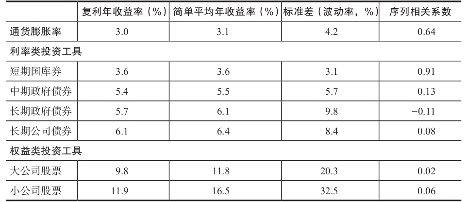

\>\> 表3-1的最后一列描述了自相关性。自相关性统计了某一期间的收益率在预期接下去期间的收益率的帮助程度。

1.  自相关性接近1.0的一系列收益将可以较好地解释下一期的收益率，从而呈现为一个趋势。
2.  如果自相关性接近-1.0，收益率系列将呈现逆周期。
3.  如果自相关性接近为0，则收益率序列不存在预期模式，称之为随机游走。

通货膨胀率的高度自相关性显示其每年遵循的趋势变化，美国短期国库券的高度自相关性也显示其每年遵循的趋势变化。相比之下股票和长期债券总体收益率模式更加接近于随机游走，其自相关性显示接近于0。

虽然表3-1中没有列出来，小公司股票溢价（small stock premium）的自相关系数为0.36，这说明小公司股票溢价的变化存在趋势现象。通过比较分析大公司股票和小公司股票的历史收益业绩，可以断定的是，研究期间中在较长的时间内一种投资工具的收益比另一种投资工具更高。

◆ 附录：统计知识

\>\> **简单平均收益率适合衡量单期特定收益，而复利年收益率更加适合于比较多期投资收益**，因为它衡量的是期初投资按此增长率连续复利至期末的结果。一般而言，用来描述不同投资工具预期收益率的模型都是单期模型，因此描述的收益率是简单平均收益率。由于本章的目的是为长期（即多期）投资决策建立分析框架，因此在相对历史业绩比较和未来投资收益模型中将采用复利年收益率

\>\> 在本书中，直接用算术方式将投资工具的复利年收益率减去其他收益率或者通货膨胀率，得到风险溢价或者经通货膨胀调整之后的收益率。

晨星的子公司倾向于采用不同收益率之间的几何差异作为风险溢价和经通过通胀调整后的收益率。（CF：第2章的◆长期公司债券）例如：4%和10%之间的几何差异不是6%，而是5.8%。计算过程：1.10/1.04-1=0.058=5.8%

本书建立模型的目的是为了帮助投资咨询机构和客户从理论上理解投资业绩。正因为如此，也为了与客户的思路相一致，本书模型建立的基础是算术差异而不是几何差异。算术差异方法更加简单，不会损害模型的理论价值，也避免了需要对算术方法和几何方法的不同做解释的问题。

\>\> 正态分布具有非常好的统计特征，仅给定均值和标准差，任何人都可以得到相同的钟形曲线。曲线以均值为对称轴，曲线下方68%（接近2/3）的面积分布在均值左右1个标准差之间，95%的面积分布在均值左右2个标准差之间。

◆ 第4章 离散和预测限制

\>\> 前一章我们研究了承担不同风险下的长期历史收益率。相比于短期国库券本金价值稳定，期限溢价吸引长期政府债券的投资者接受由于利率变动引起的债券价格变动。相对于长期政府债券的收益率，长期公司债券的投资者由于承担违约风险而获得风险溢价。权益风险溢价弥补了投资者由于持有普通股股票而不可避免面临的股票价格较大幅度的波动。相对于投资于大型公司股票，投资者投资于小型公司股票可以获得对应的风险溢价。

\>\> 投资顾问应该认可这些风险溢价点估计统计值的局限性。客户不仅应该关注每种资产类别的历史收益率，而且还需要关注这些收益率的离散程度，以及这些资产类别未来收益率高于或者低于历史收益率的可能性。

\>\> 平均收益率实际上是一个不太可能出现的结果。在过去的86年中大型公司股票的年度总体收益率落在 8%～16%的次数只有9次。即使面对更大的波动幅度0～24%，所有年度总体收益率落在这个区间的次数远远低于一半。对大多数投资者来说，这个结果令人吃惊，甚至有一些让人惴惴不安。大型公司股票的投资者很少正好获得平均收益率。相反，他们的收益率每年存在巨大波动。

\#\#\#图4-2 大型公司股票年度总体收益率的频率（1926～2011年）\#\#\#

\>\> 无论在投资计划期间对于未来的收益率是否确定，客户仍然必须制定重要决策，以确定合适的储蓄率和消费率。在这些问题上提供建议需要建立合理的资产收益率假设，而长期历史收益率通常不是未来收益率的最好估计。我们现在考虑投资期为10年的收益率预测面临的挑战。对于我们在本部分讨论的3种投资工具：短期付息类投资、长期付息类投资、权益类投资，其预测方法各不相同

◆ 短期国库券

\>\> \#\#\#从历史上看，美联储主要通过两种方法管理短期利率\#\#\#通过这两种方法，美联储通常利用一系列的小步骤，逐渐提高或者降低短期利率。

\>\> 短期国库券自相关性为0.91，表明其年度收益率数据存在严重的趋势性。

\>\> 因此，今年的短期国库券收益率是明年收益率的合理估计值。两者之间的任何差异主要是由于美联储引发的短期利率变化导致的。然而，要预测投资期限为10年期的短期国库券利率，我们首先需要预测这段时间的通货膨胀。

在表3-1中我们看到1926～2011年，短期国库券的复利年收益率比通货膨胀率高0.6%。把这0.6%的溢价加到未来通货膨胀率的预期值上，我们可以预测未来10年期短期国债的复利年收益率。幸运的是，通货膨胀保值债券（TIPS）的收益率差异为我们提供了未来通货膨胀率的市场一致性预期。通货膨胀保值债券的收益率差异等于普通长期国债的到期收益率与期限相同的通货膨胀保值债券的到期收益率之间的差异。（第9章将对TIPS进行更为全面的讨论）

美联储旧金山分行：“大体上讲，比较普通国债和通货膨胀保值债券之间的收益率，能够为未来以消费者价格指数（CPI）核算的通货膨胀率提供有用的市场预期。基本上来说，普通的长期国债支付给投资者固定的名义息票和本金，其到期收益率必须为投资者未来承担通货膨胀提供补偿。因此，其名义到期收益率包括两个部分：真实收益率和持有债券至到期这段时间承担通货膨胀的补偿。对于通货膨胀保值债券，债券的息票和本金随着消费者价格指数的上升而上升，也随着其下降而下降，因此其收益率只包括真实收益率。所以，大体上说这两者之间的收益率差异反映了在债券到期期间内承担通货膨胀的补偿。”

\>\> 在预测短期国库券未来长期收益率时，以下问题的答案非常重要，但这些又是不可知的。这些不确定性增加了未来长期收益率的预测困难及预测精确度

1.  短期国库券在未来十年其收益率是否高于通货膨胀率呢？很有可能。
2.  美国政府不断增加的债务水平是否导致另一个问题？投资者一直以来都认为短期国库券是无风险资产。然而，2011年8月，标准普尔公司将美国政府发行的长期债券的主权信用评级由AAA级下调至AA+级。如果美国短期债务的信用出现恶化，短期国库券的投资者可能需要比过去更多的高于通货膨胀的溢价

◆ 长期政府债券

\>\> 和短期国库券不同，长期政府债券的本金价值每年发生波动，这使得之前年度的总体收益率对预测下年的总体收益率几乎没有帮助。

然而，虽然总体收益率每年发生波动，长期政府债券的到期收益随时间存在趋势性推移。这种趋势具有直观的意义。长期政府债券的到期收益率反映了债券存续期市场对通货膨胀的一致性预期。这些通货膨胀预期随时间变化。

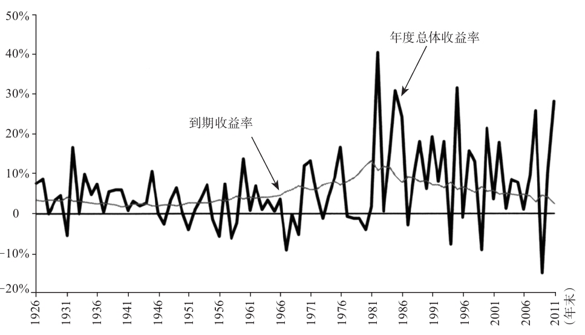

图4-3 长期政府债券：年末到期收益率和年度总体收益率对比

图4-3对比了长期政府债券到期收益率的趋势和年度总体收益率的波动。在长期持有期间，由于价格波动之间部分抵消，债券的利息支付和本金的累计升值或者损失成为了债券收益的主要来源。

\>\> 当长期政府债券到期收益相对较高时，到期收益率更能预测随后10年的复利年收益率。对到期收益率做线性回归，回归的关系强度用统计量R²来衡量

1.  当债券的到期收益率大于中位数时，我们发现在\#\#\#图4-5\#\#\#中R²的值相对较高，为0.80，这表明之前债券的到期收益率和随后10年期债券的复利年收益率之间高度相关。
2.  当到期收益率低于中位数时，我们在\#\#\#图4-6\#\#\#中发现R²的值相对较低，仅仅只有0.13，这说明变量之间弱相关，因此因变量的预测能力较低。
3.  对于同样的息票率和到期时间，当到期收益率较高时，其政府债券的价值对给定利率变化的敏感性更高。同时，如果长期政府债券的息票率很低，债券的利息收入部分就很低，使得利率变动引起的债券本金的累计变化的影响因素更大，超过了债券的利息收入部分。
4.  对于同样的息票率和到期时间，当到期收益率较低时，其政府债券的价值对给定利率变化的敏感性更低。此外，长期政府债券的息票率越高，债券的利息收入部分越高，使得其影响超过了利率变动引起的债券本金的累计变化。

◆ 长期公司股票

\>\> 为了确定大型公司股票的未来收益率是否高于或者低于历史收益率，我们首先考虑市盈率（P/E）。市盈率说明了投资者为了获得公司每1美元的收益所需支付的价格。在其他条件相同的情况下，市盈率越低，投资者投资的股票价值越高。因此，我们以市盈率作为大型公司股票的估值参考。

根据公司背景的不同，可以采用不同的方法计算出市盈率。例如，市盈率可以通过大型公司股票的当前价格除以上年度财务报告的每股收益来计算。另外一个计算方法是用大型公司股票的当前价格除以股票分析师预测的下年度每股收益得到。为了本书的研究，我们选择经通货膨胀调整之后的标准普尔500指数作为大型公司股票的价格。分母的每股收益和分子中的标准普尔500指数相对应，选择前十年经过通货膨胀调整之后的财务报告的每股收益的平均值，选择长期平均每股收益可以降低每年每股收益的波动性影响。这个过程称为标准化，我们在后续的讨论中将这个市盈率称为标准化市盈率。\#\#\#图4-7\#\#\#描绘了1926～2011年大型公司股票的标准化市盈率。标准化市盈率随时间的推移变化很大。

\>\> 整个期间标准化市盈率的中位数是16.45。如果标准化市盈率对预测未来长期收益率有所帮助，那么当标准化市盈率很高时，股票市场市值高的期间应该预示着未来时期股票市场收益率较低，反之亦然。

表4-1 1926～2011大型公司股票十年期标准化市盈率和随后十年的复利年收益率

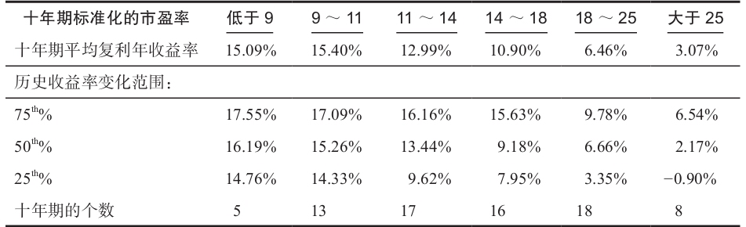

\>\> 表4-1中我们将标准化市盈率分为六类：低于9、9～11、11～14、14～18、18～25和大于25，投资者可以根据上述市盈率区间购买大型公司股票。我们可以得到每个市盈率区间随后十年的平均复利年收益率。这个结果和我们预期的一样：总体来说，标准化市盈率预示的股票价格越高，其随后的市场收益率越低，反之亦然。

\>\> 表4-1也包括包含了历史收益率的变化范围。例如，50分位点对应为中位数结果，25分位点表示大约有3/4的观察值的历史年收益率超过了给定的复利年收益率。

⭐回忆一下，1926～2011年大型公司股票的长期复利年收益率为9.8%。在历史复利年收益率变化区间有两个统计结果非常接近9.8%。这两个结果是

1.  横轴为25分位点，纵列为市盈率11～14的交叉结果（9.62%）。换句话说，在标准化市盈率为11～14时购买大型公司股票的，其随后十年期的复利年收益率有大于3/4的可能性高于平均收益率。
2.  横轴为75分位点和市盈率18～25纵列的交叉点（9.78%）。换句话说，在标准化市盈率为18～25时购买大型公司股票的，其随后十年期的复利年收益率有大于3/4的可能性低于平均收益率。

我们也可以通过一个简单的线性回归分析，检验标准化市盈率和随后10年复利年收益率之间的关系。图4-8以标准化市盈率为横轴，以随后十年期的复利年收益率为纵轴，每一个方块代表某一年份下投资者以特定的标准化市盈率购买大型公司股票，在随后十年期对应获得的复利年收益率。

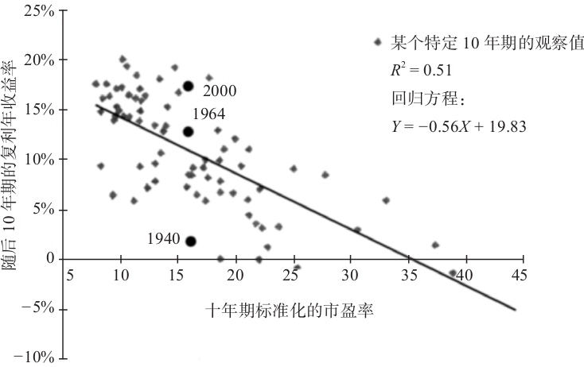

图4-8 大型公司股票十年期标准化市盈率和随后十年的复利年收益率（1926～2011年）

向下倾斜的回归线表明投资者对每单位标准化收益以越高的倍数购买股票，即市盈率越高，其随后的股票收益率越低。回归方程判定系数R2的值为0.51，表明标准化市盈率的变化可以解释大约随后十年期复利年收益率的一半变动。根据散布在回归线周围的观测值，很容易识别出具体的例子，使得其观察值具有相似的标准化市盈率，但是随后的收益率结果不同。例如在图4-8中，我们已经确定三个观测值，用黑色圆圈表示。三个观察值具有相似的估值起点：其市盈率接近整个期间的中位数，市盈率为16，即股票价格大约为标准化收益的16倍。然而，三个观察值对应的随后十年期的复利收益率结果存在很大差异。

\>\> 标准化市盈率可以看作投资者情绪的晴雨表。更高的市盈率水平表明投资者存在普遍乐观情绪，而较低的市盈率水平则表明投资者存在显著的悲观情绪。表4-1和图4-8的证据表明，投资者在任何单个方向的极端情绪都会随着时间的推移趋于缓和。表4-1和图4-8认为高于平均的市盈率水平倾向于导致收益率低于平均值。然而，这些图表也说明不同的市盈率估值水平下随后的收益率变动范围十分宽广。因此，对未来收益率建立一个精确的预测简直是不可能的。

预测信息的用途和误用

投资者想要知道为了负担孩子的大学学费或者完全支持其未来退休的支出，他们需要投资多少资金。这些问题的答案依赖投资者资产组合的规模、资产分配、投资组合中新增投资导致的现金流入和减少投资导致的现金流出的规模和时间、投资者愿意在投资组合上进行投资的期限，以及最终投资组合的未来收益率和收益率的波动。根据这些因素，蒙特卡罗模拟技术可以模拟投资者达到其理财目标的可能性。但是，模拟结果十分依赖投资组合的预期收益率，对其变化十分敏感；而反过来投资组合的预期收益率又十分依赖各种资产类别的收益率的预测，后者的长期平均收益率很难预测。虽然对资本市场构造详细假设超出了本章范围，但是去回顾收益率的预测方法，对预测资产类别未来收益率的近似水平有所帮助。

然而，正如我们在接下来的一章将要讨论的，投资顾问在使用这些预测方法制定战术性交易策略时应该小心谨慎。例如，图4-8显示虽然大型公司股票标准化市盈率和随后十年的复利年收益率之间存在关系，但这个关系远非圆满。或许更重要的是，可能同样的因素导致不同期间的股票收益率出现高于平均值或者低于值，这使得投资者在心理上很难执行价值增值的交易策略。

◆ 第5章 市场时机选择

\>\> 市场时机选择能力并不存在。那为什么市场择时能力又如此富有诱惑力呢？因为人们愿意相信市场择时能力是存在的。当我们研究大型公司股票的长期历史表现时，市场时机能力的期盼被股票看成具有预测性的变动趋势而加强——股票出现持续的价格上涨期间或下跌期间。尽管与这些表象相背离，但大型公司股票收益率的变动并不存在趋势。

\>\> 在一个长时间的熊市中，例如1973～1974年或2000～2002年的熊市，投资者倾向于自责自己，认为其应该意识到一旦价格开始下跌熊市就会持续下去。由于投资者不断面临有关股市下跌的财经新闻评论和晚间新闻的狂轰滥炸，这使得投资者很容易陷入自我惩罚的心态中。然而，如果市场下跌的时机和幅度不可预测，那就没有理由在市场逆行的痛苦中再加上自我责备而雪上加霜了。

“事后之明”也会在市场上行的时候出现。例如，在历史上最大的牛市出现之前，股价在1982年的夏天触底了。从现在回头看，投资者倾向于认为每个人都应该知道1982年夏天的股票很便宜，可以买入等着价格大幅上涨。可事实是，当时大量投资者并不知道能捡个大便宜；否则，他们的预期购买行为就不会让股票在一开始就成为便宜货。这个例子就像抛硬币实验，牛市和熊市的时机选择和持续时间是不可预测的，事后之明使之只是看起来似乎可以预测而已。

有效市场将已知的相关信息和未知的但市场普遍预期的信息融入到当前的证券价格之中。所以，当我们预测短期股票市场走势时，知道我们是处于战争还是和平环境，在白宫执政的是共和党还是民主党，或者经济处于扩张或收缩都没有任何价值。那么，是什么影响了短期市场？答案是投资者对与证券定价相关的新信息的反应。从本质上来说，没人发现的外界冲击触发了价格的变动，从而重新建立市场的新平衡。这些冲击本身是随机事件。当正向冲击多于负向冲击时，股市收益率将高于市场平均水平。反之，股票收益率将低于市场平均水平。牛市、熊市经常交替出现，但证据表明并不存在统一的方式来预测两者的转折点。

\>\> 在回顾一些市场时机选择的研究之前，\#\#\#回顾一下股市周期的统计数据\#\#\#

\>\> 很显然，典型的牛市上涨带来的收益比熊市平均下跌带来的损失大得多，收复熊市时的损失是绰绰有余的。然而，即使是在熊市期间，1/3的时间市场是上涨的，这就使得很难预测熊市是否已经出现，除非熊市已经发生，成为现实。

根据威廉F.夏普的一份研究显示：总是试图进行市场择时交易的投资经理人，必须在4次预测中至少大致有3次判断正确，才能仅仅获得和竞争对手整体投资业绩相抗衡的投资结果，而那些竞争对手并不需要采用市场择时交易。如果择时交易的投资经理预测的正确率更低，那么他的投资业绩就会更差\#\#\#2个原因\#\#\#。

\>\> 考虑到市场择时交易可能带来的潜在收益，夏普总结道：

除非真正出现类似大萧条一样的市场毁灭性的下跌，如果择时交易的投资经理人的预期是真正正确的，似乎可以预测他从择时交易中每年获得的收益率将略高于4个百分点。

\>\> 假设投资者错过了1926～2011年这86年间大型公司股票势头最好的8年，而在这8年中取而代之的是投资于短期国库券。那么投资者在1925年年末最初在股票上投资的1美元，在2011年年末其价值会达到202美元。而与此相比，如果在整个86年期间全部投资于股票则其价值将增加到3045美元。投资者因为错过了股票收益率极高的8年而会付出可怕的代价。

股票带来的丰厚收益不会以统一的方式增长。相反，股票的丰厚收益可以追溯到几个特定的时期，这期间股票迸发能量，快速增长。有趣的是，这些股票价格向上激增往往会在市场悲观情绪高涨的时候出现。这是有道理的：当市场悲观情绪达到最大极致时市场也已经触底，在这个时点上任何对未来光明的展望都会将市场推得更高。尽管如此，这些市场的转折点都是在回顾过去时才看起来似乎可以辨认，我们再次强调这一点很重要。

\>\> 如果理论家关于市场时机选择无效的观点是正确的（也就是说，一般情况下市场时机选择正确的可能性仅为50%），可能造成的后果就是，在最好的情形下实际美元收益只比连续投资于标准普尔指数大约多两倍，而在最坏的情形下收益却比标准普尔指数少100倍！

这些……统计数据的关键在于单纯地强调了市场时机选择战略家需要克服巨大的自然赔率，并且随着投资时间整体的拉长和每个时间间隔中择时交易频数的增加，赔率几乎呈现出几何级数式的增加。这使得可能在任何情况下对投资组合的客户而言，谨慎的买家比潜在的择时交易经理人作出的组合更可靠，尽管这些经理人可能是经过客户反复面谈才找到的。

\>\> 市场择时交易的主要问题在于，牛市带来的总收益不是随时间均匀分布的，其分布比重不均匀，大部分总收益迅速地分布在市场复苏初期。如果市场择时交易在这样一个关键的时刻选择旁观，而以现金等价物的方式持有投资，他很容易因为没有采取行动而错失良机。

\>\> 正确预测牛市比正确预测熊市更为重要。如果投资者仅有50%的机会正确预测牛市，那么他根本就不应该进行择时交易。因为即使投资者能100%地完全预测熊市，他的平均收益率仍然小于买入-持有投资策略带来的平均收益率。

他们计算了市场择时交易者需要达到的条件，投资者的预测精确度至少要达到：

牛市80%，熊市50%；或者

牛市70%，熊市80%；或者

牛市60%，熊市90%……

这些结论特别有趣，因为专业的市场择时交易者主要从提供服务中获取好处，因此他们常常面临资本保值和有能力避免熊市的压力。

之前的研究都指向同一个结论：任何试图进行市场择时的交易都很可能失败，而市场下行给择时交易者带来的风险要远远大于市场上行带来的潜在回报。这一结论与金融经济理论相吻合，金融经济理论认为，仅仅直接利用现成的信息不可能简单地预测得到股市收益率。对过去几十年市场择时交易的研究结果进行广泛深入的回顾，发现经验证据通常都支持了经济理论。

\>\> 约翰R.格雷厄姆和坎贝尔R.哈维以237份投资简报上的市场择时交易的投资建议为样本分析。每份简报都推荐了一个股票和现金组合。也就是说，这些简报并不做特定的股票推荐，而是试图**预期整个市场的走势**：

我们的论文分析了投资简报对市场走势的预测能力。通过分析1980～1992年15000多份有关资产分配的推荐，我们发现没有证据表明，在未来市场出现正的收益率之前，这些推荐建议投资在股票上的权重增加，或者在市场出现负的收益率之前，这些推荐建议持有的股票权重下降……然而在某些特定的时间，投资简报上的推荐意见似乎在短期具有指导作用，投资者也不能根据投资建议持续判断正确以识别出特定的投资简报，并认为其在长期可以提供卓越的投资建议。我们的蒙特卡罗分析表明，这些投资简报的投资业绩并不一定比随机提供建议的投资简报更好，甚至有可能更加糟糕。

\>\> 市场择时交易这个游戏值得玩吗？在试图采用市场择时交易策略改善投资业绩之前，先问问自己下列问题：

（1）这种市场择时交易策略是通过“数据挖掘”发现的吗？数据挖掘着眼于大量可能的交易策略，从中筛选出能够产生最佳投资结果的策略。数据挖掘把注意力过多地放在数据上，而不是审慎地思考为何这一种特定的策略应该发挥作用。通过数据挖掘产生的交易策略当将其向后延伸时一般不会发挥作用。

（2）市场择时交易策略可以发挥作用，其背后存不存在经济原理？市场择时交易成功的实证证据需要可靠的经济理论支撑，这种理论解释了为什么交易策略在过去可以发挥作用，为什么交易策略在未来可以取得成功。

（3）市场择时交易产生的回报有多大？可以持续多久？一些研究文献显示，在整个研究期间市场择时交易都是成功的，但是在研究的子时期中择时交易策略的结果有好有坏，变动范围很大。如果市场择时交易策略产生的收益很小，和/或收益不具有持续性，那么这种交易策略需要谨慎对待。

（4）市场择时交易策略在上行时带来的潜在回报是不是和策略失败时的下行风险一样大？实证研究有时显示择时交易策略的潜在结果分布偏向糟糕的投资业绩。也就是说，即使市场择时交易策略在大多数时候可以起作用，但是当策略起作用时的回报小于策略失败时的损失，那么市场择时交易策略的投资业绩可能不如买入-持有策略。

（5）在扣除交易成本和相关税收后，市场交易策略还能产生增值吗？采用低成本的指数基金的买入-持有策略天生具有节税效应。任何活跃的市场择时交易策略在开始增值之前必须首先弥补交易成本和相关税收。

（6）这种策略是否广为人知？被广泛使用了吗？如果这样，随着时间的推移，这种交易策略带来的回报将会因为套利行为而趋近于零。

（7）我有遵循这种策略的耐心吗？能严格地遵守策略吗？

最后一个问题引出了一个重要的行为问题。

\>\> 看着股市持续大幅走高，这些投资者中有多少人能大胆地在市场最终逆转之前提前脱离，淡定地旁观？

虽然从市场择时交易中获取长期收益不太可能，但仍然有投资者从市场择时交易中获得正的投资收益，尤其是在短期。这是因为在任何给定的时间内，投资者的投资结果将会大相径庭，有些投资者做得非常好，而有的投资者做得非常糟糕。从统计而言，这是我们所期望的，而危险和问题在于逻辑的跳跃，人们经常假定更好的市场择时交易的结果是由卓越的预测能力所导致的。总的来说，市场择时交易并不发挥作用，大多数市场择时交易投资者的投资结果已经是负的，或者在未来将是负的。然而，那些最近作出正确行动的市场择时交易者被写进了金融刊物，并在电视上接受采访。这燃起了一些人的希望，他们希望存在一种方法，在能够获得牛市好处的同时避免熊市的痛苦。与此同时，不成功的市场择时交易公司逐渐消失，因为他们的投资者将投资组合的剩余部分重新配置，配置到了最新被发现的市场择时交易大师手中。

许多投资者宁愿生活在虚假的希望中，也不愿意审慎地检验市场择时交易是否可行。就像亚里士多德观察到的那样：“一个合情合理的不可能总是比一个不值得相信的可能来得好。”要投资者面对市场择时交易是否可能这个问题，可以强迫投资者承认要么必须每隔一段时间就面对熊市的痛苦，要么就必须选择完全放弃投资股票，从而牺牲实际资本增长的可能性。人类存在一个普遍的倾向，为了与自己的预想相匹配，他们会重新诠释经验。这在市场择时交易中常常出现，人们总是怀有春天般的希望，希望在某些地方，有些人可以以某种方式持续地捕捉到牛市，同时安全地回避熊市。

除非投资者有足够长的投资期间，否则投资者不应该投资股市。如果投资者真的可以长期投资，那么他将不可避免地经历牛市和熊市。

\>\> 在短期，恐惧或者贪婪可能导致股票价格水平严重偏离其真实价值，而这不应该是长期投资者担心的，因为他们知道严重偏离的部分能够自我扭转。从长期来看，市场价格水平会紧紧围绕其真实价值波动。

市场择时交易的另一种方式就是简单地一直投资于股票市场。就如同威廉·夏普指出的那样：一直在股票市场中持有资产的投资经理人可能是一位积极的市场择时交易者。他的行为与预期每年都是景气年份的市场择时交易策略相一致。尽管这位经理也许可能知道这样的预期大概三年中有一年是错误的，然而这种做法导致的投资结果可能优于大多数市场择时交易者的投资业绩。

\>\> 想想在过去20年里，股市每个月有60%的时间在上涨，40%的时间在下跌。保持投资就是在赔率已知的情况下下赌注。

◆ 战术型资产分配的兴起

\>\> 2010年的调查结果显示，使用战术型资产分配的投资顾问只有8.3%。为了讨论战术型资产分配，我们首先必须介绍战略型资产分配。**战略型**资产分配：

（1）希望确定和维持投资组合的资产分配，使得其与投资者的理财目标、投资目的、投资期限和波动性容忍度相适应。

（2）从不试图预期市场短期波动的方向和大小。

（3）特征是在投资者的投资组合中对每种资产类别都配置固定的目标比例。

（4）要求定期对投资组合进行调整，实现投资组合的再平衡，从而对每种资产类别维持其目标资产分配。因此战略型资产分配并不是一个买入-持有策略。

**战术型**资产分配试图改善战略型资产分配的投资业绩。通过使用战术型策略，投资者根据对未来各种资产类别收益率的预测，定期改变各种资产类别的配置比例。对战术型资产分配的主要批评在于，战术型资产分配只是臭名昭著的市场择时交易换了个名字而已，支持者认为战术型资产分配并不是市场择时交易。市场择时交易往往大幅度过度投资于某种资产类别，或者完全从某种资产类别中退出，而战术型资产分配对战略资产分配的调整更加温和。在通过维持投资组合中各种资产类别的最低投资比例要求，战术型资产分配保留了分散化的优势，同时又通过不定时地抓住机会调高或者调低某种资产类别的投资比例增加投资组合的价值。战术型赌约并不是决定该赌约是否成功，而是觉得如果赌约成功了投资组合的价值增值多少。也就是说，减少战术型赌约的使用规模并不会提高其成功的可能性，只是限制了成功时带来的回报和失败时带来的处罚。最重要的问题是：战术型资产分配能够发挥作用吗？可以增加投资组合的价值吗？

本章前文的研究说明，**大多数战术型资产分配并不能改善战略型资产分配的投资业绩**。（CF：《哈利·布朗的永久投资组合》中的可变资产配置）在此引用的唯一可能的例外是沈普投资策略，该投资策略在标准普尔500指数的价格收益率比率和3个月的短期国库券的收益率差异低于整个差异的十分位点时就卖出股票。许多战术型资产分配需要经常调整投资组合的资产分配，以试图改善投资组合的短期投资业绩，然而沈普投资策略很少涉及资产分配的变化，其收益需要很多年才可以实现。沈普投资策略区别于其他战术型策略在于它是建立在市场价值估值的基础上的。

在表4-1中我们看到，许多时候投资者为取得美国大型公司股票，愿意支付的市盈率乘数各不相同，变动区间很大，因此其随后的投资收益率也是千差万别。从该表中可以总结得到，市场价格总是时不时地偏离其内在的“真实价值”。为什么会这样呢？根据行为金融学家的理论，这可能是因为投资者在制定投资决策时受其主观情绪的影响。当市场投资者贪婪成风时，市场就会高估资产的真实价值，为之后的低于平均水平的收益率埋下了伏笔。20世纪90年代后期的“非理性繁荣”就是这样一个例子。同样地，当市场到处弥漫着恐慌和担心时，市场就会低估资产的真实价值，从而为之后高于平均水平的收益率奠定基础。

人们观察到投资者在制定投资决策过程中无法将其主观情绪驱逐出去，这一观察产生了一个悖论。一方面，耐心的投资者追随以价值为基础的战术型资产分配，利用市场极端情绪导致市场出现估值过高或者过低的投资机会，可能可以获得超过平均水平的收益率。另一方面，如果大部分投资者都是过于乐观或者过于悲观，那么只有一小部分投资者有勇气并且有毅力执行反向操作，从而获得高于平均值的收益率。也就是说，只有追随心理上万分难以执行的投资策略，才可能获得增量收益。

◆ 第6章 投资时间期限

1.  我们把国库券（treasury bills）、中期政府债券、长期政府债券以及长期公司债券分为一组，它们都是可以产生利息的投资工具，即付息投资工具。
2.  第二组包括大公司股票和小公司股票，是历史收益率相对高的股权投资

\>\> 付息投资工具（即债权类投资）是承诺以利息支付作为回报，并在指定到期日归还本金的贷款。这种投资工具的首要优点是未来现金流（利息支付和本金回报）的特征事先确定，主要缺点是投资工具容易受通货膨胀影响。历史经验表明，付息投资工具不能够在产生收入流量的同时保持其对应的购买力，即抵斥通货膨胀的影响。相比之下，大公司股票和小公司股票是对公司拥有的所有权利益。权益类投资以股利和（或）资本增值形式提供回报。它没有指定的到期日也不承诺在未来某天归还本金，但股权类投资收益的可能性是没有上限的。相比债权类投资，权益类投资的首要优势是有望获得实际的（即通胀调整后的）、长期的资本增值，而权益类投资的主要劣势是本金价值在短期存在非常高的波动性。

从本质上说，债权类投资和权益类投资这两大投资类别代表了不同的资金运作方式，体现了作为“放贷者”和“所有者”的传统区别。作为“放贷者”的债权类投资以较低的收益率为代价，期望得到更加确定的收入；而作为“所有者”的权益类投资以短期本金的波动为代价，期望通过所有权权益分享资本可能的长期增值。这些权衡和对比体现了不同投资工具风险和收益的关系。我们之前大量讨论过风险，然而在我看来，两种最重要的风险是：

通货膨胀风险，通货膨胀更多地损害了债权类投资；

波动性，波动性更多地损害了权益类投资。

\>\> 许多投资者过于重视股票收益的波动性而忽视了通胀的有害影响。

1.  通货膨胀是“阴险的”，一步一步缓慢影响；
2.  不理解通胀的人看重账面回报（名义回报），更偏好于债权类投资工具
3.  相对而言，股票波动在短期的损害更大。

\>\> 在短期，股市波动可能带来的负面影响比通胀可能带来的损害要大得多。投资者对股市波动的畏惧有根据吗？有些情况下有，而在有些情况下没有。

1.  股票短期收益率是难以预计、有波动的。
2.  人们青睐于确定性（或可预见性）而非不确定性。

\>\> 经济学家以“财富效用递减”为基础解释人们对风险（即不确定性）的厌恶，即每额外获得的1美元都会提高人们的福利（well-being），但随着财富基数越大，提高的速度递减（即边际效用递减）。如果你的财富是1000美元，额外的100美元对你的意义比你坐拥千万家产更大。在投资领域中，这意味着投资成功赚得的钱其价值低于投资失败亏得的同等数额的钱。

\>\> “在什么条件下投资者才值得承担波动性？”如果我们把5.8%的权益风险溢价（equity risk premium）（CF：第3章）分摊到一年的365天，我们会发现相对于国库券，大公司股票的日收益优势几乎消失了。在给定的任何一天，大公司股票业绩胜过国库券的概率基本上是50%。股票收益率的**单日波动性**无法为投资者承担权益风险提供的激励，同样的道理对股票投资期限为**一个月和一年也适用**。在过去的86年里，大公司股票总收益率的标准差是20.3%（见表3-1）。这个标准差远大于我们从持有大公司股票中预期能获得5.8%的权益风险溢价。

\>\> 时间是投资管理过程中最重要的维度之一。投资者也经常不能很好地理解它。不幸的是，投资者经常不能很好地理解投资时间期限的含义。在评价付息类投资和权益类投资的过程中，时间期限决定了投资策略的适宜性。**如果投资者知道下个月需要30000美元去购买一辆车，在此过渡期间货币市场基金将是一项合理的投资。而未来名义支付义务确定的退休金计划可能需要把这些支付义务期限和具有差不多期限的债券进行匹配，或者遵循免疫投资策略**。

但在大多数长期投资情形下，投资目标中不含有确定的未来名义收入需要，而通货膨胀变化的方向和大小存在着太多的不确定性。因此**更多情况是，投资目标设定为保存或积累财富的实际价值**，而非名义价值，这就要求权益类投资。有鉴于此，我们做如下结论，在短期权益投资的波动性相对于其预期收益而言太高，随着投资期限拉长，情况则会改变。

\>\> 暂时假定稳定的通货膨胀率、利率和权益风险溢价。随着投资期限的拉长，股票预期收益率不会改变，但持有期间复利年收益率的变化程度显著下降。持有期越长，好年份的股票收益率抵消坏年份的概率就越大，结果使得复利年收益率的值域向中间汇聚。股票波动在短期毫无疑问是敌人，但它却是股票较高预期收益率的基础。时间把这个短期的敌人转换为长期投资者的朋友。

\>\> 通过把各个持有期的起点由每个公历年初改成每月初，图6-1提供了国库券和大公司股票收益率变化幅度的更全面的比较。当持有期被拉长，复利年收益率的变化幅度显著地呈现出向中间聚集的趋势。注意到所有240个月持有期的投资期间都有正的复利年收益率。我们也观察到相当有趣的现象，大公司股票收益率的中位数在持有期为12个月、60个月、120个月和240个月下大致相同。当然，国库券收益率的中位数大幅低于大公司股票，但也存在类似地相对稳定现象。

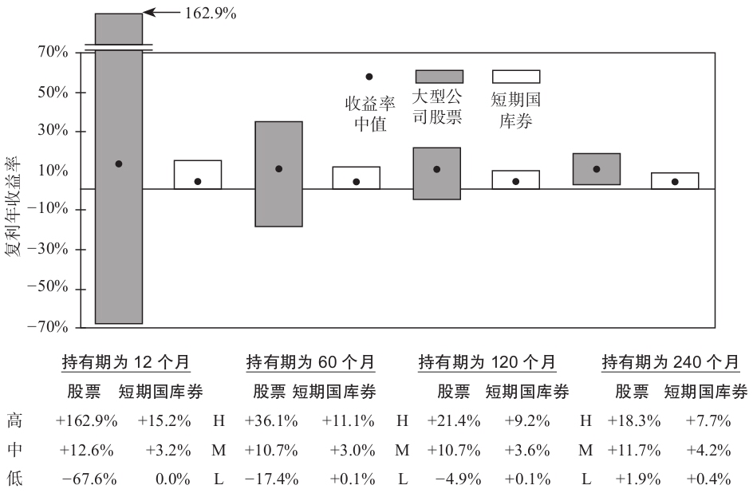图6-1 1926～2011大型公司股票对比短期国库券：不同持有期下复利年收益率的波动区间

\>\> \#\#\#图6-2和图6-3用不同方式传达了同样的信息\#\#\#。在这里我们直接比较同期的大公司股票和国库券在不同持有期间下的相对收益。我们再次发现如果股市的波动性是一种疾病，那么时间就是解药。

\>\> 投资者普遍有低估投资期限的倾向。把他们的退休期限和投资组合的投资期限弄混淆了，后者更长。如果他们打算用投资组合来支持他们度过退休后的生活，投资期限实际上终止于两人中更长寿的人逝世的那天。

\>\> 对投资期限的正确理解可以显著改变投资者的风险容忍程度。第7章将建立一个简单的模型，指导客户作出对投资组合业绩影响最大的重要决定，即在债权类投资工具和权益类投资工具之间均衡搭配。

◆ 第7章 确定广义投资组合平衡的模型

\>\> 我们将讨论在评估客户以下方面的情况时所面对的挑战。

●具体目标 ●投资目的 ●客户拥有的投资知识 ●风险 ●波动性容忍度

◆ 具体目标

\>\> 个人客户目标的示例包括提前退休、孩子的大学教育、购置度假房屋或者赡养年迈的父母。当客户表达了这些目标，它们经常缺乏具体性。

◆ 投资目的

\>\> 有时候，客户目标定得太高以至于现实中很难达到。通常，人们经常拖延到退休前几年才开始严肃地思考经济独立的问题。他们那时才准备尽可能地改变生活习惯，以省出资金来投资，确保未来能获得舒适的退休生活。但到那个时候，可以承担得起的退休的生活方式已经基本确定了。如果客户到那时才发生这样的退休生活方式严重不好，客户可能也没有办法有效地改善它。

人的欲望总是超过其可获得的资源。因此，在制定投资目的时，投资目标必须摆在首要位置上，有时在所有给定的情况下确定什么是现实可行性的过程中，目标是需要妥协的。良好的投资目标是建立在现实的资本市场的假设之上，反映了客户可获得的收入和资源的限制。

◆ 客户拥有的投资知识

\>\> 一个客户说他从未投资过债券，并且也不偏好债券投资，但他可能只是在表达对他债券投资的不熟悉。仅仅因为这样的反馈而构造一个排除债券的投资组合是不恰当的。

◆ 风险

\>\> 客户一般不会以预期收益率和标准差这类术语来思考风险。大部分情况下，客户把风险认为是字典中定义的风险：损失的可能性。

\>\> 损失厌恶心理的另一个问题是客户倾向于用名义收益率（nominal return）而非实际收益率（real return）来思考。

\>\> 许多客户害怕权益投资（equity investments）。在和这些客户打交道时，投资顾问的任务不是把他们从风险规避者改造成风险承担者。正如我们之前的论断，风险厌恶是非常理性的。相反，投资顾问的任务是使客户对他们面临的所有风险变得敏感，然后根据他们所处的环境对这些风险带来的可能的威胁进行排序。这是我们为什么要详细探讨投资的时间期限（time horizon）对投资组合设计过程产生影响的原因。

只有参照相关的投资时间期限，我们才能确定股市的波动性和通货膨胀哪个风险更大。对于长期的投资者，波动性不是主要风险，通货膨胀才是。

◆ 波动性容忍度

\>\> 真正的问题是客户能够容忍的波动性水平。

\>\> 图7-1提供了有效的视觉辅助，帮助比较短期国库券（treasury bills）和大公司股票的收益率和波动性特征。国库券每年的总收益率稳定为正，其收益模式就像大城市的天际线。叠加在这条天际线上的是大公司股票剧烈波动的总收益率。横跨图中的水平实线对应的是大公司股票11.8%的简单算术平均收益率。有趣的是，在整个86年的时间里，国库券收益率只在1981年超过了大公司股票11.8%的简单算术平均收益率。虽然如此，但是这并不说明在短期进行普通股投资是有道理的。在超过1/3的年份中，大公司股票年度总体收益率都落后于国库券，而且经常落后很多。

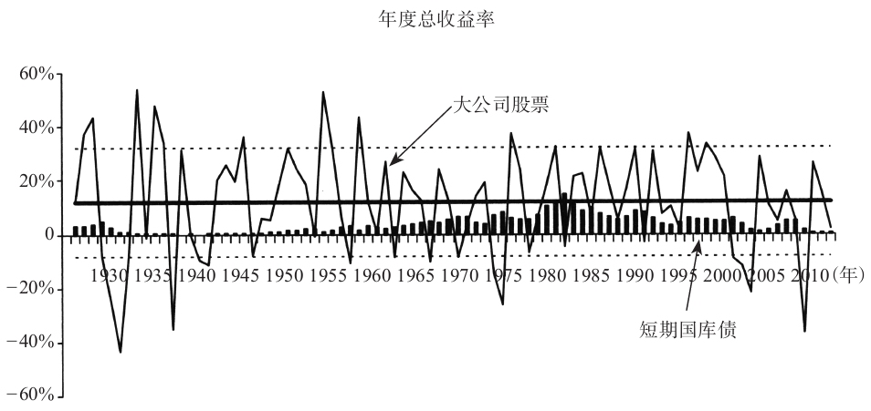

图7-1 波动性风险（1926～2011年）

\>\> 在图7-1中很容易识别出大公司股票表现特别糟糕的年份，也相当容易找到连续两年期或者连续三年期中最糟糕的期间。但要识别出糟糕的连续的五年期或者十年期就更为困难，因为好的年份总是被糟糕的年份给平均了。因此，投资期限的延长减轻了波动性带来的风险，与此同时却给权益风险溢价（equity risk premium）提供了发挥复利优势的机会。

表3-1列示了标准差统计量为20.3%，这量化了大公司股票收益率的高波动性水平。如果简单地假设大公司股票收益率服从正态分布，大约2/3的年度收益率观测值会落在以简单算术平均收益率11.8%为中心的正负20.3%的区间里。在大公司股票11.8%的简单算术平均收益率上下各一个标准差的位置分别划两条水平虚线，对应的收益率分别是32.1%和-8.5%。水平虚线的上方和下放一起形成了一个信封，它包含了大约2/3的年度总收益率的观测值。剩下1/3的年度总收益率的观测值落在信封外。一个标准差所定义的相对幅度（range）是40.6个百分点那么宽。历史上，承担这个波动性的奖励是额外增加5.8%的复利收益率，即比稳定的国库券带来的收益率高6个百分点。现在，哪个数字更大：是40.6%的相对波动性还是5.8个百分点的奖励呢？

◆ 投资组合平衡模型

\>\> 不可否认的是，投资经理人的“期望收益率和标准差”的世界和客户的“想要不承担风险地赚很多钱”的世界之间存在隔阂，将两个世界分割开来。本书第一部分讨论了美国资本市场各种可能的投资工具的长期历史业绩。在这些信息的基础上，我们建立了简单模型，用来估计这些投资工具的长期复利年度收益率和相关风险。当我们引导客户回顾资本市场时，他们的认知和预期将变得更加贴近现实，从而形成作出更加明智的投资决策的能力。如果客户没有受到这个教育，很少有客户能够为其自身作出最优的投资决策。

客户需要做的最重要的投资决策就是确定投资组合的资产在付息类投资工具（interest-generating investments）和权益类投资工具（equity investments）之间的分配。该决策决定了投资组合基本的波动性和收益率特征。我们需要一套方法，迫使客户现实地处理波动性和收益率之间的反向权衡关系。我们即将建立的模型采用了简化假设。尽管在简化过程中我们失去了部分的精确性，我们最终应该以该模型是否能够有效地帮助客户理解波动性和收益率之间的反向权衡（trade-off）关系为标准评价模型的价值。如果客户能够作出更好的投资决策，并且更为自信地坚持遵守合适的长期战略，那么这个模型就达到了它的目的。

\>\> 引导客户作出最重要的投资决策的过程中涉及的几个步骤。

步骤1：证实客户充分了解了短期国库券和大公司股票各自的收益特征。

（1）参见图2-1：美国资本市场中的投资财富指数。

（2）参见表3-1：年度总体收益率描述性统计特征。

步骤2：证实客户充分了解了短期国库券和大公司股票各自的波动性特征。参见图7-1：波动性风险。

步骤3：和客户一起回顾投资期限在评估风险和付息类投资工具与权益类投资工具谁更合适等问题中的重要性。参见第6章。

步骤4：确定客户全部投资的投资组合的当前价值。这包括：

（1）所有流动性投资和非流动性投资（例如，不动产投资）的价值，尽管后者不能轻易地转变为现金。

（2）雇主支持的退休金的价值，尽管客户可能没有这些资金的自主投资权。

（3）年化的收入现金流的现值。尽管这些一般不被认为是投资性资产，并且也很少反映在客户的资产负债表中，然而，它们是重要的经济意义上的资产，应该在构建投资组合过程中考虑进来。

步骤4：帮助客户从最广泛的角度来思考其投资组合，把注意力集中在大局上。

步骤5：指导客户虚拟地将其全部投资组合转换成现金。这个转换过程将客户从过去投资决策的阴影中解脱出来，从而克服过去投资的惯性影响。

步骤6：描述一个虚拟的投资世界，在该投资世界里只有两类投资工具：短期国库券和大公司股票。在上述投资世界中，我们将假设：

（1）给短期国库券设定3%的模拟收益率，给大公司股票设定9%的模拟收益率（两种投资工具的收益率都低于其长期历史平均水平）。

（2）给短期国库券设定0%的模拟标准差，给大公司股票设定20%的模拟标准差。由于投资期限为一年，短期国库券的收益可以锁定，不存在不确定性，因此假设短期国库券的标准差为0。

步骤7：要求客户将投资组合清算所得到的现金在这两类投资间配置。这样一做，客户应该谨记每类投资工具的波动性和收益率特征，以及相应的投资期限

\>\> 从心理学角度讲，如果最终结果出现在遥远的未来，那么容忍波动性会更加容易。因此对于长期投资者而言，正确地理解投资期限能够提高其波动性容忍度。但不幸的是，资本市场的流动性不断地修改证券价格，并提高投资者对短期投资业绩的意识。对此的一个小技巧就是，如果关注的相关结果确实对应于长期投资期限，投资者应避免将过多注意力放在短期业绩数据上。

如果客户直觉上理解了时间流逝对于缩小投资组合复利年收益率变化幅度的影响，那么\#\#\#表7-1\#\#\#本身可能就足够了。其他客户可能需要更详细地列举各个投资组合在一直以来的收益率变动幅度。对他们而言，\#\#\#图7-2～图7-6\#\#\#可以和\#\#\#表7-1\#\#\#结合起来，表达时间对选择投资组合配置均衡的影响。

\>\> 有些客户原以为自己充分理解了股票波动性，并且可以接受波动性的存在，但是在全球金融危机或者2000～2002年漫长的熊市中股票价格急速下跌可能会改变他们的观点。生活中可能发生各种事情，改变客户的波动性容忍度，例如家庭成员构成的变化、工作或事业的变化或者健康问题。

\>\> 根据客户的投资组合配置平衡决策，投资顾问就可以开始设计一个更加分散化的，利用多种资产类别的投资组合。这把我们带入了第8章，我们将讨论分散化效应。

◆ 第8章 分散化：第三个维度

\>\> 本章我们将探究分散化的概念，我们会发现仅以收益和波动性这两个维度将难以描述一项投资。我们还需要第三个维度，即分散化效应去描述一项投资。分散化效应能够有效地将投资组合的波动降低至投资组合中各投资项目的加权平均波动范围以下。

\>\> 两项投资之间收益的交叉相关系数（即相关性）显示了给定一项投资收益，我们可以获取的另一项投资收益的信息。

注释：两项投资收益率的协方差是每项收益率偏离其预期收益率的乘积的加权平均值，权重为偏离的概率。两项投资收益的交叉相关系数等于其协方差除以标准差的乘积。

投资组合的算术平均收益是将构成投资组合的投资项目的算术平均收益进行简单的加权平均。无论投资项目之间的波动性和收益模式如何，这样的计算过程都是正确的。然而，除了少数投资之间的收益率是完全正相关的情况，在所有情况下投资组合的波动性小于构成投资组合中投资项目波动性的加权平均。

\>\> 如果我们假设未来的情况将和过去一样（我们将会发现这是一个大胆的假设），图8-5中的实线描述了将大型公司股票与长期公司债券结合起来的各种可能的投资组合的特征。B点代表投资组合内的所有投资均为债券投资，S点代表投资组合内的所有投资均为股票投资。连接B和S的虚直线表示，如果股票和债券完全正相关可能构成的投资组合业绩。如果是这样的话，分散化效应将不会发生，投资组合的波动性等于股票和债券波动性的加权平均。

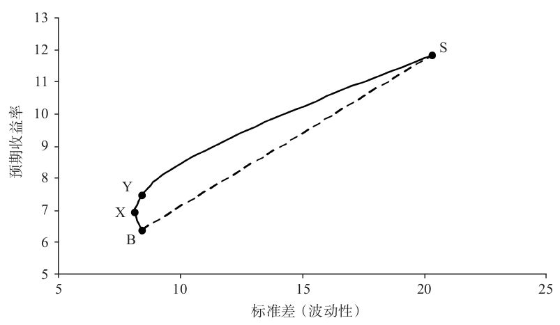

图8-5 大型公司股票/长期公司债券

然而，由于股票和债券之间并不是完全正相关的，每一种股票和债券构成的投资组合的波动性比组成它的有价证券的加权平均波动性低。于是，弓形的实线描绘的便是这种可能的投资组合集合。实线和虚线之间的水平距离衡量了任意股票和债券构成的投资组合的分散化效果。股票和债券之间相对较低的0.16的相关系数导致了这种分散化效应。

这个例子揭示了分散化的强大作用，最小波动组合并不是全部由长期公司债券组成。在图上对应于最小波动投资组合的X点是由89.8%的债券和10.2%的股票组成。该投资组合的标准差为8.1%，小于长期公司债券8.4%的标准差，而且其预期收益率为6.9%，比长期公司债券高出1.5个百分点。

一个极端保守的投资者由于无法理解分散化的强大力量，可能持有一项完全由债券组成的投资组合。图8-5说明这类投资者可以通过适度分散投资于股权投资，从而有机会在提高投资组合预期收益的同时降低波动风险。

如果极端保守的投资者对完全由债券投资构成的投资组合的波动水平感到满意，那么他也可以选择投资组合Y，Y组合由79.8%的债券和20.2%的股票投资构成。投资组合Y的标准差为8.4%，等于完全由债券投资构成的投资组合的标准差，但是投资组合Y的预期收益是7.5%，比债券投资组合高出1.1%。

\>\> 第11章将讨论投资组合最优化的数学运用，根据计算机程序的输入参数确定理想的资产分配。计算机程序的输出结果对输入的参数非常敏感。重新回顾\#\#\#图8-6～图8-8\#\#\#的目的之一是让我们更加意识到计算机程序所依赖的输入参数的内在不确定性。在最好的情况下，历史数据有助于了解资产类别的波动性、收益特征以及两者之间的关系。然而，这些数据不能以这种方式从不断变化的市场中提取“真相”。太精确的答案往往是不可能的。

1.  \#\#\#图8-6\#\#\#按照月度滚动方式比较了60个月（5年）中大型公司股票与长期公司债券的复利年收益率。
2.  \#\#\#图8-7\#\#\#列示了以月度为基础滚动得到的60个月（5年）大型公司股票对比长期公司债券收益的标准差。
3.  \#\#\#图8-8\#\#\#绘制了以月度为基础滚动得到的60个月（5年）的大型公司股票和长期公司债券收益的相关系数。

\>\> 当我们研究仅采用两项投资工具构成的可能的投资组合范围，每个投资组合的预期收益水平都对应一个独特的资产分配。但当我们考虑使用三个或者更多的投资工具构成的可能的投资组合范围时，这并不成立。我们可以确定许多的资产分配方法，它们构成的投资组合的预期收益相同，但是对应投资组合的波动性存在差异。其他的资产分配由于波动性水平过高，因此并不尽如人意。根据定义，给定的预期收益下，使得投资组合波动性最小（或者在给定程度的波动性下能够最大化投资组合收益）的投资组合被认为是有效的。如果我们把一组给定的投资工具中所有的有效投资组合连接起来，便形成了我们所说的有效边界。

\>\> 现在我们进入下一个步骤，即为了建立一个有效的投资组合，必须强调将适当金额放入我们每个篮子中的重要性。

在第7章中我们得出结论认为，提高预期收益的唯一方法就是假定投资组合承担更高的波动。现在，我们又被告知可以不增加波动性而直接提高无效的投资组合的预期收益。难道这不矛盾吗？不。波动性与收益的相互制衡关系在有效边界上一直存在！也就是说，假设你现在有一个有效的投资组合，提高预期收益的唯一方法（如果限制在一个给定的投资工具集合中）是提高投资组合的波动。

无效投资组合的概念也可能表明在经济中明显存在“免费的午餐”，即不用增加投资组合的波动而获得额外的增量收益是可能的。但是，有效市场中不存在免费的午餐。因此，与其认为这种情形是免费午餐，还不如将无效组合描述如下更加合适：无效组合是承担了不需要承担的没有风险补偿的波动，或者牺牲了无需牺牲的增量收益。

\>\> 扩充可以用于构造投资组合集合的投资工具的选择单，为在任何投资者可以容忍的波动性水平下获取更高的收益率提供了可能。同样，我们可以看到不断增加的投资工具的数量为我们寻求在不同预期收益下降低波动性提供了更多的可能。信息很清楚：虽然在给定情况下，利用所有的投资工具并不总是一个明智的选择，但是可选择的投资工具总是多多益善，而不是越少越好。与投资机会集允许各种可能相比，任何时候当投资机会集被武断地限制，投资者将承担局限于更低效率的投资边界的风险。

\>\> 了解分散化效应的好处对激进的投资者来说尤为重要，这些投资者通常对讨论分散化策略不感兴趣，因为他们错误地认为分散化会减少收益。事实未必如此。从本质上讲，分散化效应将高于投资者意愿的投资比例配置到权益类投资中，从而使得更加激进的投资者改善其投资组合的预期收益，而不会平滑不同投资工具的不同的收益。

如果我们想尽可能多地消除投资组合中的波动，可以考虑在投资组合中包含所有的资产类型，将分散化效应用到理论极致。这样做可以为投资项目中不同的收益模式提供最好的机会，使它们部分相互抵消。然而，这样可以消除所有的投资组合的波动性吗？不行。即使分散化之后，还有剩余的波动性存在，我们称之为不可分散的波动。考虑承担不可避免的波动时，我们期望会有同等的报酬。

那种很容易通过分散化消除的波动呢？我们称之为可分散波动。我们承担这些波动应该得到补偿吗？有效市场不会为投资者那些很容易消除的波动提供补偿。因此，投资者承担的可分散的波动得不到补偿。

\>\> 有兴趣对本章所描述的概念进行更深入讨论的读者可以阅读下面的附录。我们会补充介绍一些有关分散化的例子，并且探讨它们与资本资产定价模型（CAPM）的关系。

◆ 附录：对分散化概念和资本资产定价模型的进一步讨论

\#\#\#用3个例子直观地理解风险稀释\#\#\#

\>\> 有三个投资选择时，我们需要指定三个相关系数，这通常是以相关系数矩阵的形式完成的。

\>\> 对于给定的预期收益，一个可以最小化投资组合波动性的具体配置被认为是有效的。其他可以产生相同预期收益，但是波动性更大的投资组合是无效的。如果我们将各种可能水平下的预期收益对应的有效投资组合连接起来，就形成了我们所说的“有效边界”。

◆ 资本资产定价模型

\>\> 将例子改变一下，允许投资者可以以某种零波动利率Rf借入资金或者投资，那么将会发生什么呢？图8-15显示了一条绘制的直线连接了纵轴上的C点和有效边界的切点M点，C点对应于零波动利率Rf。在这种情况下，投资者可以根据其波动性忍受程度，以零波动利率借入或者投资，所有投资者都持有相同的最优波动资产组合M是有利的。

波动厌恶程度更高的投资者会以零波动利率投资部分资金，同时持有波动性资产组合M以保持平衡。根据投资于零波动利率上的资产比例，他们的投资组合会位于连接C点和M点的直线上，其中C点对应零波动利率，M点对应最优的波动性资产组合。对于波动性容忍度更大的投资者，其持有的投资组合会位于直线MX上，此时他们以零波动利率借入资金，从而获得额外的资金，将更多的资金投资在最优波动资产组合M上。需要注意的是，由于借入或贷出增加了额外的可能性，投资组合的可能集合位于直线CMX上，因此优于之前连接点A与B的有效边界上的投资组合，在那时是不能借入或者贷出资金的。

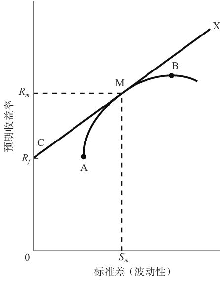

图8-15 存在借款和贷款的有效边界

这导致了资本资产定价模型（CAPM）的提出。CAPM模型做了下列一些假设：

●所有投资者都拥有相同的投资信息，并且他们对未来持有相同的预期。

●市场是完全竞争的市场。

●买卖证券不存在交易成本。

●投资者处在一个免税的环境中。

●投资者可以在零波动利率的水平下投资或者借入资金。

●投资者是波动性厌恶的。

在这样的环境下，所有的投资者都可以构建并持有由波动资产构成的相同的有效投资组合。这被称为市场投资组合，它由所有的波动性投资资产组成，每一项资产的权重为其在外流通的市场价值。现在我们将图8-15中的M点定义为市场投资组合。为了适应不同个体在波动性容忍度上的差别，投资者可以在持有市场投资组合的同时，以零波动利率借入资金或者投资。总的来说，市场投资组合对应的波动性是市场固有的不可分散的波动。这种波动以横轴OSm的距离来量化衡量。在纵轴上，Rm对应于市场投资组合的预期收益。直线CMX被称为资本市场线。资本市场线反映了位于这条线上的有效投资决策带来的波动性与预期收益之间向上倾斜的关系。可以认为，资本市场线的斜率是投资者承担一单位波动所获得的预期回报。

\>\> CAPM由于不现实的假设前提，以及并未对现实生活的证券定价作出完整、精确的论述而饱受批评。但是，它强调了分散化的重要性，强调不可分散的波动和证券预期收益之间的关系，所以它仍然是一个强大的模型。

\#\#\#理解β值与全球投资\#\#\#

◆ 第9章 有效边界的扩张

\>\> 30年前，美国的股票和债券是全世界所有流动的、可投资资本市场的主要构成。美国的资本市场不仅是最大的，而且是最具有流动性和最有效的。美国的经济广泛多样、动态十足且极具弹性。

\>\> 全球性的公司有更广泛的投资可能性，因此有更大的机会获得超乎寻常的投资业绩。

◆ 非美国股票投资

\>\> 在过去的几十年里，非美国股票投资被投资者更为广泛地接受。许多因素导致了美国投资者对跨国投资态度的迎合。第一，非美国市场在世界国民生产总值和全球资本市场总市值中占据了显著份额。第二，世界上许多著名公司的总部都不在美国。

\>\> 许多国家有比美国更高的储蓄率、资本构成（capital formation）和经济增长。一些国家有更优良的职业操守，尤其是在太平洋盆地。最后，有些时期非美国资本市场的股市业绩表现超过了美国股市，美国和非美国股票市场收益率模式的差异创造了机会，使得人们可以通过分散化效应降低投资组合的波动性。

在长期持有期间，美国大公司股票的投资者们从分散化投资于非美国国家的大公司股票中获得了好处，虽然这些好处似乎很小。尽管历史上非美国国家的大公司股票收益率比美国大公司股票收益率的波动性更大，但适当的分散化投资于非美国股票一般可以降低股票投资组合的波动性。

\>\> 美国大公司股票和非美国大公司股票之间的相关系数在20世纪90年代开始逐渐上升，并在以1998年12月～2011年12月的最后一个5年投资期间内维持在高于0.8的水平。\#\#\#可以用2个因素解释：①跨国公司、②国际投资\#\#\#

\>\> 对比投资于非美国的大公司股票，投资于非美国的小公司股票为美国股票投资者提供了更好的分散化益处。

\>\> 投资非美国的股票和债券面临一些特殊的问题。其他国家的会计操作和美国的会计操作不同，并且其他国家提供给投资者的经常是一些不完整的信息披露。很多非美国国家的股票和债券市场其流动性不如美国资本市场那么高，而且监管也更加薄弱。这些差异可能导致较高的交易成本，并可能导致证券交易清算的延迟。有些国家政治不稳定，这给投资管理过程增加了另一个维度的风险。其他国家的政府也可能对投资资本的流入与流出进行征税或（且）用各种方式进行限制。最后，对美国投资者而言，美元升值的货币风险会导致以美元衡量的收益率很差，即使他们所持有的证券以投资国本土货币衡量的投资业绩很好。除非货币暴露的风险被对冲了，否则每项非美国的投资实质上是两项投资：一项是投资于证券本身，另一项是对公司总部所在国家的货币的投资。

当在发展中的第三世界国家的新兴市场投资时，上面提到的风险更加显著。尽管如此，投资于新兴市场国家可以提供显著更高的长期回报。

应该把投资组合中的多大份额分配给非美国国家的股票和债券呢？（CF《哈利·布朗的永久投资组合》：推荐国际股票占总股票类资产的20%～40%）

◆ 不动产

\>\> 不动产和我们讨论过的其他投资工具非常不一样。每一个不动产的财产在地理位置、外观结构、住户组合以及许多其他特征上都是独特的。不动产资产的购买和销售都是谈判交易，可能非常复杂。因为不动产市场由不可交换的、独特的和非流动的财产组成，它很可能不如股票和债券市场那么有效率。市场效率的缺乏可能给技艺娴熟的投资者提供保障超凡投资业绩的机会。但是与此同时，相对于其他投资方式而言，不动产投资涉及的搜索费用和交易成本一般都会较高。

\>\> 作为权益类投资的一种，一般来说在长期的投资期限中，不动产的资本增值可以作为通货膨胀的有效对冲。购买到优质的不动产也常常可以为当前提供丰厚的现金流量。许多投资者偏爱采用贷入资金的方式获得杠杆来进行不动产投资。尽管这增加了投资的风险，需要用一部分现金流来还贷，但是也放大了价格上行时的潜在投资收益。因此，不动产投资作为一种主要的资产类别，应该在充分分散的投资组合中有着一席之地。因为每一个不动产投资都是独特的、缺乏流动性的，所以对不动产投资进行恰当的分散化非常重要。

权益型不动产投资信托公司（Equity REITs）提供了另一种不动产投资分散化的方法。权益型不动产投资信托公司是公开交易的上市公司，它们持有并且管理不动产资产。就像共同基金一样，权益型不动产投资信托公司是一种投资收益的渠道，它通过满足某些投资和收入分配的要求来避开企业税收。权益型不动产投资信托公司的股份在主要的证券交易所交易。这些股份的流动性和交易活动为权益型不动产投资信托公司的投资提供了连续的、基于市场共识的定价。

\>\> 因为权益型不动产投资信托公司是一种间接的所有权，有些人因此争辩说它们不是真正的不动产投资。

“公共的与私人的不动产权益”一文研究了两种不动产指数，结论是：调整后，公开交易的权益型不动产投资信托公司的收益略高于私人的、流动性差的持有不动产所有权这种投资方式，但是两者的收益差异在统计上并不显著；当分别针对财产类别、杠杆和估价平滑进行调整后，两个指数的波动性水平也相当。换句话说，投资于权益型不动产投资信托公司就是投资于不动产。投资者为投资组合寻求不动产分散化时有两个可以相互转换的投资于不动产的途径：私人持有的、流动性差的不动产产权投资和投资于权益型不动产投资信托公司。

当本书第1版在1990年出版时，美国权益型不动产投资信托公司的总市值不到70亿美元。在那时，权益型不动产投资信托公司被认为是投资世界中的“无人岛”。不动产投资的专业人士忽视它们，因为它们像股票一样交易；而许多股票投资组合的经理人也忽视它们，因为他们认为权益型不动产投资信托公司是不动产投资，而不是股票！随着不动产证券化的不断增加，不动产投资信托公司作为不动产所有权的一种变体也更为广泛地为投资者所接纳，这样的想法很快就会改变。

\>\> 对于非机构投资者而言，权益型不动产投资信托公司可以达到的分散化是尤其珍贵的。与直接获得不动产所有权不同，一个权益型不动产投资信托公司的投资者能够轻易地将一份数额较小的资金分散化投资于地理和类别都不同的不动产投资，比如办公楼、公寓套间、区域性购物商场、购物中心和工业用地。与直接的不动产投资相比，权益型不动产投资信托公司不仅具备交易成本更低的优势，而且公司结构更加透明，治理质量更高。

在长期，权益型不动产投资信托公司的总收益可以媲美美国股票。股息收入是总收益的主要部分，其资本增值部分平均来说和通胀率差不多。权益型不动产投资信托公司的波动性水平也和美国大公司股票相似。权益型不动产投资信托公司与美国债券和股票市场的相关性都比较低，这使其成为非常有吸引力的一项分散化的投资方式。

\>\> 以股票市场的标准为参考，权益型不动产投资信托公司倾向于产生高于平均水平的收益，而且市值更小。因此，利率的变化和小公司股票的相对业绩表现也会影响权益型不动产投资信托公司的短期投资业绩。

正如分散投资于美国和非美国国家的债券和股票市场很有道理一样，分散化投资于美国和非美国国家的不动产证券也是值得建议的。非美国国家不动产证券的资本市值在全球上市交易的不动产证券中占据了相当大的比重。与美国不动产证券相比，美国股票和债券市场与非美国不动产证券的相关性要更低。美国投资者的投资组合大部分一般都分布在美国股票和债券中，因此，非美国不动产证券为美国投资者提供了更多的潜在的分散化益处。

类似地，以非美国的金融资产为基础的投资者可能把投资组合很大的份额放在非美国国家的股票和债券上。非美国国家的股票和债券与美国房地产证券之间的相关性低于其与非美国房地产证券的相关性。因此，以非美国资产为基础的投资者可能从美国房地产证券中得到比从非美国房地产证券中更大的分散化益处。

◆ 1997年是非常好的一年

\>\> 1997年诞生了：

1.  美国通货膨胀保值债券（treasury inflation-protected securities，TIPS）
2.  实物资产基金（现在被称为Oppenheimer商品策略总体收益型基金）

\>\> 在投资产品的发展进程中具有重要意义，因为它使投资者能够很容易地投资于一种很有趣的资产类别：与商品挂钩的证券（commodity-linked securities）

◆ 美国通货膨胀保值债券

\>\> 美国通货膨胀保值债券是这样设计来消除通货膨胀风险的：通过调整赎回价值（redemption value）和调整息票支付以便在债券的生命期间内与通胀率保持步调一致。在不太可能出现通货紧缩的情形下，通胀调整将会导致利益支付和偿还价值较低。但是，通货紧缩最低选择权价值（deflation floor option value）保证财政部在到期日至少支付原始的票面价值给投资者。

美国通货膨胀保值债券真正地通过“购买并持有”的方式对冲通货膨胀风险。意料之外的高通胀会对股票和传统债券产生负面影响，但是它对美国通货膨胀保值债券的影响却是正面的。由于不寻常的收益率、波动率和相关性特征，美国通货膨胀保值债券被认为是一种独立的资产类别，为投资组合提供独特的分散化益处。在不局限于仅考虑传统资产的投资组合最优化的研究中，美国通货膨胀保值债券扩大了有效边界。

\>\> 美国通货膨胀保值债券的收益率比国债的收益率低，这是因为美国通货膨胀保值债券的收益率是实际收益率，即已经对通货膨胀调整之后的收益率。

\>\> 美国国债和美国通货膨胀保值债券之间的收益率差异经常性地被解读为市场对未来通胀率的一致性预测值。

◆ 商品挂钩证券

\>\> 商品有时候被称为实物资产，以便与股票和债券等金融资产区分开来。商品类资产主要有五种大类构成：

●能源：原油、天然气、汽油和燃料油；

●农产品：小麦、玉米、大豆、棉花、糖、咖啡和可可豆；

●工业金属：铝、铜、镍、铅和锌；

●活牲畜：活牛、肥育母牛和瘦肉猪；

**●贵金属：黄金和银。**

这些商品的全球年产值每年以万亿美元为单位衡量，它们构成了世界经济系统中的重要组成部分。当我们讨论把商品当做一类资产来投资时，我不是建议投资者实际去购买几桶原油、几蒲式耳的小麦和玉米，或者几锭金银。相反，我推荐以标准普尔-高盛商品指数（S&P Goldman Sachs Commodity Index，S&P GSCI）或道琼斯-AIG商品指数（Dow Jones-AIG Commodity Index，DJ-AIGCI）作为基准的投资。这些指数使得投资者的投资风险暴露来自分散化投资的一篮子商品的预计未来价格变化，这些商品是从上面所列的五种主要的商品构成中选取出来的。投资者无法通过持有商品生产厂商股票的形式来获得这种投资风险暴露（investment exposure）。例如，除原油价格以外的许多因素都会对埃克森公司的股价产生影响。

\>\> 道琼斯-AIG商品指数的创建者认为，流通价值常常可以更好地衡量经济重要性，尤其是对那些不易损坏的商品，例如贵金属，贵金属的交易量超过了世界的平均产量。

\>\> 商品期货的买方由于承担了商品价格的波动性风险，因此应该获得适当的风险溢价。这种风险溢价来源于商品生产者希望对冲掉其所生产的产品的价格风险。例如，一位农场主种玉米，他不知道当他可以将玉米在市场上出售的时候，一蒲式耳玉米的价格。但是，他今天可以将预期产量的一部分在期货市场上以事先确定好的价格出售，这样就能保证不需要承受因为玉米价格未预期到的大跌带来的严重的经济困难。农场主愿意接受比预期玉米丰收时的价格更低的交割价格，以吸引期货合约的买方来承担玉米价格可能降低的风险（CF：本章最后）

\>\> 道琼斯-AIG商品指数定期给收益率模式存在差异的商品期货重新配置和赋权，达到资金的再次平衡，而这些商品的价格存在均值回归的趋势，这给道琼斯-AIG商品指数的潜在收益率带来了第三种来源。

标准普尔-高盛商品指数或道琼斯-AIG商品指数这样的指数化商品投资与股票、债券等金融资产投资很不一样。股票和债券的价值可以简单地表述为从现在开始到未来的多年期预期现金流量的折现值。不同的是，商品期货合约的多头投资（long-only investments）的收益是由短期的商品供求关系和短期的可能制约商品生产和配送的风险因素决定的。

\>\> 商品价格的上涨是刺激通货膨胀的来源，而通胀对股票和债券市场来说是厄运。历史上，标准普尔-高盛商品指数的收益率像权益类投资一样的剧烈波动，并且通常和许多金融资产类别的收益率呈负相关性或者几乎不相关。

\>\> 商品挂钩证券的收益率、波动性和相关性特征使得这类资产成为分散化投资的一种潜在的强有力的资产类别。然而，不是每个人都认同。约翰·梅纳德·凯恩斯的现货溢价理论在过去的很多年中都饱受争议。

\>\> 商品期货的定价机制既是一个理论问题，也是一个实证问题。假设这个问题现在还没有解决，我们仍然模拟资本市场的假设前提，在该假设前提下，商品挂钩证券在构建投资组合时是非常有吸引力的一个“积木”。如果我们假设商品挂钩证券未来的波动性和过去相似，而且仍然和传统的资产类别保持负相关（或相对的不相关），那么我们可以用无约束的“均值-方差”最优化技术来解出商品挂钩证券所要求的最低收益率。

\>\> 关于是否应该推荐此类资产的争辩还在继续。

◆ 第10章 多重资产类别投资的收益

\>\> 人都有偏好，这是自然的。投资者有其喜欢的和不喜欢的资产类别。当一类资产表现不佳，尤其是长时间内表现不佳时，投资者经常会将其从他们的投资组合中剔除。如果投资者把他们“挑选”的冲动放在一边，而接受一个更加广泛的分散化的资本配置策略，那么结果会如何呢？

付息类投资工具在绝大多数投资者的投资组合中都扮演着重要的角色：它们帮助缓解投资组合的波动性，但是通常以更低的投资组合收益率为代价。权益类投资工具通常是投资组合出现非凡收益率的主要原因，但它通常也是巨大损失的主要原因。在投资者的投资组合中扩大权益类投资的分散化程度，能不能在不牺牲投资组合收益率的同时降低其波动性呢？本章致力于回答这个问题。

\>\> \#\#\#“蒙上眼睛选择最优”的练习\#\#\#

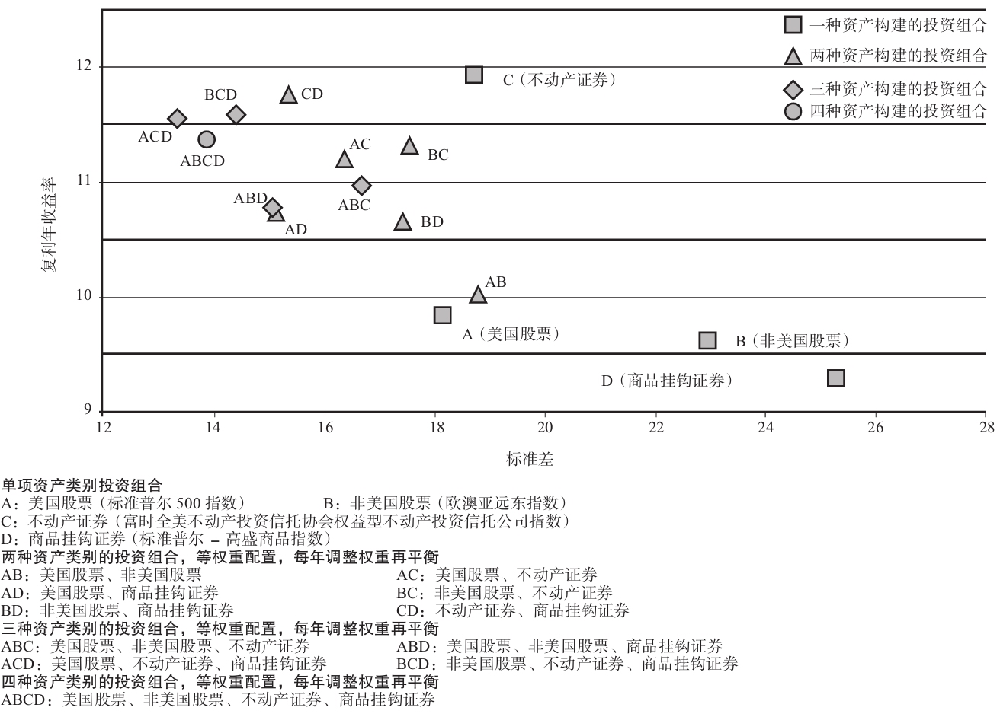

图10-2 15个权益型投资组合（1972～2011年）

\>\> \#\#\#关于上述组合的大篇幅探讨\#\#\#

\>\> 在构成多重资产类别的投资组合的组成模块中有四种资产类别，如果我们让波动性厌恶的投资者从中剔除一种资产类别，他可能选择剔除投资组合D，即商品挂钩证券。在图10-2中的15个投资组合中，商品挂钩证券的波动性最大。然而，在波动性最低的6个投资组合中都将投资组合D作为等权重的组成部分——这6个投资组合是投资组合ACD、ABCD、BCD、ABD、AD和CD。

\>\> 绝大多数金融资产之间都是正相关的，与其他资产类别不相关的资产非常少见，而与其他资产类别之间呈负相关的资产更是实属罕见。对于图10-2中15个权益型投资组合所覆盖的时期，\#\#\#表10-1\#\#\#显示了同时期美国股票、非美国股票、不动产证券和商品挂钩证券之间的相关系数矩阵（correlation matrix）。注意，商品挂钩证券的收益率模式和其他三种资产类别分别都是负相关的。

\#\#\#图10-3\#\#\#描绘了美国股票、非美国股票、不动产证券和商品挂钩证券之间在20个季度（5年）投资期间的滚动相关系数。

\>\> 图中最有趣的一条线是美国股票和商品挂钩证券之间的相关系数曲线。虽然这两者之间的相关系数偶尔会上升到很小的正相关，但在绝大多数时间里，这两类资产之间要么负相关，要么不相关。商品挂钩证券的这种不是很低就是为负值的相关性，加上其具有竞争力的长期收益率，都使得商品挂钩证券在投资组合分散化中成为一种强有力的资产类别。

\>\> \#\#\#图10-8\#\#\#分别显示了三种投资组合对应投资1美元的增长，这三种投资组合是美国股票投资组合、商品挂钩证券投资组合和等权重配置到美国股票和商品挂钩证券，每年重新进行权重调整，实现资金再平衡的投资组合。在美国股票投资组合中，1美元投资将增长至42.71美元；在商品挂钩证券投资组合中，1美元投资将增长至35.05美元；在等权重配置到美国股票和商品挂钩证券，每年重新进行权重调整，实现资金再平衡的投资组合中，1美元投资将增长至58.84美元。正如我们在第8章中曾经讨论过的，在收益率模式不同的资产类别之间进行分散化，不仅可以降低投资组合的波动性，还可以将投资组合的复利年收益率提高到高于组成资产组合的各种资产类别。

\>\> 正如2008年对我们的警示，即使多重资产类别的投资也不能保证可以完全避免短期损失。\#\#\#表10-4 最糟糕的5个年份（1972～2011年）\#\#\#（CF《有效资产管理》：分散化降低风险的效应在最严重的熊市中失效）

◆ 为什么不是所有人都采用多重资产类别的投资策略呢

1.  投资者没有意识到分散化效应的强大力量。一般的投资者知道分散化能够降低波动性，但是怀疑它会同时降低收益率。但是，正如我们所阐述的那样，分散化倾向于改善收益率，而不是降低它。我们应该就分散化效应的双重功效，更好地对投资者进行教育。
2.  这是因为市场择时交易（market timing）产生的问题。投资者自然而然地希望相信存在某些方法，可以预测哪种资产类别会表现最佳，而且一些投资经理也表明他们实际上能够作出精准的择时交易的预测。显然，成功地预计出各种资产类别的相对业绩表现是非常困难的。

心理因素：投资者在评估投资业绩的时候都倾向于采用他们自己本国的资本市场作为参考框架。参考框架的问题在美国股票长时间业绩表现优越的情况下特别严重。股票相对于其他类资产的主导优势似乎不会终结，这导致投资者对多重资产类别的投资策略产生的相对较低的收益率感到不满意。作为一个商业观察中的人，分散化的问题在于不论你是希望它起作用还是希望它不起作用，它都会发挥作用。

◆ 为教学而做的简化和取舍

\>\> 本章介绍的多重资产类别投资分析非常适合在教学过程中阐述，出于简化的目的，此处阐述的案例使用了**等权重配置**到美国股票、非美国股票、不动产证券和商品挂钩证券的投资组合。作为教学实例，我的目的是阐述分散化的作用。虽然我是多重资产类别投资策略的强烈支持者，但是我并不建议我的客户给各种资产类别都配置相等的权重。如此建议的原因一定程度上是由于客户存在参考框架等相关心理因素问题。对于居住在美国的投资者，我建议把资金侧重配置于美国股票的权益型投资结构，再把剩余的一小部分权重份额配置给非美国国家的股票、不动产证券和商品挂钩证券。

\>\> 虽然这样配置的投资组合在数学上并不是最优的，但是这种资产分配还是能获得多重资产类别投资在分散化效应方面的许多优点。更重要的是，投资者可以更早地适应投资组合的收益率模式。换句话说，如果一种投资策略可以满足客户的需求，让客户晚上睡得香，那么即使这种投资策略从数学上来说可能是次优的，客户通过持续地遵从这种投资策略，也可能有更好的长期投资业绩结果。对比之下，如果客户一味地从心里排斥，抵制不用，即使这种策略在数学上是最优的，显然也不会发挥作用。

\>\> 此处我选择把付息类投资工具从分析中剔除，并不意味着我鼓励投资者将100%的权重都赋予权益型投资。在多数情况下，我推荐客户将资金分散化投资于付息类投资工具。

\>\> 有时客户会质疑这个教学案例的作用，因为此处阐述的案例是基于历史数据的风险，而历史数据和对未来的展望可能是不相关的。客户的论断依赖于以下概念：今天的世界和我在多重资产类别投资的分析中所涉及的投资期间的世界是截然不同的，今天的世界存在一些在历史上没有出现过的风险和机遇。虽然这种说法可能是正确的，但是有些东西不会改变，例如投资者更加青睐于可预测性，而不是不确定性，投资者面临着波动性水平各异的各种可能的投资工具。投资者的买入和卖出活动使得证券价格到达供给与需求的均衡水平。为了达到均衡，波动性更大的资产普遍都比波动性较小的资产拥有更高的预期收益率，最终导致不同的资产类别，其经过波动性调整后的收益率存在区别，互相具备竞争力。

多重资产类别的投资带来的分散化益处在短期依赖于各种资产类别的短期收益率模式的差异性，在长期则依赖于不同资产间长期的竞争性定价。尽管我们面临的风险和机遇与我们所处的时代相关，但这些条件未来很可能依然成立。最明智的投资策略就是把投资组合广泛地分散化，以便降低未来的不可预知的风险。

◆ 本章小结

\>\> 分散化的益处异常强大，显著稳健，它不仅体现在降低波动性方面，而且也体现在改善收益率方面。评估一种资产类别作为分散化投资的组成部分是否理想，我们还必须知道相关程度。美国投资者需要放弃以本土投资业绩作为参考框架，并且把自己当作世界公民来投资。

◆ 第11章 投资组合优化

\>\> 本章致力于讨论投资组合的最优化问题，也被称为均值-方差最优化问题。这对感兴趣的读者，或者打算根据不同客户的情况，采用计算机程序确定最优资产分配的读者来说也许很有价值。对资产分配技术层面的分析不感兴趣的读者可以直接跳到第12章。

在第8章中，我们已经就建立投资组合时如何配置资产的方法的优劣进行了区分。优秀的资产分配可谓是有效的。

\>\> 将增量贡献小的资产类别调换为增量贡献大的资产类别，改善投资组合的预期收益率。如果持续这样做，我们最终会无法再进行有利的调换。在给定资产组合的波动水平下，这一结果下的资产组合最大化了资产组合的预期收益率。因此，这个投资组合是有效的。作为投资组合有效的条件之一，每一种资产类别对投资组合经过波动性调整之后的预期收益率的增量贡献都相等（如果这个条件不成立，我们可以通过进行更多的调换交易，这样就可以在不增加投资组合波动性的情况下继续提高投资组合的预期收益率）。

在使用最优化工具预测时，考虑到资产类别未来平均收益水平的不确定性，某一资产类别的标准差的输入统计数据一般应当比其预期的波动水平更大。

\>\> 历史收益率在估计未来收益率时作用不大。解决这个问题的方法之一是

①使用资产类别的收益率之间存在的长期历史关系，来预测得到未来收益的估计值。另一种方法是

②利用现代投资组合理论的指导，得出不同资产类别预期收益率的估计值。举个例子，现代投资组合理论表明，一个有着平均波动性容忍度的投资者，其最好持有一份融合了现实世界中各种资产类别的投资组合，这一投资组合的投资比例配置完全复制了全球投资市场中可投资资产的配置比例。首先，这一估计过程使用历史数据作为得到不同资产类别的收益率的标准差估计值和相关系数估计值的基础。其次，世界投资资本市场的配置决定了投资组合的配置（见图1-1，以2011年12月31日的状况作为世界投资资本配置的预测值）。假设对于有着平均波动性容忍度的投资者而言，这个资产分配是最佳的，在这个假设前提下，我们就可以在后面进一步的工作中，反向推导出每种资产类别的预期收益率。

③在第4章介绍了一种更加精密的方法估计长期预期收益率。举个例子来说，大公司股票的价值过高则意味着其收益率的估计值低于平均预期收益率，价值过低则意味着其收益率的估计值高于平均预期收益率。

一旦我们预测得到每种资产类别的预期收益率、标准差以及相关系数等输入参数的估计值，就可以直接采用数学计算方法得到有效边界上每种投资组合对应的资产分配，尽管这个计算过程也较为复杂。

\#\#\#本章中间内容跳过\#\#\#

\>\> 在达到最优的配置比例之前，投资组合预期收益率的增长比率是否与配置到不动产证券的投资份额的增长比率呈线性相关？或者，随着我们逐渐增加不动产证券中的资产分配比例，投资组合预期收益率的影响是否发生变化？

我们可以通过制定一组约束条件下的最优化投资方案来回答上述问题。根据分配到不动产证券中的投资比例，这组最优化方案决定了有效投资组合相关的预期收益率。如果制成图表，投资组合的预期收益率和不动产投资证券的配置比例之间的关系如图11-1所示。

\>\> A点对应的是投资组合的标准差为9%，且投资选择仅仅限定于短期国库券、美国长期公司债券以及美国大型公司债券时，投资组合的最高可能的预期收益率。C点对应的是除了以上三种资产外，还利用了不动产证券时投资组合最高可能的预期收益率。所以AC间的距离代表的就是资产组合中不动产证券的最优配置所带来的投资组合可能的预期收益率。B点对应的是当不动产证券的配置比例限定在15%以下时，投资组合最高可能的预期收益率。我们可以看到，投资组合预期收益率的大部分增长是依赖不动产证券投资比例在0～15%变动实现的，而不动产证券的配置比例在15%～30%变动时，仅对投资组合预期收益率贡献了一小部分。

这一事实有着非常重要的投资意义。首先，这使得试图寻找精确的资产分配，以最大化经过波动性调整后的投资组合的预期收益率这一焦躁情绪得以缓解。

\>\> 这一道理对于经常调高或者调低某种资产类别，试图进行市场择时交易的战术型资产分配的投资者而言同样重要。例如，战术型资产分配者会根据某种资产类别长期战略性资产分配为基础，设定严格的上下波动幅度范围构造投资组合。只要资产分配的范围不是太宽，并且集中于最优化配置附近，在这一范围内的投资组合中不同配置的预期收益率和波动性特征也许很相似。

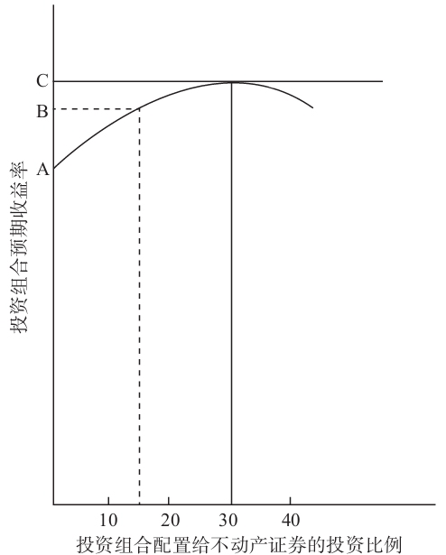

图11-1 投资组合预期收益率和不动产证券配置比例的函数关系

\>\> 尽管我不是战术型资产分配的倡导者，但这种方式通过将资产分配设置在一定范围至少剔除了完全不投资于上涨的市场，或者过多投资于下跌市场的风险。

\#\#\#本章剩余内容跳过\#\#\#

◆ 第12章 了解你的客户

\>\> 客户和投资顾问的关系不断发生变化，现在我们将讨论如何将发展到现在的一些理念应用于客户和顾问的关系中。图12-1的流程图描述了投资管理过程的各个步骤，投资管理过程是一个相互反馈、不断循环的过程。我们会在第12～14章中详细叙述流程图中的每一个步骤。**在本章，我们将介绍前两个步骤。**

\>\> 投资顾问仅仅妥善地管理客户的投资组合还不够，让客户了解其投资组合被投资顾问妥善的管理也很重要。如果没有这种理解，客户就不可能在极端市场环境的压力下坚持一个恰当的、长期的投资策略。

有趣的是，注意直到流程图的倒数第二步，资金才真正进行投资。不幸的是，许多客户认为投资管理过程的前八个步骤需要花费他们大量的时间和精力。他们不愿意参与前期的步骤，情愿将投资顾问的最初选择作为他们自己的选择，这样的话，投资顾问承担了“投资组合管理”这个大标题下的最后四个步骤的全部责任

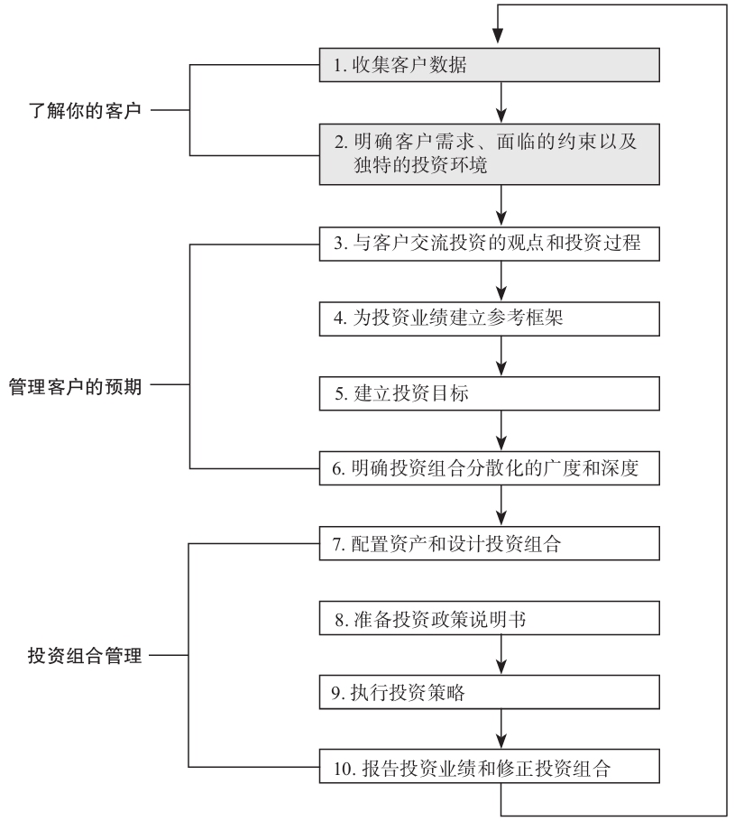

图12-1 投资管理过程

◆ 第一步：收集客户数据

\>\> 对有关客户**目前**的波动性容忍度的线索，投资顾问要予以警惕。目前这个词之所以要着重强调的原因在于，波动容忍度在相当广泛的范围内不断进行修正，而修正范围是以为客户提供的投资决策制定的参考框架为基础。

\>\> 将客户的资产负债表编制成为表格的形式，从而有利于客户的投资决策过程，这是非常有帮助的。我建议以下的分类：

（1）付息类投资工具（interest-generating investments）。

（2）权益类投资工具。

（3）负债。

（4）日常生活类资产（lifestyle assets）。包括客户的首套住房、个人不动产以及度假屋（只要度假屋的租金收入超过物业管理费）。

\>\> 投资性资产和日常生活类资产之间的配置平衡可以作为一种暗示，反映了客户的财务自律性和节俭态度。投资顾问可以通过分析客户的现金流，推断得到更多的信息。客户的收入中有多少花费在生活类的支出上，有多少最终花费在投资净值上？

\>\> 最后，收集数据过程给了投资顾问一个绝好的机会，投资顾问可以利用这个过程将投资管理方法的大纲提供给客户，并在未来利用该大纲逐渐推动客户实现后者的财务目标。

◆ 第二步：明确客户需求、面临的约束以及独特的投资环境

流动性

投资顾问应当评估每个客户的状况，了解其对投资组合流动性的需求。如果客户很可能需要资金以应付未来的开支，那么不应该进行非流动性投资，例如直接持有不动产投资的所有权。即使投资组合在别处有足够的流动性来满足这些支出，投资顾问也应该评估非流动投资相对于未来可能从投资组合中提取资金的相对规模。

例如，组合中包括5%的实物黄金难以变现。随着资产中的现金被提取，实体黄金的比例会自动提升；如果有新资金加入，金条的比例会降低。就像这里讨论的，流动性是与客户的收益需求或现金流需求相分离的一个问题。

为了满足预期支出的投资组合现金提取比率

投资顾问和客户应该就未来从投资组合中需要提取的现金的规模和时间予以量化，提前制定计划。一般而言，除了监管或者法律规定的收益率要求外，投资顾问和客户不能有意识地将投资组合设计成可以产生某种确定的收益或者现金流量。投资组合的设计，和为了满足必要支出如何将现金从投资组合中提取出来，这两个问题基本上是相互独立的。

正如我们之前详细讨论过的，付息类投资工具和权益类投资工具之间选择的配置平衡是决定投资组合波动性和收益特征的主要因素，客户做这个最重要的决策时会参考他的投资期限。

\>\> 假设投资组合的现金提取比率不是太高，投资组合可以产生足够的流动性，大于必要的现金提取比率，这样大部分的投资组合都能保留在投资组合中，维持适当的平衡和广泛的分散化。在实际操作中，即使是被动管理的投资组合，例如指数基金，当资本市场发生变化时也需要定期重新调整，达到再平衡。在这些**再平衡的时间点上，可以将现金另外放置，投资于货币市场基金，并且专项用于预期支出**。从投资组合管理的角度来说，这个过程很容易执行，概念上听起来也很简单。

如何将资金从投资组合中取出这个问题，应该独立于投资组合如何进行恰当设计这一决策，从而单独考虑。虽然这在一般情况下是正确的，但是当现金提取比率相对于投资组合的规模来说暂时比较高时，这两个问题开始交织在一起。

纳税情况

\#\#\#中国目前针对个人投资的税收很少，跳过这一小节\#\#\#

监管和法律约束

监管法规和（或）法律约束形式多样，主要对机构客户更为普遍。

投资期限

本书有一整章专门讨论投资期限问题。投资期限为短期的投资组合应当将更多的资金投资到本金价值更加稳定的付息类投资工具中。

客户往往会低估他们的投资期限，这将导致权益类投资在投资组合中的配置比例过低，投资组合过度地暴露在通货膨胀的风险之下。

根据定义，一个拥有平均健康状况的人，他的实际寿命有50%的可能性超出预期寿命。因此，保守观点要求计划投资的投资期限应该超过客户的预期寿命。投资期限可能会很长，因此需要通过资本增值维持购买力的需求仍然存在。

心理因素和情感因素

理想状态下，投资决策制定过程应该是一系列逻辑的步骤，这些步骤一起系统地构建起来，形成一个概念清晰、合理的投资战略。然而，许多心理和情感因素可以影响决策制定过程，因此，了解它们很重要。大多数客户在评估投资工具时都存在先入为主的偏好。

1.  投资顾问应该尝试满足客户的合理偏好，以增加客户对组合的满意度。
2.  但是如果客户的偏好是基于误解或者缺乏投资知识所导致的，那么投资顾问应该花时间教育客户。

决策制定过程的动态变化

\>\> 个人客户在决策制定上更加具有连续性。资金是客户自己的，他在做决策时有更大的灵活性和自由。

◆ 第13章 管理客户预期

◆ 第三步：与客户交流投资的观点和投资过程

\>\> 如果客户认为投资顾问的部分职责就是保护他的资产避免市场恶化的影响，然后直到不利的市场状况将投资顾问与客户的关系变得紧张，并且可能最终将终结投资顾问和客户的关系，这只是时间问题。客户的预期常常盲目乐观，他们认为能够在比实际更低的波动性下获得更高的收益。在投资管理过程之前管理客户的预期，并且将客户预期的管理贯穿于投资管理过程的始终，这对投资顾问和客户都非常有利。

\>\> 在我看来，两个最重要的投资观点的问题是：

（1）成功地进行市场择时交易是否可能？

（2）高超的证券选择是否可能？

\>\> 第一个投资者约翰对两个问题的回答都是“是”。上述投资观点非常容易推销出去，尽管不是不可能，但是非常难实现。以我的判断，一个持有这种投资观点的投资者或者投资顾问是在将他自己引入失败。

\>\> 第二位投资者米歇尔相信高超的证券选择能力是可能存在的，所以她将投资限制在每种资产类型中业绩表现优于整个资产类型的证券（博主注：就是挑选个股）。大多数专业的资金经理人和投资顾问都持有第二象限的投资观点。

\>\> 第三位投资者丹尼认为不同资产类别相应的短期业绩可以被预测（博主注：这是择时的另一种表述，例如在自认为合适的时机把股票类资产转为现金），但他不相信存在高超的证券选择能力，他采用低成本的指数基金去执行投资策略。这种特殊的投资观点其支持者最少。这是真正的市场择时交易追随者的观点

\>\> 最后一位投资者卡斯支持第四象限的投资观点。她相信市场是有效率的，这种投资观点称为有效市场假说。过去50年投资学的学术研究大部分都支持了这种投资观点（可能行为金融给有效市场假说带来了最大的挑战，他们认为投资者存在认知偏差，因此导致市场无效）。第四象限的投资者遵循一个广泛多样化的、多重资产类别的投资策略，他采用指数基金作为投资组合的构成模块。特别需要注意的是，这种投资方式并**不是简单的买入并持有策略**（buy-andhold strategy）。当市场变动时，投资组合将偏离对每种资产类别的配置目标，这将使得**需要**将投资组合重新进行调整，恢复长期的、战略性的资产分配的**再平衡**。

第四象限的投资观点有着三个重要的大问题

1.  适当的资产分配，因为分散化投资是减轻投资风险的主要方式。
2.  成本最小化，作为投资业绩可能达到的市场收益率的上限，成本最小化是获得此类业绩的必要先决条件。可以利用低成本的指数基金或者ETF来完成。
3.  客户预期的管理，因为在客户投资所在的市场中，他们并没有希望得到超过市场的投资业绩。

\>\> 第一象限的投资观点很容易推销给客户，但是难以实现，而第四象限的投资观点难以推销给客户，但是容易实现。

比较这些可替代的投资观点

第一象限、第二象限和第三象限的投资观点认同同一个观点，那就是投资技巧对投资业绩有着积极的影响。如果某个资金经理人发现了一种可以产生卓越投资结果的投资策略，那么只有在其他经理人还没有模仿这种投资策略之前，他们才能够保持其竞争优势。然而，少数人的成功将极易鼓励其他竞争者去探索并进一步复制其投资策略。当这些发生的时候，之前投资策略的卓越回报开始不断下降。从本质上说，资金经理人之间的竞争越剧烈，第四象限将越快地成为现实。

\>\> 第四象限的投资观点否定了以投资技巧为基础、积极的资金管理专业方式的存在理由。如果不能依靠投资技巧去增加价值，为什么要对一个无力战胜市场的投资尝试支付对应费用，以及蒙受交易成本呢？

\>\> 我们有证据表明资本市场证券交易不是一个“零和”博弈，它是一个“负和”博弈。平均而言，大部分资金管理者的投资业绩比他们所投资的市场的业绩表现更加逊色。在“负和”博弈中，成为赢者的方法就是：把各种资产类别的预期收益作为最好的一面接受它，然后尝试通过最小化投资成本去尽可能地接近它。

\>\> 如果资产分配决策驱动投资业绩，那么考虑到客户必须根据其投资组合结构制定投资决策的重要性，以及之后客户依赖市场变动必须适应各种投资结果的必要性，因此客户和顾问的关系就成为了关注重心。伴随着这种商业模式，投资专业人员必须与客户打交道，因为客户是关注的焦点。客户的各种特征，例如投资风险的感觉、风险容忍度、财务目标、资产分配决策、投资结果的解释、耐心和是否有纪律性，是决定其投资成功与否的决定性变量。

\>\> 在对抗第四象限投资观点中存在合谋，由三个紧密相连的合谋者组成：

（1）投资者。

（2）以投资技巧为基础的、积极的资金管理的专业人士。

（3）财经媒体。

投资者不想接受第四象限投资观点的原因在于，第四象限的投资观点意味着不存在任何可能的方法完全地保护客户，使得他们可以避免有些时候资本市场的残酷现实。如果第四象限的投资观点是正确的，那么在糟糕的市场状况下投资者无法依赖投资技巧获救。难怪投资者不愿意接受这个不同的投资观点。

最后，财经媒体依靠撰写这样的文章而成长起来，这些文章从一个或另一个方面灌输这种观念，认为战胜市场的投资方法是存在的。如果财经媒体完全赞同第四象限的投资观点，那么他们可写的内容就少多了。

\>\> 小结。因为当客户支持某个象限的投资观点，而其投资顾问支持其他象限的投资观点时，在客户与投资顾问的关系中就会出现许多问题。大多数投资者倾向于支持第一象限投资观点阐述的立场，而大部分专业资金经理人支持第二象限的投资观点，坚定的市场择时交易者支持第三象限的投资观点，有效市场假设的倡导者则支持第四象限的投资观点。从根本上来说，不同的投资方式与这些不同的投资观点相关，而客户和投资顾问之间关系的长期成功至少要求双方当事人就下列问题达成协议，即客户的投资组合管理中可以现实地实现什么？

◆ 第四步：为投资业绩建立参考框架

\>\> 投资者面临双重危险，一方面是市场的波动性，另一方面是通货膨胀，这里不存在完全安全的地方可供立足。资金投资的固有风险不可避免。风险实现的痛苦能够促进投资者去学习有关资本市场行为和成功的投资法则。

投资顾问花时间为其客户培训有关资本市场的性质，以使客户可以更加镇定地作出明智的决策。如同第2章和第3章所提出的那样，这种培训的过程开始于对短期国库券、政府债券、企业债券和普通股的长期历史业绩和通货膨胀的回顾 带着所有投资管理中固有的不确定性，客户应当理解地去寻找一些可靠的不会变化的常量。其中一个稳定的常量就是相对不确定的收益，人们还将继续偏好稳定的收益。因此，客户可以肯定投资者的买入和卖出活动将对资产进行定价。

\>\> 第6章投资期限的概念指导客户，教育客户下列内容：时间的推移确实改变了与波动性相对应的风险补偿的大小。投资期限越长，好的投资年份和差的投资年份之间就越存在相互抵消的机会，这为投资者提供了一个平均收益，该平均收益不断向各种资产类别的长期增长路径聚拢。因此，时间将波动性风险这一短期敌人转变为长期朋友，从而支持权益类投资更高的预期收益。

培养客户现实的预期是构建现实的投资目标的基础。客户的波动性容忍度可以在一个相当广泛的范围内变化，这个变化幅度建立在对投资时间期限适当的理解和对资本市场行为更加熟悉的基础上。

◆ 第五步：建立投资目标

\>\> 要构建一个投资组合能够产生足够满足客户财务目标的收益，可能要求客户承担其无法接受的风险水平。由于这个原因，通常更合理的是要关注客户的波动性容忍度，而不是他的收益需求。

\>\> 在第7章所描述的过程的美妙之处在于，它迫使客户承认和实际地处理投资管理过程中所固有的收益和风险之间的权衡，还促进现实的投资业绩预期的形成。一般而言，投资顾问应该鼓励客户选择这样的投资组合配置均衡，这一投资组合配置可以将客户置于接近其波动性容忍度区间的最上端，而且同时确保客户能在市场极端情况下继续致力维持投资组合配置均衡的决策。这个过程的目标是保证客户每晚可以睡个好觉的同时，最大化投资组合的预期收益。

◆ 第六步：明确投资组合分散化的广度和深度

\>\> 广度是指用于构建投资组合的各种资产类别的选择范围。投资组合分散化的深度是指在不同的资产类别之间资金的相对配置。

\>\> 基于第8章的讨论，我们得出如下结论：分散化的投资组合的波动性**小于**构成投资组合各项资产波动性水平的加权平均值。这种差异是由于各种投资工具的收益率模式之间部分抵消带来的分散化效应。在第10章中我们回顾了多重资产类别投资带来的可观的回报。

\#\#\#图13-4\#\#\#（CF《有效资产管理》：最终财富价值的波动性随时间增加）

\>\> 本书的第4版写于全球金融危机之前，在第4版中我指出这样的情况在下一个熊市可能有所不同，实际情况的确如此。2008年美国股票市场下跌了37.00%，投资组合ABCD的损失为-41.07%，与之前的两个熊市不同，在全球金融危机期间，投资者陷入恐慌，开始出售所有的权益类资产类别。

\>\> 由于多重资产类别的权益类投资无法避免重大的损失，因此市场环境出现下行时无法提供保护。（CF：\#\#\#表10-4 \#\#\# 2008年金融危机对我们的警示）

\>\> 如果我们可以成功地帮助客户抵御参考标准风险，那么我们将能够消除放弃资产分配策略的一个主要的原因，增加客户安全实现其财务目标的可能性。

\>\> 正如我们在第10章中所讨论的，等权重的权益型资产分配只用于教学阐述，我不会推荐给生活在美国的客户。相反，我会建议客户美国让股票这一资产类别占最大的权重，而同时较少地将资金配置给非美国股票、不动产证券和商品挂钩证券。这样做既有心理上的原因，也有行为上的原因：投资者更容易容忍他们熟悉的、被广泛持有的资产类别出现业绩弱势。

◆ 第14章 投资组合管理

\>\> 身怀绝技的优秀的资金经理人确实存在，他们对改善投资组合的业绩有着重要贡献。但是，由于在最终识别这些经理人的过程中存在内在困难，因此无法依赖资金经理人的优异技能作为投资策略背后的驱动力。

\>\> 我们现在完成投资管理过程中的第7～10个步骤。步骤七描述了下列过程：制定资产分配决策和选择特定的投资头寸。

◆ 第七步：配置资产和设计投资组合

\>\> 配置资产。在第7章中我们讨论了客户最重要的投资决策：确定投资组合的资产在付息类投资工具和权益类投资工具之间的广义上的分配。

\>\> 第13章列举了各种各样的心理上和行为上的问题，这些问题需要被成功的管理，以使得客户遵守为其量身定做的投资组合策略，包括适当地决定在不同的资产类别上进行投资组合分散化的广度和深度。

\>\> 图14-2展示了一个模板，该模板帮助客户如何从目前总投资组合拥有的现金价值逐渐发展形成清楚的投资顾问推荐的投资组合的构成结构。

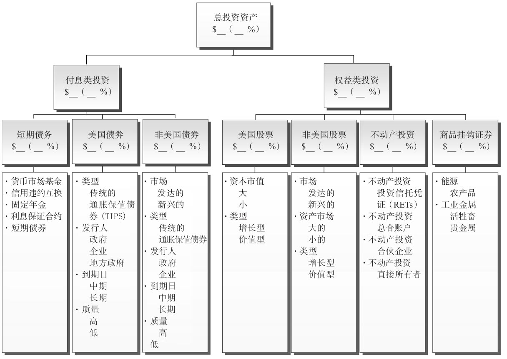

图14-2 投资组合设计模板

\>\> 一旦投资比例确定了，一般会维持固定不变，除非客户的波动性容忍度、投资时间期限或财务状况大幅发生变动。

受限于广义的投资组合平衡决策，客户和投资顾问需要在其资产类别中决定如何恰当地进行资产分配：

（1）短期债权投资；

（2）美国债券；

（3）非美国债券；

（4）美国股票；

（5）非美国股票；

（6）不动产投资；

（7）商品挂钩证券。

只有在资产分配决策制定了之后，投资顾问和客户才开始选择特定的投资头寸。

\>\> 我坚持倡导客户参与投资组合设计的每个过程。确实，这些决策中很多都是客户不可委托的责任。投资顾问的作用是指导客户正确的方向，以及提供一个参考框架，帮助提升客户的决策质量。

如果这些决策是在足够重视和深思熟虑的情况下制定出来的，那么得到的战略性的资产分配将是根据客户个人量身定做的、全方位的投资策略，它应该满足下列两项标准：

（1）给定客户的资产、现金流、投资时间期限和财务目标，投资策略可以产生良好的经济效果。就是说，面对一个知识渊博的专业投资人员基于基本信息的判断，投资组合的资产分配与客户的目标和财务状况是相匹配的。

（2）投资策略的收益率模式（波动性水平或者是相对美国市场的投资业绩）将不会造成客户在未来经历各种极端的市场环境时放弃该投资策略。

这两个标准对投资成功而言至关重要。上述第一个标准主要是科学的内容。上述第二个标准则是艺术的内容——它要求客户和投资顾问之间存在紧密的合作关系。投资顾问的责任（和增加投资价值的最大机会）是要帮助客户准确地认识后者所面临的风险和机会，作出知情的选择，从而能够创造实现其财务目标的最好机会。然后，最重要的是，鼓励客户去坚持这种投资策略。好的投资咨询的艺术要求投资顾问扮演多个角色：培训师、心理学家和教练。

\>\> “不动产投资”可以以多种形式持有，我列出了其中一些投资选择。针对很多客户的情况，权益型不动产投资信托公司或者投资于权益型不动产投资信托公司的共同基金是不动产投资分散化的有效选择。不同于直接持有不动产的所有权，权益型不动产投资信托公司的投资者可以轻松地将相当少量的资金在地理上，以及不同的不动产投资类型上进行分散化，例如办公大楼、公寓、地区商场、购物中心和工业设施。私人住宅或者度假屋通常不是用于投资的目的而持有，也不产生现金流量，因此它们没有被列在这里。相反，它们被放在客户资产负债表中的“生活方式资产”这一标题之下。

\>\> 直到20世纪90年代晚期，商品挂钩证券的分散化一般也只能在合作关系结构中出现，特点是有着高昂的、激励性质的管理费用。现在，一些共同基金和交易所交易的基金使得商品挂钩证券的分散化成为可能。

\>\> 有时，投资顾问或者客户提出采用股票期权或期货去修改投资组合的波动性特征。不论发生何种情况，期权或者期货一般都不是青睐的解决方法。只有出现下面两种情况之一时，才有必要去修改投资组合的波动性特征。

1.  投资组合的资产分配可能偏离其目标，而通过投资组合的再平衡将其恢复到合理的波动性水平上。
2.  投资组合的资产分配未与客户的波动性容忍度相匹配，在这种情况下，广义的投资组合平衡结果或者投资组合分散化的广度和深度应该重新修改。

\>\> 更加积极的策略假定不同资产类别的定价无效，可以通过提高价值被低估的资产的比重，降低价值被高估的资产的比重来获得收益。通过设置每一种资产类别的最小和最大的配置百分比，判断上的误差风险可以保持在有限的范围内，而同时上述尝试可以增加价值（CF：《有效资产管理》过度平衡法、对整个市场估值）。而相对应的被动的投资决策，也是我强烈提倡的，就是简单地定期对投资组合进行调整，实现投资组合的再平衡，使得投资组合回到依据每种资产类别制定的目标战略配置上来。

◆ 第八步：准备投资政策说明书

\>\> 即使缺乏特定的法律要件，我也强烈推荐一个正式的投资政策说明书。除了向所有利益相关团体提供关于投资政策和过程的文件，一份写得不错的投资政策说明书的准备还有以下几个特点：

●提倡一个合规的、持续执行的组合投资策略，这在极端好或者极端差的资本市场环境下尤为重要。

●对于由投资委员会管理的机构的组合，当新的委员会成员替换那些离开的成员时，一份投资政策说明书将提供投资方式的连续性。

●当事后评论之前的投资决策时，投资政策说明书提供了防止事后马后炮的功能。

●在合理地审视投资管理过程中，投资政策说明书也提供了投资管理人尽忠职守、完全履行信托责任的证据。

\>\> 本章附录Ⅰ介绍了个人投资政策说明书的一个案例。

附录Ⅱ讨论了金融模型的目的和局限性。

附录Ⅲ记载了用于分散投资组合的各种资产类别的预期收益率、标准差和相关系数统计值。

附录Ⅳ描述了用于资金经理人尽职调查中参考的对比资产类别和参考基准。

◆ 第九步：执行投资策略

\>\> 投资组合从当前情况调整到其目标情况的相关问题：一方面，考虑到客户的投资目标和波动性容忍度，如果他当前的投资组合均衡结果不是很合适，那么就存在建议将投资组合快速地调整至其目标投资组合。另一方面，可以通过采用“平均成本法或定期定额投资法”（dollar-cost average）策略，将投资组合逐渐地调整至其目标投资组合，这样可以获得抵消经济和心理效益之后的好处。

\>\> 选择从现有的投资组合调整到建立目标投资组合需要多少时间的时间范围是一个妥协的过程，需要在冲突的两个目标之间进行妥协，这两个目标是：

1.  快速建立目标投资组合
2.  花更多的时间建立以消除短期市场波动带来的不利影响。

你所增加投资的投资工具越是不稳定，投资平均成本或定期定额投资所需要的时间期限就越长。因为股票的波动性比债券更大，因此一般建议：

1.  股票：**需要花费12～24个月的时间将投资组合调整至目标的普通股比例**。
2.  债券：只需要6～12个月的时间就能实现债券的目标配置比例。

\>\> \#\#\#有关税收的小节跳过\#\#\#

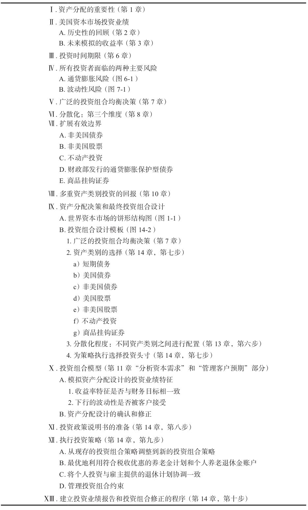

表14-5 投资政策决策制定议程

\>\> 有时，客户对雇主提供的退休计划中的资金投资没有自由裁量权。因为不需要对这些计划制定投资决策，因此投资顾问有时会忽略这些资产。这种做法将会导致资产分配不是最优的。

\>\> 类似地，如果客户投资组合中的大部分比例投入到非流动的投资工具（不动产和实物贵金属）中，那么投资约束可能出现。处理这些情况的最好方式，不过就是假定投资步骤可以从无约束的全部持有现金头寸开始，通过建立理想的目标投资组合的操作完成。通过对比客户当前的受约束的投资组合和理想的目标投资组合，可以立刻弄清楚哪种修改是最重要的，以及他们应该按什么顺序去执行

\>\> 双层费用是合理的，因为每一个决策制定层次都增加了投资组合的价值。

◆ 第十步：报告投资业绩和修正投资组合

\>\> 不管是对投资顾问还是对其客户而言，投资业绩的衡量都是一个特别麻烦的问题。困难产生的一个原因是，投资业绩衡量的区间通常是一个日历季度，相对典型的投资时间期限而言太短了。

\>\> 买入-持有策略不存在投资组合的再平衡问题。战略资产分配并不等同于买入-持有策略。如果客户从投资组合中提取资金，资金可以通过出售投资权重高于目标资产分配的资产获得。如果客户希望对投资组合增加投资，资金可以首先投资于那些权重低于目标资产分配的资产类别中。

除了利用投资组合的现金流量行为外，资金需要定期重新配置，从最近投资业绩相对更好的资产类别配置到投资业绩相对差的资产类别中。

战略资产分配的做法与一般大众的想法相反，其投资策略是“买低、卖高”。相比之下，战略资产分配实现投资组合的再平衡，有着以下几个优点：

●它容易被理解和执行。

●它为客户赢得了一个更加稳定的投资组合的波动性水平。

●它保持了投资组合在多重资产类别之间进行分散化的特征。

●它提供了一种严格的规则，防止当某种资产类别的市场到达巅峰的时候，投资组合在该资产类别中的配置比重过多，在市场出现低谷的时候在该资产类别中的配置比重不足。

◆ 第15章 解决执行中遇到的难题

\>\> 在实施新战略前，必须考虑交易成本和所得税等财务约束。

推荐客户卖掉以往的、熟悉的投资而买入新的、陌生的投资可能会使客户紧张或焦虑，尽管这些变化能显著地改善投资组合的风险和收益特征。

◆ 客户的惯性

\>\> 如果客户无法接受改善后的资产分配战略，他可能以各种潜在的机会成本形式付出代价：

（1）继续遵循旧的投资战略，客户可能面临新的投资战略会消除的风险。

（2）旧投资战略可能提高客户在极端市场情形下作出糟糕投资决定的概率。

（3）旧战略下，客户达成财务目标的可能性比新战略下更小。

（4）尽管继续遵循旧战略，客户可以回避交易成本和/或资本增值所得税，但是客户可能失去新战略下显著更多的经济回报。

有时，客户的惯性来源于已大幅增值的、高度集中的股票头寸。

◆ 资本增值所得税与交易成本

\>\> 当其他条件保持不变时，以下因素可以增加成功概率：

（1）更大的投资组合；

（2）更高的投资组合预期收益率；

（3）更低的投资组合的标准差；

（4）对投资组合追加更多的投资；

（5）对投资组合的追加投资发生在距离现在更近的时间；

（6）对投资组合的撤资更少；

（7）对投资组合的撤资发生在距离未来更远的时间。

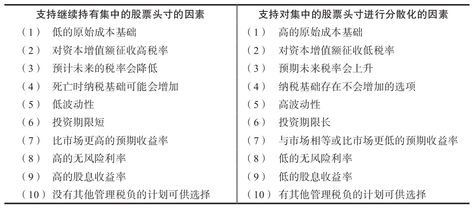

表15-1 集中的股票头寸：决定分散化需要考虑的因素

\>\> ETF基金使投资者通过把股票与其他投资者持有的其他公司低税基的股票以基金的方式放在一起，投资者可以以较低的税收基础处理股票。作为交换，投资者获得对应的基金份额，并因此得到了基金中所有投资带来的间接利益。如果投资者持有这些基金份额超过7年，那么资本增值所得税的征收就被推迟了。

◆ 未实现的资本损失

\>\> “账面损失综合症”背后的心理是错误地相信除非证券已经卖出，否则就没有亏钱，认为账面上的损失没有实质经济含义。再次强调，除了税收考虑外，**历史成本不应当与继续持有还是卖出股票的决定有什么关系**。

\>\> 客户可以决定留有一些过去的、熟悉的投资，但可以为其选择一个更为合理的百分比份额。

投资决策应该是积极的。以往的投资建议分为购进、持有和卖出三类。我认为“持有”的投资推荐经常逃脱了作出积极决策的责任，“卖出”法则和“购进”法则应该是一个相同的法则。一个更一般的法则简单说来就是：在投资组合中仅持有以下投资，即如果你并未拥有它们，你会重新积极地再次购进的投资。**适当考虑税收和交易成本的因素**，并卖出其他所有投资。

◆ 大额资金的决定

\>\> 收到一大笔遗产的经验较浅的投资者，在他们人生中第一次需要作出重大的投资决定。鼓励客户全局地考虑整个投资组合，并采用占总投资组合的百分比来表达投资建议能够消除一部分焦虑。

◆ 对特定投资建议的抵制

\>\> 投资组合设计过程应该从广泛的投资组合平衡层次，到更为具体的资产分配层次，最后到特定的投资头寸。在进入下一层次之前，每个层次的决策都应该被坚定的落实。如果处理得当，在决策制定过程中会产生积极的惯性作用，并且防止客户因为本应该在更一般性的决策层次中出现的原因而反对某个特定投资。客户反对特定投资本身无可非议，只要反对与所在的那个决策层次相联系。否则，应该撤回投资建议并返回到之前更一般性的、与反对的理由相关的那个投资决策层次。

◆ 从投资组合中提取资金以满足客户开销

\>\> 客户：“我不可能依靠那个利率+股息率生活。为什么不削减股票投资额，而把收入投资于债券之中，直到投资组合的收益率与我的收入需要相匹配？”

\>\> 解决方法是教育客户从总收益率（当期收益率加上资本增值带来的收益率）的角度思考问题，而不是当期收益率。在总收益率的框架下，客户认识到花费一点点总收益率较高的投资组合的本金来补充其较低的当期收入率，比选择当期收入率较高但总收益率较低的投资组合更好。

◆ 投资组合实际的年资金提取比率

\>\> 理想地，我们建议选择一个实际的（也就是经过通胀调整后的）年度资金提取比率，这个比率可以维持投资组合的购买力。乍一看，好像我们可以通过将年度资金提取比率设定为等于投资组合的复利年收益率和通胀率之差来做到这一点。但是，为了该方法可以行得通，投资组合的收益率必须是稳定不变的。

\>\> 波动性对投资组合的资金提取比率具有阻碍作用

◆ 第16章 2008年全球金融危机

\>\> 试想一个经济环境，在这个环境下，所有的权益资产类别同时陷入麻烦，而且是大麻烦。这样的完美风暴就发生在2008年。促使了这场危机的因素如下：

1.  证券化。证券化切断了作为按揭贷款发起人的金融机构和承担贷款风险的投资者之间的联系。
2.  金融工程。证券的切割使我们能创造出极其复杂的金融工具，这些金融工具可以在多方之间缓和或转移信用风险和利率风险。这些证券非常复杂，难以估值，而且分散在全球金融市场中，使得人们无法评估这些“有毒资产”出现的问题的程度。当社会公众开始质疑金融机构的信用时，信贷市场就冻结了。
3.  过度使用杠杆。
4.  利益不一致。高管薪酬计划可能诱使他们把个人短期利益置于股东长期利益之上。
5.  贪婪。人们纷纷这样指责：按揭购房者借了太多钱，希望买的房子一年一年涨价；金融机构只知道发起按揭贷款、将它们证券化并兜售出去，丝毫不管按揭购房者的还款能力；公司高管只知道中饱私囊，却忽略了公司股东所承担的风险。

◆ 客户的疑问

\>\> 该资产分配战略很好地降低了风险，但不可能彻底消除风险。2008年收益率为负数的事实也不能说明该战略配置没实现它的目标。

\>\> 投资组合长期收益率高于组成投资组合的各项资产类别的收益率的加权平均值。波动性低于组成投资组合的各项资产类别的收益率的波动性的加权平均值。

◆ 为2008年的收益率寻找原因

\>\> 2008年权益类资产的损失规模是我所经历过的最大的。

\>\> 将分散化策略的失效定义为一年中所有四种权益类投资同时产生低于平均或同时产生高于平均的收益率，也就是说当其他类别的权益类投资都往某个方向走时，剩下的这个类别的权益类投资也往这个方向走。\#\#\#表16-2\#\#\#列示了7个这样的失效例子：三个是“好的失效”，四个是“坏的失效”。2008年所有四类权益投资的收益率都低于平均的情况是非常罕见的，但也不是没有先例。2008年和1937年的收益率都处于-30%～-40%。

◆ 未来如何持股

\>\> 当权益类投资的收益率的相关系数上升时，权益类投资和高质量债券的收益率之间的相关系数则显著下降。

\>\> 不管市场如何跌宕起伏，根本性的原则永远不会改变。他还警告我们要谨慎对待新的投资想法。比如，20世纪90年代，许多人认为“新经济”需要一种全新的投资范式，以适应当时高得离谱的股市市值。现在回想起来，这真是害人的想法。

\>\> 政策制定者常常是等到危机显现后他们不得不采取行动时才有所作为。

\>\> 毫无疑问，总有些人从不同侧面预见了或者理解了危机的酝酿过程，但危机爆发的具体方式和市场与经济所遭到破坏的程度却是没被预见的。

◆ 结论

\>\> 投资管理非常简单，但是并不容易。说它简单是因为成功的投资原则数量相对较少，而且很容易理解。虽然客户在管理其资金的过程中会面临多种多样的风险，但其中两个最重要的风险是通货膨胀和投资组合的波动性。为了规避这些风险中的某一个而构建投资组合结构，不幸的是，也将其在某种程度上暴露在其他风险之下。出于这个原因，客户必须确定哪种风险对他们而言更加危险。投资时间期限是客户在做这些决策中需要一并考虑的一个相关因素。

\>\> 然而，无论投资期限或长或短，广泛分散化带来的平滑风险的好处为所有客户利用多重资产类别提供了支持，无论客户的波动性容忍度如何。

因为投资管理很简单，因此所有客户都有能力参与到投资决策制定过程中，这对客户而言也非常有意义。客户将主要的投资决策留给投资顾问单独裁量，这既没有必要，也不建议客户这么做。这是客户的钱，他必须接受投资结果。当客户被教育得对投资管理过程有了更好的理解时，其波动性容忍度会朝着最适合其境况的方向变化。有了更好的理解后，客户将会作出更好的决策。客户也将从拥有现实的评估投资组合业绩表现的参考框架中受益。现实的预期给客户带来宁静和持久力，这两者对财务目标的实现都至关重要。

\>\> 投资管理并不容易，这是因为如果没有非常坚定地遵循战略资产分配框架中的长期投资政策，客户很容易被那些承诺高收益率、很少或没有风险的投资计划所吸引而分心。

\>\> 今天，资本市场的效率越来越高，认定卓越的投资技能可以安全地依赖，作为投资组合业绩的首要决定因素，这种想法很危险。
